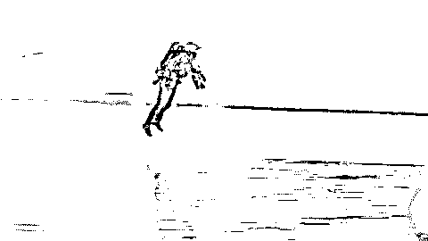
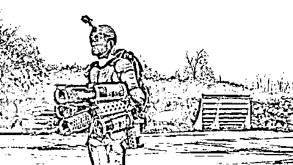
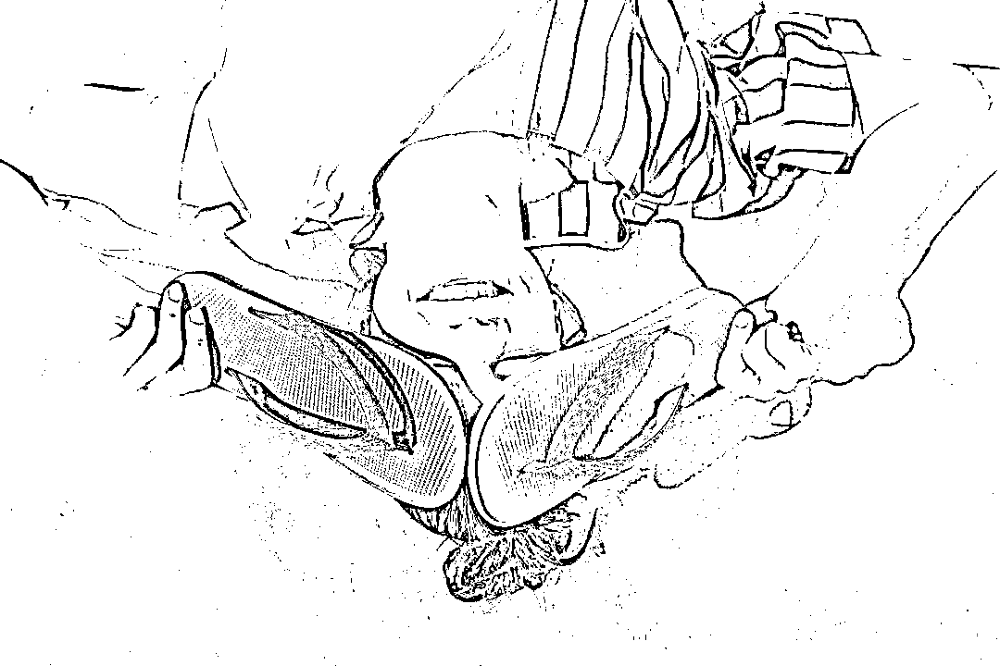
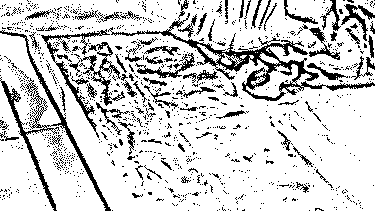
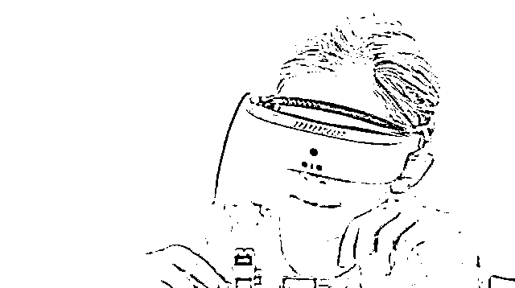
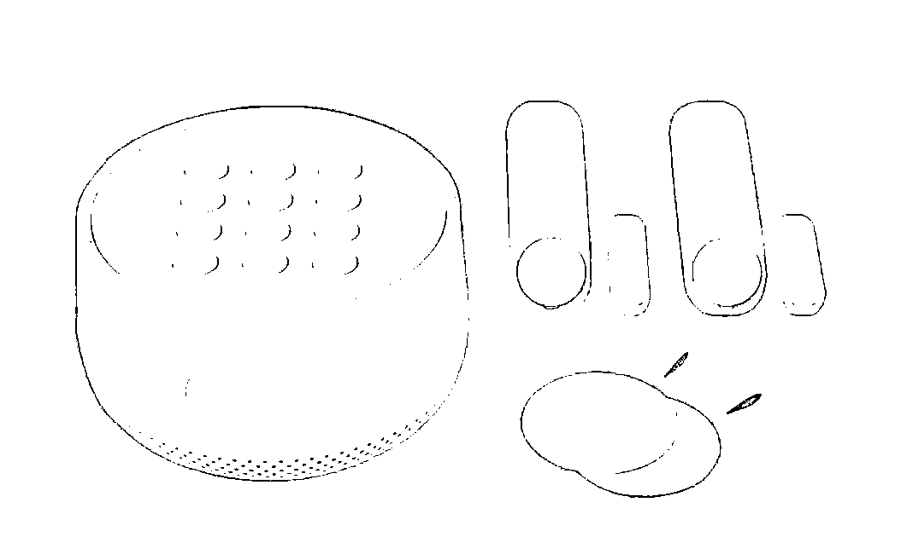
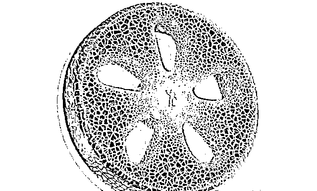

# 美国《时代周刊》: 2018 年全球 50 大最佳发明

> 原文：[`mp.weixin.qq.com/s?__biz=MzAxNTc0Mjg0Mg==&mid=2653290389&idx=1&sn=ee01cb99726135a84e3cc10e093573f6&chksm=802e3d80b759b496d624d84036e807a236e27f8a77c9574b0db34a01945ca03676eb75744e5c&scene=27#wechat_redirect`](http://mp.weixin.qq.com/s?__biz=MzAxNTc0Mjg0Mg==&mid=2653290389&idx=1&sn=ee01cb99726135a84e3cc10e093573f6&chksm=802e3d80b759b496d624d84036e807a236e27f8a77c9574b0db34a01945ca03676eb75744e5c&scene=27#wechat_redirect)

**标星★公众号**，第一时间获取最新资讯

文章来自：向外看一看

**近期原创文章：**

## ♥ [2018 中国量化投资年度盘点【独家】](https://mp.weixin.qq.com/s?__biz=MzAxNTc0Mjg0Mg==&mid=2653290036&idx=1&sn=79dd3529dd9300b0a5d3d6fee4607904&chksm=802e3c21b759b537eda936128dd5e13a22257d623b605b4a52d1c0ccc7f05abfefc93d10e366&token=1337549942&lang=zh_CN&scene=21#wechat_redirect)

## **♥** [利用深度学习最新前沿预测股价走势](https://mp.weixin.qq.com/s?__biz=MzAxNTc0Mjg0Mg==&mid=2653290080&idx=1&sn=06c50cefe78a7b24c64c4fdb9739c7f3&chksm=802e3c75b759b563c01495d16a638a56ac7305fc324ee4917fd76c648f670b7f7276826bdaa8&token=770078636&lang=zh_CN&scene=21#wechat_redirect)

## ♥ [一位数据科学 PhD 眼中的算法交易](https://mp.weixin.qq.com/s?__biz=MzAxNTc0Mjg0Mg==&mid=2653290118&idx=1&sn=a261307470cf2f3e458ab4e7dc309179&chksm=802e3c93b759b585e079d3a797f512dfd0427ac02942339f4f1454bd368ba47be21cb52cf969&token=770078636&lang=zh_CN&scene=21#wechat_redirect)

## ♥ [深度学习是信号处理和时序分析的最后选择？](https://mp.weixin.qq.com/s?__biz=MzAxNTc0Mjg0Mg==&mid=2653289999&idx=1&sn=800b645653a3e36ce57ff82260d030dc&chksm=802e3c1ab759b50cf9fb931574f84001f4858997be6330251c139deef0272e9217aa62276ea5&token=770078636&lang=zh_CN&scene=21#wechat_redirect)

## ♥ [人工智能『AI』应用算法交易，7 个必踩的坑！](https://mp.weixin.qq.com/s?__biz=MzAxNTc0Mjg0Mg==&mid=2653289974&idx=1&sn=88f87cb64999d9406d7c618350aac35d&chksm=802e3fe3b759b6f5eca6e777364270cbaa0bf35e9a1535255be9751c3a77642676993a861132&token=770078636&lang=zh_CN&scene=21#wechat_redirect)

## ♥ [神经网络在算法交易上的应用系列（一）](https://mp.weixin.qq.com/s?__biz=MzAxNTc0Mjg0Mg==&mid=2653289962&idx=1&sn=5f5aa65ec00ce176501c85c7c106187d&chksm=802e3fffb759b6e9f2d4518f9d3755a68329c8753745333ef9d70ffd04bd088fd7b076318358&token=770078636&lang=zh_CN&scene=21#wechat_redirect)

## ♥ [预测股市 | 如何避免 p-Hacking，为什么你要看涨？](https://mp.weixin.qq.com/s?__biz=MzAxNTc0Mjg0Mg==&mid=2653289820&idx=1&sn=d3fee74ba1daab837433e4ef6b0ab4d9&chksm=802e3f49b759b65f422d20515942d5813aead73231da7d78e9f235bdb42386cf656079e69b8b&token=770078636&lang=zh_CN&scene=21#wechat_redirect)

## ♥ [如何鉴别那些用深度学习预测股价的花哨模型？](https://mp.weixin.qq.com/s?__biz=MzAxNTc0Mjg0Mg==&mid=2653290132&idx=1&sn=cbf1e2a4526e6e9305a6110c17063f46&chksm=802e3c81b759b597d3dd94b8008e150c90087567904a29c0c4b58d7be220a9ece2008956d5db&token=1266110554&lang=zh_CN&scene=21#wechat_redirect)

## ♥[ Quant 必备：学什么、哪家面试难、哪家挣大钱？](https://mp.weixin.qq.com/s?__biz=MzAxNTc0Mjg0Mg==&mid=2653290261&idx=2&sn=ee7cf7dabe50ed89adafdc92e980a48c&chksm=802e3d00b759b416875b2881ec5bc8a81d95208271c66f3680afd3cfbf27aa2e506398ae9e90&token=304730811&lang=zh_CN&scene=21#wechat_redirect)

整理图文来源于网络，版权归原创作者，鸣谢！

**提起发明创造，你会想到什么？**

每年《时代周刊》都会评选年度最佳发明，它们让世界变得更美好，更智能，或更有趣。 

Time 从世界各地征集了各类别的提名，然后从**原创性，创造力，影响力，前瞻****性**和有效性对竞争者们进行评估。

最终选出 50 项突破性的发明，它们可能正在改变我们生活，给我们的工作，娱乐和思考提供更多可能性。下面选了一些，为大家展开来讲讲！

**隐形电视**

三星 2018 QLED 电视

电视已经不是必备家电了，它**黑黑的屏幕与家里的装饰格格不入**。三星想了一个拯救电视的办法，隐形电视！

只有在你需要的时候，它才是一台电视机。平时它可以是山水画、照片墙，甚至和你家融为一体。

我以为它是透明的屏幕，但其实是在黑屏上显示与墙面一致的背景图案，看上去就像隐形了一样。

操作方法很简单，通过手机 App 对着电视和墙壁拍张照。

以前的电视要接一堆电缆，为了让它像个真正的画框，三星把他们**整合成一条细细的 15 米线缆**，不仅能传输视频信号，还能传输电源。

随着白天黑夜或灯光变化，画面还能自动调整暗角和色调，并显示时间和天气。

**坚不可摧的连裤袜**

Sheerly Genius Pantyhose

对于 8102 年的精致男孩女孩，衣物起球绝对是一件令人头痛的事。有人做过测试，最优秀的连裤袜品牌，磨 20 下必起球！而这款打底裤，**别说起球了，甚至能防子弹**。

Sheerly Genius 由一种通常用于防弹背心和攀岩设备的纤维制成，**强度比钢强 10 倍**，超轻。

牢不可破的同时，它还很柔软舒适，一样的性感透明~

虽然要卖每双 99 美元，但是很多女性都愿意试试。网友评论说：男朋友都不能把它撕开了，他很不开心。

# 海洋垃圾桶

Seabin V5 Hybrid

每年大约有 **14 亿吨垃圾**在地球海洋中肆虐，造成海洋污染和生物死亡。Seabin 是一个漂浮在港口和码头的海洋垃圾桶， 用泵吸入垃圾并释放干净的水。

海洋垃圾桶每天大概能捕获 **1.5 公斤**的漂浮物，包括最小 2 毫米的微塑料。

传统的方法是无法捕获微纤维微塑料的，而 Seabin 用了特殊的**过滤器+捕获袋**结构。作为垃圾收集器，它还配备了**吸油垫**，甚至能吸收一些以石油为主的污染物。

这个项目的两位发明者，是冲浪爱好者，海洋里的垃圾让他们痛心不已，于是说干就干，有了海洋垃圾桶。

**最像奶子的奶瓶**

Nanobébé

喂奶最重要的，就是**接近母乳的感觉**。这种最像母亲乳房的形状可以说是宝宝最能适应的形状。

奶瓶独特的结构、比普通奶瓶**加热速度快两倍，加热也更均匀，用后分层打开清洗也很方便**。

# 救生无人机

第二代 Zipline

这空投套装，乍一看还以为是吃鸡的广告。只不过空投的不是枪支弹药，而是**医疗用品**。

由于地形和基础设施的差距，超过 **20** 亿人缺乏足够的基本医疗产品，如血液和疫苗、药物、医疗用品。

Zipline 可以飞越无法通行的山脉和蜿蜒的道路，直接送往偏远的诊所，减少资源浪费。他可以在 80 英里/小时（130km/h）的速度下运载 3.85 磅( 约 2kg )货物,用最快的速度医疗物资投到指定位置。

2016 年开始，Zipline 在非洲推出商业无人机送货服务，向偏远的社区提供血液和重要医疗用品的配送服务。如今第二代的产品性能更优，将继续为非洲的农村社区提供服务。

# 随身携带的衣橱

Solgaard Lifepack 行李箱

收行李箱绝对是我最讨厌做的事之一，旅行的乐趣都打了折扣。而对于来去匆匆的商务人士，抽空整理箱子非常麻烦。

**要是行李箱里有个柜子就好了**。诶！等等！这不就是了嘛。

跟一般的箱子比起来，找一件衣服似乎节省了好多步骤和时间啊！

但是这个架子，同样会占用箱子的部分空间，减少了它的装载量。也许这不是最优解法，但不得不承认真的直击痛点。 

**钢铁侠套装**

Gravity Jet Suit 重力喷气式飞行器

**想要成为“钢铁侠”吗？**现在，你的梦想可能就要实现了。

英国发明家理查德布朗宁从 2016 年开始，一直在潜心研发自己的“**飞行战甲**”。终于，Gravity Jet Suit 问世了。

1050 马力的系统依赖于五个迷你喷气式发动机 ，每只手臂上各两个，另一个内置在背包中。它最高时速可达 50 英里/小时( 约 80 公里时速 ），最大飞行高度约 3600 米。

Gravity 已经在 20 个国家举办了 60 多场活动，包括 4 场 TE 演讲和 2 场线下赛事，每次都引起大批围观。

虽然它要卖 44 万美元，但折合成人民币 300 万 在上海只能买个厕所。买了它，90 分钟培训上手，你可能就是下一个钢铁侠！

**真正的量身定做**

ZOZOSUIT

**网购一时爽，买错尺码却让人头疼**。日本最大的时尚电商 ZOZOTOWN 推出了一件奇怪的紧身衣，解决了这一难题。 

远程智能量身 ZOZOSUITS 是免费提供的，你只用付点邮费，就能得到一件能精准测量自己身材的衣服。

它上面的小点点，其实是内置的 **150 个传感器**。它会对你进行全身测量，并将具体数据发送到配套的应用程序当中。

数据自动上传成功后，系统就会给你推荐适合你尺码的衣服。再也不怕买错尺码啦~不然买来的衣服总是胸部有点紧，讨厌~

**为无家可归者打印一个家**

ICON Vulcan 3-D 住房打印机

创业公司 ICON 使用它们的 3-D 打印机器，在 **48** 小时内打印出了第一套住房。它是一个 32 平米的住宅，价格约为 10,000 美元（仅限打印部分），并且符合美国德克萨斯州的住房标准。

Vulcan 3-D 打印机与非营利性组织 New Story 合作创建，致力于**为居住在全球贫民窟的家庭提供安全的住所**。

它使用容易采购到的小骨料混凝土作为原料，从混凝土中逐层架设住宅的基本结构。轨道可以无限延长，只需要传统方法的一小部分材料和劳动力成本。

它是可移动的，重约 900 公斤。希望和政府合作，为整个社区服务。

预计二代产品能在 12 小时内打印 600 平方英尺（约 55㎡）的单层住宅，并且只需花费 4000 美元。

**可软可硬的 Bra**

锐步 PureMove 智能文胸

为了**让女性在运动时更加舒适**，Reebok 推出了这款 PureMove 运动内衣。它的亮点是加入了“**运动感应技术**”，以及一种叫 Shear Thickening Fluid 的物质，会**随着用户的动作自动调节松紧**。

当剧烈的运动使胸罩的针织面料变形时，凝胶状的增稠液会活化并使衣服收缩,提供额外的支撑。在轻松活动或休息期间，面料向后伸展，以获得舒适，透气的贴合感。

PureMove 在设计上其实十分简单，仅由 7 件柔软透气材料组成。没有复杂的钩子，扣子，钢圈或可调节带子，舒坦！

**甘蔗做的人字拖**

Allbirds SweetFoam

Allbirds 是那个号称有世界上最舒服羊毛鞋的品牌，但是它想拓展业务，做做拖鞋。**要做就做最不一样的拖鞋**。

他们联合了巴西一家公司，**耗时两年，研究出了如何把甘蔗做成人字拖**。

Sweet Form 鞋底用的是世界上**第一款减碳 EVA 材料**。使用巴西甘蔗，由完全用再生能源的工厂进行加工，最大程度的**减少对环境的污染**。

鞋子上的带子也是环保的生物尼龙，坚韧又好用，就算断了也可以更换。

目前 Sugar Zeffers 系列已经在国外上市，每双 35 美元。这可是世界上首款甘蔗人字拖！

**让游戏更具包容性**

Nintendo LABO

Labo 是任天堂 Switch 游戏机的一套纸板玩具。买来是个纸板，**通过你聪明灵活的小手，可以拼成好多款玩具**。

再把它跟游戏机自带的手柄 Joy-Con 搭在一起，通过**IR 摄像头、动态捕捉和 HD 震动反馈等功能**，便可以实现各种奇妙的玩法。

自 2018 年 4 月推出以来，任天堂已售出超过 139 万个 Labo 套件！

**能粘在任何地方的工具箱**

Grypmat 工具托盘

在空军担任 F-16 武器机械师时，汤姆经常发现他的**工具从飞机上滑落**，于是他给自己设计出一款**能够适应任何平面的工具托盘**。

Grypmat 使用**高性能、防滑、无磁性、抗化学腐蚀、抗静电的橡胶**制成。最大的特点就是十分灵活，还可以吸附在任何的表面之上，无论是不规则的还是垂直竖立的，找不到放置的地方时，利用一下旁边的墙壁就可以了！

清洁起来也极其容易，不用担心用久了就脏兮兮的。

他们已经找到了各种专业的客户，从外科医生到珠宝制造商，40 美元的定价，非常有市场。

**智能机器人**

JIBO 是全球首款社交机器人，看起来就像是从皮克斯电影中走出来的一样。有着大大的圆脑袋和一个用动画图标来传达情感的脸。

**说话时会把脑袋转向你~**

**还会说话、眨眼、跳舞、撒娇、卖萌、讨你欢心。**

**甚至还能帮你拍照等...**

小编：很智能很可爱，谁送我一个...

**让盲人重见光明**

eSight 是一款能够帮助视障患者看清世界的眼镜。外观和我 VR 眼镜差不多，配备了一个高速、高清的摄像头和两块 OLED 屏幕。

佩戴时，高速摄像头会将使用者面前的场景完整的采集拍摄下来并处理。让画面达到和人眼一样的清晰度。

更厉害的是，eSight 3 将对 70%的视力残疾者都有效！

小编感叹科技让生活更美好

**Ember Mug: 智能温控马克杯**

  

咖啡的温度一定程度上决定了咖啡的口感，太烫或太冷都会影响品尝。Ember Mug 把不锈钢马克杯加固在白色陶瓷涂层里，让咖啡保持在 49 到 60 摄氏度之间。

操作起来也很酷。

可以通过旋转底座或者 APP，来进行温度设置。

中年人最需要的保温杯，79.95 美元，这个可以有。

**MULTI: 可以水平移动的电梯**

这是世界上第一款无绳电梯系统，由德国蒂森克虏伯公司制造

它最大的特点是——

不仅可以上下移动，还可以水平移动！

小编：以后乘电梯终于不用排长队了~

**Forward: 重新定义诊所**

这是一个充满未来感的 AI 诊所，包月 149 美元就能享受不限次数的服务！每次进门时，会对你进行全身扫描。

还有数字听诊器、帮助抽血时找到静脉的红外光食品等，就像科幻电影里的医院一样！

小编：这样的诊所绝对能造福很多人，只是这价格...有点贵啊

**Nest Secure: 简易版家用安全系统**

这是由 Google 母公司 Alphabet 的另一家子公司 Nest 研发的安全系统。只要挥动钥匙而不用输入密码，就可以让特定人员在特定的时间进入家中。比如保姆可以在她工作时间进入。

小编：这才是理想中的智能防护系统有木有！

**NASA Mars Insight: 火星内部探测器**

这个 Insight 主要用于观察火星地质的变化。它将会深入火星 5 米以下以研究火星内部的热能信息，并测量相应的地质温度。有趣的是，它还要带着 240 万个名字上火星。 

小编：请带我回火星...

**Oculus Go: 可独立运行的 VR 头盔**

这是 Facebook 推出的一款 VR 一体机。

它最大的亮点是容易上手。

通过自带的主机就能实现独立运行，还配备了一个遥控手柄。

小编：仅需 199 美元的入门级 VR 设备，这个可以有~——

**Tasty One Top: 自助烹饪伴侣**

这是一款智能电磁炉，只为让所有人轻松做出美味佳肴！

它会根据你的偏好为你推荐个性化食谱，还可以根据不同菜式智能温控调节。最贴心的是——炒菜过程中，它还会提醒你添加调料和配菜。

小编：吃货的福音啊~

**Michelin Vision Concept: 无空气轮胎**

这是米其林发布一款非充气式概念轮胎。 

首先，它是没有空气的，不用担心爆胎。

其次，它是用可回收的材料制造的，可以有效减少废弃物。

最特别的是——它 3D 打印的轮胎面，可以在不换轮胎的情况下轻松更换，以适应各种路况。

小编：怎么一说到米其林，我都是想到吃的...

**Norton Core: 防火防盗防黑客**

Norton Core 是一款注重家庭网络安全防护智能路由器。它可以识别出潜在的黑客、病毒危机，直接停止连接病毒源，就像流感爆发时的隔离病人。

  

小编：这颜值，放家里都是一种装饰~

**Molekule: 赶走污染的空气净化器**

大多数空气净化器都是用过滤器过滤有害污染物来改善空气质量。

Molekule 则更直接——

直接分解并摧毁有害污染物！

关键就是它独特的纳米过滤涂层。

可以通过光线的作用来防止包括细菌、病毒等颗粒的再生。

小编：听起来蛮牛逼的样子...

**DJI Spark: 无人机的领导者**

这是大疆发布的最小的无人机。 

它第一次在无人机中加入了人脸识别。

并且还有手势拍照、一键短片、掌上降落等特殊技能。

小编：唯一入围的中国产品，值得骄傲！

**无障碍工具**

► Aira：面向盲人的“按需眼睛”

► 吉列 Treo：有辅助功能的剃须刀

► WHILL Model Ci：给用户带来多种帮助的轮椅

► Xbox 适配手柄：让游戏变得更普惠

► Eargo Max：面向大众的助听器

**设备和工具**

► iRobot Roomba i7+：能自动清理的吸尘器

► Nanit Plus 婴儿监控摄像头：婴儿的睡眠教练

► LynQ：指向亲朋好友的指南针

► Bebop Sensors Forte 无线手套：让工人获得虚拟手

► Panda：革命性的机械臂

► 网件 Orbi Voice：不受限的 WiFi 路由器

****医疗和健康****

****

**► Fundamental Surgery：面向外科医生的智能培训**

**► Aimovig：一种偏头疼的治疗方式**

**► Nanobebe Breast-Milk Bottle：更棒的婴儿奶瓶**

**► Bose Sleepbuds：帮助改善睡眠的耳塞**

**► Gravity Blanket：缓解焦虑的毛毯**

**► HabitAware Keen：帮助改正坏习惯的手环**

**► Acuvue Oasys with Transitions：根据光线自动调整的隐形眼镜**

****可持续发展和社会公益**** 

****

**► 3M 抗烟雾颗粒：能对抗烟雾污染的屋顶材料**

**► 第二代 Zipline：能挽救生命的送货无人机**

**► Model 3 智能烧水器：更高效的烧水器**

**► My Special Aflac Duck：癌症患儿的伴侣**

**► LIA：更私密的验孕工具**

**交通和旅行**

****

**► Gravity Jet Suit：现实中的钢铁侠战衣**

**► The Carry-on Closet：不需要费时整理的旅行箱**

**► Lumos Kickstart Helmet：内置头灯的头盔**

**► Boosted Mini：更便携的电动滑板**

**► Thor ET-One：电动的半挂卡车**

****

**看到这里是不是觉得意犹未尽？**

**曾经，大部分人的对发明的想象可能还停留在例如飞机、手机、电视机、电脑这些高科技的东西。随着现代科技的发展、创新形态的改变，从无到有颠覆人们生活的发明渐渐变少了，更多的是基于现有产品的改良和创新。** 

**这 50 项突破性的发明从**一些微小的细节改变了用户体验，是发明者对生活的细心观察和思考**。他们改变着我们生活，工作，娱乐和思考的方式，以及那些不易察觉的我们看世界的方式。**发明者在注重功能性的同时，又兼顾了产品的美观性，还帮助人们看到了自己内心和身体的需求**。他们通过无处不在的生活细节改变着我们习以为常的枯燥环境。**

**不知道大家有没有发现一点，美国评选出来的产品，不仅有想法有创意，而且都是**成功落地的商品**，并且迅速获得了市场。**

**从获得了九百万投资的 3D 打印住房，或是销量百万的环保甘蔗拖鞋来看，**产品的商业价值和社会价值都很重要**。而在未来产品上，对用户体验以及产品之外的附加价值的关注，无疑是未来新制造的必然要求。**科技让生活更美好，这值得新制造人们学习和关注**。**

**图文来源于网络，版权归原创作者，鸣谢！**

****推荐阅读****

**[01、经过多年交易之后你应该学到的东西（深度分享）](https://mp.weixin.qq.com/s?__biz=MzAxNTc0Mjg0Mg==&mid=2653289074&idx=1&sn=e859d363eef9249236244466a1af41b6&chksm=802e3867b759b1717f77e07a51ee5671e8115130c66562577280ba1243cba08218add04f1f00&token=449379994&lang=zh_CN&scene=21#wechat_redirect)** 

**[02、监督学习标签在股市中的应用（代码+书籍）](https://mp.weixin.qq.com/s?__biz=MzAxNTc0Mjg0Mg==&mid=2653289050&idx=1&sn=60043a5c95b877dd329a5fd150ddacc4&chksm=802e384fb759b1598e500087374772059aa21b31ae104b3dca04331cf4b63a233c5e04c1945a&token=449379994&lang=zh_CN&scene=21#wechat_redirect)**

**[03、全球投行顶尖机器学习团队全面分析](https://mp.weixin.qq.com/s?__biz=MzAxNTc0Mjg0Mg==&mid=2653289018&idx=1&sn=8c411f676c2c0d92b0dd218f041bee4b&chksm=802e382fb759b139ffebf633ac14cdd0f21938e4613fe632d5d9231dab3d2aca95a11628378a&token=449379994&lang=zh_CN&scene=21#wechat_redirect)** 

**[04、使用 Tensorflow 预测股票市场变动](https://mp.weixin.qq.com/s?__biz=MzAxNTc0Mjg0Mg==&mid=2653289014&idx=1&sn=3762d405e332c599a21b48a7dc4df587&chksm=802e3823b759b135928d55044c2729aea9690f86752b680eb973d1a376dc53cfa18287d0060b&token=449379994&lang=zh_CN&scene=21#wechat_redirect)**

**[05、使用 LSTM 预测股票市场基于 Tensorflow](https://mp.weixin.qq.com/s?__biz=MzAxNTc0Mjg0Mg==&mid=2653289238&idx=1&sn=3144f5792f84455dd53c27a78e8a316c&chksm=802e3903b759b015da88acde4fcbc8547ab3e6acbb5a0897404bbefe1d8a414265d5d5766ee4&token=2020206794&lang=zh_CN&scene=21#wechat_redirect)**

**[06、美丽的回测——教你定量计算过拟合概率](https://mp.weixin.qq.com/s?__biz=MzAxNTc0Mjg0Mg==&mid=2653289314&idx=1&sn=87c5a12b23a875966db7be50d11f09cd&chksm=802e3977b759b061675d1988168c1fec06c602e8583fbcc9b76f87008e0c10b702acc85467a0&token=1972390229&lang=zh_CN&scene=21#wechat_redirect)**

**[07、利用动态深度学习预测金融时间序列基于 Python](https://mp.weixin.qq.com/s?__biz=MzAxNTc0Mjg0Mg==&mid=2653289347&idx=1&sn=bf5d7899bc4a854d4ba9046fdc6fe0d6&chksm=802e3996b759b080287213840987bb0a0c02e4e1d4d7aae23f10a225a92ef6dd922d8006123d&token=290397496&lang=zh_CN&scene=21#wechat_redirect)**

**[08、Facebook 开源神器 Prophet 预测时间序列基于 Python](https://mp.weixin.qq.com/s?__biz=MzAxNTc0Mjg0Mg==&mid=2653289394&idx=1&sn=24a836136d730aa268605628e683d629&chksm=802e39a7b759b0b1dcf7aaa560699130a907716b71fc9c45ff0e5d236c5ae8ef80ebdb09dbb6&token=290397496&lang=zh_CN&scene=21#wechat_redirect)**

**[09、Facebook 开源神器 Prophet 预测股市行情基于 Python](https://mp.weixin.qq.com/s?__biz=MzAxNTc0Mjg0Mg==&mid=2653289437&idx=1&sn=f0dca7da8e69e7ba736992cb3d034ce7&chksm=802e39c8b759b0de5bce401c580623d0729ecca69d13926479d36e19aff8c9c9e8a20265afff&token=290397496&lang=zh_CN&scene=21#wechat_redirect)**

**[10、2018 第三季度最受欢迎的券商金工研报前 50（附下载）](https://mp.weixin.qq.com/s?__biz=MzAxNTc0Mjg0Mg==&mid=2653289358&idx=1&sn=db6e8ab85b08f6e67790ec0e401e586e&chksm=802e399bb759b08d6eec855f9901ea856d0da68c7425cba62791b8948da6ad761a3d88543dad&token=290397496&lang=zh_CN&scene=21#wechat_redirect)** 

**[11、实战交易策略的精髓（公众号深度呈现）](https://mp.weixin.qq.com/s?__biz=MzAxNTc0Mjg0Mg==&mid=2653289447&idx=1&sn=f2948715bf82569a6556d518e56c1f9e&chksm=802e39f2b759b0e4502d1aaac562b87789573b55c76b3c85897d8c9d88dbf9a0b7ee34d86a4e&token=290397496&lang=zh_CN&scene=21#wechat_redirect)**

**[12、Markowitz 有效边界和投资组合优化基于 Python](https://mp.weixin.qq.com/s?__biz=MzAxNTc0Mjg0Mg==&mid=2653289478&idx=1&sn=f8e01a641be021993d8ef2d84e94a299&chksm=802e3e13b759b7055cf27a280c672371008a5564c97c658eee89ce8481396a28d254836ff9af&token=290397496&lang=zh_CN&scene=21#wechat_redirect)**

**[13、使用 LSTM 模型预测股价基于 Keras](https://mp.weixin.qq.com/s?__biz=MzAxNTc0Mjg0Mg==&mid=2653289495&idx=1&sn=c4eeaa2e9f9c10995be9ea0c56d29ba7&chksm=802e3e02b759b7148227675c23c403fb9a543b733e3d27fa237b53840e030bf387a473d83e3c&token=1260956004&lang=zh_CN&scene=21#wechat_redirect)**

**[14、量化金融导论 1：资产收益的程式化介绍基于 Python](https://mp.weixin.qq.com/s?__biz=MzAxNTc0Mjg0Mg==&mid=2653289507&idx=1&sn=f0ca71aa07531bbbdbd33213f0bab89f&chksm=802e3e36b759b720138b3b17a4dd0e198e054b9de29a038fdd50805f824effa55831111ad026&token=1936245282&lang=zh_CN&scene=21#wechat_redirect)**

**[15、预测股市崩盘基于统计机器学习与神经网络（Python+文档）](https://mp.weixin.qq.com/s?__biz=MzAxNTc0Mjg0Mg==&mid=2653289533&idx=1&sn=4ef964834e84a9995111bb057b0fc5dd&chksm=802e3e28b759b73e0618eb1262c53aa0601fbf5805525a7c7ff40dc3db62c7704496611bdbf1&token=1950551577&lang=zh_CN&scene=21#wechat_redirect)**

**[16、实现最优投资组合有效前沿基于 Python（附代码）](https://mp.weixin.qq.com/s?__biz=MzAxNTc0Mjg0Mg==&mid=2653289609&idx=1&sn=c7f0b3e47025862d10bb53b6ab88bcda&chksm=802e3e9cb759b78abf6b8b049c59bf18ccfb2ead7580d1f557d36de2292f59dcbd94dcd41910&token=2085008037&lang=zh_CN&scene=21#wechat_redirect)**

**[17、精心为大家整理了一些超级棒的机器学习资料（附链接）](https://mp.weixin.qq.com/s?__biz=MzAxNTc0Mjg0Mg==&mid=2653289615&idx=1&sn=1cdc89afb997d0c580bf0cef296d946c&chksm=802e3e9ab759b78ce9f0cd152a680d4a413d6c8dcb02a7a296f4091993a7e4137e7520394575&token=2085008037&lang=zh_CN&scene=21#wechat_redirect)**

**[18、海量 Wind 数据，与全网用户零距离邂逅！](https://mp.weixin.qq.com/s?__biz=MzAxNTc0Mjg0Mg==&mid=2653289623&idx=1&sn=28a3600fd7a72d7be00b066ca0f98244&chksm=802e3e82b759b7943f43a4f6ef4a91e4153fa6b8210de9590235fa8ee66eb9811ce177054dbc&token=1389401983&lang=zh_CN&scene=21#wechat_redirect)**

**[19、机器学习、深度学习、量化金融、Python 等最新书籍汇总下载](https://mp.weixin.qq.com/s?__biz=MzAxNTc0Mjg0Mg==&mid=2653289640&idx=1&sn=34e94fcbe99052b8e7381ecc48a36dc0&chksm=802e3ebdb759b7ab897cd329a680715b6f8294e63550ddf0c57b9e1320b2b7d1408c6fdca0c7&token=1389401983&lang=zh_CN&scene=21#wechat_redirect)**

**[20、各大卖方 2019 年 A 股策略报告，都是有故事的人！](https://mp.weixin.qq.com/s?__biz=MzAxNTc0Mjg0Mg==&mid=2653289725&idx=1&sn=4b65cd1fb8331438e4c0b3d0eae6b51f&chksm=802e3ee8b759b7fe1b94e84d54cc23b0ab05853d5cd227812574b350e9fc2cce9e5f1bc6cb7a&token=1389401983&lang=zh_CN&scene=21#wechat_redirect)**

****扫码关注我们****

****