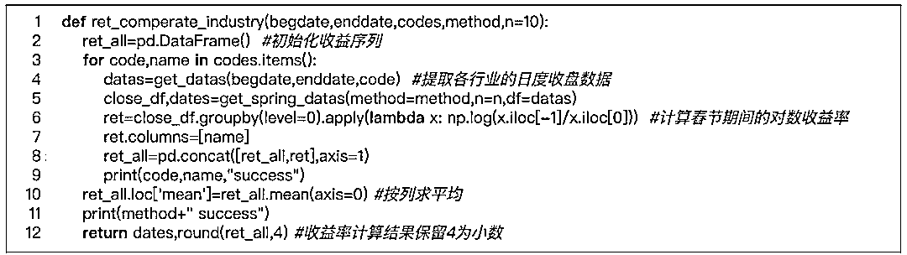

# 想要压岁钱？试试『春节效应』策略（附代码）

> 原文：[`mp.weixin.qq.com/s?__biz=MzAxNTc0Mjg0Mg==&mid=2653290355&idx=1&sn=6ec8ca0be0ad7a593f3a67b795a3c066&chksm=802e3d66b759b470b84165db1db90cdd13c3b365a4d4f7fee2e4c74f9855d0e2d48595c2da89&scene=27#wechat_redirect`](http://mp.weixin.qq.com/s?__biz=MzAxNTc0Mjg0Mg==&mid=2653290355&idx=1&sn=6ec8ca0be0ad7a593f3a67b795a3c066&chksm=802e3d66b759b470b84165db1db90cdd13c3b365a4d4f7fee2e4c74f9855d0e2d48595c2da89&scene=27#wechat_redirect)

**标星★公众号**，第一时间获取最新资讯

原文作者：Wind-万矿

今天这篇文章，我们主要对 2001-2018 年期间 A 股市场的春节效应进行实证研究（包括指数层面和行业层面），同时基于春节效应量化因子，看看在春节期间投资股票市场是否具有高性价比。

一、效应简介

## **1.1 日历效应**

在行为金融学的发展历史中，“日历效应”（Calendar effect）是最早被发现的市场异常现象之一，**即金融资产收益率在不同的时间段上存在系统性的差异**。日历效应主要包括**季节效应**、**月份效应**、**星期效应**和**假日效应**，它们分别指金融市场与季节、月份、星期和假日有关的非正常收益、非正常二阶矩及其他非正常高阶矩。这种周期性异象有悖于有效市场假说，因为资产收益不再是随机的，而是基于特定的日历期间存在一定的可预测性。有一种解释为日历效应是由人们在投资决策过程中认知的偏差和情绪、情感、偏好等心理方面的原因导致其无法以理性人方式做出无偏差估计而造成的一种现象，反映出市场的非有效性。

## **1.2 月份效应**

月份效应是日历效应的一个分支，反映的是金融资产收益率在不同月份上的差异性。如美国股票市场上较为显著的**“一月效应”**，相应的成因有“避税售卖假说”、“窗口修饰假说”等等各种理论说明，但至今并没有出现完全令人信服的理论。就中国股票市场而言，可能月初效应更为显著，市场在每个月上旬会有相对更高的、更显著的超额收益。

## **1.3 春节效应**

春节效应就是专门针对春节的一种月份效应，A 股市场在春节期间的表现通常优于平日，国泰君安认为 A 股出现春节效应的原因主要有：

1、**盈利端预期的改善**，春季是开工旺季，经济动能预期会改善，开年信贷数据或会走强，而 1 月份宏观经济数据空窗期为这一预期升温发酵创造条件；

2、**年末提现因素的影响**，银行系统趋向资金紧张，二春节之后流动性回流，资本市场流动性将趋于改善；

3、**机构投资者存在着跨年度布局需求**，有利于提升市场交易活跃度；

4、每年 11 月份-12 月份举行的**中央经济工作会议**，3 月份左右的**两会**，会出现一些超预期因素。

二、春节效应

1、华泰金工研报一般把腊月十八到次年的正月十八作为**“农历春节效应月”**。

2、兴业金工研报将**“春节月”**定义为包**含春节假期在内的 4 周时间**，即春节休市前的 5 个交易日和春节开市后的 10 个交易日。春节前后或春节月的收益率采用**对数差分收益率**的计算方式，其中 rt 表示第 t 期的收益率，Pt 表示第 t 期的收盘指数点位：

基于上述公式，我们可以推出，第 i 期收盘到第 j 期收盘这段时间的收益率就等于：

三、程序实现

**部分代码，获取全部见文末**

## **3.1 A 股市场主要指数春节效应期间涨跌情况**

提取沪深两市中 9 大常用指数——上证综指、深证成指、上证 50、中证 100、沪深 300、中证 500、中证 1000、中小板指数、创业板指数的收盘数据。

春节效应期间的定义方式采用的是兴业金工研报的定义方式：春节休市前的 5 个交易日和春节开市后的 10 个交易日。

***大家也可通过修改 get_spring_datas 函数中的 n1 和 n2 变量来自行设置春节效应的期间范围。***

****部分代码，获取全部见文末****

### **3.1.1 主要指数****春节月****期间的涨跌情况**

数据来源：Wind-万矿

****部分代码，获取全部见文末****

数据来源：Wind-万矿

**除了 2008 年、2013 年**春节期间收益率**表现较差**外，其余年度春节期间基本都取得了正收益，说明**A 股市场存在着较为明显的“春节效应”**。

**各个指数在历次春节效应期间的平均涨跌幅**

数据来源：Wind-万矿

各指数在历次春节效应期间的**平均涨跌幅表现最好**分别是**中证 1000、中证 500、创业板指、中小板指，均高于 7%**，而以上证 50、中证 100 等大盘指数平均涨幅均低于 4%，**小盘指数表现要好于大盘指数的表现，风格分化相对显著。**

### **3.1.2 主要指数****春节月****期间与****春节前后 10 个交易日****的涨跌情况对比**

****部分代码，获取全部见文末****

数据来源：Wind-万矿

从春节前后涨跌对比来看，**小盘指数春节后的表现要优于春节前的表现，而大盘指数却是节前行情优于节后行情**。

### **3.1.3 ****单个指数****春节月期间与春节前后的涨跌情况对比（以上证 50 为例）**

******部分代码，获取全部见文末******

数据来源：Wind-万矿

******部分代码，获取全部见文末******

数据来源：Wind-万矿

### **3.2 A 股市场中信一级行业春节效应期间涨跌情况**

********部分代码，获取全部见文末********

### **3.2.1 一级行业春节月期间的涨跌情况**

**********部分代码，获取全部见文末**********

数据来源：Wind-万矿

数据来源：Wind-万矿

**各个版块在历次春节效应期间的平均涨跌幅**

数据来源：Wind-万矿

四、春节因子的构建

**思路 1：** 对于因子库中的因子，检验各因子在春节效应期间（春节休市前后交易日的时间跨度可以自己确定）的有效性，选取有效性较高的一些因子（如 IC 或 IR 值较高的因子），再基于这些因子通过等权或加权的方式合成春节因子（SFF）（就是多因子研究里的因子打分）。

**思路 2：**可以将春节因子与基准因子（该因子是用全部有效应因子合成的因子）进行复合，春节期间使用春节因子，其余时间使用基准因子，构建春节效应增强因子（SFEF）。

注：以上构建思路详情可参看兴业金工研报《猎金系列之二十四春节效应下的 A 股市场与量化因子思考》

**********部分代码，获取全部见文末**********

## **4.1 简单投资策略基本思路**

*   **回测时间：**2010-01-01 到 2018-12-31

*   **股票池：**全 A 股，剔除选股日的 ST/PT 股票；剔除上市不满 6 个月的股票；剔除选股日由于停牌等原因而无法买入的股票

*   **回测基准：**中证 500

*   **策略思想：**在春节效应期间买入满足春节因子排名前 100 的股票（春节因子越小越好），等权配置，不考虑交易费用

*   **春节因子：**基于思路 1，简单挑选了自由流通市值（'cap'）、市盈率倒数（'EP'）、120 日收益率的标准差（'var120'）、净资产收益率（'ROE'）、净利润增长率（"profit_g"）、外加辅助变量中信一级行业（'industry'）的春节效应期间的数据，采用等权 rank 打分的方法进行春节因子合成。

**********部分代码，获取全部见文末**********

本文参考： 

1、华泰证券《全球股市反弹，A 股春节效应开启》

2、兴业证券《春节效应下的 A 股市场与量化因子思考》

五、原文代码获取

**获取全部代码，扫下方二维码**

**推荐阅读**

[01、经过多年交易之后你应该学到的东西（深度分享）](https://mp.weixin.qq.com/s?__biz=MzAxNTc0Mjg0Mg==&mid=2653289074&idx=1&sn=e859d363eef9249236244466a1af41b6&chksm=802e3867b759b1717f77e07a51ee5671e8115130c66562577280ba1243cba08218add04f1f00&token=449379994&lang=zh_CN&scene=21#wechat_redirect)

[02、监督学习标签在股市中的应用（代码+书籍）](https://mp.weixin.qq.com/s?__biz=MzAxNTc0Mjg0Mg==&mid=2653289050&idx=1&sn=60043a5c95b877dd329a5fd150ddacc4&chksm=802e384fb759b1598e500087374772059aa21b31ae104b3dca04331cf4b63a233c5e04c1945a&token=449379994&lang=zh_CN&scene=21#wechat_redirect)

[03、全球投行顶尖机器学习团队全面分析](https://mp.weixin.qq.com/s?__biz=MzAxNTc0Mjg0Mg==&mid=2653289018&idx=1&sn=8c411f676c2c0d92b0dd218f041bee4b&chksm=802e382fb759b139ffebf633ac14cdd0f21938e4613fe632d5d9231dab3d2aca95a11628378a&token=449379994&lang=zh_CN&scene=21#wechat_redirect)

[04、使用 Tensorflow 预测股票市场变动](https://mp.weixin.qq.com/s?__biz=MzAxNTc0Mjg0Mg==&mid=2653289014&idx=1&sn=3762d405e332c599a21b48a7dc4df587&chksm=802e3823b759b135928d55044c2729aea9690f86752b680eb973d1a376dc53cfa18287d0060b&token=449379994&lang=zh_CN&scene=21#wechat_redirect)

[05、使用 LSTM 预测股票市场基于 Tensorflow](https://mp.weixin.qq.com/s?__biz=MzAxNTc0Mjg0Mg==&mid=2653289238&idx=1&sn=3144f5792f84455dd53c27a78e8a316c&chksm=802e3903b759b015da88acde4fcbc8547ab3e6acbb5a0897404bbefe1d8a414265d5d5766ee4&token=2020206794&lang=zh_CN&scene=21#wechat_redirect)

[06、美丽的回测——教你定量计算过拟合概率](https://mp.weixin.qq.com/s?__biz=MzAxNTc0Mjg0Mg==&mid=2653289314&idx=1&sn=87c5a12b23a875966db7be50d11f09cd&chksm=802e3977b759b061675d1988168c1fec06c602e8583fbcc9b76f87008e0c10b702acc85467a0&token=1972390229&lang=zh_CN&scene=21#wechat_redirect)

[07、利用动态深度学习预测金融时间序列基于 Python](https://mp.weixin.qq.com/s?__biz=MzAxNTc0Mjg0Mg==&mid=2653289347&idx=1&sn=bf5d7899bc4a854d4ba9046fdc6fe0d6&chksm=802e3996b759b080287213840987bb0a0c02e4e1d4d7aae23f10a225a92ef6dd922d8006123d&token=290397496&lang=zh_CN&scene=21#wechat_redirect)

[08、Facebook 开源神器 Prophet 预测时间序列基于 Python](https://mp.weixin.qq.com/s?__biz=MzAxNTc0Mjg0Mg==&mid=2653289394&idx=1&sn=24a836136d730aa268605628e683d629&chksm=802e39a7b759b0b1dcf7aaa560699130a907716b71fc9c45ff0e5d236c5ae8ef80ebdb09dbb6&token=290397496&lang=zh_CN&scene=21#wechat_redirect)

[09、Facebook 开源神器 Prophet 预测股市行情基于 Python](https://mp.weixin.qq.com/s?__biz=MzAxNTc0Mjg0Mg==&mid=2653289437&idx=1&sn=f0dca7da8e69e7ba736992cb3d034ce7&chksm=802e39c8b759b0de5bce401c580623d0729ecca69d13926479d36e19aff8c9c9e8a20265afff&token=290397496&lang=zh_CN&scene=21#wechat_redirect)

[10、2018 第三季度最受欢迎的券商金工研报前 50（附下载）](https://mp.weixin.qq.com/s?__biz=MzAxNTc0Mjg0Mg==&mid=2653289358&idx=1&sn=db6e8ab85b08f6e67790ec0e401e586e&chksm=802e399bb759b08d6eec855f9901ea856d0da68c7425cba62791b8948da6ad761a3d88543dad&token=290397496&lang=zh_CN&scene=21#wechat_redirect)

[11、实战交易策略的精髓（公众号深度呈现）](https://mp.weixin.qq.com/s?__biz=MzAxNTc0Mjg0Mg==&mid=2653289447&idx=1&sn=f2948715bf82569a6556d518e56c1f9e&chksm=802e39f2b759b0e4502d1aaac562b87789573b55c76b3c85897d8c9d88dbf9a0b7ee34d86a4e&token=290397496&lang=zh_CN&scene=21#wechat_redirect)

[12、Markowitz 有效边界和投资组合优化基于 Python](https://mp.weixin.qq.com/s?__biz=MzAxNTc0Mjg0Mg==&mid=2653289478&idx=1&sn=f8e01a641be021993d8ef2d84e94a299&chksm=802e3e13b759b7055cf27a280c672371008a5564c97c658eee89ce8481396a28d254836ff9af&token=290397496&lang=zh_CN&scene=21#wechat_redirect)

[13、使用 LSTM 模型预测股价基于 Keras](https://mp.weixin.qq.com/s?__biz=MzAxNTc0Mjg0Mg==&mid=2653289495&idx=1&sn=c4eeaa2e9f9c10995be9ea0c56d29ba7&chksm=802e3e02b759b7148227675c23c403fb9a543b733e3d27fa237b53840e030bf387a473d83e3c&token=1260956004&lang=zh_CN&scene=21#wechat_redirect)

[14、量化金融导论 1：资产收益的程式化介绍基于 Python](https://mp.weixin.qq.com/s?__biz=MzAxNTc0Mjg0Mg==&mid=2653289507&idx=1&sn=f0ca71aa07531bbbdbd33213f0bab89f&chksm=802e3e36b759b720138b3b17a4dd0e198e054b9de29a038fdd50805f824effa55831111ad026&token=1936245282&lang=zh_CN&scene=21#wechat_redirect)

[15、预测股市崩盘基于统计机器学习与神经网络（Python+文档）](https://mp.weixin.qq.com/s?__biz=MzAxNTc0Mjg0Mg==&mid=2653289533&idx=1&sn=4ef964834e84a9995111bb057b0fc5dd&chksm=802e3e28b759b73e0618eb1262c53aa0601fbf5805525a7c7ff40dc3db62c7704496611bdbf1&token=1950551577&lang=zh_CN&scene=21#wechat_redirect)

[16、实现最优投资组合有效前沿基于 Python（附代码）](https://mp.weixin.qq.com/s?__biz=MzAxNTc0Mjg0Mg==&mid=2653289609&idx=1&sn=c7f0b3e47025862d10bb53b6ab88bcda&chksm=802e3e9cb759b78abf6b8b049c59bf18ccfb2ead7580d1f557d36de2292f59dcbd94dcd41910&token=2085008037&lang=zh_CN&scene=21#wechat_redirect)

[17、精心为大家整理了一些超级棒的机器学习资料（附链接）](https://mp.weixin.qq.com/s?__biz=MzAxNTc0Mjg0Mg==&mid=2653289615&idx=1&sn=1cdc89afb997d0c580bf0cef296d946c&chksm=802e3e9ab759b78ce9f0cd152a680d4a413d6c8dcb02a7a296f4091993a7e4137e7520394575&token=2085008037&lang=zh_CN&scene=21#wechat_redirect)

[18、海量 Wind 数据，与全网用户零距离邂逅！](https://mp.weixin.qq.com/s?__biz=MzAxNTc0Mjg0Mg==&mid=2653289623&idx=1&sn=28a3600fd7a72d7be00b066ca0f98244&chksm=802e3e82b759b7943f43a4f6ef4a91e4153fa6b8210de9590235fa8ee66eb9811ce177054dbc&token=1389401983&lang=zh_CN&scene=21#wechat_redirect)

[19、机器学习、深度学习、量化金融、Python 等最新书籍汇总下载](https://mp.weixin.qq.com/s?__biz=MzAxNTc0Mjg0Mg==&mid=2653289640&idx=1&sn=34e94fcbe99052b8e7381ecc48a36dc0&chksm=802e3ebdb759b7ab897cd329a680715b6f8294e63550ddf0c57b9e1320b2b7d1408c6fdca0c7&token=1389401983&lang=zh_CN&scene=21#wechat_redirect)

[20、各大卖方 2019 年 A 股策略报告，都是有故事的人！](https://mp.weixin.qq.com/s?__biz=MzAxNTc0Mjg0Mg==&mid=2653289725&idx=1&sn=4b65cd1fb8331438e4c0b3d0eae6b51f&chksm=802e3ee8b759b7fe1b94e84d54cc23b0ab05853d5cd227812574b350e9fc2cce9e5f1bc6cb7a&token=1389401983&lang=zh_CN&scene=21#wechat_redirect)

**扫码关注我们**

