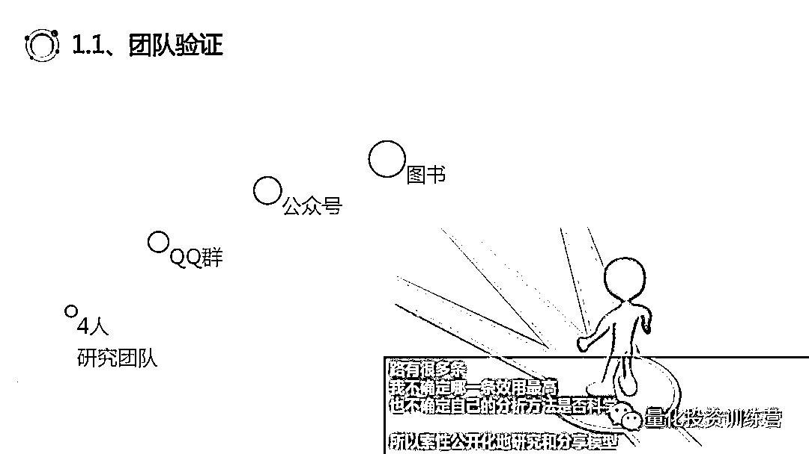
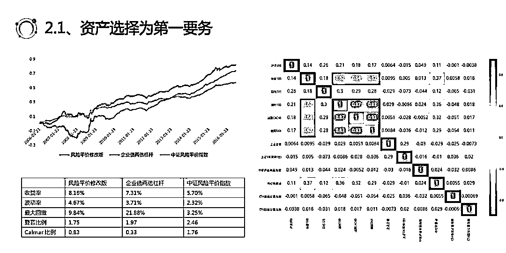
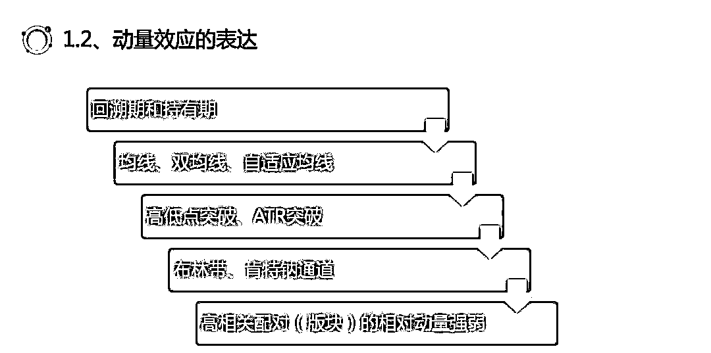
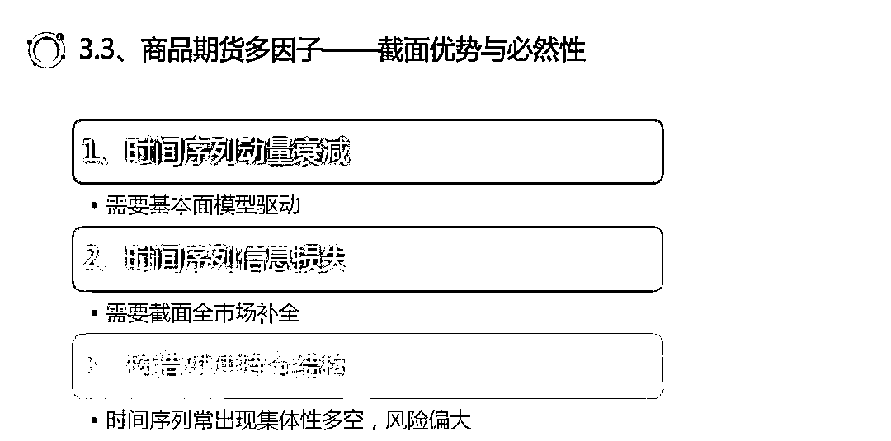
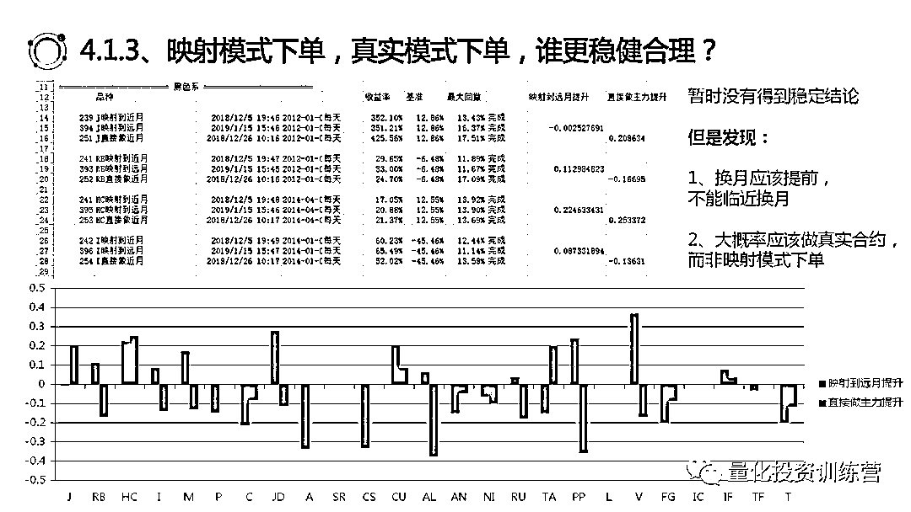

# 深度分享 | 80 页 PPT 解读量化开发与实盘

> 原文：[`mp.weixin.qq.com/s?__biz=MzAxNTc0Mjg0Mg==&mid=2653290346&idx=1&sn=71482fac1eb37ed6d0365ac061fd0141&chksm=802e3d7fb759b469693cc727878b3a53a85d19fd3a6645ceebd11a5730e221624b7ea12921ff&scene=27#wechat_redirect`](http://mp.weixin.qq.com/s?__biz=MzAxNTc0Mjg0Mg==&mid=2653290346&idx=1&sn=71482fac1eb37ed6d0365ac061fd0141&chksm=802e3d7fb759b469693cc727878b3a53a85d19fd3a6645ceebd11a5730e221624b7ea12921ff&scene=27#wechat_redirect)

**标星★公众号**，第一时间获取最新资讯

**近期原创文章：**

## ♥ [2018 中国量化投资年度盘点【独家】](https://mp.weixin.qq.com/s?__biz=MzAxNTc0Mjg0Mg==&mid=2653290036&idx=1&sn=79dd3529dd9300b0a5d3d6fee4607904&chksm=802e3c21b759b537eda936128dd5e13a22257d623b605b4a52d1c0ccc7f05abfefc93d10e366&token=1337549942&lang=zh_CN&scene=21#wechat_redirect)

## **♥** [利用深度学习最新前沿预测股价走势](https://mp.weixin.qq.com/s?__biz=MzAxNTc0Mjg0Mg==&mid=2653290080&idx=1&sn=06c50cefe78a7b24c64c4fdb9739c7f3&chksm=802e3c75b759b563c01495d16a638a56ac7305fc324ee4917fd76c648f670b7f7276826bdaa8&token=770078636&lang=zh_CN&scene=21#wechat_redirect)

## ♥ [一位数据科学 PhD 眼中的算法交易](https://mp.weixin.qq.com/s?__biz=MzAxNTc0Mjg0Mg==&mid=2653290118&idx=1&sn=a261307470cf2f3e458ab4e7dc309179&chksm=802e3c93b759b585e079d3a797f512dfd0427ac02942339f4f1454bd368ba47be21cb52cf969&token=770078636&lang=zh_CN&scene=21#wechat_redirect)

## ♥ [深度学习是信号处理和时序分析的最后选择？](https://mp.weixin.qq.com/s?__biz=MzAxNTc0Mjg0Mg==&mid=2653289999&idx=1&sn=800b645653a3e36ce57ff82260d030dc&chksm=802e3c1ab759b50cf9fb931574f84001f4858997be6330251c139deef0272e9217aa62276ea5&token=770078636&lang=zh_CN&scene=21#wechat_redirect)

## ♥ [人工智能『AI』应用算法交易，7 个必踩的坑！](https://mp.weixin.qq.com/s?__biz=MzAxNTc0Mjg0Mg==&mid=2653289974&idx=1&sn=88f87cb64999d9406d7c618350aac35d&chksm=802e3fe3b759b6f5eca6e777364270cbaa0bf35e9a1535255be9751c3a77642676993a861132&token=770078636&lang=zh_CN&scene=21#wechat_redirect)

## ♥ [神经网络在算法交易上的应用系列（一）](https://mp.weixin.qq.com/s?__biz=MzAxNTc0Mjg0Mg==&mid=2653289962&idx=1&sn=5f5aa65ec00ce176501c85c7c106187d&chksm=802e3fffb759b6e9f2d4518f9d3755a68329c8753745333ef9d70ffd04bd088fd7b076318358&token=770078636&lang=zh_CN&scene=21#wechat_redirect)

## ♥ [预测股市 | 如何避免 p-Hacking，为什么你要看涨？](https://mp.weixin.qq.com/s?__biz=MzAxNTc0Mjg0Mg==&mid=2653289820&idx=1&sn=d3fee74ba1daab837433e4ef6b0ab4d9&chksm=802e3f49b759b65f422d20515942d5813aead73231da7d78e9f235bdb42386cf656079e69b8b&token=770078636&lang=zh_CN&scene=21#wechat_redirect)

## ♥ [如何鉴别那些用深度学习预测股价的花哨模型？](https://mp.weixin.qq.com/s?__biz=MzAxNTc0Mjg0Mg==&mid=2653290132&idx=1&sn=cbf1e2a4526e6e9305a6110c17063f46&chksm=802e3c81b759b597d3dd94b8008e150c90087567904a29c0c4b58d7be220a9ece2008956d5db&token=1266110554&lang=zh_CN&scene=21#wechat_redirect)

## ♥[ Quant 必备：学什么、哪家面试难、哪家挣大钱？](https://mp.weixin.qq.com/s?__biz=MzAxNTc0Mjg0Mg==&mid=2653290261&idx=2&sn=ee7cf7dabe50ed89adafdc92e980a48c&chksm=802e3d00b759b416875b2881ec5bc8a81d95208271c66f3680afd3cfbf27aa2e506398ae9e90&token=304730811&lang=zh_CN&scene=21#wechat_redirect)

公众号编辑部受濮先生邀请，参加了 2019 年上海策略闭门交流会，现将部分会议内容刊登如下，文章来自濮先生公众号：量化投资训练营。

**原文**

走到年终，才发现自己踏入纯的数量化投资领域 4 年有余，依然无法忘记从 2008 年开始手工交易股票的盈利乐趣、漫长亏损忍耐，2015 年转型量化的各种困扰，以及 2016 年初入期货市场凌厉的风险偏好，和艰难地 CTA 模型实盘历程……这像是命运为一个生存于二级市场的凡人所准备的考卷，如果一次消耗太多本金，没有补考机会。

这其中走过哪些路，最近一年又做过哪些探索，今天通过公众号，向各位读者分享，并力求还原 2019 年 1 月 19 日上海策略分享会上，我和诸位好友交流的经典内容。

上海 银河期货 2019 年我们自发组织的策略交流会

再次感谢银河期货资管部负责人李伟，彼得明奇资管创始人谭昊，《量化投资与机器学习》公众号资深编辑等行业前辈，和诸位研究员、量化爱好者参加会议。

**一、我的量化学习与分析框架**

**1、量化学习路程**

作为一个起点平庸的量化爱好者，辗转几年进入金融行业，最初我们只有 4 人的兴趣团队，和很多爱好者一样，我们彼此协作研究模型，通过每个人擅长的领域覆盖不同资产，最终在一个市场环境非常恶劣的时间点（2017 年下半年），开始通过私募基金产品进行资管实践。

想到沃兹和乔布斯最初在车库里启动一个伟大的公司，我们这个小团队起步连车库都没有，还要什么自行车……大多数时候我们在餐厅沟通研究进展，后来知道预定公共会议室（方便投影），再后来有合伙人支持，获得稳定办公场所。

又区别于很多团队，我主张在开发过程中多交流分享，我们通过 QQ 群结识量化爱好者，所以有了《量化投资训练营》这个小众的公众号，还有了你们知道的那本粗浅的图书。因为我不确定哪一条效用最高，也不确定自己的分析方法是否科学，所以索性公开化地研究和分享部分模型。

我主张在学习开始，面向最有盈利机会市场的开发自己的策略，因为新进入量化领域，你的忍耐力比较脆弱，**如果长期无法得到可以盈利的资金曲线，放弃概率很高**。所以进一步地，我认为时间序列类模型（比如在指数上择时，甚至在个股上择时）学习成本最低，策略思路直观，不用复杂的统计和数据特征分析，也不用了解过多金融市场知识，最容易上手。这其中，又以动量类模型构造方法最简单。 

在市场的选择方面，我反而认为管理期货 CTA 容易用较少资金构建投资组合，如果有 10~50 万元，即可部署多品种多策略，比股票量化门槛低。在这里积累功底，容易向股票截面因子分析过度，因为股票多因子模型难度较高，无论 python 编程语言，还是截面数据统计分析方法，都有可能难倒初学者。

我们每个人的能力都有边界，有擅长和欠缺，所以认清自身实力，发现缺陷，尝试和模型匹配，非常重要。这并不意味着我们必须完成从 IT 平台搭建到策略开发的全流程，而是选择你擅长的环节。我们要接受自己交易 IT 功底的缺陷、或中低频模型的风险（缺乏高频模型）、或通过有限的资金量（个人的资金量和初期机构资金量有局限性）做资产和策略配置。

所以你可以借用其他 IT 平台，如已有的各种在线式编程平台，并在中低频方面尽可能构建不同源模型，甚至在策略之间动态调节资金，或者放弃某些策略部署，这都是常事。

**2、量化分析框架**

做实盘交易（特别是受人之托管理资产），第一个要解决的不是模型开发到什么完美程度，而是选择合适的资产。这里以团队中王前锋最早做过的保险资管配置方案举例，追求较高的确定性收益，并且在资产中追求低相关，这比策略模型的低相关更重要。

其次依然不是追求完美的模型，而是考虑任何模型和方法的边界，下图左半部分是已故的刘宏老师（F10 功能创始人，国内首家市场中性私募基金创始人，享誉多项第一）给我们的宝贵遗产：当波动率小于一个临界值时，无论如何优化策略的参数都无法获利。当波动率超过临界值后策略，很容易获利，但是过大的波动率也会影响其收益。

所以不要在低波动情况下在时间序列类动量策略模型上消耗时间精力。右半部分是我们工作过程中，给一些新入门爱好者的建议：现象是暂时的，背后的哲学是持久的。没有坚实理论支撑的模型，没有存在意义。单纯数据挖掘违反这一原则（基于可靠的经济学理论），也为量化投资划定了边界，换句话说也为模型划定了边界。要去努力寻找你的模型最佳的生存区间，比如高频交易模型，通过对高频数据进行机器学习，依然可以获取到可观收益，但是放在中低频显得非常困难，高频 tick 数据就是它最佳的生存区间。

我的量化分析框架的第三部分，是设法增加数据源，没有什么比数据源更重要的。本质上必须非同源因子，才具备多维度解释力，多维度数据也是对抗过拟合的利器。行情、基本面、宏观、舆情、高频等维度数据，缺一不可。

第四部分，是挖掘因子，从点到线。如果一个好的 idea 刺激到你，寻找到一个好的因子，比如特指波动率因子，你应该能够明白风险模型中还有类似的特异度因子，也可以加以利用。**此外这种因子都和动量（反转）因子有千丝万缕的联系**，顺着这条线，可以参考研报，将改进后的动量因子，以及 CGO 等行为金融学因子，都测试一遍。

基本面也是类似 PB 和 ROE、ROIC/PB 这一路，可以挖掘到价值与估值因子，通过分析师 G（盈利预测）、扣非 PE（精细加工基本面），可以打造出增强 PEG 因子，它们的 IC 和收益都能上一个台阶。

第 5 部分是我想解释根号下交易次数这种绩效评估方式，但是必须要从 CAPM 说起。CAPM 的假设“预期残差收益率（残差对于个股（或单独资产）收益率 ri 的贡献）为零”。自然产生其推论“被动投资最优”（无 Alpha 收益）。

完全假设下的 CAMP 模型无法解释的风险部分，就是残差。事实上市场非有效，所以存在不能完全使用市场收益率 rm 解释的风险。有了残差概念，就可以引入 IR 这个绩效评估方法。

IR 是残差收益率，对残差风险（标准差）的比值。 可以理解为是残差的夏普比率。IR 越大，说明收益模型越好，风险模型越差。因为存在一个持续显著的残差项（收益模型可持续利用该残差项盈利，风险模型持续性无法解释该残差为什么存在）。

再往后，我们才能过渡到 IR 的第二种表达方法——IC*√BR。即投资组合的信息比率 IR 取决于投资策略的广度 BR（Breadth）和信息系数 IC（Information Coefficient）。这里的 BR（Breadth）：投资策略的广度，**即策略每年对超额收益率做出的独立预测数目**。你的股票模型每个截面上持股数量必须足够多，才有足够的 BR。这一点很多人知道，但是难以表达出来。

实际上我们推导过程中，由于能力所限，只推导出了 IR = Cov(x,y)* √BR（这里的 x 指因子值，y 指收益率），并没有推导出 IR = IC（Cov(x,y) / √VAR(x)* VAR(y)）* √BR，所以每当遇到类似问题，也难免对自己的数学功底心慌，好在相关系数和协方差线性相关（如果 x 和 y 的方差稳定）。通过提升持股数量获得更可靠绩效，也容易理解。

在时间序列类模型中，如 TB 软件“置信度”是推导出“头寸系数”的重要过程，计算公式为：1-1/√交易次数。也表示在同等利润或者夏普比率下，越高的绩效置信度说明实盘阶段该绩效保持不变的可能性越高。这类目标函数都可以辅助你评价或训练出更好模型。

**二、股票量化收获**

**1、因子检验**

在股票领域，我谈不上有什么积累，对初入市场的研究者，有一些走过的路径可参考。首先就是单因子分析，流程如图，每个流程都不可忽略。

金融数据的高噪音特性（特别是基本面数据），导致数据清洗直接影响回归质量。我都是使用已经被验证较好的 3 倍 MAD 限制（中位数极值）方法，将超出上下 3 倍 MAD 的数据，都规整到区间内部，首先用中位数更好反应真实分布特征，然后用限制法保证数据大致在一个区间内，有利于打分或回归得到准确水平。

中性化部分，我提出 3 个疑问：

1、中性化对性能有伤害，但需要做

2、是否考虑过行业分类合理性？

3、是否考虑过不做行业中性化？

每个人观点不同，我的答案分别是：

肯定需要做中性化；行业分类不一定使用申万 28 个一级行业，而是尽可能使用更好的分类方法；可以不做行业中性化，但是市值中性化还是要做。

第三部分是因子值相关性分析，不能简单通过相关系数剔除因子，因为你常会遇到诸如 PE 和扣非 PE 保留谁的问题，结论肯定是要保留扣非 PE 这样更有真实信息含量的因子。所以逻辑很重要，是否了解财务逻辑、了解财报如何造假很重要。

回归法模型会涉及到因子之间的 VIF（方差膨胀因子）检验，我认为 VIF 可能是必须环节，**它通过循环互相回归，来用 X1~Xn-1 解释每一个自变量 Xn，寻找被解释程度最高的因子，然后剔除**，之后会有文章介绍 VIF 执行细节。随着因子数量上升，整体的因子互相解释度都有上升，所以剔除高共线性因子的阈值，不能是固定值。

IC 分析也是单因子检验体系中重要一个环节，IC 为每个时间截点上因子在各个股票的暴露度和股票下期收益的 Pearson 相关系数，IC 值越高意味着该因子的暴露度与未来收益率存在较明显的相关关系。

光大研报《多因子系列报告之一：因子测试框架》这样描述： 我们会得到一个 IC 值序列，类似的，我们将关注以下几个与 IC 值相关的指标来判断因子的有效性和预测能力：

（1） IC 值的均值——体现 IC 强度

（2） IC 值的标准差——体现 IC 波动

（3） IC 大于 0 的比例——体现 IC 显著性

（4） IC 绝对值大于 0.02 的比例——体现 IC 显著性

（5） IR （IR = IC 均值/IC 标准差）——通过类似夏普分析方法，体现 IC 质量

单因子分析中多组曲线对冲也是必做环节，因为我们需要多空收益分布。常见的第一组除以最后一组，得到多空对冲曲线，用来观察因子收益和回撤稳定性。但是它没有告诉你，收益来自于空头，还是多头。

我们需要改进组间分析方法：用第一组除以基准，得到多头对冲曲线。用最后一组除以基准，得到空头超额收益曲线。

通过计算组间差异，**可以凸显因子全阶段的稳定性**。比如你有 10 组曲线，可以求出前三组，后三组的平均收益，对两组平均收益差，求 t 检验，证明分层能力是否显著，且是否持续。这比起我们用肉眼观察，然后下结论“分层稳定”，要显得靠谱很多。

**2、因子分享**

股票量化收获的第二节，我们分析两个可实战的因子。

ROIC 除以 PB，是一个看起来表现不错的因子，它同时考虑了安全边际+盈利，好公司应该这样选。

实际上我们对于 ROE，ROIC 的挖掘依然很浅显，但是仅是写出这个因子的代码，相信很多人就被挡在门外。

非对冲情况下，该因子没有显著风格暴露和风险暴露，但是 Barra 告诉我们收益主要来源于账面市值比 BP 因子和非线性市值（中等规模因子，市值因子数据进行 3 次方，然后和市值因子正交化处理）。

第二个因子是 CGO 资本利得突出量，该因子通过前景理论描述了：投资者的风险偏好存在突变：投资者在处于亏损状态时，是风险偏好的，而处于盈利状态时则是风险厌恶的。

投资者在处于高度盈利状态 A 时效用增加缓慢，风险规避，从而倾向于抛售获利股票。在处于深度亏损状态 B 时，由于效用函数平缓下降，有过度自信的惜售心理，甚至“越跌越补”，股价则有较大的反转可能。

我们基于过去 100 日成交均价按照换手率加权平均的 RP，然后计算资本利得突出量 (Capital Gain Overhang) ，CGO𝑡表示第 t 日这只股票市场持仓者相对参考价格(RP)的平均盈亏情况，CGO𝑡越大浮盈越大。

这是我们测试中发现量价类收益最显著的因子。但是这类因子需要周度调仓，较为频繁，手续费影响较大。所有量价类因子都存在这个问题。 

**3、模型分享**

 第三节，我们分享一个整合择时与选股+对冲的股票模型，这里存在一些不稳定因素，因为对 RSRS 依赖过度，但是我有一定理由相信这个指标的稳定性。RSRS 的计算方法如图。可以直接标准分，也可以修正标准分，也可以再有偏标准分。

我也会思考：RSRS 的本质是什么呢？其实是上波动 High 与下波动 low，线性回归后，得到方向性。券商已经测试过其参数稳健性，基本符合要求。

这类动量模型，在个股上无法使用，行业指数可以使用，市场指数效果更好。

我在恒生指数、日经 225 指数、标普 500、英国富时上测试了效果，单纯做多情况下，恒生指数、日经 225 指数表现优秀，尤其是港股市场。

**粗暴地假设：我们还有 5~10 年走向港股市场成熟度，这个指标至少还有 5 年阳寿？**日经指数 20 年来以下跌为主，RSRS 却能显著跑赢指数，这一结果也值得参考。

接下来我们将 ROE 和 ROIC 结合使用，并结合了 PB 以考虑估值因素，两次交集+一次并集，得到一个初步股票池。具体的选股方式是：基本面信息更新后立刻调仓（日频调仓），结合打分法，降低噪音影响，得到股票池。

在空仓期，使用了现金、银华日利、企业债、国债、纳指各种 ETF 做现金管理，其中风险敞口最大的纳指，效果最好。我在某些股票社区也看到过类似结论，说明中美股票市场动态抽取资金？也许是这样，但是直接持有纳指依然有风险，毕竟我们没有对其进行分析，仅凭借美股和 A 股的负相关关系（还没有经过严格检验），就去持有不合理。

此时我们想到了股指期货，做空等名义价值的股指期货，在空仓期，也许是较好选择。我们让卖出条件更为严格，然后得到了空仓期做空股指期货的效果。年化 47%，但是回撤非常大，**不过作为一个可参考的策略模板，它的结构已经基本上完整了**。

**三、期货量化积累**

**1、动量模型改进**

在期货领域，尤其是商品期货上，有一定积累。不仅是模型研发，还有实盘的感悟。

首先是动量效应，你理解和掌握动量之后，坚持去做动量，在过去 10 年包括 2018 年，收益是非常丰厚的。动量从观测维度上，分为时间序列和截面这两类，也称为绝对动量和相对动量。**其中时间序列动量对于高相关品种不能很好识别，收益高、风险高。**截面动量可以认为是一种 alpha 收益，特别是你还可以尝试在两个品种对上，做截面动量。

动量的表达有很多种方式，如图，各位做过的模型，拿到各网站分享的源码，都不少了，是否考虑过过于冗余和同源。

时间序列动量的表现很好，海龟交易法则就是例子。

很多人觉得海龟回撤大，稳定性低，结果自己瞎折腾各种模型，收益稳定吗？去年的北京分享会上，**我和诸位考虑过一个问题：辛辛苦苦干一年，输给海龟，怎么办？为什么输？**因为参数拟合、交易频度过高、逻辑不强硬、交易信心不足。

当然**这也并不意味着，我们就要去刻板地执行海龟**，因为你有强大的策略开发能力，为什么不放在经典框架的迭代方面？首先要解决的就是改进出场。如图。

改进完毕后，我们关闭离市周期条件。因为反应不足需要使用系统的主体条件应对——均线、突破等（入场），反应过度需要使用系统的外挂条件应对——基于波动率的追踪止损（出场）。

只保留 ATR 出场和反手后，90%品种多年绩效出现大幅度改进，**组合的夏普也提升了 0.26**。我更愿意相信各品种改进带来的组合性能改进，因为这个改进仅针对各品种，还未涉及到组合内部（之后你们会明白我要表达的意思）。

顺便谈一个问题——加仓（老生常谈了）。简单的海龟系统不支持加仓，国内商品期货的动量效应递减，也不支持加仓，**做风控还来不及，现有模型框架和技术储备下，难有勇气加仓。**加仓除了增加了收益毫无用处，而期货最需要的是收益风险比的改进。

止损区间很重要，原版海龟系统给予各品种 2 倍 ATR 止损。但是测试发现，越贵止损越小，波动越高止损越小，是正确的。

止盈也是需要的，我们测试发现，多品种组合内，可以止盈一部分高波动品种，降低组合波动率。

如图我们采用**分步出场方法，第一步，走 50%头寸，第二步，通过追踪止损再走 50%**。高波动率止盈，带来的收益风险比提升是显著的，也成为我们实盘的重要支撑模型。但是这和普通的个人投资者模型依然没有显著区别，所以，我们从截面上下功夫。

**2、横截面风控**

这就到了本部分的第二节：横截面风控。因为各品种互相争夺投机资金、互相争夺先发优势、互相叠加持仓风险，所以要做截面分析。我们的投资标的，是存在于整体期货市场的，不是单独存在的，所以要分析和监控市场。

横截面上都有很多信息，可以做交易方向性信号的发出，也可以做资金分配。可惜的是我依然没能找到进攻性的资金配置策略，但是我找到了防御性的。

为了方便 TB 交易开拓者执行时间序列模型，而不在一个模型内混用软件，我们使用 TB 加载一个多品种的工作区，不下单，仅提供数据，提供两项数据：1、全市场波动率，2、全市场方向性。

波动率方面，可以看出，使用波动率均值来过滤波动率，比固定使用某个阈值，要好很多。它可以更加自适应地寻找到波动率较高的位置，并控制这些位置的风险。

方向性方面，我会约束全市场价格 - 20 日均值为方向性表达，这个值为正数方向性变量+1，为负数-1。如果超过 75%的品种多头或者空头，证明市场发生了较大幅度的整体性偏多或者偏空，以此表示风险。

在主模型中，我们读取多品种工作区产生的 CSV 文件，然后定义 Bool 变量，当波动率高于均值且 方向性偏多（或偏空）超过 75%，不开仓，系统执行防御。类似的风控条件不仅适用于海龟模型，适用于几乎所有时间序列动量交易系统。这种防御措施，带来了 20%左右收益风险比（和夏普比率）增加，配合主动止盈等因素，系统在中低频上，也能跑出一个勉强可以被基金资产配置（对于多数个人交易者，这已经很棒）的绩效。

改进后的系统，部署在 30 个品种上，在 10%%手续费+开平各 1 条滑点的冲击成本下，可以带来超过 2 的调整后收益风险比和接近 2 的夏普比率，它几乎没有敏感参数。

**3、期货多因子模型**

期货分享的第三部分，是多因子模型。通过多因子框架，涵盖所有之前我们做过的模型，是一个可持续迭代的选择，这里的因子更多指基本面因子。因为价格的驱动越来越倾向于转向产业资本，而品种越来越多，资金却不见增加，所以时间序列动量模型盈利有一些困难，多因子有可能是一个解决方案。

因子主要分为**量价和基本面**。

商品期货多因子通过截面分析，能够获得优势，主要在于：

1、基本面逻辑驱动（原因），比动量驱动（结果）更好

2、截面包含全市场信息补全，时间序列损失了部分信息

3、截面模型可构造金额对冲的持仓结构，时间序列模型难以做到

然后我们构造了动量、期限结构（展期收益率）、现货价格（和期货基差）、仓单+库存、会员持仓这样几个因子，其中“现货价格、会员持仓”数据来自 Fushare（这是一个值得研究的期货开源数据平台）。

我们合并测试了多因子绩效，**通过 Fushare 作者提供的测试结果可看到，情况较为理想**，理论夏普可以达到 2。通过聚宽平台也测试了类似模型，在很粗的模型框架下，可以达到 1.52 夏普比率，并且回撤时间，和动量类模型体现出非常大差异。

最后提醒大家一点：绝对因子值可以辅助（确认）相对因子值，时间序列动量可以辅助截面动量，时间序列库存可以辅助截面库存。

最后一部分，我们提示大家，期货实战中有可能用到的头寸调节方式，通过截面投机度、ER 效率系数等因子，都可以调节。

还要监控提前换月，和异常远月合约变化。

关于模型运行在真实主力合约，还是通过映射模式，挂载在指数合约，映射到主力合约，我们建议直接做真实合约，但是要注意提前换月或者推后换月，往往持仓量切换的换月点，不是最佳换月机会。

**四、资产配置尝试**

**资产配置是投资市场的皇冠**，我们仅能在现阶段做尝试，但是尝试的结果在 2018 年帮助我们获得较好收益，获得更低风险，也为这种规模较小，且模型研发储备不足的公司，提供了喘息的机会（不是谦虚，仅是陈述事实）。

桥水风险平价启示我们，要做多资产覆盖，动态调节头寸。任何一种资产都有遭遇不测，或者迎来较大交易机会的可能性。而你很难提前获知，所以通过配置的方法，动态监测波动率和价格走势，提前布局。

国信的“信用风火轮”也带来类似效果。信用（现实金融环境）带来的资产切换，比央行信用目标更重要。因为金融资金链上的**一系列主体的信用派生与吸纳能力**，可能受到市场实际情况影响。

风险平价纯的数理化模拟我们在公众号演示过，我有两点体会：

**1、债券基本上可以 all in，**

**2、高风险类资产权重要严格控制。**

****

很多人认为“资产等风险”和“资产对组合的风险贡献相等”类似，其实不然，长期模拟后显示风险平价绩效更好。

2018 年对于团队最佳的奖赏，莫过于我们的某只产品获得较好排名，因为配置债券比例较高，赶上信用债牛市，勉强实践了量化资产配置这一课题。为了该产品和其他几只产品有足够资金配置，我们在股票和期货上，只能勉强维持部署几套模型，但是看到**前锋兄****荣获 2018 年度金长江奖年度新锐私募基金经理**，依然非常欣喜。这是一场长跑，认识到自己的不足，获得微弱的积累优势，是资管公司成长必经之路。

我们用这样一张 PPT 来结尾。当你开始卸掉自己身上的光环，去观察人性的缺陷和反思自己的学习历程时，会发现量化道路上，我们面对的大多数选择，并不是：**The right way, or the wrong way ?**真正面临的选择是：**The right　way, or the easy way ?**

因为我们喜欢选择捷径，认为自己的金融知识和有限的认知偏差能战胜市场，或者认为自己的算法优势和数据挖掘强项能掩盖逻辑缺失，或者认为极小概率发生的连续性回撤和多资产共振不可能被自己遇到，**实际上这些问题都会在实盘交易中暴露**。业绩是检验一切的真实标准，要逼迫自己走出舒适区，想想你最初为什么走入这个领域——为了真正的自由。

再次感谢银河期货李伟老师提供交流场地。

**PDF 获取链接：**

*https://pan.baidu.com/s/1W57mh8rLc89ThVYSCnOnUA *

提取码：8xds

**推荐阅读**

[01、经过多年交易之后你应该学到的东西（深度分享）](https://mp.weixin.qq.com/s?__biz=MzAxNTc0Mjg0Mg==&mid=2653289074&idx=1&sn=e859d363eef9249236244466a1af41b6&chksm=802e3867b759b1717f77e07a51ee5671e8115130c66562577280ba1243cba08218add04f1f00&token=449379994&lang=zh_CN&scene=21#wechat_redirect)

[02、监督学习标签在股市中的应用（代码+书籍）](https://mp.weixin.qq.com/s?__biz=MzAxNTc0Mjg0Mg==&mid=2653289050&idx=1&sn=60043a5c95b877dd329a5fd150ddacc4&chksm=802e384fb759b1598e500087374772059aa21b31ae104b3dca04331cf4b63a233c5e04c1945a&token=449379994&lang=zh_CN&scene=21#wechat_redirect)

[03、全球投行顶尖机器学习团队全面分析](https://mp.weixin.qq.com/s?__biz=MzAxNTc0Mjg0Mg==&mid=2653289018&idx=1&sn=8c411f676c2c0d92b0dd218f041bee4b&chksm=802e382fb759b139ffebf633ac14cdd0f21938e4613fe632d5d9231dab3d2aca95a11628378a&token=449379994&lang=zh_CN&scene=21#wechat_redirect)

[04、使用 Tensorflow 预测股票市场变动](https://mp.weixin.qq.com/s?__biz=MzAxNTc0Mjg0Mg==&mid=2653289014&idx=1&sn=3762d405e332c599a21b48a7dc4df587&chksm=802e3823b759b135928d55044c2729aea9690f86752b680eb973d1a376dc53cfa18287d0060b&token=449379994&lang=zh_CN&scene=21#wechat_redirect)

[05、使用 LSTM 预测股票市场基于 Tensorflow](https://mp.weixin.qq.com/s?__biz=MzAxNTc0Mjg0Mg==&mid=2653289238&idx=1&sn=3144f5792f84455dd53c27a78e8a316c&chksm=802e3903b759b015da88acde4fcbc8547ab3e6acbb5a0897404bbefe1d8a414265d5d5766ee4&token=2020206794&lang=zh_CN&scene=21#wechat_redirect)

[06、美丽的回测——教你定量计算过拟合概率](https://mp.weixin.qq.com/s?__biz=MzAxNTc0Mjg0Mg==&mid=2653289314&idx=1&sn=87c5a12b23a875966db7be50d11f09cd&chksm=802e3977b759b061675d1988168c1fec06c602e8583fbcc9b76f87008e0c10b702acc85467a0&token=1972390229&lang=zh_CN&scene=21#wechat_redirect)

[07、利用动态深度学习预测金融时间序列基于 Python](https://mp.weixin.qq.com/s?__biz=MzAxNTc0Mjg0Mg==&mid=2653289347&idx=1&sn=bf5d7899bc4a854d4ba9046fdc6fe0d6&chksm=802e3996b759b080287213840987bb0a0c02e4e1d4d7aae23f10a225a92ef6dd922d8006123d&token=290397496&lang=zh_CN&scene=21#wechat_redirect)

[08、Facebook 开源神器 Prophet 预测时间序列基于 Python](https://mp.weixin.qq.com/s?__biz=MzAxNTc0Mjg0Mg==&mid=2653289394&idx=1&sn=24a836136d730aa268605628e683d629&chksm=802e39a7b759b0b1dcf7aaa560699130a907716b71fc9c45ff0e5d236c5ae8ef80ebdb09dbb6&token=290397496&lang=zh_CN&scene=21#wechat_redirect)

[09、Facebook 开源神器 Prophet 预测股市行情基于 Python](https://mp.weixin.qq.com/s?__biz=MzAxNTc0Mjg0Mg==&mid=2653289437&idx=1&sn=f0dca7da8e69e7ba736992cb3d034ce7&chksm=802e39c8b759b0de5bce401c580623d0729ecca69d13926479d36e19aff8c9c9e8a20265afff&token=290397496&lang=zh_CN&scene=21#wechat_redirect)

[10、2018 第三季度最受欢迎的券商金工研报前 50（附下载）](https://mp.weixin.qq.com/s?__biz=MzAxNTc0Mjg0Mg==&mid=2653289358&idx=1&sn=db6e8ab85b08f6e67790ec0e401e586e&chksm=802e399bb759b08d6eec855f9901ea856d0da68c7425cba62791b8948da6ad761a3d88543dad&token=290397496&lang=zh_CN&scene=21#wechat_redirect)

[11、实战交易策略的精髓（公众号深度呈现）](https://mp.weixin.qq.com/s?__biz=MzAxNTc0Mjg0Mg==&mid=2653289447&idx=1&sn=f2948715bf82569a6556d518e56c1f9e&chksm=802e39f2b759b0e4502d1aaac562b87789573b55c76b3c85897d8c9d88dbf9a0b7ee34d86a4e&token=290397496&lang=zh_CN&scene=21#wechat_redirect)

[12、Markowitz 有效边界和投资组合优化基于 Python](https://mp.weixin.qq.com/s?__biz=MzAxNTc0Mjg0Mg==&mid=2653289478&idx=1&sn=f8e01a641be021993d8ef2d84e94a299&chksm=802e3e13b759b7055cf27a280c672371008a5564c97c658eee89ce8481396a28d254836ff9af&token=290397496&lang=zh_CN&scene=21#wechat_redirect)

[13、使用 LSTM 模型预测股价基于 Keras](https://mp.weixin.qq.com/s?__biz=MzAxNTc0Mjg0Mg==&mid=2653289495&idx=1&sn=c4eeaa2e9f9c10995be9ea0c56d29ba7&chksm=802e3e02b759b7148227675c23c403fb9a543b733e3d27fa237b53840e030bf387a473d83e3c&token=1260956004&lang=zh_CN&scene=21#wechat_redirect)

[14、量化金融导论 1：资产收益的程式化介绍基于 Python](https://mp.weixin.qq.com/s?__biz=MzAxNTc0Mjg0Mg==&mid=2653289507&idx=1&sn=f0ca71aa07531bbbdbd33213f0bab89f&chksm=802e3e36b759b720138b3b17a4dd0e198e054b9de29a038fdd50805f824effa55831111ad026&token=1936245282&lang=zh_CN&scene=21#wechat_redirect)

[15、预测股市崩盘基于统计机器学习与神经网络（Python+文档）](https://mp.weixin.qq.com/s?__biz=MzAxNTc0Mjg0Mg==&mid=2653289533&idx=1&sn=4ef964834e84a9995111bb057b0fc5dd&chksm=802e3e28b759b73e0618eb1262c53aa0601fbf5805525a7c7ff40dc3db62c7704496611bdbf1&token=1950551577&lang=zh_CN&scene=21#wechat_redirect)

[16、实现最优投资组合有效前沿基于 Python（附代码）](https://mp.weixin.qq.com/s?__biz=MzAxNTc0Mjg0Mg==&mid=2653289609&idx=1&sn=c7f0b3e47025862d10bb53b6ab88bcda&chksm=802e3e9cb759b78abf6b8b049c59bf18ccfb2ead7580d1f557d36de2292f59dcbd94dcd41910&token=2085008037&lang=zh_CN&scene=21#wechat_redirect)

[17、精心为大家整理了一些超级棒的机器学习资料（附链接）](https://mp.weixin.qq.com/s?__biz=MzAxNTc0Mjg0Mg==&mid=2653289615&idx=1&sn=1cdc89afb997d0c580bf0cef296d946c&chksm=802e3e9ab759b78ce9f0cd152a680d4a413d6c8dcb02a7a296f4091993a7e4137e7520394575&token=2085008037&lang=zh_CN&scene=21#wechat_redirect)

[18、海量 Wind 数据，与全网用户零距离邂逅！](https://mp.weixin.qq.com/s?__biz=MzAxNTc0Mjg0Mg==&mid=2653289623&idx=1&sn=28a3600fd7a72d7be00b066ca0f98244&chksm=802e3e82b759b7943f43a4f6ef4a91e4153fa6b8210de9590235fa8ee66eb9811ce177054dbc&token=1389401983&lang=zh_CN&scene=21#wechat_redirect)

[19、机器学习、深度学习、量化金融、Python 等最新书籍汇总下载](https://mp.weixin.qq.com/s?__biz=MzAxNTc0Mjg0Mg==&mid=2653289640&idx=1&sn=34e94fcbe99052b8e7381ecc48a36dc0&chksm=802e3ebdb759b7ab897cd329a680715b6f8294e63550ddf0c57b9e1320b2b7d1408c6fdca0c7&token=1389401983&lang=zh_CN&scene=21#wechat_redirect)

[20、各大卖方 2019 年 A 股策略报告，都是有故事的人！](https://mp.weixin.qq.com/s?__biz=MzAxNTc0Mjg0Mg==&mid=2653289725&idx=1&sn=4b65cd1fb8331438e4c0b3d0eae6b51f&chksm=802e3ee8b759b7fe1b94e84d54cc23b0ab05853d5cd227812574b350e9fc2cce9e5f1bc6cb7a&token=1389401983&lang=zh_CN&scene=21#wechat_redirect)

**扫码关注我们**

