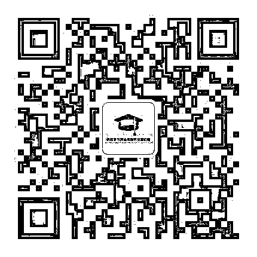

# 二千零一十九、年值得关注的九个高质量公众号

> 原文：[`mp.weixin.qq.com/s?__biz=MzAxNTc0Mjg0Mg==&mid=2653290302&idx=1&sn=b401612de33910d42c45ea0b5597b3c6&chksm=802e3d2bb759b43d1ca882096d51365a6c405fc38d3d2522ebf0e168d84ee3117fec1ba0ab0e&scene=27#wechat_redirect`](http://mp.weixin.qq.com/s?__biz=MzAxNTc0Mjg0Mg==&mid=2653290302&idx=1&sn=b401612de33910d42c45ea0b5597b3c6&chksm=802e3d2bb759b43d1ca882096d51365a6c405fc38d3d2522ebf0e168d84ee3117fec1ba0ab0e&scene=27#wechat_redirect)

逆水行舟，不进则退。我们的工作已经占用了大块的时间了，剩下的只有各种碎片，最适合碎片时间学习的，莫过于优质的技术干货公众号啦~以下这些是小编精选，里面有很多资讯和资源，内含干货，希望能给大家在学习过程中带来一些帮助。

**顶级程序员**

谁说程序员是无趣无聊的！顶级程序员就向你全方位立体式 360 度展示程序员群体的有趣、温情、态度以及情怀！这里有程序员最关心的话题，这里有最牛逼的行业大咖，这里有最有料的职场干货，我们在这里记录程序员的点滴生活和嬉笑怒骂。

**按上图，弹出“识别二维码”后关注**

**架构师小秘圈**

架构师小秘圈，聚集 15 万架构师的小圈子！不定期分享技术干货，行业秘闻，汇集各类奇妙好玩的话题和流行方向！

**按上图，弹出“识别二维码”后关注**

**机器学习算法与自然语言处理**

一个哈工大 NLP 在读博士的技术提升之路，为您提供一系列我在学习路上的笔记，经验以及感悟。自然语言处理领域排名第一，机器学习算法领域排名第一，与君成长！

**按上图，弹出“识别二维码”后关注**

**Python 爱好者社区**

Python 爱好者社区，你想学的这里基本都有，已经积淀了数百篇优秀文章，例如技术方面的：Python 入门, 进阶，数据结构与算法，面向对象编程，数据分析挖掘，机器学习，深度学习，自然语言处理。业务方面的：数据分析师能力培养系列等。还有不定期的免费公开课和送书活动等你来撩。

后台回复：“Python 书籍”，可以领取大量免费 Python 及数据方面书籍

**按上图，弹出“识别二维码”后关注**

**码农有道**

一个百度人的技术提升之路，为您提供一系列系统架构、数据结构、网络、C++、计算机底层等高质量技术文章，让您的碎片化时间最大价值化。同时会不定期分享精品免费视频和资源，让您的技术之路不再单调枯燥。

**按上图，弹出“识别二维码”后关注**

**JAVA**

海量 JAVA 资源免费分享（V 信公众号二次开发教程、电子书、视频、笔记、精彩文章、经验交流、最新技术）

**按上图，弹出“识别二维码”后关注**

**挖地兔**

挖地兔作为金融大数据开放平台 Tushare 的公众号，定期发表一些贴近实践的技术和业务相关分析文章，为量化投资和智能投资从业人员提供技术和数据相关内容，帮助大家了解业界最新方向，同时也给用户提供免费的包括股票期货期权在内的金融数据。

**按上图，弹出“识别二维码”后关注**

**飞总聊 IT**

飞总，从事大数据的基础构架研发 10 余年。本公众号的主要目的是和大家交流我在大数据基础架构，IT 前沿发展，职场经验的方面的观点和看法。

**按上图，弹出“识别二维码”后关注**

**利兄日志**

一个教你做 PPT 的公众号，不仅免费分享各种 PPT 教程，还免费赠送各类 PPT 模板。作者是一名知乎大 V，是知乎收藏量最高的 PPT 答主，他 PPT 定制的价格超过 500 元一页。如果你也想做出高逼格的幻灯片，关注它就对了。

**按上图，弹出“识别二维码”后关注**