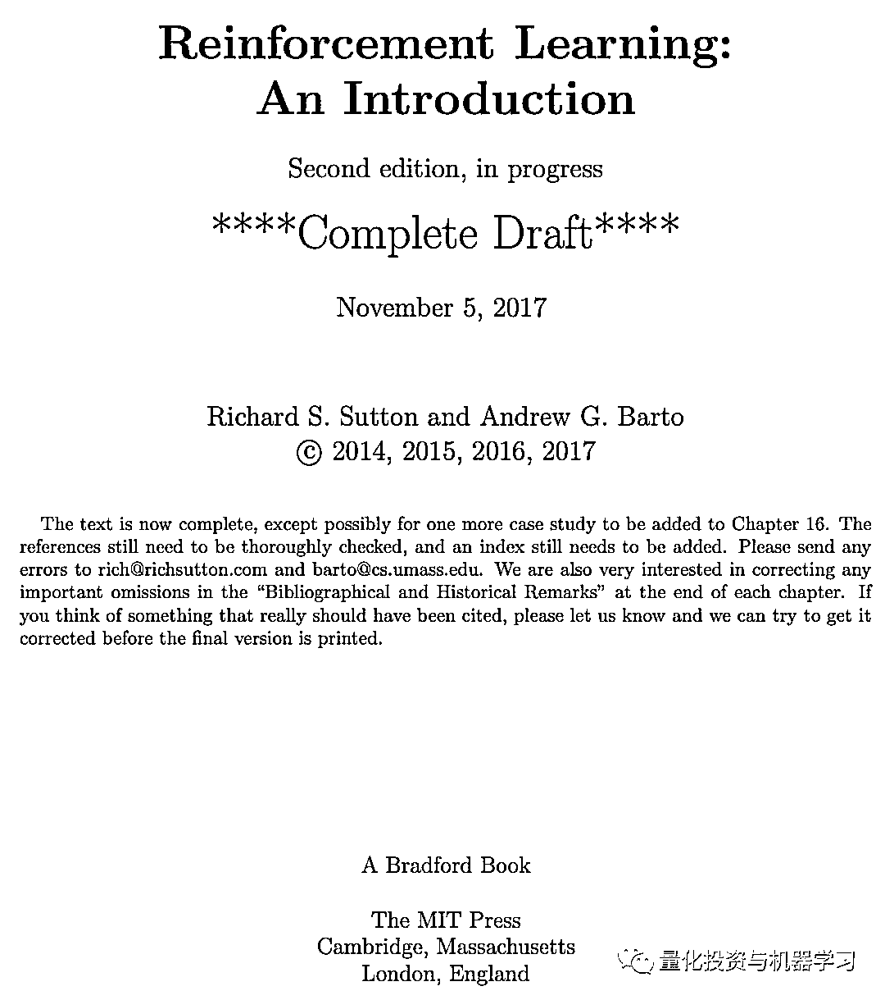
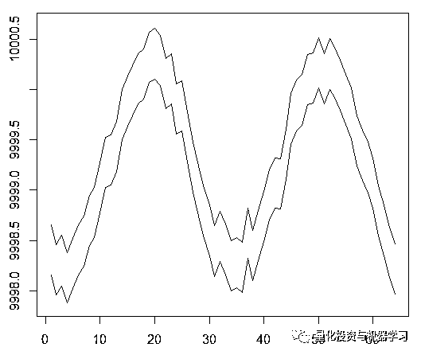
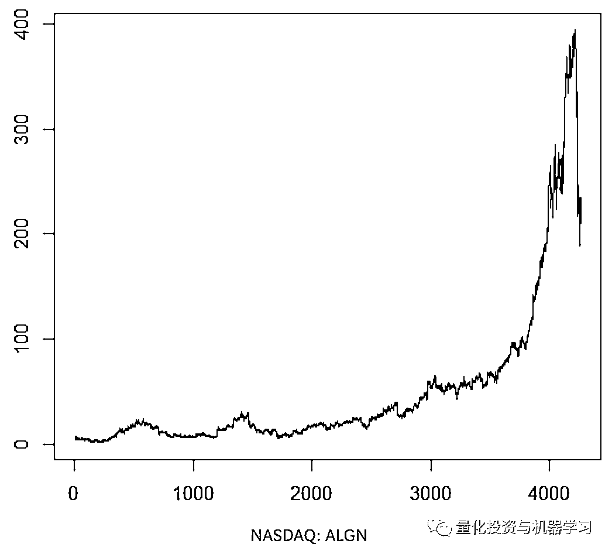

# 优化强化学习 Q-learning 算法进行股市交易（附代码）

> 原文：[`mp.weixin.qq.com/s?__biz=MzAxNTc0Mjg0Mg==&mid=2653290286&idx=1&sn=882d39a18018733b93c8c8eac385b515&chksm=802e3d3bb759b42d1fc849f96bf02ae87edf2eab01b0beecd9340112c7fb06b95cb2246d2429&scene=27#wechat_redirect`](http://mp.weixin.qq.com/s?__biz=MzAxNTc0Mjg0Mg==&mid=2653290286&idx=1&sn=882d39a18018733b93c8c8eac385b515&chksm=802e3d3bb759b42d1fc849f96bf02ae87edf2eab01b0beecd9340112c7fb06b95cb2246d2429&scene=27#wechat_redirect)

**标星★公众号**，第一时间获取最新资讯

本期作者： Alexey Burnakov

本期翻译：1+1=6

**近期原创文章：**

## ♥ [2018 中国量化投资年度盘点【独家】](https://mp.weixin.qq.com/s?__biz=MzAxNTc0Mjg0Mg==&mid=2653290036&idx=1&sn=79dd3529dd9300b0a5d3d6fee4607904&chksm=802e3c21b759b537eda936128dd5e13a22257d623b605b4a52d1c0ccc7f05abfefc93d10e366&token=1337549942&lang=zh_CN&scene=21#wechat_redirect)

## **♥** [利用深度学习最新前沿预测股价走势](https://mp.weixin.qq.com/s?__biz=MzAxNTc0Mjg0Mg==&mid=2653290080&idx=1&sn=06c50cefe78a7b24c64c4fdb9739c7f3&chksm=802e3c75b759b563c01495d16a638a56ac7305fc324ee4917fd76c648f670b7f7276826bdaa8&token=770078636&lang=zh_CN&scene=21#wechat_redirect)

## ♥ [一位数据科学 PhD 眼中的算法交易](https://mp.weixin.qq.com/s?__biz=MzAxNTc0Mjg0Mg==&mid=2653290118&idx=1&sn=a261307470cf2f3e458ab4e7dc309179&chksm=802e3c93b759b585e079d3a797f512dfd0427ac02942339f4f1454bd368ba47be21cb52cf969&token=770078636&lang=zh_CN&scene=21#wechat_redirect)

## ♥ [深度学习是信号处理和时序分析的最后选择？](https://mp.weixin.qq.com/s?__biz=MzAxNTc0Mjg0Mg==&mid=2653289999&idx=1&sn=800b645653a3e36ce57ff82260d030dc&chksm=802e3c1ab759b50cf9fb931574f84001f4858997be6330251c139deef0272e9217aa62276ea5&token=770078636&lang=zh_CN&scene=21#wechat_redirect)

## ♥ [人工智能『AI』应用算法交易，7 个必踩的坑！](https://mp.weixin.qq.com/s?__biz=MzAxNTc0Mjg0Mg==&mid=2653289974&idx=1&sn=88f87cb64999d9406d7c618350aac35d&chksm=802e3fe3b759b6f5eca6e777364270cbaa0bf35e9a1535255be9751c3a77642676993a861132&token=770078636&lang=zh_CN&scene=21#wechat_redirect)

## ♥ [神经网络在算法交易上的应用系列（一）](https://mp.weixin.qq.com/s?__biz=MzAxNTc0Mjg0Mg==&mid=2653289962&idx=1&sn=5f5aa65ec00ce176501c85c7c106187d&chksm=802e3fffb759b6e9f2d4518f9d3755a68329c8753745333ef9d70ffd04bd088fd7b076318358&token=770078636&lang=zh_CN&scene=21#wechat_redirect)

## ♥ [预测股市 | 如何避免 p-Hacking，为什么你要看涨？](https://mp.weixin.qq.com/s?__biz=MzAxNTc0Mjg0Mg==&mid=2653289820&idx=1&sn=d3fee74ba1daab837433e4ef6b0ab4d9&chksm=802e3f49b759b65f422d20515942d5813aead73231da7d78e9f235bdb42386cf656079e69b8b&token=770078636&lang=zh_CN&scene=21#wechat_redirect)

## ♥ [如何鉴别那些用深度学习预测股价的花哨模型？](https://mp.weixin.qq.com/s?__biz=MzAxNTc0Mjg0Mg==&mid=2653290132&idx=1&sn=cbf1e2a4526e6e9305a6110c17063f46&chksm=802e3c81b759b597d3dd94b8008e150c90087567904a29c0c4b58d7be220a9ece2008956d5db&token=1266110554&lang=zh_CN&scene=21#wechat_redirect)

## ♥[ Quant 必备：学什么、哪家面试难、哪家挣大钱？](https://mp.weixin.qq.com/s?__biz=MzAxNTc0Mjg0Mg==&mid=2653290261&idx=2&sn=ee7cf7dabe50ed89adafdc92e980a48c&chksm=802e3d00b759b416875b2881ec5bc8a81d95208271c66f3680afd3cfbf27aa2e506398ae9e90&token=304730811&lang=zh_CN&scene=21#wechat_redirect)

**全部代码，文末下载**

首先请阅读这篇文章：

***地址：https://storage.googleapis.com/deepmind-media/dqn/DQNNaturePaper.pdf***


它将向您介绍使用深度 Q-Network （DQN）来逼近对解决马尔可夫决策过程至关重要的值函数的思想。

还推荐使用 Richard S. Sutton and Andrew G. Barto: 的这本书的预印本深入研究 RL 数学：

***地址：***

***http://incompleteideas.net/book/bookdraft2017nov5.pdf***



稍后将介绍原始 DQN 的一个高级版本，它包含了更多的想法，以帮助它更好更快地收敛，即:

**Deep Double Dueling Noisy**神经网络与 prioritized sampling 的经验回放缓冲区。

是什么使这种方法优于传统的 DQN？

*   **Double:** there are two networks which train and estimate next Q values

*   **Dueling:** there are neurons that estimate state value and advantages explicitly

*   **Noisy:** there are noise matrixes applied to intermediate layers, where the noise parameters mean and standard deviations are the learnable weights

*   **Prioritized:** batches of samples from the replay buffer contain examples that made previous function trainings produce large residuals which can be stored in an auxiliary array

那么，由 DQN 智能体进行的交易呢？这本身就是一个有趣的话题。 

它有趣的原因如下：

1、**选择状态表示、操作、奖励和 NN 架构的绝对自由**。人们可以用任何他们认为值得尝试的东西来丰富输入空间，从新闻到其他股票和指数。

2、**交易逻辑与强化学习逻辑的拟合为**：agent 做出离散（或连续）的行为，奖励本质上是稀疏的（交易结束或周期结束后），环境是部分可见的，可能包含下一步的信息，交易是一种情景博弈。

3、我们可以将 DQN 结果与几个基准（如指数）进行比较。

4、**Agent 可以不间断地学习新信息，从而适应不断变化的规则**。

使用 Keras 后端构建 RL 智能体的神经网络的代码：**（全部代码文末下载，同时有 Python）**

**部分代码展示**

```py
state_names_length <- 12 # just for example
a_CustomLayer <- R6::R6Class(
          "CustomLayer"
          , inherit = KerasLayer
          , public = list(

            call = function(x, mask = NULL) {
                 x - k_mean(x, axis = 2, keepdims = T)
            }

     )
)
a_normalize_layer <- function(object) {
     create_layer(a_CustomLayer, object, list(name = 'a_normalize_layer'))
}
v_CustomLayer <- R6::R6Class(
     "CustomLayer"
     , inherit = KerasLayer
     , public = list(

          call = function(x, mask = NULL) {
               k_concatenate(list(x, x, x), axis = 2)
          }

          , compute_output_shape = function(input_shape) {

               output_shape = input_shape
               output_shape[[2]] <- input_shape[[2]] * 3L

               output_shape
          }
     )
)
v_normalize_layer <- function(object) {
     create_layer(v_CustomLayer, object, list(name = 'v_normalize_layer'))
} 
```

神经网络是这样的：


> Q = A’ + V, where
> 
> A’ = A — avg(A);
> 
> Q = state-action value;
> 
> V = state value;
> 
> A = advantage.

**第一阶段**

交易成本 0.5：



在这种情况下，最高平均奖励应该是 1.5。


Training of DQN on synthetic data

**第二阶段**

We train our agent on an arbitrarily chosen stock symbol that showed interesting behaviour: flatty beginning, rapid growth in the middle, and a dreary ending. There are about 4300 days in our training set. Transaction cost set to $0.1 (purposefully low); each reward is a USD profit/loss after buying/selling 1.0 share.



在调整了一些参数（保持 NN 架构不变）之后，我们得到了这样的结果：


red = sell, green = buy, grey = hold

**that at its apex the average reward per episode has beaten the realistic transaction cost that one may face in real trading.**

在第一阶段的图中，正弦函数是第一个交点。这两条曲线模拟的是价差最小的资产的买入价和卖出价。

然而，这一次，我们想通过延长信度分配传播来使这个简单的任务复杂化：


正弦的相位增加了两倍。

这意味着我们使用的 sparse rewards 需要在更长的轨迹中传播。最重要的是，我们严重地减少了获得正面回报的机会，因为 agent 必须采取 2 倍长的正确行动序列来克服交易成本。即使在正弦这样简单的设置中，这两个因素都会使任务变得更加困难。

此外，回忆一下我们使用的神经网络的架构：


**添加了什么，为什么添加**

> **LSTM**

首先，我们想让一个 agent 更了解轨迹内变化的动力学。简单地说，agent 应该更好地理解自己的行为：它刚刚做了什么，在过去的某个时间做了什么，以及状态行为分布是如何演变的。使用循环层可以解决这个问题。使用新的架构来运行新的训练集：


请注意，我们稍微改进了描述。与旧 NN 的区别是第一个隐藏层是 LSTM。

注意，在使用 LSTM 时，我们必须修改经验来回采样进行训练：我们现在需要转换序列，而不是单个示例。这就是它的工作原理。我们以前用过逐点抽样：


一个虚拟的重放缓冲方案

我们将此方案与 LSTM 一起使用：


无论是以前还是现在，采样都是由一个优先排序算法控制的。

LSTM 递归层允许时间序列信息向前传播来捕获隐藏在过去滞后中的额外信号。时间序列是一个多维张量，其大小与状态表示的大小相同。

> **展示**

PBRS，是一种强大的工具，可以提高速度、稳定性，并且不会打破寻找政策解决环境问题的过程的最优性。

论文：https://people.eecs.berkeley.edu/~russell/papers/ml99-shaping.ps


潜能决定了我们所处的状态有多好，它是我们想要进入的目标状态。它是如何工作的一个简单的观点：


有各种各样的变化和复杂的情况，你可以通过反复试验来理解，但是我们忽略了这些细节。

更糟糕的是，PBRS 可以通过使用一种专家形式，在一个环境中学习接近最优行为的表现。有一种方法可以使用优化方案为我们的任务找到这样的表示。

A potential-shaped reward takes the following form (eq. 1):

**r’ = r + gamma * F(s’) — F(s)**

其中 F 表示状态的势能，r 是初始奖励。

带着这些想法，我们开始编写代码：

**使用 R 语言实现**

下面是基于 Keras API 的神经网络代码：****（全部代码文末下载，同时有 Python）****

**部分代码展示**

```py
critic_model_v <-
 critic_input %>%
 common_lstm_layer %>%
 critic_layer_dense_v_1 %>%
 critic_layer_dense_v_2 %>%
 critic_layer_dense_v_3 %>%
 v_normalize_layer
critic_model_a <-
 critic_input %>%
 common_lstm_layer %>%
 critic_layer_dense_a_1 %>%
 #critic_layer_dense_a_2 %>%
 noise_add_layer(output_dim = 5) %>%
 critic_layer_dense_a_3 %>%
 a_normalize_layer
critic_output <-
 layer_add(
 list(
 critic_model_v
 , critic_model_a
 )
 , name = ‘critic_output’
 )
critic_model_1 <- keras_model(
 inputs = critic_input
 , outputs = critic_output
)
critic_optimizer = optimizer_adam(lr = learning_rate)
keras::compile(
 critic_model_1
 , optimizer = critic_optimizer
 , loss = ‘mse’
 , metrics = ‘mse’
)
train.x <- array_reshape(rnorm(10 * lstm_seq_length * state_names_length)
 , dim = c(10, lstm_seq_length, state_names_length)
 , order = ‘C’)
predict(critic_model_1, train.x)
layer_name <- ‘noise_add_layer’
intermediate_layer_model <- keras_model(inputs = critic_model_1$input, outputs = get_layer(critic_model_1, layer_name)$output)
predict(intermediate_layer_model, train.x)[1,]
critic_model_2 <- critic_model_1
```

**结果比较**

让我们直接进入最后的结果。

注：所有的结果都是点估计，当使用不同的随机数多次运行时可能会有所不同。

比较包括：

*   **旧版本没有 LSTM 和 presentations**

*   **一个简单的 2-cell LSTM**

*   **一个 4-cell LSTM**

*   **带有 PBRS 的 4-cell LSTM**


mean return per episode averaged over 1000 episodes


cumulative return per episode


learning progress of the agent

与早期的尝试相比，PBRS 目标的收敛如此快速和稳定。没有 presentations，速度大约是 4-5 倍。稳定性非常显着。

**在使用 LSTM 时，4 个 cell 的效果优于 2 个 cell。2cell 的 LSTM 比 no-LSTM 表现出更好的效果。**

**最后的话**

我们已经看到，重复和基于潜力的奖励形成是有帮助的。

**不要相信那些告诉你构建良好强化学习智能体很容易的人，因为这是一个谎言。添加到系统中的每个新组件都可能降低系统的稳定性，需要进行大量的调优和调试。**

然而，有明确的证据表明，只要改进所使用的方法（数据保持不变），任务解决方案就可以得到改进。对于任何给定的任务，一个特定的参数范围都比其他的工作得更快。

**如何获取代码**

在**后台**输入

**20190124**

**后台获取方式介绍**


**公众号官方 QQ 群**

**量化、技术人士深度交流群**


**扫码关注我们**

