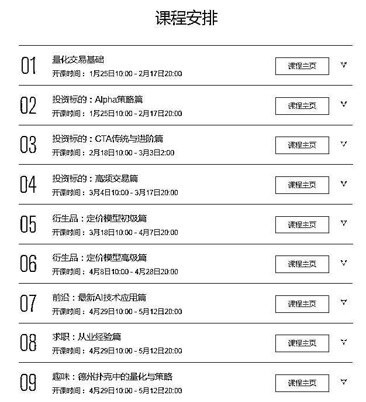
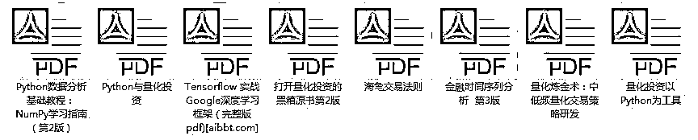
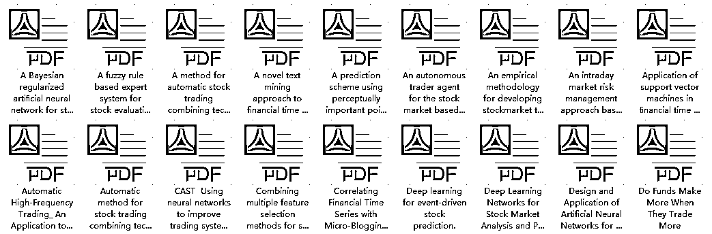

# 最新 | JP 摩根人工智能、机器学习应用算法交易解析

> 原文：[`mp.weixin.qq.com/s?__biz=MzAxNTc0Mjg0Mg==&mid=2653290261&idx=1&sn=f747752188ce4ca594efd6bd0d4534ef&chksm=802e3d00b759b4167f69a63df8adbde6d5010b4877ed1765c35b7cb423c47f5bf9ac70083098&scene=27#wechat_redirect`](http://mp.weixin.qq.com/s?__biz=MzAxNTc0Mjg0Mg==&mid=2653290261&idx=1&sn=f747752188ce4ca594efd6bd0d4534ef&chksm=802e3d00b759b4167f69a63df8adbde6d5010b4877ed1765c35b7cb423c47f5bf9ac70083098&scene=27#wechat_redirect)

**标星★公众号**，第一时间获取最新资讯

如果你对机器学习和人工智能（AI）在金融领域的应用感兴趣的话，J.P. Morgan 最新发布了一份关于算法交易“应用数据驱动学习”问题的报告。也许对你有帮助。

**报告在文末获取**

**1、算法现在可以在客户设置的几个参数内控制关键的交易决策**

金融中的算法控制着股票和电子期货合约的“微观”交易决策：“它们定义了在哪里交易，以什么价格交易，以及以什么数量交易。”

然而，算法并不是随心所欲的。JPM 指出，客户机“通常向执行代理传输带有约束和首选项的特定指令”。例如，客户可能希望在他们的投资组合转换过程中保持货币中性，以便卖出的数量大致等于买入的数量。它们还可能指定，已执行的一篮子证券以可控的方式暴露于某些行业。

**2、交易订单中的数据极其复杂**

编写电子交易算法是一项极其复杂的工作。

例如，JPM 的分析师指出，一盘国际象棋大约有 40 步长，一盘围棋大约有 200 步长。然而，即使使用每秒重新考虑其期权的中频电子交易算法，每小时也会有 3600 步。

这也不是唯一的问题。当你在国际象棋和围棋中映射数据时，问题是考虑如何在所有合格棋子中移动一个棋子以及它们如何响应。然而，电子交易行为由多个步骤组成。这是“一组子订单”，JPM 的分析师说。

什么是子订单？JPM 指出，一个简单的操作可能是“提交一个被动的购买订单和一个主动的购买订单”。被动子订单将以指定的价格停留在订单簿中，从而为其他市场参与者提供流动性。提供流动性最终可能会在交易时获得回报，因为它会在当地获取差价：相对于那些通过获取流动性进行相同交易的人，交易价格会更高。另一方面，激进的子订单可以发送出去，以捕捉预期价格变动的机会。两者形成一个动作。由此产生的动作空间非常大，并且随着我们想要在某一时刻使用的特征组合的数量呈指数级增长。

**3、由人编写的交易算法往往变得庞大而笨拙**

当人们编写电子交易算法时，事情很快变得复杂起来。

在过去，摩根大通的分析师指出，电子交易算法是“一种科学的、定量的模型的混合体，它表达了对世界运行方式的定量看法。”它们包含“表达人类交易员和算法用户的实际经验、观察和偏好的规则和启发式”。

试图概括所有这些是困难的。大多数人工编译的 algo 是“数万行手写的，很难维护和修改代码”。当客户反对和市场发生变化时，JPM 表示，人类的算法会受到“特征蠕变”的影响。随着时间的推移，他们会“积累许多层的逻辑、参数和调整来处理特殊情况”。

**4、监管使得人类的 algos 再次变得更加复杂**

algo 的交易还与 MiFID II 等法规以及“最佳执行”的概念有关。

因此，它们必须考虑到“不断变化的市场条件和市场结构、监管限制以及客户的多重目标和偏好”。

如果 algo 的编写能够自动化，并且考虑到这些限制，那么生活将会变得更加简单。

**5、在编写交易算法时，三种常用数据方法**

JPM 表示，在编写交易算法时，有三种常用数据方法：**数据建模、机器学习、还有算法决策。**

**数据建模：**建立在这样一种假设之上，金融市场就像一个黑匣子，里面有一个简单的模型。你所需要做的就是建立一个近似于黑匣子的定量模型。鉴于金融市场行为的复杂性，这可能过于简单。

**机器学习：**试图使用更复杂、有时不透明的功能来建模观察。它没有声称这些函数揭示了底层过程的本质。

**算法决策：**是关于决策而不是建立模型。它不是试图描绘世界是如何运转的，而是试图训练 electronic agents 。区分好决策和坏决策的算法。然后，问题就变成试图理解为什么算法会做出它所做的决策，并注入规则、值和约束来确保决策是可接受的。

**6、该算法必须在理想交易的最优执行速度和最优执行计划之间找到平衡**

一旦你有了你的算法，它需要做一个权衡。它可以在影响市场价格的风险下，快速执行交易。或者缓慢地执行交易，风险是会以不利于订单的方式变化（“买入订单上升，卖出订单下降”）。

**7、人们并不总是清楚什么是成功的交易**

algo 交易成功的定义并不简单。它可能是关于在快速执行交易和以价格不变的方式执行交易之间的平衡——这取决于客户的优先级。

例如，algo 的目标可能是与市场的其他部分融合。这意味着要平衡交易过快和价格变动对市场的影响，或者交易过慢而价格与交易相反。algo 的作者需要找到一种表示信息和行为的方法，这种方法要适合模型和机器学习方法。必须总结市场状态，尽管它是“巨大的、可变的、频繁变化的维度和订单状态，父订单和子订单对于模型输入都是未完成的”。

很多机会都是“短暂的，可能只存在于微秒的尺度上”，**“局部最优并不一定会转变成一个全球最优：现在可能被认为是一个糟糕的交易可能是一个优秀的交易的开始”。**

**8、JP 摩根一直在使用强化学习算法进行交易，尽管这可能会带来问题**

JP 摩根完全支持“强化学习”（RL）算法，这种算法使用动态规划，对做出错误决策的算法进行惩罚，对做出正确决策的算法进行奖励。

“我们现在运行的是基于 RL 的第二代限价下单引擎”摩根大通的交易员表示。他们补充称，他们之前一直在“有限的行动空间”内进行训练，使用的是“本地短期目标，其回报、步骤和时间跨度特征各不相同”。然而，训练你的算法可能是复杂的。如果你试图通过在多个处理设备上同时执行算法来“parallize”算法的训练，你会得到错误的结果，因为算法和环境之间的反馈循环。但如果你不这样做，并尝试“基于梯度的训练”，你将以大量无关的经验和良好的行为可以忘记。

JP 摩根试图通过**“应用超参数优化技术”**来避免这种情况。这意味着他们在每次试验中有更少的抽样事件，并尽早停止无趣的路径。超参数优化技术使世行能够通过并行运行培训课程来培训算法。

JP 摩根表示，研究的主要焦点已经变成了“**policy learning algorithms**”，这种算法能在一定的参数范围内，将符合特定业务目标的累计奖励最大化。它还指出，在交易算法必须“产生可预测、可控和可解释的行为”的区域，可以使用“**hierarchical reinforcement learning**”。

在分层方法下，算法的决策被分成不同采样频率和不同粒度级别的组。这允许分离一些 algo 的模块，并使它更容易看到它在做什么。

**9、JP 摩根开发了一种“字符”强化学习算法来处理 long tails**

JP 摩根指出，在大多数强化学习情况下，算法学习行为平均能带来更好的结果。然而，在金融领域，过于关注平均结果可能是错误的——它也与长尾有关。因此，JP 摩根的定量分析师一直在构建“重视多维和不确定结果”的 algos。

为了实现这一目标，JP 摩根一直在对不确定的结果（长尾效应）进行排名，方法是将其交付的预期效用与其未来的分布进行比较。这被称为**Certainty Equivalent Reinforcement Learning （CERL）**。

在 CERL 下，JP 摩根指出该算法根据其风险偏好有效地获取一个字符。“如果客户厌恶风险，结果的不确定性增加，就会降低行动的确定性等价回报。”这导致的自然出现折现系数γ分布的结果是扩大了风险。

**10、一些有用的开源强化学习框架**

如果你想建立自己的交易算法，JP 摩根的研究人员建议你从几个地方开始：

他们注意到一些有用的早期开源强化学习框架，包括： 

**OpenAI baselines、dopamine、deepmind/trfl** 和 **Ray RLlib。**

**论文获取**

> **链接：https://pan.baidu.com/s/1x9B0Sq0IwS_KPX8rbo8Ifw  **
> 
> **密码：f87k**

**学习建议 **

对于初学的同学，能否真正进入 AI 量化的大门，掌握最前沿的量化算法理论，**取决于是否熟练掌握金融学相关理论，机器学习和深度学习相关知识，以及在实践中能否熟练应用。**

系统地讲，初学者想要登堂入室，必须掌握金融理论、交易策略研发、机器学习与深度学习以及将策略进行实盘检验。

**针对量化研究的小白、有志于投身 AI 量化交易事业的同学**，**网易云课堂**特推出了 AI 量化交易课程。

课程的主要目标是从金融学基础出发，通过讲解量化中常见的模型和策略并使用 Python 加以实现，让学习者深度掌握量化交易模型和方法。**重点加入了机器学习和深度学习的相关内容，将量化金融和人工智能技术相结合**，与时俱进，希望大家能够通过学习研究出适合于自己的量化策略，早日实现财务自由。    

现在，面向本公众号粉丝发出限时免费福利：

1 月 23 日，网易云课堂 AI 量化交易特邀讲师 Skywalker，为大家免费直播讲解 AI 量化交易的实战操作以及求职面试的独家技巧，同时还能获得免费体验课程以及学习资料包：

**Part.1 免费直播公开课**

**直播主题**

**《老司机领你探索 AI 量化交易》**

1 月 23 日 周三 20:00

**直播大纲**

1\. 入这行哪些基础要先学

2\. AI 如何应用到量化交易

3\. 手把手教你 AI 量化实战操作

4\. 求职面试技巧独家传授

**直播讲师**

**Skywalker**

网易云课堂特邀 AI 量化交易讲师

**Part.2 免费体验课**

**《AI 量化交易》**

**课程大纲** 

1.量化交易的历史背景与发展

2.机器学习加持下的量化交易新世界

3.量化案例展示——大单跟随

4.量化交易指衍生品定价

**Part.3 免费学习资料包**

AI 量化交易电子书

▼

AI 量化交易相关论文

▼

**Part.4 获取方式**

扫描下方二维码 

添加网易云课堂「AI 量化交易」助教

即可获取所有免费福利

为了保证学习体验

本次学习社群限时开放

**数量有限，进群从速哦~**

**点击****【阅读原文】****，免费领取福利**