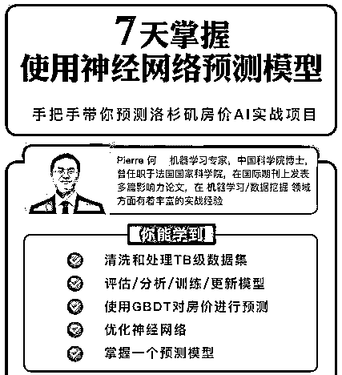
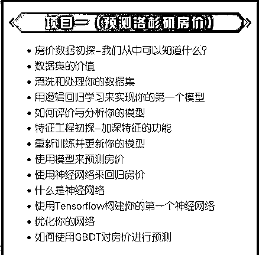

# 在北上广，年薪不到 40W 意味着什么？

> 原文：[`mp.weixin.qq.com/s?__biz=MzAxNTc0Mjg0Mg==&mid=2653290234&idx=1&sn=ed3f0ae7ba31c8a1e9011dfe84772554&chksm=802e3cefb759b5f96f51594a8dec20caf6fa8d123542dd4b20f0fcc3b84f01c2a242a7a32121&scene=27#wechat_redirect`](http://mp.weixin.qq.com/s?__biz=MzAxNTc0Mjg0Mg==&mid=2653290234&idx=1&sn=ed3f0ae7ba31c8a1e9011dfe84772554&chksm=802e3cefb759b5f96f51594a8dec20caf6fa8d123542dd4b20f0fcc3b84f01c2a242a7a32121&scene=27#wechat_redirect)

****在北上广，年薪不到 40W 意味着什么？****

**算算真正能拿到手的工资，也就能让你生活过的稍微舒服一点，还不足以谈自由。**

做为一个软件工程师，**工作了几年你有没有遇到以下情况？**

> 工作已经有几年时间，依旧是公司的一颗“螺丝钉”，工作单一没创新，工作能力得不到锻炼；
> 
> 每个项目都会保质保量的完成，多次提出加薪，领导总说哦哦哦知道了；
> 
> 所在公司规模小、同样的事情不断重复去做，想要跳槽却总是觉得缺少一点改变的资本。
> 
> 毕业几年，还在做着嵌入式、C 开发，同毕业的同学做 AI，现在已经年薪 40W+了····

总结来说，以上情况都有着一个共同点**：工作几年，晋升无门，高薪难求。**

**那么作为软件工程师，怎么才能打破瓶颈，提升年薪到 40W+甚至 50W+呢？**

这里给大家两点非常实用的建议：

**1.早做职业规划**，向项目管理或人员管理方向转型。

**2.掌握行业风向**，抢先一步学习最火、最有前景的技术。 

了解行业动态的人应该都知道，**人工智能一定是未来时代发展的风口。** 

即便是现在，**人工智能的平均薪资也已经达到 2.58 万，今年的 AI 应届博士生年薪更是最高达到了 80 万。**

而且，几乎**50%**人工智能岗位的职位，都会为员工提供股票期权，部分巨头更是会将解决户口作为吸引牛人的重要手段。**（就帝都而言，户口是想都不敢想的梦）**

由此可见，**掌握人工智能技术的人才具有决定性的竞争力。** 

**为什么呢？** 

虽然 AI 相关的岗位目前风头正盛，但市场的供需关系严重失衡，AI 行业仍然存在着的上百万量级的人才缺口。百度、阿里、腾讯等一线大厂都在高薪招聘可用的人才。

鉴于此，给大家分享一份软件工程师转行人工智能需要掌握这 **4 项技能。**

> **1.统计学：**高等数学、线性代数、概率论与数理统计在内的大学数学知识
> 
> **2.机器学习理论：**掌握经典机器学习理论与基本算法；
> 
> **3.软件工程：**掌握一种编程工具（语言），例如：入门必学 python；
> 
> **4.紧跟大牛梳理好的知识框架进行学习，制定一个长期深度学习计划，并坚持执行完成。**

未来 AI 人工智能的发展势不可挡，只有把握行业发展的最新潮流，才能成为自己人生的掌舵手。

说了这么多，一套学习视频——**使用神经网络预测模型**作为**新年福利**，大型 AI 实战项目视频教程，**限时免费（限前 300 名）**。

这套学习视频涵盖了**使用 GBDT 预测房价实操、TB 级数据集、如何优化神经网络，****授人以鱼不如授人以渔，重要的是教会你掌握一个预测模型，学习时长****近****20 个课时****，****每天下班花 1 个小时认真学习，教你******7 天掌握使用神经网络预测模型****。

添加下面的微信即可领取视频。由于通过之后会逐个发送资源，精力有限，这次只**开放 300 个名额**，先到先得！

本公众号专属福利等你**免费领取**哦！

**长按扫描，添加小助理**

**免费领取 7 天掌握使用神经网络预测模型**

**PS：扫描二维码领取—****AI 神经网络预测模型实战教程****，希望你领到之后认真学习，不要做收！藏！党！**

这套 AI 实战视频由**"开课吧"**友情提供，大家熟知的**IT 技术大牛廖雪峰**已加盟开课吧，联合**前微软数据科学家 Leo Sun 孙博**士联合打造了精品付费课程——**《Python 人工智能特训营》**，非常适合想要能真正的深入学习人工智能这门核心技术需求的人，对课程感兴趣也可以加微信了解。