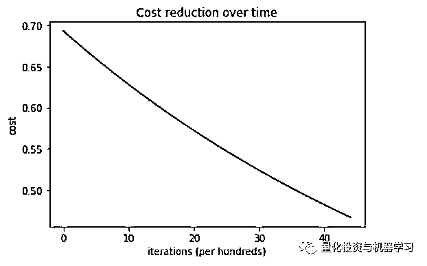

# 超详细 | 逻辑回归大解析（手写推导+Python 代码实现）

> 原文：[`mp.weixin.qq.com/s?__biz=MzAxNTc0Mjg0Mg==&mid=2653290222&idx=1&sn=dacd9c7a9e57bc34add2f3f2a63d21f2&chksm=802e3cfbb759b5ed6e0eb9333ccba280ad7c60caff8491496ff48a4354b5ab69a48d46bd79dc&scene=27#wechat_redirect`](http://mp.weixin.qq.com/s?__biz=MzAxNTc0Mjg0Mg==&mid=2653290222&idx=1&sn=dacd9c7a9e57bc34add2f3f2a63d21f2&chksm=802e3cfbb759b5ed6e0eb9333ccba280ad7c60caff8491496ff48a4354b5ab69a48d46bd79dc&scene=27#wechat_redirect)

**标星★公众号**，第一时间获取最新资讯

本期作者：Saishruthi

本期翻译：Remedios | 公众号翻译部成员

**近期原创文章：**

## ♥ [2018 中国量化投资年度盘点【独家】](https://mp.weixin.qq.com/s?__biz=MzAxNTc0Mjg0Mg==&mid=2653290036&idx=1&sn=79dd3529dd9300b0a5d3d6fee4607904&chksm=802e3c21b759b537eda936128dd5e13a22257d623b605b4a52d1c0ccc7f05abfefc93d10e366&token=1337549942&lang=zh_CN&scene=21#wechat_redirect)

## **♥** [利用深度学习最新前沿预测股价走势](https://mp.weixin.qq.com/s?__biz=MzAxNTc0Mjg0Mg==&mid=2653290080&idx=1&sn=06c50cefe78a7b24c64c4fdb9739c7f3&chksm=802e3c75b759b563c01495d16a638a56ac7305fc324ee4917fd76c648f670b7f7276826bdaa8&token=770078636&lang=zh_CN&scene=21#wechat_redirect)

## ♥ [一位数据科学 PhD 眼中的算法交易](https://mp.weixin.qq.com/s?__biz=MzAxNTc0Mjg0Mg==&mid=2653290118&idx=1&sn=a261307470cf2f3e458ab4e7dc309179&chksm=802e3c93b759b585e079d3a797f512dfd0427ac02942339f4f1454bd368ba47be21cb52cf969&token=770078636&lang=zh_CN&scene=21#wechat_redirect)

## ♥ [深度学习是信号处理和时序分析的最后选择？](https://mp.weixin.qq.com/s?__biz=MzAxNTc0Mjg0Mg==&mid=2653289999&idx=1&sn=800b645653a3e36ce57ff82260d030dc&chksm=802e3c1ab759b50cf9fb931574f84001f4858997be6330251c139deef0272e9217aa62276ea5&token=770078636&lang=zh_CN&scene=21#wechat_redirect)

## ♥ [人工智能『AI』应用算法交易，7 个必踩的坑！](https://mp.weixin.qq.com/s?__biz=MzAxNTc0Mjg0Mg==&mid=2653289974&idx=1&sn=88f87cb64999d9406d7c618350aac35d&chksm=802e3fe3b759b6f5eca6e777364270cbaa0bf35e9a1535255be9751c3a77642676993a861132&token=770078636&lang=zh_CN&scene=21#wechat_redirect)

## ♥ [神经网络在算法交易上的应用系列（一）](https://mp.weixin.qq.com/s?__biz=MzAxNTc0Mjg0Mg==&mid=2653289962&idx=1&sn=5f5aa65ec00ce176501c85c7c106187d&chksm=802e3fffb759b6e9f2d4518f9d3755a68329c8753745333ef9d70ffd04bd088fd7b076318358&token=770078636&lang=zh_CN&scene=21#wechat_redirect)

## ♥ [预测股市 | 如何避免 p-Hacking，为什么你要看涨？](https://mp.weixin.qq.com/s?__biz=MzAxNTc0Mjg0Mg==&mid=2653289820&idx=1&sn=d3fee74ba1daab837433e4ef6b0ab4d9&chksm=802e3f49b759b65f422d20515942d5813aead73231da7d78e9f235bdb42386cf656079e69b8b&token=770078636&lang=zh_CN&scene=21#wechat_redirect)

## ♥ [如何鉴别那些用深度学习预测股价的花哨模型？](https://mp.weixin.qq.com/s?__biz=MzAxNTc0Mjg0Mg==&mid=2653290132&idx=1&sn=cbf1e2a4526e6e9305a6110c17063f46&chksm=802e3c81b759b597d3dd94b8008e150c90087567904a29c0c4b58d7be220a9ece2008956d5db&token=1266110554&lang=zh_CN&scene=21#wechat_redirect)

**正文**

二十世纪早期，逻辑回归曾在生物科学中被使用，在那之‘后也在许多社会科学中被广泛运用。逻辑回归通常被应用于因变量（目标）是分类的场景，比如：

*   预测一封邮件是否是垃圾邮件

*   判断一个肿瘤是恶性的还是良性的

思考以下情境，我们需要将一封邮件划分为垃圾邮件或非垃圾邮件。如果我们在这个问题上使用线性回归，就需要设置一个便于划分的阈值。假设某一数据点的实际分类是有害的，其预测连续值是 0.4，而阈值是 0.5，那么这个数据点会被分类到不是恶性的一类，这在实际情况下最终会导致非常严重的结果。


从这个例子中，我们可以推断线性回归对于分类问题并不适用。线性回归是没有判定边界的，这个特征驱使我们将目光转向有判定边界的逻辑回归，逻辑回归的值始终在 0 和 1 之间变动。

**模型**

> **输出 = 0 或 1**
> 
> **假设 = >Z=WX+B**
> 
> **hΘ(x) = sigmoid (Z)**


如果”Z”趋近于正无穷，Y（估计值）将为 1；如果“Z”趋近于负无穷，Y（估计值）将为 0。

**假设分析**

假设的输出值是估计的概率。这个估计概率被用来推断当给定的输入值是 X 时估计值是实际值的可信度。 思考以下这个例子： 

> **X = [x0 x1 = [1 IP-Address]**

基于 x1 的值，让我们假设我们得到的估计概率为 0.8。这意味着每封邮件有 80%的概率为垃圾邮件。

用数学的方法表示：


这证明了“逻辑回归”名称的合理性。数据被拟合入线性回归模型，而这个线性回归模型之后被用于依照一个逻辑回归函数来估计目标分类因变量。

**逻辑回归的种类**

**1、二元逻辑回归： **

分类结果只有两种可能输出，例如：是垃圾邮件或非垃圾邮件。

**2、多元逻辑回归：**

三种及以上无序的分类。例如：预测哪类食物更被青睐（蔬菜、非蔬菜、素食）。

**3、有序逻辑回归：**

三种及以上有序的分类。例如：排名从 1-5 的电影。

**判定边界**

为了预测一个数据属于哪一个类别，我们可以设置一个阈值。计算所得的估计概率基于这个阈值被分类进不同类别中。 

判定逻辑例如：如果估计值大于或等于 0.5，那么将一封邮件分类进垃圾邮件中，否则则不分类为垃圾邮件。

判定边界可以是线性的也可以是非线性的。我们可能通过提高多项式次方来得到复杂的判定边界。

**成本函数**

为什么在线性回归情况下使用的成本函数不能被应用于逻辑回归的情况？


线性回归使用均方差作为其成本函数，如果这个函数被应用于逻辑回归，那么这个函数将会是参数（theta）的非凸函数。只有当函数为凸函数时，梯度下降才会向全局最小值收敛。


凸成本函数和非凸成本函数

**成本函数解析**


**简化后的成本函数**

 

**为什么是这个成本函数？**


当我们训练时，我们需要通过最小化损失函数来最大化概率。假设实例们是从一个独立同分布中获得的，成本的减少会增加最大似然。

**推导梯度下降算法的公式**


 

**Python 实现**

```py
def weightInitialization(n_features):
    w = np.zeros((1,n_features))
    b = 0
    return w,b
def sigmoid_activation(result):
    final_result = 1/(1+np.exp(-result))
    return final_result

def model_optimize(w, b, X, Y):
    m = X.shape[0]

    #Prediction
    final_result = sigmoid_activation(np.dot(w,X.T)+b)
    Y_T = Y.T
    cost = (-1/m)*(np.sum((Y_T*np.log(final_result)) + ((1-Y_T)*(np.log(1-final_result)))))
    #

    #Gradient calculation
    dw = (1/m)*(np.dot(X.T, (final_result-Y.T).T))
    db = (1/m)*(np.sum(final_result-Y.T))

    grads = {"dw": dw, "db": db}

    return grads, cost
def model_predict(w, b, X, Y, learning_rate, no_iterations):
    costs = []
    for i in range(no_iterations):
        #
        grads, cost = model_optimize(w,b,X,Y)
        #
        dw = grads["dw"]
        db = grads["db"]
        #weight update
        w = w - (learning_rate * (dw.T))
        b = b - (learning_rate * db)
        #

        if (i % 100 == 0):
            costs.append(cost)
            #print("Cost after %i iteration is %f" %(i, cost))

    #final parameters
    coeff = {"w": w, "b": b}
    gradient = {"dw": dw, "db": db}

    return coeff, gradient, costs
def predict(final_pred, m):
    y_pred = np.zeros((1,m))
    for i in range(final_pred.shape[1]):
        if final_pred[0][i] > 0.5:
            y_pred[0][i] = 1
    return y_pred
```

**全部代码再文末获取**

 成本 VS 循环次数



此系统的训练和测试精确度是 100%。

这个 Python 执行针对于二元逻辑回归，对于含两个以上分类的数据，必须使用 softmax 回归。

**欢迎大家在文末给翻译部的小伙伴们打赏！**

**如何获取代码**

在**后台**输入

**20190121**

**后台获取方式介绍**


****公众号官方 QQ 群****

**量化、技术人士深度交流群**


**扫码关注我们**

