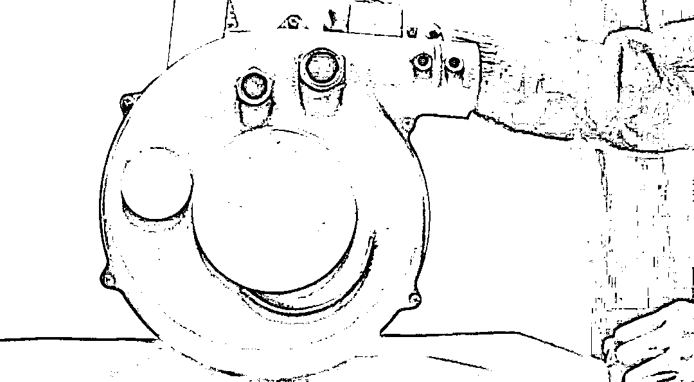
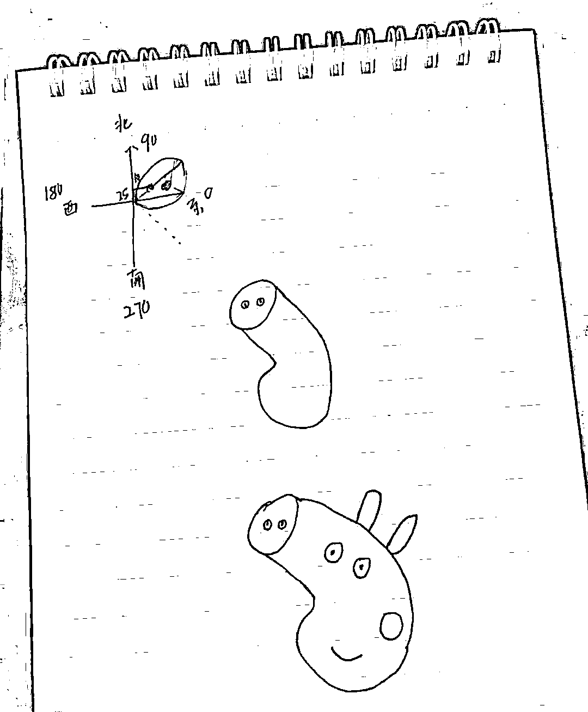

# 啥是佩琦？用 Python 画给你看！

> 原文：[`mp.weixin.qq.com/s?__biz=MzAxNTc0Mjg0Mg==&mid=2653290192&idx=1&sn=d999cda49870863f4f7d5aa4c964faae&chksm=802e3cc5b759b5d3788a5d963ed67f3495962b52a5d85a17c2dede15822be73d879de8e7ebfe&scene=27#wechat_redirect`](http://mp.weixin.qq.com/s?__biz=MzAxNTc0Mjg0Mg==&mid=2653290192&idx=1&sn=d999cda49870863f4f7d5aa4c964faae&chksm=802e3cc5b759b5d3788a5d963ed67f3495962b52a5d85a17c2dede15822be73d879de8e7ebfe&scene=27#wechat_redirect)



来源：恋习 Python 

作者：丁彦军

**近期原创文章：**

## ♥ [2018 中国量化投资年度盘点【独家】](https://mp.weixin.qq.com/s?__biz=MzAxNTc0Mjg0Mg==&mid=2653290036&idx=1&sn=79dd3529dd9300b0a5d3d6fee4607904&chksm=802e3c21b759b537eda936128dd5e13a22257d623b605b4a52d1c0ccc7f05abfefc93d10e366&token=1337549942&lang=zh_CN&scene=21#wechat_redirect)

## **♥** [利用深度学习最新前沿预测股价走势](https://mp.weixin.qq.com/s?__biz=MzAxNTc0Mjg0Mg==&mid=2653290080&idx=1&sn=06c50cefe78a7b24c64c4fdb9739c7f3&chksm=802e3c75b759b563c01495d16a638a56ac7305fc324ee4917fd76c648f670b7f7276826bdaa8&token=770078636&lang=zh_CN&scene=21#wechat_redirect)

## ♥ [一位数据科学 PhD 眼中的算法交易](https://mp.weixin.qq.com/s?__biz=MzAxNTc0Mjg0Mg==&mid=2653290118&idx=1&sn=a261307470cf2f3e458ab4e7dc309179&chksm=802e3c93b759b585e079d3a797f512dfd0427ac02942339f4f1454bd368ba47be21cb52cf969&token=770078636&lang=zh_CN&scene=21#wechat_redirect)

## ♥ [深度学习是信号处理和时序分析的最后选择？](https://mp.weixin.qq.com/s?__biz=MzAxNTc0Mjg0Mg==&mid=2653289999&idx=1&sn=800b645653a3e36ce57ff82260d030dc&chksm=802e3c1ab759b50cf9fb931574f84001f4858997be6330251c139deef0272e9217aa62276ea5&token=770078636&lang=zh_CN&scene=21#wechat_redirect)

## ♥ [人工智能『AI』应用算法交易，7 个必踩的坑！](https://mp.weixin.qq.com/s?__biz=MzAxNTc0Mjg0Mg==&mid=2653289974&idx=1&sn=88f87cb64999d9406d7c618350aac35d&chksm=802e3fe3b759b6f5eca6e777364270cbaa0bf35e9a1535255be9751c3a77642676993a861132&token=770078636&lang=zh_CN&scene=21#wechat_redirect)

## ♥ [神经网络在算法交易上的应用系列（一）](https://mp.weixin.qq.com/s?__biz=MzAxNTc0Mjg0Mg==&mid=2653289962&idx=1&sn=5f5aa65ec00ce176501c85c7c106187d&chksm=802e3fffb759b6e9f2d4518f9d3755a68329c8753745333ef9d70ffd04bd088fd7b076318358&token=770078636&lang=zh_CN&scene=21#wechat_redirect)

## ♥ [预测股市 | 如何避免 p-Hacking，为什么你要看涨？](https://mp.weixin.qq.com/s?__biz=MzAxNTc0Mjg0Mg==&mid=2653289820&idx=1&sn=d3fee74ba1daab837433e4ef6b0ab4d9&chksm=802e3f49b759b65f422d20515942d5813aead73231da7d78e9f235bdb42386cf656079e69b8b&token=770078636&lang=zh_CN&scene=21#wechat_redirect)

## ♥ [如何鉴别那些用深度学习预测股价的花哨模型？](https://mp.weixin.qq.com/s?__biz=MzAxNTc0Mjg0Mg==&mid=2653290132&idx=1&sn=cbf1e2a4526e6e9305a6110c17063f46&chksm=802e3c81b759b597d3dd94b8008e150c90087567904a29c0c4b58d7be220a9ece2008956d5db&token=1266110554&lang=zh_CN&scene=21#wechat_redirect)

刚刚

被《啥是佩奇》这支广告片刷屏了 

佩奇明明是个喜剧角色

却看哭了所有人

▼

**一定要看啊！！！！！！**

[`v.qq.com/iframe/preview.html?width=500&height=375&auto=0&vid=m0828x153iv`](https://v.qq.com/iframe/preview.html?width=500&height=375&auto=0&vid=m0828x153iv)

快过年了

在农村爷爷给城里的小孙子打电话

小孙子说想要“佩奇”

为了满足小孙子的愿望

爷爷开始满村子找佩奇

开片爷爷在电话这头的一段话就很抓人心，

全世界的爷爷都是这样疼孙儿的，

一下子就让观众有共情的心理。

一句“什么是佩奇？”

铺垫了爷爷接下来的一段寻找佩奇之路，

最后爷爷找到的佩奇骨络清奇，

却是圈主见过的全世界最可爱的小猪佩奇！


不知道大家看完什么感觉 

反正我看完是哭了

我看网友们也纷纷留言

说自己哭笑两重奏

看着爷爷满村子找佩奇，我有点心疼了。为此我想用纯粹的 Python 来告诉爷爷，啥是佩奇？

**先看看效果视频：**

[`v.qq.com/iframe/preview.html?width=500&height=375&auto=0&vid=c1341vh69yx`](https://v.qq.com/iframe/preview.html?width=500&height=375&auto=0&vid=c1341vh69yx)

**基本思路：**

选好画板大小，设置好画笔颜色，粗细，定位好位置，依次画鼻子，头、耳朵，眼睛，腮，嘴，身体，手脚，尾巴，完事。

都知道，turtle 是 python 内置的一个比较有趣味的模块，俗称 海龟绘图，它是基于 tkinter 模块打造，提供一些简单的绘图工具。

在海龟作图中，我们可以编写指令让一个虚拟的（想象中的）海龟在屏幕上来回移动。这个海龟带着一只钢笔，我们可以让海龟无论移动到哪都使用这只钢笔来绘制线条。通过编写代码，以各种很酷的模式移动海龟，我们可以绘制出令人惊奇的图片。使用海龟作图，我们不仅能够只用几行代码就创建出令人印象深刻的视觉效果，而且还可以跟随海龟看看每行代码如何影响到它的移动。这能够帮助我们理解代码的逻辑。所以海龟作图也常被用作新手学习 Python 的一种方式。更丰富详细的功能及知识可以参考官方文档：

***https://docs.python.org/3/library/turtle.html***

了解了 turtle 的用法之后就可以开始实战了。

代码示例：

```py

```

```py
`from turtle import*

def nose(x,y):#鼻子
    penup()#提起笔
    goto(x,y)#定位
    pendown()#落笔，开始画
    setheading(-30)#将乌龟的方向设置为 to_angle/为数字（0-东、90-北、180-西、270-南）
    begin_fill()#准备开始填充图形
    a=0.4
    for i in range(120):
        if 0<=i<30 or 60<=i<90:
            a=a+0.08
            left(3) #向左转 3 度
            forward(a) #向前走 a 的步长
        else:
            a=a-0.08
            left(3)
            forward(a)
    end_fill()#填充完成

    penup()
    setheading(90)
    forward(25)
    setheading(0)
    forward(10)
    pendown()
    pencolor(255,155,192)#画笔颜色
    setheading(10)
    begin_fill()
    circle(5)
    color(160,82,45)#返回或设置 pencolor 和 fillcolor
    end_fill()

    penup()
    setheading(0)
    forward(20)
    pendown()
    pencolor(255,155,192)
    setheading(10)
    begin_fill()
    circle(5)
    color(160,82,45)
    end_fill() def head(x,y):#头
    color((255,155,192),"pink")
    penup()
    goto(x,y)
    setheading(0)
    pendown()
    begin_fill()
    setheading(180)
    circle(300,-30)
    circle(100,-60)
    circle(80,-100)
    circle(150,-20)
    circle(60,-95)
    setheading(161)
    circle(-300,15)
    penup()
    goto(-100,100)
    pendown()
    setheading(-30)
    a=0.4
    for i in range(60):
        if 0<=i<30 or 60<=i<90:
            a=a+0.08
            lt(3) #向左转 3 度
            fd(a) #向前走 a 的步长
        else:
            a=a-0.08
            lt(3)
            fd(a)
    end_fill()` 
```

```py
`def cheek(x,y):#腮
    color((255,155,192))
    penup()
    goto(x,y)
    pendown()
    setheading(0)
    begin_fill()
    circle(30)
    end_fill() def mouth(x,y): #嘴
    color(239,69,19)
    penup()
    goto(x,y)
    pendown()
    setheading(-80)
    circle(30,40)
    circle(40,80) def setting():          #参数设置
    pensize(4)
    hideturtle()        #使乌龟无形（隐藏）
    colormode(255)      #将其设置为 1.0 或 255.随后 颜色三元组的 r，g，b 值必须在 0 .. cmode 范围内
    color((255,155,192),"pink")
    setup(840,500)
    speed(10) def main():
    setting()           #画布、画笔设置
    nose(-100,100)      #鼻子
    head(-69,167)       #头
    ears(0,160)         #耳朵
    eyes(0,140)         #眼睛
    cheek(80,10)        #腮
    mouth(-20,30)       #嘴
    done() if __name__ == '__main__':
	main()`
```

```py

```

思路其实很简单，就是通过 turtle 模块实现基本的圆，椭圆，曲线等，难点在于，如何定位每个部位的位置（建议先草图画画）。



**源码获取**

在**后台**输入

**20190118**

**后台获取方式介绍**


**推荐阅读**

[01、经过多年交易之后你应该学到的东西（深度分享）](https://mp.weixin.qq.com/s?__biz=MzAxNTc0Mjg0Mg==&mid=2653289074&idx=1&sn=e859d363eef9249236244466a1af41b6&chksm=802e3867b759b1717f77e07a51ee5671e8115130c66562577280ba1243cba08218add04f1f00&token=449379994&lang=zh_CN&scene=21#wechat_redirect)

[02、监督学习标签在股市中的应用（代码+书籍）](https://mp.weixin.qq.com/s?__biz=MzAxNTc0Mjg0Mg==&mid=2653289050&idx=1&sn=60043a5c95b877dd329a5fd150ddacc4&chksm=802e384fb759b1598e500087374772059aa21b31ae104b3dca04331cf4b63a233c5e04c1945a&token=449379994&lang=zh_CN&scene=21#wechat_redirect)

[03、全球投行顶尖机器学习团队全面分析](https://mp.weixin.qq.com/s?__biz=MzAxNTc0Mjg0Mg==&mid=2653289018&idx=1&sn=8c411f676c2c0d92b0dd218f041bee4b&chksm=802e382fb759b139ffebf633ac14cdd0f21938e4613fe632d5d9231dab3d2aca95a11628378a&token=449379994&lang=zh_CN&scene=21#wechat_redirect)

[04、使用 Tensorflow 预测股票市场变动](https://mp.weixin.qq.com/s?__biz=MzAxNTc0Mjg0Mg==&mid=2653289014&idx=1&sn=3762d405e332c599a21b48a7dc4df587&chksm=802e3823b759b135928d55044c2729aea9690f86752b680eb973d1a376dc53cfa18287d0060b&token=449379994&lang=zh_CN&scene=21#wechat_redirect)

[05、使用 LSTM 预测股票市场基于 Tensorflow](https://mp.weixin.qq.com/s?__biz=MzAxNTc0Mjg0Mg==&mid=2653289238&idx=1&sn=3144f5792f84455dd53c27a78e8a316c&chksm=802e3903b759b015da88acde4fcbc8547ab3e6acbb5a0897404bbefe1d8a414265d5d5766ee4&token=2020206794&lang=zh_CN&scene=21#wechat_redirect)

[06、美丽的回测——教你定量计算过拟合概率](https://mp.weixin.qq.com/s?__biz=MzAxNTc0Mjg0Mg==&mid=2653289314&idx=1&sn=87c5a12b23a875966db7be50d11f09cd&chksm=802e3977b759b061675d1988168c1fec06c602e8583fbcc9b76f87008e0c10b702acc85467a0&token=1972390229&lang=zh_CN&scene=21#wechat_redirect)

[07、利用动态深度学习预测金融时间序列基于 Python](https://mp.weixin.qq.com/s?__biz=MzAxNTc0Mjg0Mg==&mid=2653289347&idx=1&sn=bf5d7899bc4a854d4ba9046fdc6fe0d6&chksm=802e3996b759b080287213840987bb0a0c02e4e1d4d7aae23f10a225a92ef6dd922d8006123d&token=290397496&lang=zh_CN&scene=21#wechat_redirect)

[08、Facebook 开源神器 Prophet 预测时间序列基于 Python](https://mp.weixin.qq.com/s?__biz=MzAxNTc0Mjg0Mg==&mid=2653289394&idx=1&sn=24a836136d730aa268605628e683d629&chksm=802e39a7b759b0b1dcf7aaa560699130a907716b71fc9c45ff0e5d236c5ae8ef80ebdb09dbb6&token=290397496&lang=zh_CN&scene=21#wechat_redirect)

[09、Facebook 开源神器 Prophet 预测股市行情基于 Python](https://mp.weixin.qq.com/s?__biz=MzAxNTc0Mjg0Mg==&mid=2653289437&idx=1&sn=f0dca7da8e69e7ba736992cb3d034ce7&chksm=802e39c8b759b0de5bce401c580623d0729ecca69d13926479d36e19aff8c9c9e8a20265afff&token=290397496&lang=zh_CN&scene=21#wechat_redirect)

[10、2018 第三季度最受欢迎的券商金工研报前 50（附下载）](https://mp.weixin.qq.com/s?__biz=MzAxNTc0Mjg0Mg==&mid=2653289358&idx=1&sn=db6e8ab85b08f6e67790ec0e401e586e&chksm=802e399bb759b08d6eec855f9901ea856d0da68c7425cba62791b8948da6ad761a3d88543dad&token=290397496&lang=zh_CN&scene=21#wechat_redirect)

[11、实战交易策略的精髓（公众号深度呈现）](https://mp.weixin.qq.com/s?__biz=MzAxNTc0Mjg0Mg==&mid=2653289447&idx=1&sn=f2948715bf82569a6556d518e56c1f9e&chksm=802e39f2b759b0e4502d1aaac562b87789573b55c76b3c85897d8c9d88dbf9a0b7ee34d86a4e&token=290397496&lang=zh_CN&scene=21#wechat_redirect)

[12、Markowitz 有效边界和投资组合优化基于 Python](https://mp.weixin.qq.com/s?__biz=MzAxNTc0Mjg0Mg==&mid=2653289478&idx=1&sn=f8e01a641be021993d8ef2d84e94a299&chksm=802e3e13b759b7055cf27a280c672371008a5564c97c658eee89ce8481396a28d254836ff9af&token=290397496&lang=zh_CN&scene=21#wechat_redirect)

[13、使用 LSTM 模型预测股价基于 Keras](https://mp.weixin.qq.com/s?__biz=MzAxNTc0Mjg0Mg==&mid=2653289495&idx=1&sn=c4eeaa2e9f9c10995be9ea0c56d29ba7&chksm=802e3e02b759b7148227675c23c403fb9a543b733e3d27fa237b53840e030bf387a473d83e3c&token=1260956004&lang=zh_CN&scene=21#wechat_redirect)

[14、量化金融导论 1：资产收益的程式化介绍基于 Python](https://mp.weixin.qq.com/s?__biz=MzAxNTc0Mjg0Mg==&mid=2653289507&idx=1&sn=f0ca71aa07531bbbdbd33213f0bab89f&chksm=802e3e36b759b720138b3b17a4dd0e198e054b9de29a038fdd50805f824effa55831111ad026&token=1936245282&lang=zh_CN&scene=21#wechat_redirect)

[15、预测股市崩盘基于统计机器学习与神经网络（Python+文档）](https://mp.weixin.qq.com/s?__biz=MzAxNTc0Mjg0Mg==&mid=2653289533&idx=1&sn=4ef964834e84a9995111bb057b0fc5dd&chksm=802e3e28b759b73e0618eb1262c53aa0601fbf5805525a7c7ff40dc3db62c7704496611bdbf1&token=1950551577&lang=zh_CN&scene=21#wechat_redirect)

[16、实现最优投资组合有效前沿基于 Python（附代码）](https://mp.weixin.qq.com/s?__biz=MzAxNTc0Mjg0Mg==&mid=2653289609&idx=1&sn=c7f0b3e47025862d10bb53b6ab88bcda&chksm=802e3e9cb759b78abf6b8b049c59bf18ccfb2ead7580d1f557d36de2292f59dcbd94dcd41910&token=2085008037&lang=zh_CN&scene=21#wechat_redirect)

[17、精心为大家整理了一些超级棒的机器学习资料（附链接）](https://mp.weixin.qq.com/s?__biz=MzAxNTc0Mjg0Mg==&mid=2653289615&idx=1&sn=1cdc89afb997d0c580bf0cef296d946c&chksm=802e3e9ab759b78ce9f0cd152a680d4a413d6c8dcb02a7a296f4091993a7e4137e7520394575&token=2085008037&lang=zh_CN&scene=21#wechat_redirect)

[18、海量 Wind 数据，与全网用户零距离邂逅！](https://mp.weixin.qq.com/s?__biz=MzAxNTc0Mjg0Mg==&mid=2653289623&idx=1&sn=28a3600fd7a72d7be00b066ca0f98244&chksm=802e3e82b759b7943f43a4f6ef4a91e4153fa6b8210de9590235fa8ee66eb9811ce177054dbc&token=1389401983&lang=zh_CN&scene=21#wechat_redirect)

[19、机器学习、深度学习、量化金融、Python 等最新书籍汇总下载](https://mp.weixin.qq.com/s?__biz=MzAxNTc0Mjg0Mg==&mid=2653289640&idx=1&sn=34e94fcbe99052b8e7381ecc48a36dc0&chksm=802e3ebdb759b7ab897cd329a680715b6f8294e63550ddf0c57b9e1320b2b7d1408c6fdca0c7&token=1389401983&lang=zh_CN&scene=21#wechat_redirect)

[20、各大卖方 2019 年 A 股策略报告，都是有故事的人！](https://mp.weixin.qq.com/s?__biz=MzAxNTc0Mjg0Mg==&mid=2653289725&idx=1&sn=4b65cd1fb8331438e4c0b3d0eae6b51f&chksm=802e3ee8b759b7fe1b94e84d54cc23b0ab05853d5cd227812574b350e9fc2cce9e5f1bc6cb7a&token=1389401983&lang=zh_CN&scene=21#wechat_redirect)

****公众号官方 QQ 群****

**量化、技术人士深度交流群**


**扫码关注我们**

