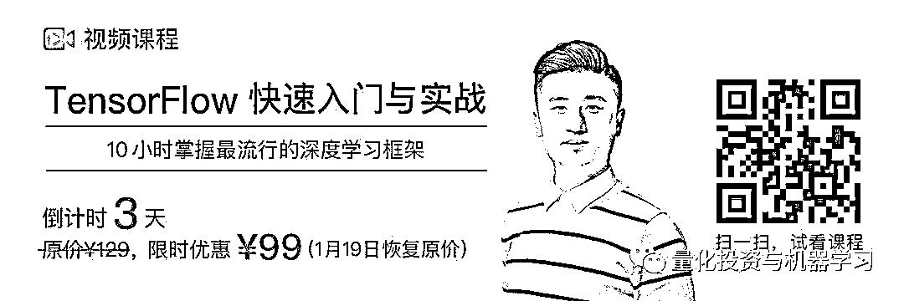
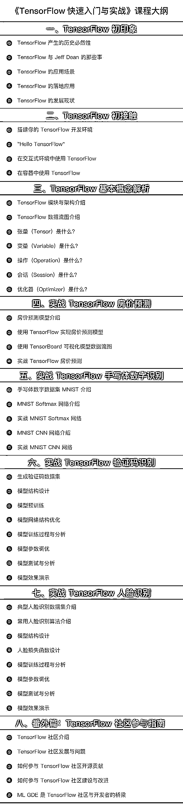
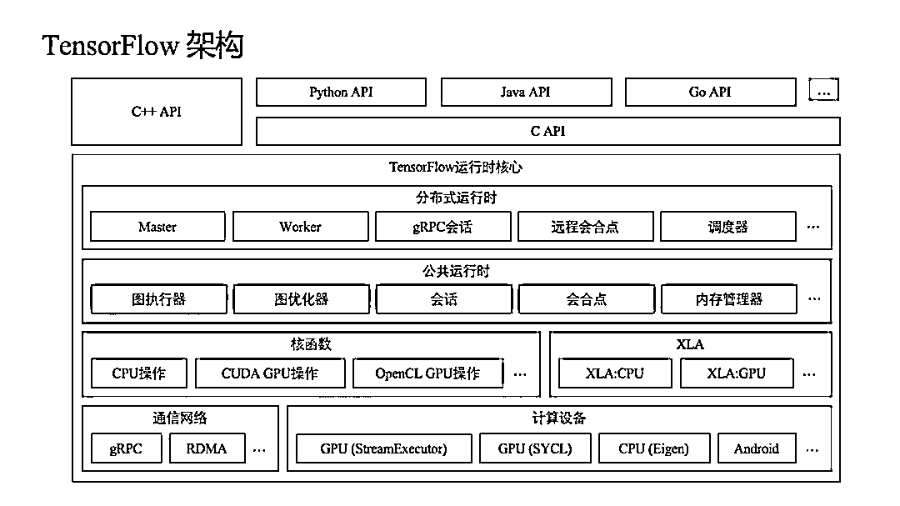
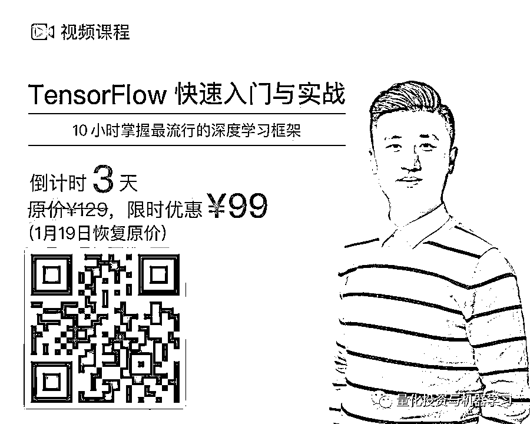
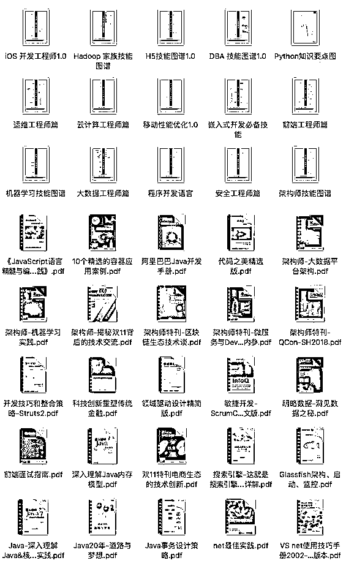

# TensorFlow 2.0 版本都发布了，你却还不会用？

> 原文：[`mp.weixin.qq.com/s?__biz=MzAxNTc0Mjg0Mg==&mid=2653290170&idx=1&sn=1b37c16daeb4d37c521e73c03d1a5ffe&chksm=802e3cafb759b5b949cbef11330a806b5d0da74e837cc9a2a30c5eb5896a4e171d5035fbf303&scene=27#wechat_redirect`](http://mp.weixin.qq.com/s?__biz=MzAxNTc0Mjg0Mg==&mid=2653290170&idx=1&sn=1b37c16daeb4d37c521e73c03d1a5ffe&chksm=802e3cafb759b5b949cbef11330a806b5d0da74e837cc9a2a30c5eb5896a4e171d5035fbf303&scene=27#wechat_redirect)

**标星★公众号**，第一时间获取最新资讯

众所周知，谷歌的 TensorFlow 团队正在努力筹备 TensorFlow 2.0 的发布，而就在今天，谷歌 AI 团队的 Martin Wicke 在官方社区发帖，兴奋地告知大家 TensorFlow 2.0 的开发者预览版已经放出。 

虽然这个版本目前还不完整，但足见开源以来 TensorFlow 的发展进程。作为当下最流行的深度学习框架，TensorFlow 已然成为 AI 领域的技术人员必须掌握的技能。

目前，阿里、腾讯、京东、小米、网易、滴滴等国内知名互联网企业和 Airbnb、Uber、Dropbox 等硅谷明星公司，都在生产环境大规模地使用 TensorFlow。在谷歌内部，更有超过 80% 的软件项目采用了 TensorFlow。

不仅如此，越来越多的程序员都选择通过 TensorFlow 开始自己的深度学习之路，并逐步成为专业的深度学习 / 机器学习工程师。

如果你所在的企业有大量数据，或想学习人工智能最先进的技术，**TensorFlow 一定可以让你如虎添翼**。

而 TensorFlow 的初学者经常会遇到以下问题：

***1、*****网上各种教程参差不齐，且各自基于不同的 TensorFlow 版本**，完全照着做，难免会遇到各种奇怪的问题，有时候折腾半天都解决不了，越看越焦虑，还浪费时间。

***2、***TensorFlow 使用了大量的抽象概念来描述算法模型及其计算过程，譬如张量、操作、占位符、数据流图、会话等。**初学者往往难以理解，如果没有详细的指导和点拨，学习起来困难重重**。

***3、***由于初学者对 TensorFlow 的模块和架构设计缺乏整体认知，就**无法根据自身需求快速学习和应用**，容易胡子眉毛一把抓，皱着眉头钻研半天也抓不住重点。

**是否有资源可以让你快速学习，并且入门呢？**

推荐极客时间的一门内容完整、又不会复杂到坑爹的课程：**《TensorFlow 快速入门与实战》**。

讲师彭靖田，是谷歌机器学习开发专家，曾为 TensorFlow 社区全球前 40 的贡献者，也是**国内第一本深度剖析 Google AI 框架的畅销书《深入理解 TensorFlow》的作者。**

另外，他还参与主导了华为 2012 实验室深度学习平台和华为深度学习云服务的设计与研发工作。

相比网上的快餐内容，**这个教程不仅良心，讲的内容也不是随便抄抄改改的，而是作者在实战中的经验和总结**。有些知识点（比如 SVM 的原理公式)，你花了好几个小时在网上学习也未必真能看明白，课程里就讲得十分通透，让你少走很多弯路。

**如果你是一个 TensorFlow 初学者，这门课确实非常适合你。**

总结一下**有几个原因：**

***1\.*** 课程从张量（Tensor）、变量（Variable）、操作（Operation）、会话（Session）、优化器（Optimizer）等 **TensorFlow 基本概念讲起，帮你打牢基础**，再进行下一步学习。

***2. ***实战应用由浅入深：包含了房价预测、手写体数字识别、验证码识别、人脸识别四大典型应用场景，难度和涉及知识点的复杂程度都是循序渐进的，**通过合适的学习梯度帮助初学者逐步建立自信**。

***3\.*** **基本概念梳理得很清晰**，让你搞清楚深度学习的框架和概念。

***4\.*** **教程、课件和代码应有尽有**，不仅可以辅助理解，还能综合填补知识空白点，从而找到自己的学习路径。     

****

**学完课程后，你将获得**：

*   快速掌握 TensorFlow 核心概念和架构；

*   熟练进行模型结构设计、训练及测试；

*   参数调优及损失函数设计的基本方法；

*   四个典型的 TensorFlow 应用场景实战。

无论你是立志投身人工智能行业的工程师，还是想利用深度学习为自身业务赋能的行业专家，这门课都将是一个绝佳的选择。

△扫描二维码试读或订阅

**→ 看到这里，才有彩蛋：**

凡**订阅用户**，即可获得作者总结的“**TensorFlow 技能图谱**”及“极客时间 2018 全年的资料集锦（共 50G，含**20 套程序员必备技能知识图谱、20 篇+的专栏精华内容总结、十年架构师文集 100 本和近 100 位 CTO 的访谈实录**）。

部分内容截图：

点击「阅读原文」获取管理员微信，回复关键词【TF 图谱】，即可领取。