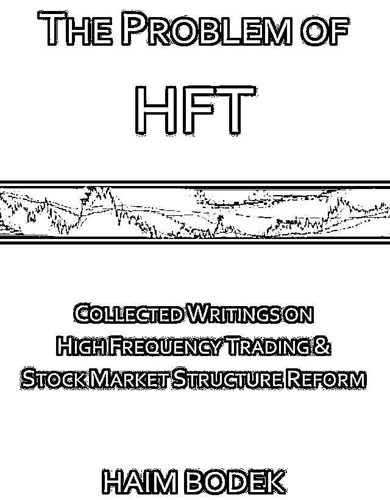
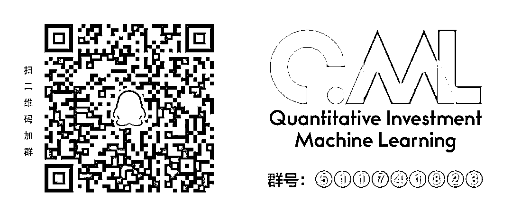

# 高频交易已经竞争到纳秒级！！！（赠送 HFT 的 18 篇论文+15 本书籍+9 篇研报）

> 原文：[`mp.weixin.qq.com/s?__biz=MzAxNTc0Mjg0Mg==&mid=2653290158&idx=1&sn=04553c46d35a8f5554356412017fa64e&chksm=802e3cbbb759b5ad59a34dca078923ef994890a3394e94a57ec245101c06a576310030235588&scene=27#wechat_redirect`](http://mp.weixin.qq.com/s?__biz=MzAxNTc0Mjg0Mg==&mid=2653290158&idx=1&sn=04553c46d35a8f5554356412017fa64e&chksm=802e3cbbb759b5ad59a34dca078923ef994890a3394e94a57ec245101c06a576310030235588&scene=27#wechat_redirect)

**标星★公众号**，第一时间获取最新资讯

本期作者：MoonX

本期翻译：Kiwi | 公众号翻译部成员

****↓**↓**年度巨献**↓↓**

**↑↑****点我****↑**↑****

**正文**

高频交易是一种更频繁地用于快速启动金融交易的方法。这种由高速发送订单组成的自动交易形式在美国过去十年中经历了强劲的增长。Tabb Group 的数据显示，高频交易目前约占美国贸易额的 55%，欧洲贸易额的近 40%。 

高频交易（HFT，high frequency trading）中现有的一些知名投资银行、机构交易和对冲基金维权宣传机构包括 Virtu Financial、KCG、DRW trading、Optiver、Tower Research Capital、Flow Traders、Hudson River trading、Jump trading、RSJ Algorithmic Trading、Spot Trading、Sun trading、Tradebot Systems、IMC、Quantlab Financial 和 Teza Technologies。

交易员通常会区分以下几种最常见的策略：

*   做市策略：指在同一证券上发出买卖指令，以捕捉两种价格之间的差价。

*   套利策略：在两个交易场所或一篮子股票与期货合约之间对同一种证券进行套利。

*   方向性策略：使用算法预测未来趋势。

****纳秒级的竞赛****

高频交易员正在纳秒尺度内争分夺秒。从执行决策程序到确定连接他们的机器和机构交易平台的电缆长度，速度至关重要。许多 virtuosos 把他们的服务器放在运营商的旁边（被称为托管），而且许多公司会在战略位置出租机库。

**交易中的托管历史**

高频金融市场中交易策略的使用会产生不同的影响。目前还没有专门设计用来评估市场流动性的工具。然而，它通常是通过观察证券买卖价差的大小来评估的。根据经验法则，最佳投资方案和最佳兜售方案之间的小差距是流动性充裕的标志，而大差距则表明流动性不足。基于这一原理，研究人员一致认为，高频交易者所采用的套利和做市策略对市场流动性的贡献极为有利。一些研究人员解释说，他们已经在市场上高频交易的存在与供求之间建立了一种负相关关系。因此，托管大大优化了交易时间，增强了交易者的决策能力。 

托管是指数据中心内属于证券交易所的专用空间。它用于获得执行订单的速度（以纳秒为单位），尽可能接近股票交易所的交易引擎。

纽约-泛欧交易所（NYSE- Euronext）为其会员提供了租用其服务器附近空间的机会。这些高频交易者使用托管来获得交易所和他们自己的服务器之间的物理距离上的接近优势。

与不选择托管的用户相比，这几纳秒的增长使他们能够执行最快的交易（纽约-泛欧交易所，2008 年和 2010 年）。此外，在纽约泛欧交易所（NYSE-Euronext）实施内部匹配服务（IMS）系统是动态的一部分:在这种情况下，它是参与者发送的订单的聚合服务，目的是在将订单插入中央待办事项列表之前将其路由到市场的交叉流（NYSE-Euronext, 2007）。该机构本身提出了对资金流动不利的地方进行优化的建议。由于没有通过中央账簿的订单，通过自动化小尺寸应用程序（也就是说，通过插值额外订单流和在源执行其他重复订单）可以减少支付。因此，市场运营商接受了部分订单较低的 combat pay，希望在一个更具争议性的环境中，作为对其客户产生的大部分流动的回报，这种做法能够持续下去。

BATS Chi-X Europe 过去的速度是传统股票市场的 10 倍，2007 年 3 月，该公司在旧大陆 Slough 的 Equinix 数据中心推出了第一个托管平台。其他交易所，如伦敦证券交易所和纽约-泛欧交易所在 2009-2010 年开始提供托管服务。在推出托管服务的背景下，接下来出现的套件（suite）有 Gemini，Coinbase, OKCoin 交易所。

在当前的市场环境下，**多资产交易是增加风险管理、控制收益波动的最有效途径**。MoonX 是一家分散所有权的交易所，这是同类交易所中第一家缩减命令（fiat）和数字资产以带来流动性的交易所，即便在流动性不佳的市场也是如此。与此同时，该团队还提供托管服务，据信这些服务更符合当今金融市场的需求，更具兼容性和创新性。MoonX 从零开始建立数据中心，通过人工智能监控和定期抽查确保数据中心的紧凑性。MoonX 的这些数据中心为需要高级安全功能的机构提供开放的 racks、cages 和 suite。机架间布线、交叉连接、存储空间、接待室和会议室是新增的一些功能。

通过分析一个关于为什么采用托管服务的案例，我们可以更好地理解人们的担忧。10 年前，人们认为交易员应该每天在一个市场上下单 70 笔。如今，一个高频交易员每天在五个不同的市场上执行 100 万份订单。对于高频交易商来说，这是一样的，他们以最好的价格持有股票，并寻求以更高的价格转售。

****这些算法是如何工作的****?****

**1、算法的智能**

基本上，算法是以计算机代码的形式编写的指令。在这种情况下，该算法具有在股票市场上交易或敲定交易以及预测价格变化的命令。简而言之，没有这些算法，计算机将无法进行推测。 

因此，所有的公司都有自己的算法，大多数算法的名字都很奇怪，比如 Iceberg、Ninja、Sumo、Guerilla 等等，而且数量数以千计。

**2、电缆布线**

如果这些算法不能以闪电般的速度运行，就会失去其价值。因此，到上个十年末，许多金融机构增强了它们的网络能力。这些新的网络被称为暗光纤；它们是为单个客户（在本例中是单个证券交易所）保留的 VIP 光纤。

举个例子：2010 年，一家电信公司将直接连接纽约和芝加哥。它包括在交换机之间 1200 公里的通道上安装一个私人的光纤，在那里，信息在 0.0065 秒内就能通过三分之一的美国。这种设置对于高频交易者来说是完美的。

变速箱的传输速度使高频交易始终处于领先地位，因为它们的 closeout 和 softsell 比任何人都快。

****地理邻近的重要性****

****以巴黎证券交易所为例****

巴黎证券交易所几年前搬到了伦敦，更准确地说搬到了巴塞尔登，搬进了一个巨大的仓库。你想知道为什么要这样做吗？因为巴黎证券交易所的主要赞助者都是英国人。在高频交易中，地理位置的临近是至关重要的：**事实上，离金融中心越近，交易的流通速度就越快**（是的，所有交易仍在纳米级上进行）。这就是**托管**的重要性。 

例如，有了 MoonX 的托管服务，高频交易将受益于 30 纳秒的优势:在高频交易中，计算机以异乎寻常的速度买卖股票。一些市场，比如纳斯达克，通常会在向这些“交易员”展示订单之前，让他们以 30 毫秒（0.03 秒）的时间快速浏览一下订单。这使得他们能够很快下订单，而且他们知道不久后需求将会强劲。每次操作可以赚几美分，有时一天能赚几百万次。一只行动缓慢的共同基金下了一份购买 5000 股 XYZ 股票的订单。

在 30 毫秒时间内：

*   订单在发送到整个金融中心之前，会先发送给高频交易员。

*   在 H + 50 毫秒的时间里，那些先入之见的高频交易员会以 21.00 美元的价格买进 XYZ 的所有股票，然后涌入购买订单市场。

*   在 H + 300 毫秒，执行共同基金的顺序;高频交易商以 21.01 美元的价格出售股票，每股获利 1%，在本案中总共获利 50 美元。

*   如果该场景是在 MoonX 托管中心实现的，那么就平均交易规模而言，在高频交易的最大执行性能方面看到有利结果的机会是可能的。

**高频论文**

**1\. High Frequency Trading – Measurement, Detection and Response**

**2\. Adaptive Strategies for High Frequency Trading **

**3\. Algorithmic and High-frequency trading: an overview **

**4\. Algorithmic Seeking an Edge **

**5\. The diversity of high frequency traders** 

**6\. Automation, Trading Costs, and the Structure of the Securities Trading Industry**

**7\. Risk and Return in High Frequency Trading **

**8\. Does Algorithmic Trading Improve Liquidity? **

**9\. High Frequency Trading and Hard Information **

**10\. High-frequency trading Better than its reputation? **

**11\. Latency, Liquidity and Price Discovery **

**12\. Machine Learning for Market Microstructure and High Frequency Trading **

**13\. Middlemen Interaction and Market Quality **

**14\. Need for Speed? Exchange Latency and Liquidity **

**15\. News Trading and Speed**

**16\. Why are Financial Services so Expensive? **

**17\. The High-frequency Trading Arms Race: Frequent Batch Auctions as a Market Design Response **

**18\. THE VOLUME CLOCK: INSIGHTS INTO THE HIGH FREQUENCY PARADIGM **

****高频研报****

**1. 银河证券：期指 level2 行情的价格发现研究及高频实战体会**

**2. 民生证券：基于机器学习的订单簿高频交易策略**

**3\. 民生证券：订单簿驱动策略与交易细节**

**4. 国信证券：基于事件冲击效应的高频统计套利策略**

**5\. 国信证券：在高频数据中挖掘交易机会**

**6. 光大证券：基于价差交易的高频统计套利 01：EMA 模型**

**6\. 光大证券：基于价差交易的高频统计套利 03：CUSCORE 模型**

**7. 广发证券：股指期货高频追杀趋势策略**

**8. 申银万国：基于 RSI 的高频趋势策略研究** 

**9\. 申银万国：配对交易在指数增强中的应用及高频改进**

****高频书籍****

****

****

****

****

****

****

****

****

****

****

****

****

****

****

****

****欢迎大家在文末给公众号翻译部的小伙伴们打赏！****

****推荐阅读****

**[01、经过多年交易之后你应该学到的东西（深度分享）](https://mp.weixin.qq.com/s?__biz=MzAxNTc0Mjg0Mg==&mid=2653289074&idx=1&sn=e859d363eef9249236244466a1af41b6&chksm=802e3867b759b1717f77e07a51ee5671e8115130c66562577280ba1243cba08218add04f1f00&token=449379994&lang=zh_CN&scene=21#wechat_redirect)** 

**[02、监督学习标签在股市中的应用（代码+书籍）](https://mp.weixin.qq.com/s?__biz=MzAxNTc0Mjg0Mg==&mid=2653289050&idx=1&sn=60043a5c95b877dd329a5fd150ddacc4&chksm=802e384fb759b1598e500087374772059aa21b31ae104b3dca04331cf4b63a233c5e04c1945a&token=449379994&lang=zh_CN&scene=21#wechat_redirect)**

**[03、全球投行顶尖机器学习团队全面分析](https://mp.weixin.qq.com/s?__biz=MzAxNTc0Mjg0Mg==&mid=2653289018&idx=1&sn=8c411f676c2c0d92b0dd218f041bee4b&chksm=802e382fb759b139ffebf633ac14cdd0f21938e4613fe632d5d9231dab3d2aca95a11628378a&token=449379994&lang=zh_CN&scene=21#wechat_redirect)** 

**[04、使用 Tensorflow 预测股票市场变动](https://mp.weixin.qq.com/s?__biz=MzAxNTc0Mjg0Mg==&mid=2653289014&idx=1&sn=3762d405e332c599a21b48a7dc4df587&chksm=802e3823b759b135928d55044c2729aea9690f86752b680eb973d1a376dc53cfa18287d0060b&token=449379994&lang=zh_CN&scene=21#wechat_redirect)**

**[05、使用 LSTM 预测股票市场基于 Tensorflow](https://mp.weixin.qq.com/s?__biz=MzAxNTc0Mjg0Mg==&mid=2653289238&idx=1&sn=3144f5792f84455dd53c27a78e8a316c&chksm=802e3903b759b015da88acde4fcbc8547ab3e6acbb5a0897404bbefe1d8a414265d5d5766ee4&token=2020206794&lang=zh_CN&scene=21#wechat_redirect)**

**[06、美丽的回测——教你定量计算过拟合概率](https://mp.weixin.qq.com/s?__biz=MzAxNTc0Mjg0Mg==&mid=2653289314&idx=1&sn=87c5a12b23a875966db7be50d11f09cd&chksm=802e3977b759b061675d1988168c1fec06c602e8583fbcc9b76f87008e0c10b702acc85467a0&token=1972390229&lang=zh_CN&scene=21#wechat_redirect)**

**[07、利用动态深度学习预测金融时间序列基于 Python](https://mp.weixin.qq.com/s?__biz=MzAxNTc0Mjg0Mg==&mid=2653289347&idx=1&sn=bf5d7899bc4a854d4ba9046fdc6fe0d6&chksm=802e3996b759b080287213840987bb0a0c02e4e1d4d7aae23f10a225a92ef6dd922d8006123d&token=290397496&lang=zh_CN&scene=21#wechat_redirect)**

**[08、Facebook 开源神器 Prophet 预测时间序列基于 Python](https://mp.weixin.qq.com/s?__biz=MzAxNTc0Mjg0Mg==&mid=2653289394&idx=1&sn=24a836136d730aa268605628e683d629&chksm=802e39a7b759b0b1dcf7aaa560699130a907716b71fc9c45ff0e5d236c5ae8ef80ebdb09dbb6&token=290397496&lang=zh_CN&scene=21#wechat_redirect)**

**[09、Facebook 开源神器 Prophet 预测股市行情基于 Python](https://mp.weixin.qq.com/s?__biz=MzAxNTc0Mjg0Mg==&mid=2653289437&idx=1&sn=f0dca7da8e69e7ba736992cb3d034ce7&chksm=802e39c8b759b0de5bce401c580623d0729ecca69d13926479d36e19aff8c9c9e8a20265afff&token=290397496&lang=zh_CN&scene=21#wechat_redirect)**

**[10、2018 第三季度最受欢迎的券商金工研报前 50（附下载）](https://mp.weixin.qq.com/s?__biz=MzAxNTc0Mjg0Mg==&mid=2653289358&idx=1&sn=db6e8ab85b08f6e67790ec0e401e586e&chksm=802e399bb759b08d6eec855f9901ea856d0da68c7425cba62791b8948da6ad761a3d88543dad&token=290397496&lang=zh_CN&scene=21#wechat_redirect)** 

**[11、实战交易策略的精髓（公众号深度呈现）](https://mp.weixin.qq.com/s?__biz=MzAxNTc0Mjg0Mg==&mid=2653289447&idx=1&sn=f2948715bf82569a6556d518e56c1f9e&chksm=802e39f2b759b0e4502d1aaac562b87789573b55c76b3c85897d8c9d88dbf9a0b7ee34d86a4e&token=290397496&lang=zh_CN&scene=21#wechat_redirect)**

**[12、Markowitz 有效边界和投资组合优化基于 Python](https://mp.weixin.qq.com/s?__biz=MzAxNTc0Mjg0Mg==&mid=2653289478&idx=1&sn=f8e01a641be021993d8ef2d84e94a299&chksm=802e3e13b759b7055cf27a280c672371008a5564c97c658eee89ce8481396a28d254836ff9af&token=290397496&lang=zh_CN&scene=21#wechat_redirect)**

**[13、使用 LSTM 模型预测股价基于 Keras](https://mp.weixin.qq.com/s?__biz=MzAxNTc0Mjg0Mg==&mid=2653289495&idx=1&sn=c4eeaa2e9f9c10995be9ea0c56d29ba7&chksm=802e3e02b759b7148227675c23c403fb9a543b733e3d27fa237b53840e030bf387a473d83e3c&token=1260956004&lang=zh_CN&scene=21#wechat_redirect)**

**[14、量化金融导论 1：资产收益的程式化介绍基于 Python](https://mp.weixin.qq.com/s?__biz=MzAxNTc0Mjg0Mg==&mid=2653289507&idx=1&sn=f0ca71aa07531bbbdbd33213f0bab89f&chksm=802e3e36b759b720138b3b17a4dd0e198e054b9de29a038fdd50805f824effa55831111ad026&token=1936245282&lang=zh_CN&scene=21#wechat_redirect)**

**[15、预测股市崩盘基于统计机器学习与神经网络（Python+文档）](https://mp.weixin.qq.com/s?__biz=MzAxNTc0Mjg0Mg==&mid=2653289533&idx=1&sn=4ef964834e84a9995111bb057b0fc5dd&chksm=802e3e28b759b73e0618eb1262c53aa0601fbf5805525a7c7ff40dc3db62c7704496611bdbf1&token=1950551577&lang=zh_CN&scene=21#wechat_redirect)**

**[16、实现最优投资组合有效前沿基于 Python（附代码）](https://mp.weixin.qq.com/s?__biz=MzAxNTc0Mjg0Mg==&mid=2653289609&idx=1&sn=c7f0b3e47025862d10bb53b6ab88bcda&chksm=802e3e9cb759b78abf6b8b049c59bf18ccfb2ead7580d1f557d36de2292f59dcbd94dcd41910&token=2085008037&lang=zh_CN&scene=21#wechat_redirect)**

**[17、精心为大家整理了一些超级棒的机器学习资料（附链接）](https://mp.weixin.qq.com/s?__biz=MzAxNTc0Mjg0Mg==&mid=2653289615&idx=1&sn=1cdc89afb997d0c580bf0cef296d946c&chksm=802e3e9ab759b78ce9f0cd152a680d4a413d6c8dcb02a7a296f4091993a7e4137e7520394575&token=2085008037&lang=zh_CN&scene=21#wechat_redirect)**

**[18、海量 Wind 数据，与全网用户零距离邂逅！](https://mp.weixin.qq.com/s?__biz=MzAxNTc0Mjg0Mg==&mid=2653289623&idx=1&sn=28a3600fd7a72d7be00b066ca0f98244&chksm=802e3e82b759b7943f43a4f6ef4a91e4153fa6b8210de9590235fa8ee66eb9811ce177054dbc&token=1389401983&lang=zh_CN&scene=21#wechat_redirect)**

**[19、机器学习、深度学习、量化金融、Python 等最新书籍汇总下载](https://mp.weixin.qq.com/s?__biz=MzAxNTc0Mjg0Mg==&mid=2653289640&idx=1&sn=34e94fcbe99052b8e7381ecc48a36dc0&chksm=802e3ebdb759b7ab897cd329a680715b6f8294e63550ddf0c57b9e1320b2b7d1408c6fdca0c7&token=1389401983&lang=zh_CN&scene=21#wechat_redirect)**

**[20、各大卖方 2019 年 A 股策略报告，都是有故事的人！](https://mp.weixin.qq.com/s?__biz=MzAxNTc0Mjg0Mg==&mid=2653289725&idx=1&sn=4b65cd1fb8331438e4c0b3d0eae6b51f&chksm=802e3ee8b759b7fe1b94e84d54cc23b0ab05853d5cd227812574b350e9fc2cce9e5f1bc6cb7a&token=1389401983&lang=zh_CN&scene=21#wechat_redirect)**

****如何获取资料****

**在**后台**输入**

****20190115****

****后台获取方式介绍****

****

******公众号官方 QQ 群******

****量化、技术人士深度交流群****

****

****扫码关注我们****

****