# 【跳槽必备】全球最知名的十五大高频交易公司大揭秘！

> 原文：[`mp.weixin.qq.com/s?__biz=MzAxNTc0Mjg0Mg==&mid=2653290153&idx=1&sn=46b4a171d276d199a32faec5fa3fc9b7&chksm=802e3cbcb759b5aa0b98a09bf284f5df811f4dae4c46ffc8cc5040864aa14edb45e0ad6d376b&scene=27#wechat_redirect`](http://mp.weixin.qq.com/s?__biz=MzAxNTc0Mjg0Mg==&mid=2653290153&idx=1&sn=46b4a171d276d199a32faec5fa3fc9b7&chksm=802e3cbcb759b5aa0b98a09bf284f5df811f4dae4c46ffc8cc5040864aa14edb45e0ad6d376b&scene=27#wechat_redirect)

**标星★公众号**，第一时间获取最新资讯

本期作者：Evan Akutagawa

本期翻译：Chloe | 公众号翻译部成员

****↓**↓**年度巨献**↓↓**

**↑↑****点我****↑**↑****

**近期原创文章：**

## ♥ [利用深度学习最新前沿预测股价走势](https://mp.weixin.qq.com/s?__biz=MzAxNTc0Mjg0Mg==&mid=2653290080&idx=1&sn=06c50cefe78a7b24c64c4fdb9739c7f3&chksm=802e3c75b759b563c01495d16a638a56ac7305fc324ee4917fd76c648f670b7f7276826bdaa8&token=770078636&lang=zh_CN&scene=21#wechat_redirect)

## ♥ [一位数据科学 PhD 眼中的算法交易](https://mp.weixin.qq.com/s?__biz=MzAxNTc0Mjg0Mg==&mid=2653290118&idx=1&sn=a261307470cf2f3e458ab4e7dc309179&chksm=802e3c93b759b585e079d3a797f512dfd0427ac02942339f4f1454bd368ba47be21cb52cf969&token=770078636&lang=zh_CN&scene=21#wechat_redirect)

## ♥ [深度学习是信号处理和时序分析的最后选择？](https://mp.weixin.qq.com/s?__biz=MzAxNTc0Mjg0Mg==&mid=2653289999&idx=1&sn=800b645653a3e36ce57ff82260d030dc&chksm=802e3c1ab759b50cf9fb931574f84001f4858997be6330251c139deef0272e9217aa62276ea5&token=770078636&lang=zh_CN&scene=21#wechat_redirect)

## ♥ [人工智能『AI』应用算法交易，7 个必踩的坑！](https://mp.weixin.qq.com/s?__biz=MzAxNTc0Mjg0Mg==&mid=2653289974&idx=1&sn=88f87cb64999d9406d7c618350aac35d&chksm=802e3fe3b759b6f5eca6e777364270cbaa0bf35e9a1535255be9751c3a77642676993a861132&token=770078636&lang=zh_CN&scene=21#wechat_redirect)

## ♥ [神经网络在算法交易上的应用系列（一）](https://mp.weixin.qq.com/s?__biz=MzAxNTc0Mjg0Mg==&mid=2653289962&idx=1&sn=5f5aa65ec00ce176501c85c7c106187d&chksm=802e3fffb759b6e9f2d4518f9d3755a68329c8753745333ef9d70ffd04bd088fd7b076318358&token=770078636&lang=zh_CN&scene=21#wechat_redirect)

## ♥ [预测股市 | 如何避免 p-Hacking，为什么你要看涨？](https://mp.weixin.qq.com/s?__biz=MzAxNTc0Mjg0Mg==&mid=2653289820&idx=1&sn=d3fee74ba1daab837433e4ef6b0ab4d9&chksm=802e3f49b759b65f422d20515942d5813aead73231da7d78e9f235bdb42386cf656079e69b8b&token=770078636&lang=zh_CN&scene=21#wechat_redirect)

## ♥ [如何鉴别那些用深度学习预测股价的花哨模型？](https://mp.weixin.qq.com/s?__biz=MzAxNTc0Mjg0Mg==&mid=2653290132&idx=1&sn=cbf1e2a4526e6e9305a6110c17063f46&chksm=802e3c81b759b597d3dd94b8008e150c90087567904a29c0c4b58d7be220a9ece2008956d5db&token=1266110554&lang=zh_CN&scene=21#wechat_redirect)

全球最大最知名的高频交易公司有哪些呢？开始涉猎算法交易的个人交易者可能对这个问题最感兴趣。你知道吗？虽然我们很难获得具体数字，但从行业报告显示数据来看，高频交易公司的交易量已达到整个美股市场交易量的 50%-60%。在此，我们整理了全球最知名的 15 大高频交易公司以及它的简要介绍，并附上他们的网站链接供你进一步研究。 

大家以后想去哪家，直接在下面挑吧~ 

**Virtu Financial**

创立于 2008 年，创始人 Vincent Viola 和 Doug Cifu。Virtu Financial 是全球最大的高频交易做市商之一，在美股交易中占有特别重要的席位。同时，Virtu 还收购了多个知名金融服务公司，其中包括两个纽交所上市公司 KCG 和 ITG。

> 网址：***https://www.virtu.com/***

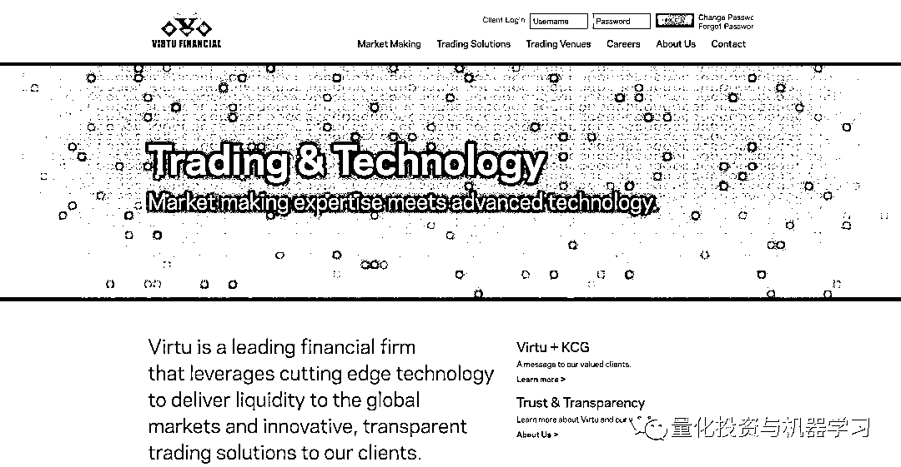

**Citadel Securities **

它是 Citadel LLC 的两个重要商业分支之一，是全球顶尖的做市商公司之一。Citadel LLC 于 1990 年由 Ken Griffen 建立，旗下管理着 300 亿美金的资产，跨越多个投资策略。Citadel Securities 于 2002 年成立，交易量占整个美股市场的 10%。

> 网址：***https://www.citadelsecurities.com/***

**Two Sigma Securities**

类似于 Citadel LLC， Two Sigma 也集资产管理与做市商于一身。其对冲基金管理着 500 亿美金资产，同时做市商通常在美股市场的日交易量超过 3 亿股。 

> 网址：***https://twosigmasecurities.com/***

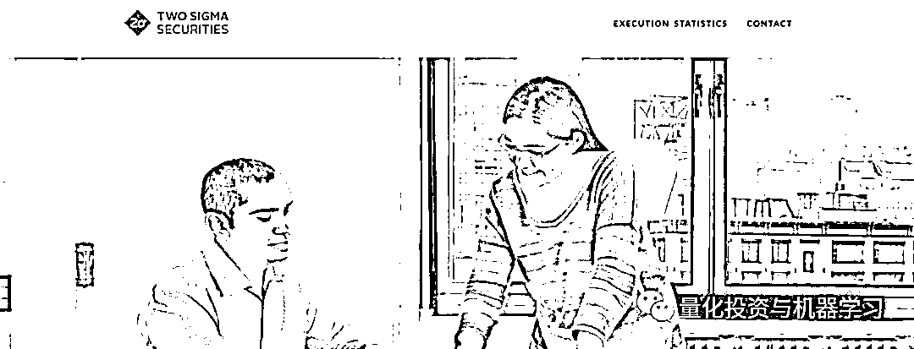

**Tower Research Capital**

总部设立于纽约市，创立于 1998 年，创始人 Mark Gorton。Tower 内部有许多“封闭式”的团队用自己的交易策略积极地进行全球性的交易，但却共享公司的底层数据构架和公司的资本。

> 网址：***https://www.tower-research.com/***

**Jump Trading**

由场内交易员 Paul Gurinas 和 Bill Disomma 组建于 1999 年，总部芝加哥。Jump 目前已发展为一个全球 500 多雇员的大型电子交易公司。此公司在期货交易市场占有重要席位，并将业务扩展到加密数字货币交易。

> 网址：***https://www.jumptrading.com***

**DRW**

由前场内交易员 Don Wilson 创立于 1992 年。DRW 作为一个自营交易公司，在全球范围内交易许多金融产品。此公司有 800 多名雇员，曾是最早建立的高频交易公司之一。2014 年 DRW 通过子公司 Cumberland Trading 将业务扩展到加密数字货币领域。

> 网址：**https://drw.com**

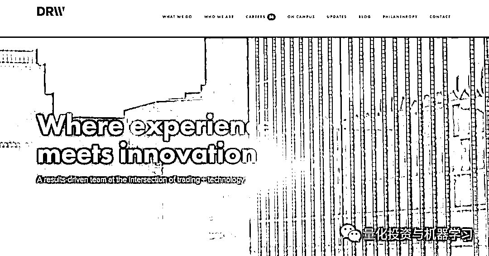

**Hudson River Trading **

简称 HRT，创立于 2002 年，总部纽约市。据华尔街日报的一篇文章报导，此量化交易公司的交易量约为整个美股市场的 5%。该公司于 2017 年收购了竞争对手 Sun Trading。

> 网址：***http://www.hudson-trading.com***

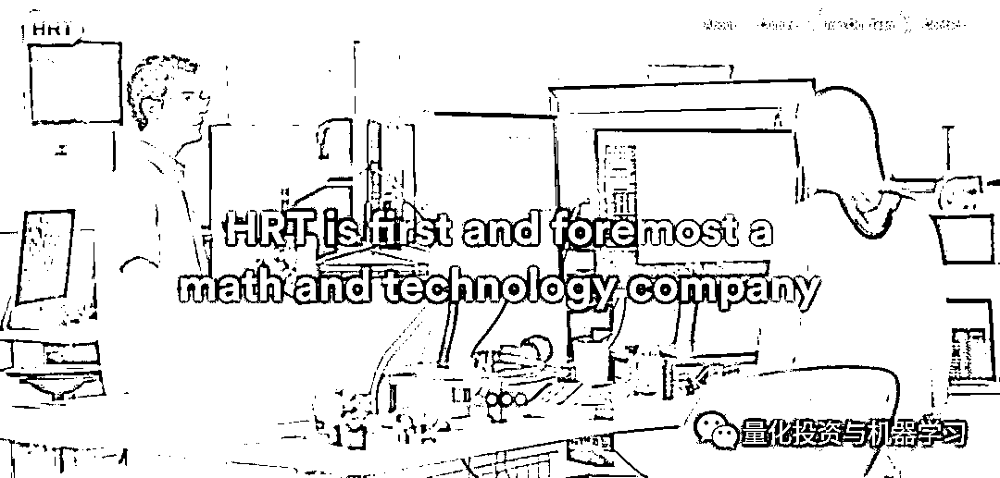

**Quantlab Financial **

作为一个高科技主导的自营交易公司，由 Ed Bosarge 和 Bruce Eames 于 1998 年创建，总部位于得克萨斯州休斯顿，此公司在美国和欧洲都有办公室。2017 年 Quantlab 收购了 Teza Technologies 的高科技资产来巩固自身优势。

> 网址：***https://www.quantlab.com***

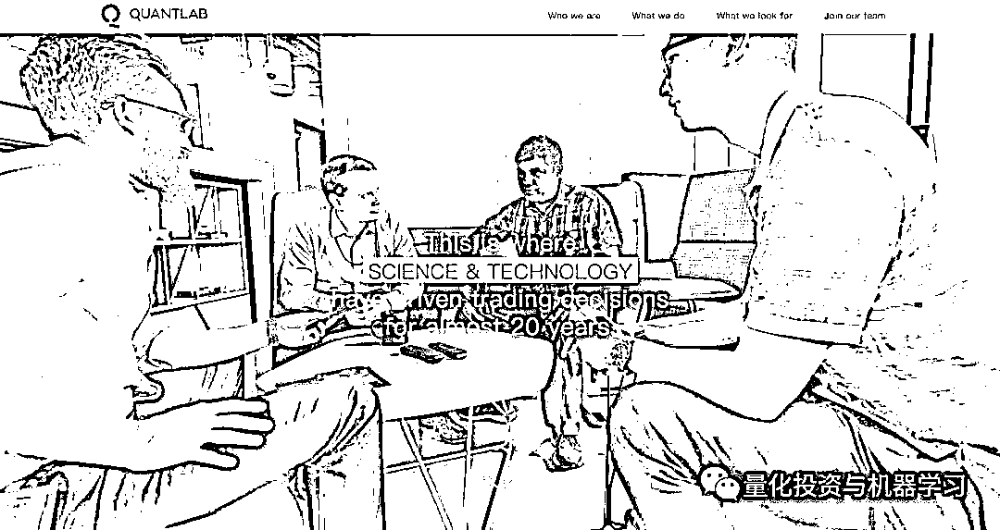

**XTX Markets **

创立于 2015 年，创始人 Alexander Gerko，总部位于伦敦。 XTX 有 100 多名雇员，在货币市场相当活跃。作为第三大做市商公司，XTX 占据了货币市场超过 7%的交易量。同时它也是欧洲股票市场的重要玩家，有超过 11%的市场份额。该公司是从 GSA Capital 分离出来组建而成的。 

> 网址：***https://www.xtxmarkets.com***

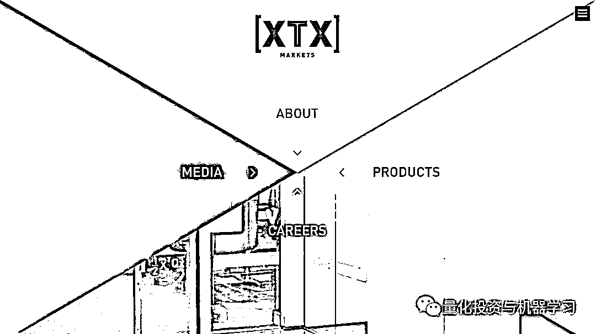

**GTS**

创立于 2006 年，是一个自营量化交易公司，是纽交所最大的“指定做市商”（Designated Market Maker，DMM），为 1100 多上市公司维持公平有序的市场交易环境。GTS 的日现金交易约占美国股市的 3-6%，同时还在全球交易超过 10000 种不同的金融产品。该公司目前同意收购 Cantor Fitzgerald 公司旗下的 ETF 业务和批量做市业务。

> 网址：***http://www.gtsx.com***

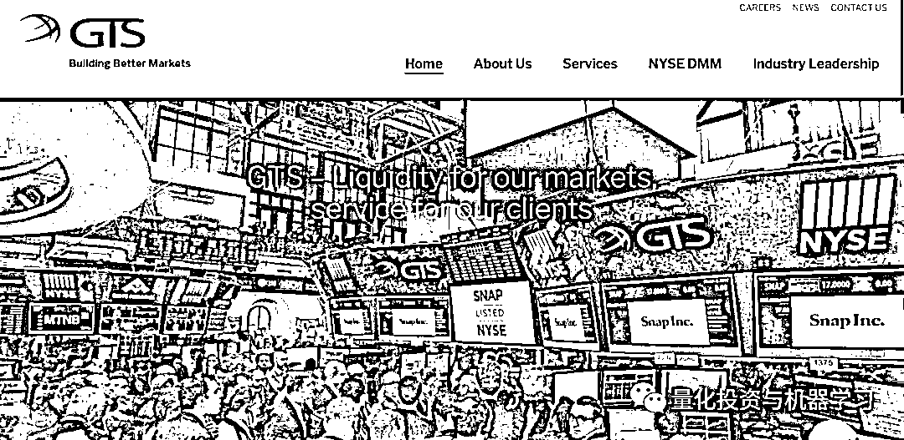

**Tradebot Systems**

成立于 1999 年，创始人 Dave Cummings（他之后又创立了另外一个交易公司 BATS），总部堪萨斯城。该公司约有 60 名雇员，主要擅长向美国股市提供流动性。

> 网址：***http://www.tradebot.com***

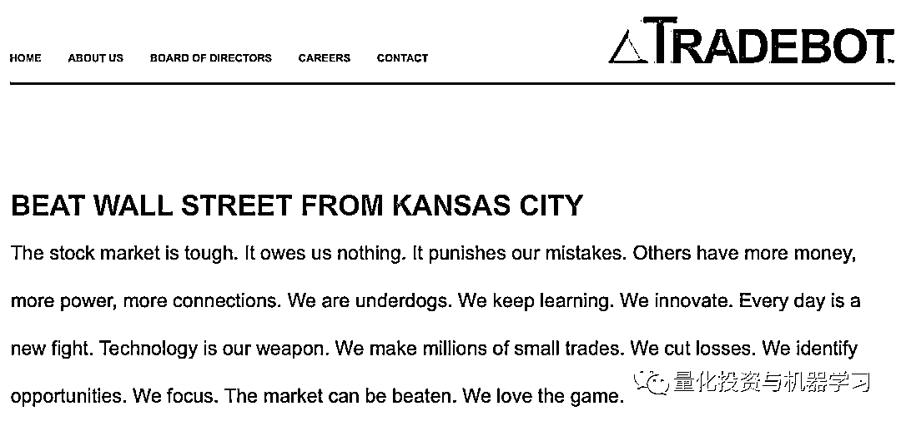

**Flow Traders**

2004 年成立，总部阿姆斯特丹。Flow 是一家公开交易的公司，以制作交易所的交易产品而闻名。有超过 300 多名雇员，该公司为欧洲、美国、亚洲的主要市场提供流动性。特别的，他是欧洲市场 ETF 的重量级做市商，可操纵整个欧洲市场约三分之一的交易量。

> 网址：***https://www.flowtraders.com***

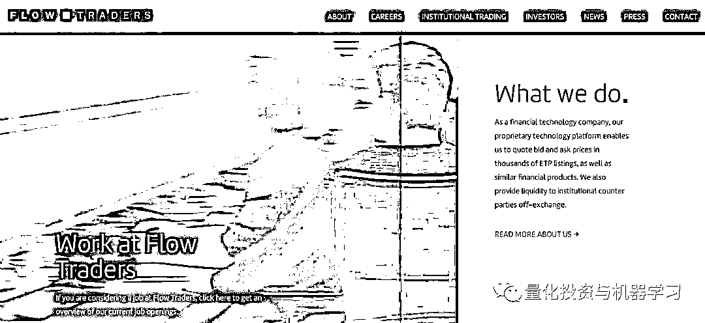

**IMC Financial**

成立于 1989 年，IMC 是在欧洲、美国和亚洲市场的大型电子做市商。在美国，它还是纽交所的“指定做市商”。该公司有超过 500 名雇员，并在阿姆斯特丹、纽约市、芝加哥和悉尼均设有办公室。

> 网址：***https://www.imc.com/us/***

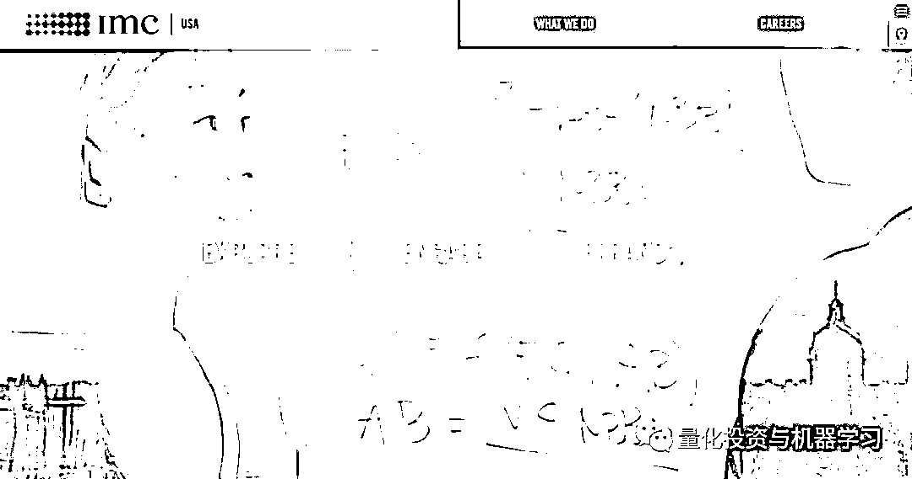

**Optiver**

成立于 1986 年，总部也在阿姆斯特丹。Optiver 是一个自营交易公司，同时也是做市商，总共约有 1000 名雇员。它活跃于全球市场，不过类似于 Flow 和 IMC，它更是欧洲市场 ETF 做市商里的重要玩家。 

> 网址：***https://www.optiver.com/na/en/***

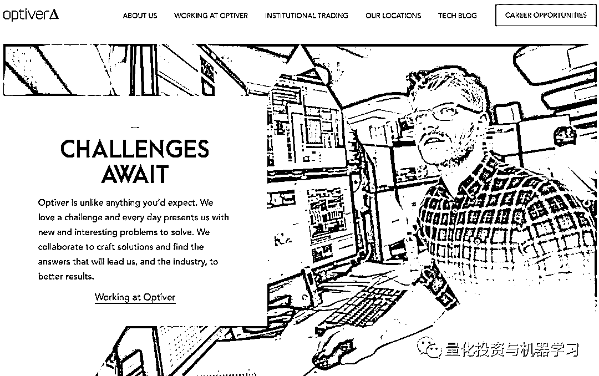

**XR Trading**

作为一个定息债券投资商，XT 成立于 2002 年，总部位于芝加哥。XT 也是一个自营交易公司，并在很大范围内为各种金融产品和资产类型提供流动性。

> 网址：***http://www.xrtrading.com***

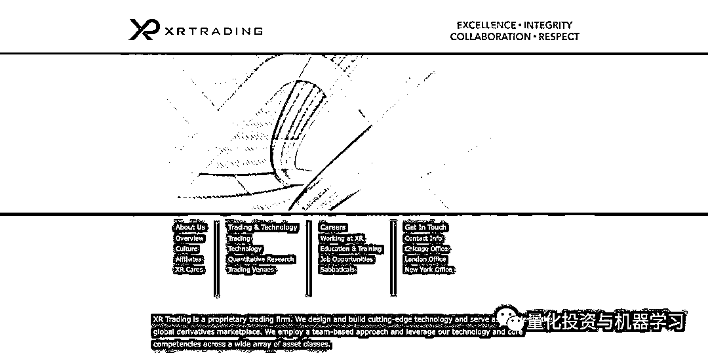

**欢迎大家在文末给公众号翻译部的小伙伴们打赏！**

**推荐阅读**

[01、经过多年交易之后你应该学到的东西（深度分享）](https://mp.weixin.qq.com/s?__biz=MzAxNTc0Mjg0Mg==&mid=2653289074&idx=1&sn=e859d363eef9249236244466a1af41b6&chksm=802e3867b759b1717f77e07a51ee5671e8115130c66562577280ba1243cba08218add04f1f00&token=449379994&lang=zh_CN&scene=21#wechat_redirect)

[02、监督学习标签在股市中的应用（代码+书籍）](https://mp.weixin.qq.com/s?__biz=MzAxNTc0Mjg0Mg==&mid=2653289050&idx=1&sn=60043a5c95b877dd329a5fd150ddacc4&chksm=802e384fb759b1598e500087374772059aa21b31ae104b3dca04331cf4b63a233c5e04c1945a&token=449379994&lang=zh_CN&scene=21#wechat_redirect)

[03、全球投行顶尖机器学习团队全面分析](https://mp.weixin.qq.com/s?__biz=MzAxNTc0Mjg0Mg==&mid=2653289018&idx=1&sn=8c411f676c2c0d92b0dd218f041bee4b&chksm=802e382fb759b139ffebf633ac14cdd0f21938e4613fe632d5d9231dab3d2aca95a11628378a&token=449379994&lang=zh_CN&scene=21#wechat_redirect)

[04、使用 Tensorflow 预测股票市场变动](https://mp.weixin.qq.com/s?__biz=MzAxNTc0Mjg0Mg==&mid=2653289014&idx=1&sn=3762d405e332c599a21b48a7dc4df587&chksm=802e3823b759b135928d55044c2729aea9690f86752b680eb973d1a376dc53cfa18287d0060b&token=449379994&lang=zh_CN&scene=21#wechat_redirect)

[05、使用 LSTM 预测股票市场基于 Tensorflow](https://mp.weixin.qq.com/s?__biz=MzAxNTc0Mjg0Mg==&mid=2653289238&idx=1&sn=3144f5792f84455dd53c27a78e8a316c&chksm=802e3903b759b015da88acde4fcbc8547ab3e6acbb5a0897404bbefe1d8a414265d5d5766ee4&token=2020206794&lang=zh_CN&scene=21#wechat_redirect)

[06、美丽的回测——教你定量计算过拟合概率](https://mp.weixin.qq.com/s?__biz=MzAxNTc0Mjg0Mg==&mid=2653289314&idx=1&sn=87c5a12b23a875966db7be50d11f09cd&chksm=802e3977b759b061675d1988168c1fec06c602e8583fbcc9b76f87008e0c10b702acc85467a0&token=1972390229&lang=zh_CN&scene=21#wechat_redirect)

[07、利用动态深度学习预测金融时间序列基于 Python](https://mp.weixin.qq.com/s?__biz=MzAxNTc0Mjg0Mg==&mid=2653289347&idx=1&sn=bf5d7899bc4a854d4ba9046fdc6fe0d6&chksm=802e3996b759b080287213840987bb0a0c02e4e1d4d7aae23f10a225a92ef6dd922d8006123d&token=290397496&lang=zh_CN&scene=21#wechat_redirect)

[08、Facebook 开源神器 Prophet 预测时间序列基于 Python](https://mp.weixin.qq.com/s?__biz=MzAxNTc0Mjg0Mg==&mid=2653289394&idx=1&sn=24a836136d730aa268605628e683d629&chksm=802e39a7b759b0b1dcf7aaa560699130a907716b71fc9c45ff0e5d236c5ae8ef80ebdb09dbb6&token=290397496&lang=zh_CN&scene=21#wechat_redirect)

[09、Facebook 开源神器 Prophet 预测股市行情基于 Python](https://mp.weixin.qq.com/s?__biz=MzAxNTc0Mjg0Mg==&mid=2653289437&idx=1&sn=f0dca7da8e69e7ba736992cb3d034ce7&chksm=802e39c8b759b0de5bce401c580623d0729ecca69d13926479d36e19aff8c9c9e8a20265afff&token=290397496&lang=zh_CN&scene=21#wechat_redirect)

[10、2018 第三季度最受欢迎的券商金工研报前 50（附下载）](https://mp.weixin.qq.com/s?__biz=MzAxNTc0Mjg0Mg==&mid=2653289358&idx=1&sn=db6e8ab85b08f6e67790ec0e401e586e&chksm=802e399bb759b08d6eec855f9901ea856d0da68c7425cba62791b8948da6ad761a3d88543dad&token=290397496&lang=zh_CN&scene=21#wechat_redirect)

[11、实战交易策略的精髓（公众号深度呈现）](https://mp.weixin.qq.com/s?__biz=MzAxNTc0Mjg0Mg==&mid=2653289447&idx=1&sn=f2948715bf82569a6556d518e56c1f9e&chksm=802e39f2b759b0e4502d1aaac562b87789573b55c76b3c85897d8c9d88dbf9a0b7ee34d86a4e&token=290397496&lang=zh_CN&scene=21#wechat_redirect)

[12、Markowitz 有效边界和投资组合优化基于 Python](https://mp.weixin.qq.com/s?__biz=MzAxNTc0Mjg0Mg==&mid=2653289478&idx=1&sn=f8e01a641be021993d8ef2d84e94a299&chksm=802e3e13b759b7055cf27a280c672371008a5564c97c658eee89ce8481396a28d254836ff9af&token=290397496&lang=zh_CN&scene=21#wechat_redirect)

[13、使用 LSTM 模型预测股价基于 Keras](https://mp.weixin.qq.com/s?__biz=MzAxNTc0Mjg0Mg==&mid=2653289495&idx=1&sn=c4eeaa2e9f9c10995be9ea0c56d29ba7&chksm=802e3e02b759b7148227675c23c403fb9a543b733e3d27fa237b53840e030bf387a473d83e3c&token=1260956004&lang=zh_CN&scene=21#wechat_redirect)

[14、量化金融导论 1：资产收益的程式化介绍基于 Python](https://mp.weixin.qq.com/s?__biz=MzAxNTc0Mjg0Mg==&mid=2653289507&idx=1&sn=f0ca71aa07531bbbdbd33213f0bab89f&chksm=802e3e36b759b720138b3b17a4dd0e198e054b9de29a038fdd50805f824effa55831111ad026&token=1936245282&lang=zh_CN&scene=21#wechat_redirect)

[15、预测股市崩盘基于统计机器学习与神经网络（Python+文档）](https://mp.weixin.qq.com/s?__biz=MzAxNTc0Mjg0Mg==&mid=2653289533&idx=1&sn=4ef964834e84a9995111bb057b0fc5dd&chksm=802e3e28b759b73e0618eb1262c53aa0601fbf5805525a7c7ff40dc3db62c7704496611bdbf1&token=1950551577&lang=zh_CN&scene=21#wechat_redirect)

[16、实现最优投资组合有效前沿基于 Python（附代码）](https://mp.weixin.qq.com/s?__biz=MzAxNTc0Mjg0Mg==&mid=2653289609&idx=1&sn=c7f0b3e47025862d10bb53b6ab88bcda&chksm=802e3e9cb759b78abf6b8b049c59bf18ccfb2ead7580d1f557d36de2292f59dcbd94dcd41910&token=2085008037&lang=zh_CN&scene=21#wechat_redirect)

[17、精心为大家整理了一些超级棒的机器学习资料（附链接）](https://mp.weixin.qq.com/s?__biz=MzAxNTc0Mjg0Mg==&mid=2653289615&idx=1&sn=1cdc89afb997d0c580bf0cef296d946c&chksm=802e3e9ab759b78ce9f0cd152a680d4a413d6c8dcb02a7a296f4091993a7e4137e7520394575&token=2085008037&lang=zh_CN&scene=21#wechat_redirect)

[18、海量 Wind 数据，与全网用户零距离邂逅！](https://mp.weixin.qq.com/s?__biz=MzAxNTc0Mjg0Mg==&mid=2653289623&idx=1&sn=28a3600fd7a72d7be00b066ca0f98244&chksm=802e3e82b759b7943f43a4f6ef4a91e4153fa6b8210de9590235fa8ee66eb9811ce177054dbc&token=1389401983&lang=zh_CN&scene=21#wechat_redirect)

[19、机器学习、深度学习、量化金融、Python 等最新书籍汇总下载](https://mp.weixin.qq.com/s?__biz=MzAxNTc0Mjg0Mg==&mid=2653289640&idx=1&sn=34e94fcbe99052b8e7381ecc48a36dc0&chksm=802e3ebdb759b7ab897cd329a680715b6f8294e63550ddf0c57b9e1320b2b7d1408c6fdca0c7&token=1389401983&lang=zh_CN&scene=21#wechat_redirect)

[20、各大卖方 2019 年 A 股策略报告，都是有故事的人！](https://mp.weixin.qq.com/s?__biz=MzAxNTc0Mjg0Mg==&mid=2653289725&idx=1&sn=4b65cd1fb8331438e4c0b3d0eae6b51f&chksm=802e3ee8b759b7fe1b94e84d54cc23b0ab05853d5cd227812574b350e9fc2cce9e5f1bc6cb7a&token=1389401983&lang=zh_CN&scene=21#wechat_redirect)

****公众号官方 QQ 群****

**量化、技术人士深度交流群**

**扫码关注我们**

