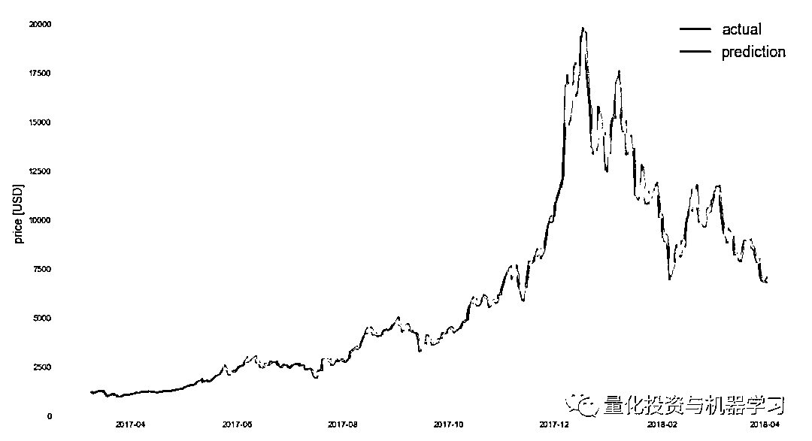
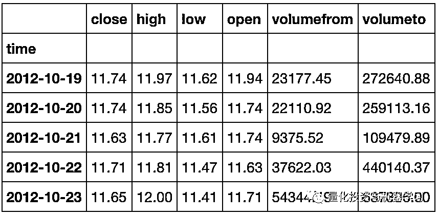
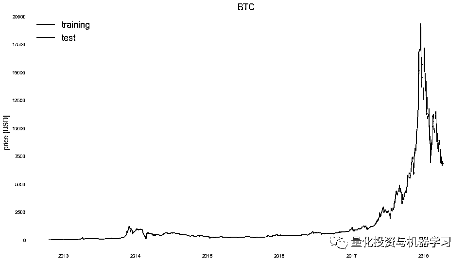
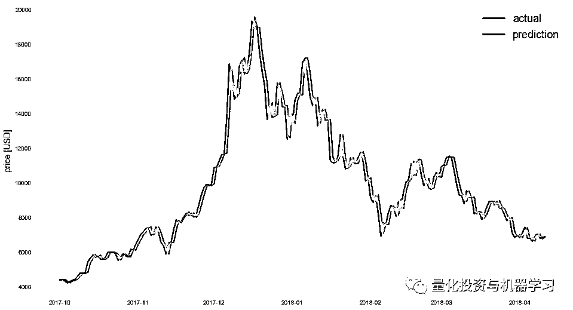
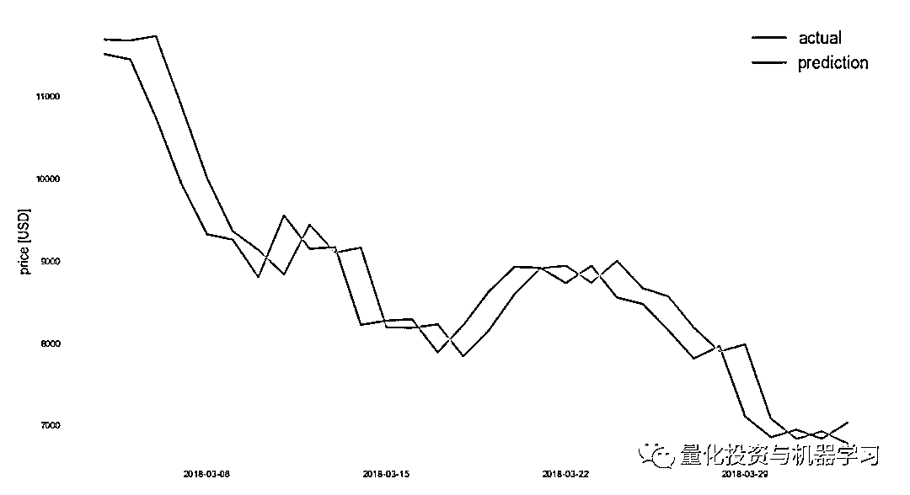
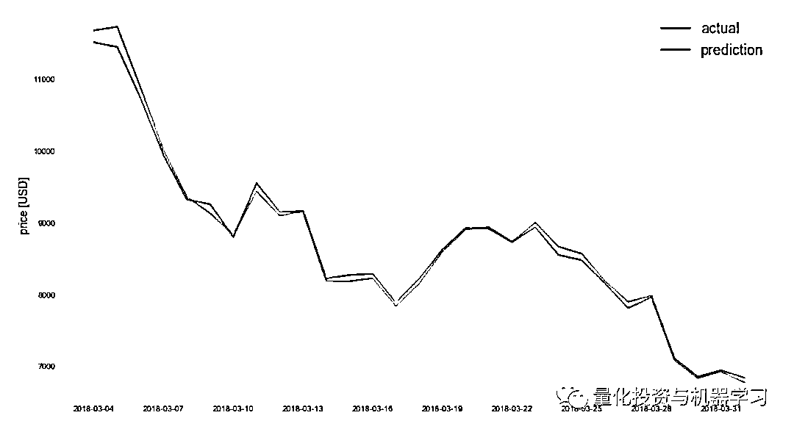
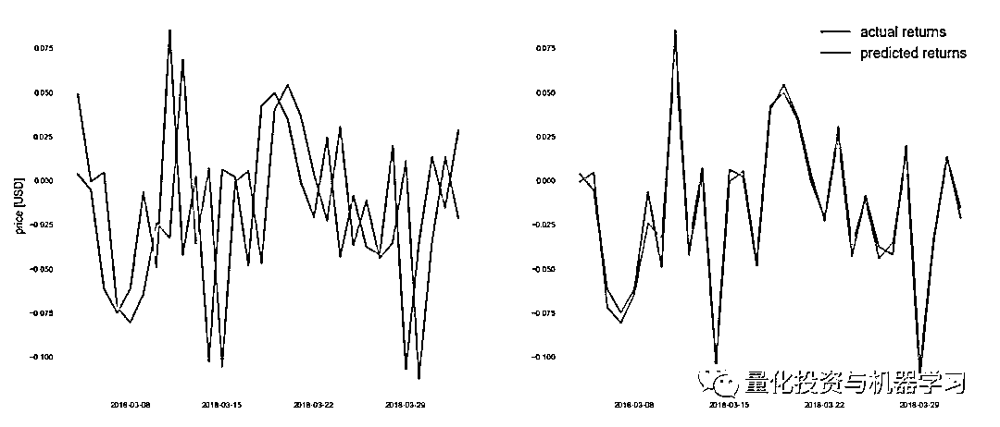
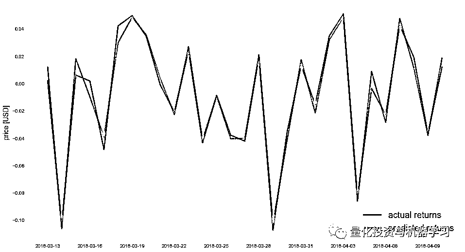
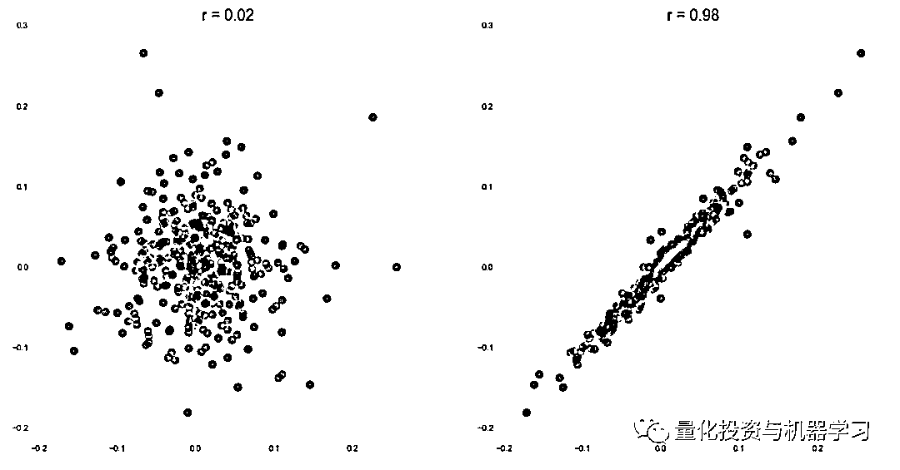

# 【干货】教你如何鉴别那些用深度学习预测股价的花哨模型？

> 原文：[`mp.weixin.qq.com/s?__biz=MzAxNTc0Mjg0Mg==&mid=2653290132&idx=1&sn=cbf1e2a4526e6e9305a6110c17063f46&chksm=802e3c81b759b597d3dd94b8008e150c90087567904a29c0c4b58d7be220a9ece2008956d5db&scene=27#wechat_redirect`](http://mp.weixin.qq.com/s?__biz=MzAxNTc0Mjg0Mg==&mid=2653290132&idx=1&sn=cbf1e2a4526e6e9305a6110c17063f46&chksm=802e3c81b759b597d3dd94b8008e150c90087567904a29c0c4b58d7be220a9ece2008956d5db&scene=27#wechat_redirect)

**标星★公众号**，第一时间获取最新资讯

本期作者：Rafael

本期翻译：Chloe | 公众号翻译部成员

****↓**↓**年度巨献**↓↓**


**↑↑****点我****↑**↑****

**近期原创文章：**

## **♡** [利用深度学习最新前沿预测股价走势](https://mp.weixin.qq.com/s?__biz=MzAxNTc0Mjg0Mg==&mid=2653290080&idx=1&sn=06c50cefe78a7b24c64c4fdb9739c7f3&chksm=802e3c75b759b563c01495d16a638a56ac7305fc324ee4917fd76c648f670b7f7276826bdaa8&token=770078636&lang=zh_CN&scene=21#wechat_redirect)

## **♡** [一位数据科学 PhD 眼中的算法交易](https://mp.weixin.qq.com/s?__biz=MzAxNTc0Mjg0Mg==&mid=2653290118&idx=1&sn=a261307470cf2f3e458ab4e7dc309179&chksm=802e3c93b759b585e079d3a797f512dfd0427ac02942339f4f1454bd368ba47be21cb52cf969&token=770078636&lang=zh_CN&scene=21#wechat_redirect)

## **♡** [深度学习是信号处理和时序分析的最后选择？](https://mp.weixin.qq.com/s?__biz=MzAxNTc0Mjg0Mg==&mid=2653289999&idx=1&sn=800b645653a3e36ce57ff82260d030dc&chksm=802e3c1ab759b50cf9fb931574f84001f4858997be6330251c139deef0272e9217aa62276ea5&token=770078636&lang=zh_CN&scene=21#wechat_redirect)

## **♡** [人工智能『AI』应用算法交易，7 个必踩的坑！](https://mp.weixin.qq.com/s?__biz=MzAxNTc0Mjg0Mg==&mid=2653289974&idx=1&sn=88f87cb64999d9406d7c618350aac35d&chksm=802e3fe3b759b6f5eca6e777364270cbaa0bf35e9a1535255be9751c3a77642676993a861132&token=770078636&lang=zh_CN&scene=21#wechat_redirect)

## **♡** [神经网络在算法交易上的应用系列（一）](https://mp.weixin.qq.com/s?__biz=MzAxNTc0Mjg0Mg==&mid=2653289962&idx=1&sn=5f5aa65ec00ce176501c85c7c106187d&chksm=802e3fffb759b6e9f2d4518f9d3755a68329c8753745333ef9d70ffd04bd088fd7b076318358&token=770078636&lang=zh_CN&scene=21#wechat_redirect)

## **♡** [预测股市 | 如何避免 p-Hacking，为什么你要看涨？](https://mp.weixin.qq.com/s?__biz=MzAxNTc0Mjg0Mg==&mid=2653289820&idx=1&sn=d3fee74ba1daab837433e4ef6b0ab4d9&chksm=802e3f49b759b65f422d20515942d5813aead73231da7d78e9f235bdb42386cf656079e69b8b&token=770078636&lang=zh_CN&scene=21#wechat_redirect)

**正文**

我们建立了一个深度神经网络模型来预测比特币价格——测试结果出奇地准确！ 

看看这个结果吧：



看起来相当精确，不是吗？

在你问我之前我先回答你：是的，上面的回测只用以前的数据去训练模型（稍后会给出细节）。

所以这是一个可以让我变富有的印钞机！

好了，让我们就此打住吧！不要这样做。

我再说一遍：**不要这样做！不要用它来交易！**

请不要被欺骗了。

上面的结果是极其具有迷惑性的，让我来解释一下。

**太美好以至于不够真实**

在过去几周甚至几个月，我们碰到了好多类似文章，用类似的方法给读者呈现了关于加密货币价格预测的类似上图的结果。

**当你看到这些看起来非常精确的结果时，就应该给自己敲响警钟。**

这些结果明显太美好而感觉不够真实。

*“When something looks too good to be true, it usually is.” — Emmy Rossum*

接下来，我们来一步步证明为什么是这样的。

请不要理解错了——我的意图并不是低估那些文章的价值。他们很好，应当获得掌声。事实上，从技术层面讲许多这样的方法都是非常精确的。

本文的目的在于解释为什么那些模型在实际应用中靠不住，为什么他们的预测结果不一定适合于实际交易。

那为什么是这样的呢？让我们一起看个究竟。

**用 LSTMs 来预测比特币价格**

为了更好地解释，我先给你一个实例。该实例通过建立多维 Long Short Term Memory （LSTM） 神经网络模型来预测比特币价格，并产生了如上图你所看到的一样精确的预测结果。 

LSTMs 是一类特殊的 Recurrent Neural Networks （RNN)）模型，特别适合时间序列问题。因此，LSTM 在预测加密货币或者股票价格的模型中非常流行。

关于深度介绍 LSTMs 的文章，推荐这两篇：

***1、http://colah.github.io/posts/2015-08-Understanding-LSTMs/***

***2、http://blog.echen.me/2017/05/30/exploring-lstms/***

目前我们用 Python 和 Keras 来实现 LSTM 算法。

**1. 获得数据**

首先，我通过 API 从 cryptocompare 获得比特币的历史价格数据（对于其他任何加密货币或者股票你都可以这么做）。

```py
import json
import requests

from keras.models import Sequential
from keras.layers import Activation, Dense, Dropout, LSTM
import matplotlib.pyplot as plt
import numpy as np
import pandas as pd
import seaborn as sns
from sklearn.metrics import mean_absolute_error

sns.set_palette('Set2')
%matplotlib inline

endpoint = 'https://min-api.cryptocompare.com/data/histoday'
res = requests.get(endpoint + '?fsym=BTC&tsym=USD&limit=2000')
hist = pd.DataFrame(json.loads(res.content)['Data'])
hist = hist.set_index('time')
hist.index = pd.to_datetime(hist.index, unit='s')

hist.head()
```



我们获得了从 2012 年 10 月 10 日到 2018 年 04 月 04 日共约 2000 天的 BTC 每日数据。

**2. 训练集和测试集分组**

然后，我将所有数据分成训练集和测试集两部分。用最近 10%的数据作为测试集，也就是说将数据从 2017 年 09 月 14 日那天分开。在那天之前的所有数据作为训练集，那天以及那天之后的所有数据用于测试这个模型。接下来画出了我们的 DataFrame 数据结构中 close 那一列的数据，也就是我想预测的每天的收盘价格。

```py
target_col = 'close'

def train_test_split(df, test_size=0.1):
   split_row = len(df) - int(test_size * len(df))
   train_data = df.iloc[:split_row]
   test_data = df.iloc[split_row:]
   return train_data, test_data

def line_plot(line1, line2, label1=None, label2=None, title='', lw=2):
   fig, ax = plt.subplots(1, figsize=(16, 9))
   ax.plot(line1, label=label1, linewidth=lw)
   ax.plot(line2, label=label2, linewidth=lw)
   ax.set_ylabel('price [USD]', fontsize=14)
   ax.set_title(title, fontsize=18)
   ax.legend(loc='best', fontsize=18);

line_plot(train[target_col], test[target_col], 'training', 'test', title='BTC')
```



比特币历史数据的训练集和测试集分离

**3. 建立模型**

为了训练 LSTM 模型，将所有训练数据连续划分成互不相交的窗口，每个窗口有 7 天（这个数字可以任意选，我只是简单地选了 7 天）。在每个窗口内，我将数据正规化成零基准，也就是说，每个窗口第一个元素是 0 而其他值代表着相应于第一个元素的变化率。因此，我在预测价格的变化率，而不是绝对的数值大小。

```py
def normalise_zero_base(df):
   """ Normalise dataframe column-wise to reflect changes with respect to first entry. """
   return df / df.iloc[0] - 1

def normalise_min_max(df):
   """ Normalise dataframe column-wise min/max. """
   return (df - df.min()) / (data.max() - df.min())

def extract_window_data(df, window_len=10, zero_base=True):
   """ Convert dataframe to overlapping sequences/windows of len `window_data`.

       :param window_len: Size of window
       :param zero_base: If True, the data in each window is normalised to reflect changes
           with respect to the first entry in the window (which is then always 0)
   """
   window_data = []
   for idx in range(len(df) - window_len):
       tmp = df[idx: (idx + window_len)].copy()
       if zero_base:
           tmp = normalise_zero_base(tmp)
       window_data.append(tmp.values)
   return np.array(window_data)

def prepare_data(df, target_col, window_len=10, zero_base=True, test_size=0.2):
   """ Prepare data for LSTM. """
   # train test split
   train_data, test_data = train_test_split(df, test_size=test_size)

   # extract window data
   X_train = extract_window_data(train_data, window_len, zero_base)
   X_test = extract_window_data(test_data, window_len, zero_base)

   # extract targets
   y_train = train_data[target_col][window_len:].values
   y_test = test_data[target_col][window_len:].values
   if zero_base:
       y_train = y_train / train_data[target_col][:-window_len].values - 1
       y_test = y_test / test_data[target_col][:-window_len].values - 1

   return train_data, test_data, X_train, X_test, y_train, y_test
```

只用一个简单的神经网络模型。这个神经网络带一个 LSTM 层（包含 20 个神经元和一个失效因子 dropout factor 0.25）和一个包含单个线性激发函数的稠密层。另外，我用均值绝对误差（Mean Absolute Error）作为损失函数和 Adam 优化器。

我训练这个模型 50 次（epochs），每次批量大小（batch size）为 4。

> 说明：网络构架和所有因子的选择都是任意的，我并没有对他们做优化，因为这不是本文的着重点。

```py
def build_lstm_model(input_data, output_size, neurons=20, activ_func='linear',
                     dropout=0.25, loss='mae', optimizer='adam'):
    model = Sequential()

    model.add(LSTM(neurons, input_shape=(input_data.shape[1], input_data.shape[2])))
    model.add(Dropout(dropout))
    model.add(Dense(units=output_size))
    model.add(Activation(activ_func))

    model.compile(loss=loss, optimizer=optimizer)
    return model

np.random.seed(42)

# data params
window_len = 7
test_size = 0.1
zero_base = True

# model params
lstm_neurons = 20
epochs = 50
batch_size = 4
loss = 'mae'
dropout = 0.25
optimizer = 'adam'

train, test, X_train, X_test, y_train, y_test = prepare_data(
    hist, target_col, window_len=window_len, zero_base=zero_base, test_size=test_size)

model = build_lstm_model(
    X_train, output_size=1, neurons=lstm_neurons, dropout=dropout, loss=loss,
    optimizer=optimizer)
history = model.fit(
    X_train, y_train, epochs=epochs, batch_size=batch_size, verbose=1, shuffle=True)
Epoch 1/50
```

**4. 结果**

用训练好的模型去预测剩余的测试集，我们得到了本文一开始的图。

```py
targets = test[target_col][window_len:]
preds = model.predict(X_test).squeeze()

mean_absolute_error(preds, y_test)
0.044705889968596577

preds = test[target_col].values[:-window_len] * (preds + 1)
preds = pd.Series(index=targets.index, data=preds)

line_plot(targets, preds, 'actual', 'prediction', lw=3)
```



那这个结果到底是哪里出问题了呢？

为什么我们不能将这个模型用于实际交易？

我们将这个图放大到最近的 30 天，然后仔细观察一下。

```py
targets = test[target_col][window:]
preds = model.predict(X_test).squeeze()
# convert change predictions back to actual price
preds = test.close.values[:-window] * (preds + 1)
preds = pd.Series(index=targets.index, data=preds)
n = 30
line_plot(targets[-n:], preds[-n:], 'actual', 'prediction')
```



看到了吗？估计你已经准确地猜到了，**这个模型的基本错误是当做某一天的预测时，基本只用到了前一天的值。**

那条红色的预测曲线，看起来基本只是那条绿色的实际价格曲线的平移而已。

事实上，如果我们将预测曲线调整一下，往前平移一天，那我们所观察到的现象会更显而易见。

```py
line_plot(targets[-n:][:-1], preds[-n:].shift(-1))
```



正如你所看到的，我们几乎可以观察到实际数据和预测数据的一个近乎完美的重合。也就是说，我们的模型本质上只学习了前一天的价格。

这样的结果正是我在许多用 LSTM 做单点预测的事例中看到的。

为了揭示得更清晰，让我们来计算预测价格回报的期望，然后跟实际回报的期望做对比。

```py
actual_returns = targets.pct_change()[1:]
predicted_returns = preds.pct_change()[1:]

def dual_line_plot(line1, line2, line3, line4, label1=None, label2=None, title='', lw=2):
    import matplotlib.dates as mdates
    fig, (ax1, ax2) = plt.subplots(1, 2, figsize=(21, 9))
    ax1.plot(line1, label=label1, linewidth=lw)
    ax1.plot(line2, label=label2, linewidth=lw)
    ax2.plot(line3, label=label1, linewidth=lw)
    ax2.plot(line4, label=label2, linewidth=lw)
    ax2.set_xticks(ax1.get_xticks())
    ax2.xaxis.set_major_formatter(mdates.DateFormatter('%Y-%m-%d'))
    ax1.set_ylabel('daily returns', fontsize=14)
    ax2.legend(loc='best', fontsize=18);

dual_line_plot(actual_returns[-n_points:],
          predicted_returns[-n_points:],
          actual_returns[-n_points:][:-1],
          predicted_returns[-n_points:].shift(-1),
          'actual returns', 'predicted returns', lw=3)
```



 实际回报和预测回报，右图中预测回报往前平移了一天

```py
line_plot(actual_returns[-n_points:][:-1], predicted_returns[-n_points:].shift(-1),
           'actual returns', 'predicted returns', lw=3)
```



不论是原始的形式还是平移一天的形式，如果我们看实际回报和预测的回报，我们可以得到相同的观察结论。 

事实上，如果我们计算实际回报和预测回报之前的相关性，不论是原始的预测还是平移一天的预测，我们都可以得到如下观察结果：

```py
fig, (ax1, ax2) = plt.subplots(1, 2, figsize=(18, 9))

# actual correlation
corr = np.corrcoef(actual_returns, predicted_returns)[0][1]
ax1.scatter(actual_returns, predicted_returns, color='k', marker='o', alpha=0.5, s=100)
ax1.set_title('r = {:.2f}'.format(corr), fontsize=18)

# shifted correlation
shifted_actual = actual_returns[:-1]
shifted_predicted = predicted_returns.shift(-1).dropna()
corr = np.corrcoef(shifted_actual, shifted_predicted)[0][1]
ax2.scatter(shifted_actual, shifted_predicted, color='k', marker='o', alpha=0.5, s=100)
ax2.set_title('r = {:.2f}'.format(corr), fontsize=18);
```



从上图我们可以看到，**比特币价格的实际回报和原始预测回报之间没有相关性，而和平移一天后的预测回报之间有非常高的相关性。**

**总结**

本文目的在于总结在过去几个月遇到的用深度神经网络来预测加密货币或者股票价格的例子。这些例子与本文用了完全类似的方法：**都是用历史数据通过 LSTM 来预测未来结果**。我已经证明了为什么这样的模型在实际交易中可能不可靠。 

没错，**深度神经网络可以很有效地学习。但它最终训练得到的策略竟是预测一个跟前一天数据非常接近的数值，以成功地实现最小化均值绝对误差。**

然而，不管这个预测从均值绝对误差的角度看有多精确，实际上，正如我们文中例子展现的那样，**仅仅基于历史数据的单点预测模型的结果依然很难有所作为，尤其在实际交易中。**

毋庸置疑，更复杂且实施有效的用于价格预测的 LSTM 模型可能是存在的。首先可以使用更多的数据，优化网络架构和参数。不过在我看来，引入区别于历史数据的其他数据和特征会更有用，毕竟金融股市的久存名言说：

**“过去不能代表未来”**

文章来源：https://hackernoon.com/dont-be-fooled-deceptive-cryptocurrency-price-predictions-using-deep-learning-bf27e4837151

**欢迎大家在文末给公众号翻译部的小伙伴们打赏！**

**推荐阅读**

[01、经过多年交易之后你应该学到的东西（深度分享）](https://mp.weixin.qq.com/s?__biz=MzAxNTc0Mjg0Mg==&mid=2653289074&idx=1&sn=e859d363eef9249236244466a1af41b6&chksm=802e3867b759b1717f77e07a51ee5671e8115130c66562577280ba1243cba08218add04f1f00&token=449379994&lang=zh_CN&scene=21#wechat_redirect)

[02、监督学习标签在股市中的应用（代码+书籍）](https://mp.weixin.qq.com/s?__biz=MzAxNTc0Mjg0Mg==&mid=2653289050&idx=1&sn=60043a5c95b877dd329a5fd150ddacc4&chksm=802e384fb759b1598e500087374772059aa21b31ae104b3dca04331cf4b63a233c5e04c1945a&token=449379994&lang=zh_CN&scene=21#wechat_redirect)

[03、全球投行顶尖机器学习团队全面分析](https://mp.weixin.qq.com/s?__biz=MzAxNTc0Mjg0Mg==&mid=2653289018&idx=1&sn=8c411f676c2c0d92b0dd218f041bee4b&chksm=802e382fb759b139ffebf633ac14cdd0f21938e4613fe632d5d9231dab3d2aca95a11628378a&token=449379994&lang=zh_CN&scene=21#wechat_redirect)

[04、使用 Tensorflow 预测股票市场变动](https://mp.weixin.qq.com/s?__biz=MzAxNTc0Mjg0Mg==&mid=2653289014&idx=1&sn=3762d405e332c599a21b48a7dc4df587&chksm=802e3823b759b135928d55044c2729aea9690f86752b680eb973d1a376dc53cfa18287d0060b&token=449379994&lang=zh_CN&scene=21#wechat_redirect)

[05、使用 LSTM 预测股票市场基于 Tensorflow](https://mp.weixin.qq.com/s?__biz=MzAxNTc0Mjg0Mg==&mid=2653289238&idx=1&sn=3144f5792f84455dd53c27a78e8a316c&chksm=802e3903b759b015da88acde4fcbc8547ab3e6acbb5a0897404bbefe1d8a414265d5d5766ee4&token=2020206794&lang=zh_CN&scene=21#wechat_redirect)

[06、美丽的回测——教你定量计算过拟合概率](https://mp.weixin.qq.com/s?__biz=MzAxNTc0Mjg0Mg==&mid=2653289314&idx=1&sn=87c5a12b23a875966db7be50d11f09cd&chksm=802e3977b759b061675d1988168c1fec06c602e8583fbcc9b76f87008e0c10b702acc85467a0&token=1972390229&lang=zh_CN&scene=21#wechat_redirect)

[07、利用动态深度学习预测金融时间序列基于 Python](https://mp.weixin.qq.com/s?__biz=MzAxNTc0Mjg0Mg==&mid=2653289347&idx=1&sn=bf5d7899bc4a854d4ba9046fdc6fe0d6&chksm=802e3996b759b080287213840987bb0a0c02e4e1d4d7aae23f10a225a92ef6dd922d8006123d&token=290397496&lang=zh_CN&scene=21#wechat_redirect)

[08、Facebook 开源神器 Prophet 预测时间序列基于 Python](https://mp.weixin.qq.com/s?__biz=MzAxNTc0Mjg0Mg==&mid=2653289394&idx=1&sn=24a836136d730aa268605628e683d629&chksm=802e39a7b759b0b1dcf7aaa560699130a907716b71fc9c45ff0e5d236c5ae8ef80ebdb09dbb6&token=290397496&lang=zh_CN&scene=21#wechat_redirect)

[09、Facebook 开源神器 Prophet 预测股市行情基于 Python](https://mp.weixin.qq.com/s?__biz=MzAxNTc0Mjg0Mg==&mid=2653289437&idx=1&sn=f0dca7da8e69e7ba736992cb3d034ce7&chksm=802e39c8b759b0de5bce401c580623d0729ecca69d13926479d36e19aff8c9c9e8a20265afff&token=290397496&lang=zh_CN&scene=21#wechat_redirect)

[10、2018 第三季度最受欢迎的券商金工研报前 50（附下载）](https://mp.weixin.qq.com/s?__biz=MzAxNTc0Mjg0Mg==&mid=2653289358&idx=1&sn=db6e8ab85b08f6e67790ec0e401e586e&chksm=802e399bb759b08d6eec855f9901ea856d0da68c7425cba62791b8948da6ad761a3d88543dad&token=290397496&lang=zh_CN&scene=21#wechat_redirect)

[11、实战交易策略的精髓（公众号深度呈现）](https://mp.weixin.qq.com/s?__biz=MzAxNTc0Mjg0Mg==&mid=2653289447&idx=1&sn=f2948715bf82569a6556d518e56c1f9e&chksm=802e39f2b759b0e4502d1aaac562b87789573b55c76b3c85897d8c9d88dbf9a0b7ee34d86a4e&token=290397496&lang=zh_CN&scene=21#wechat_redirect)

[12、Markowitz 有效边界和投资组合优化基于 Python](https://mp.weixin.qq.com/s?__biz=MzAxNTc0Mjg0Mg==&mid=2653289478&idx=1&sn=f8e01a641be021993d8ef2d84e94a299&chksm=802e3e13b759b7055cf27a280c672371008a5564c97c658eee89ce8481396a28d254836ff9af&token=290397496&lang=zh_CN&scene=21#wechat_redirect)

[13、使用 LSTM 模型预测股价基于 Keras](https://mp.weixin.qq.com/s?__biz=MzAxNTc0Mjg0Mg==&mid=2653289495&idx=1&sn=c4eeaa2e9f9c10995be9ea0c56d29ba7&chksm=802e3e02b759b7148227675c23c403fb9a543b733e3d27fa237b53840e030bf387a473d83e3c&token=1260956004&lang=zh_CN&scene=21#wechat_redirect)

[14、量化金融导论 1：资产收益的程式化介绍基于 Python](https://mp.weixin.qq.com/s?__biz=MzAxNTc0Mjg0Mg==&mid=2653289507&idx=1&sn=f0ca71aa07531bbbdbd33213f0bab89f&chksm=802e3e36b759b720138b3b17a4dd0e198e054b9de29a038fdd50805f824effa55831111ad026&token=1936245282&lang=zh_CN&scene=21#wechat_redirect)

[15、预测股市崩盘基于统计机器学习与神经网络（Python+文档）](https://mp.weixin.qq.com/s?__biz=MzAxNTc0Mjg0Mg==&mid=2653289533&idx=1&sn=4ef964834e84a9995111bb057b0fc5dd&chksm=802e3e28b759b73e0618eb1262c53aa0601fbf5805525a7c7ff40dc3db62c7704496611bdbf1&token=1950551577&lang=zh_CN&scene=21#wechat_redirect)

[16、实现最优投资组合有效前沿基于 Python（附代码）](https://mp.weixin.qq.com/s?__biz=MzAxNTc0Mjg0Mg==&mid=2653289609&idx=1&sn=c7f0b3e47025862d10bb53b6ab88bcda&chksm=802e3e9cb759b78abf6b8b049c59bf18ccfb2ead7580d1f557d36de2292f59dcbd94dcd41910&token=2085008037&lang=zh_CN&scene=21#wechat_redirect)

[17、精心为大家整理了一些超级棒的机器学习资料（附链接）](https://mp.weixin.qq.com/s?__biz=MzAxNTc0Mjg0Mg==&mid=2653289615&idx=1&sn=1cdc89afb997d0c580bf0cef296d946c&chksm=802e3e9ab759b78ce9f0cd152a680d4a413d6c8dcb02a7a296f4091993a7e4137e7520394575&token=2085008037&lang=zh_CN&scene=21#wechat_redirect)

[18、海量 Wind 数据，与全网用户零距离邂逅！](https://mp.weixin.qq.com/s?__biz=MzAxNTc0Mjg0Mg==&mid=2653289623&idx=1&sn=28a3600fd7a72d7be00b066ca0f98244&chksm=802e3e82b759b7943f43a4f6ef4a91e4153fa6b8210de9590235fa8ee66eb9811ce177054dbc&token=1389401983&lang=zh_CN&scene=21#wechat_redirect)

[19、机器学习、深度学习、量化金融、Python 等最新书籍汇总下载](https://mp.weixin.qq.com/s?__biz=MzAxNTc0Mjg0Mg==&mid=2653289640&idx=1&sn=34e94fcbe99052b8e7381ecc48a36dc0&chksm=802e3ebdb759b7ab897cd329a680715b6f8294e63550ddf0c57b9e1320b2b7d1408c6fdca0c7&token=1389401983&lang=zh_CN&scene=21#wechat_redirect)

[20、各大卖方 2019 年 A 股策略报告，都是有故事的人！](https://mp.weixin.qq.com/s?__biz=MzAxNTc0Mjg0Mg==&mid=2653289725&idx=1&sn=4b65cd1fb8331438e4c0b3d0eae6b51f&chksm=802e3ee8b759b7fe1b94e84d54cc23b0ab05853d5cd227812574b350e9fc2cce9e5f1bc6cb7a&token=1389401983&lang=zh_CN&scene=21#wechat_redirect)

**扫码关注我们**

