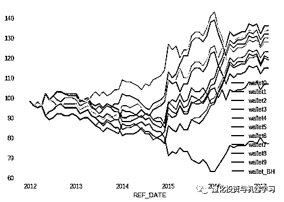

# 一位数据科学 PhD 眼中的算法交易

> 原文：[`mp.weixin.qq.com/s?__biz=MzAxNTc0Mjg0Mg==&mid=2653290118&idx=1&sn=a261307470cf2f3e458ab4e7dc309179&chksm=802e3c93b759b585e079d3a797f512dfd0427ac02942339f4f1454bd368ba47be21cb52cf969&scene=27#wechat_redirect`](http://mp.weixin.qq.com/s?__biz=MzAxNTc0Mjg0Mg==&mid=2653290118&idx=1&sn=a261307470cf2f3e458ab4e7dc309179&chksm=802e3c93b759b585e079d3a797f512dfd0427ac02942339f4f1454bd368ba47be21cb52cf969&scene=27#wechat_redirect)

**标星★公众号**，第一时间获取最新资讯

本期作者：Daniel Shapiro, PhD

本期翻译：1+1=6 | 公众号翻译部成员

****↓**↓**年度巨献**↓↓**


**↑↑****点我****↑**↑****

**正文**

本篇推文，将介绍用于算法交易的资产模型。我们研究的一些模型可以根据过去发生的事情来预测将会发生什么，并通过交易这些信息来赚钱。模型和交易策略是一个 demo，但提供的代码属于数据科学部分，以便你能够真正了解此建模工作的具体操作。在本文中，将向你展示如何识别经济数据并将其与可交易标的进行匹配。

***“All models are wrong but some are useful” ******-George Box***


这次 demo 的标的是货币对 USD/CAD。我们可以从 Open data Canada 这里获得每日历史数据。地址：https://open.canada.ca/data/en/dataset/1bc25b1e-0e02-4a5e-afd7-7b96d6728aac

```py
import pandas as pd
import numpy as np
# daily exchange rate
# https://open.canada.ca/data/en/dataset/1bc25b1e-0e02-4a5e-afd7-7b96d6728aac

# Load the CSV file
rates = pd.read_csv('https://lemay.ai/forex/10100008.csv')
# Decide what columns we want
rates_cols=['REF_DATE', 'VALUE']
# Only keep the closing spot price for our currency pair
rates=rates[rates['Type of currency']=='United States dollar, closing spot rate']
# Dump the columns we don't need, and fill null values with 0s
rates=rates[rates_cols].fillna(0)
# Force a common index with the economic data we will be getting next
rates.index = pd.to_datetime(rates['REF_DATE'])
# Now that we set the index, drop the extra date column
rates.drop(['REF_DATE'], axis=1, inplace=True)
# Let's give our asset a nice human-friendly name: USD_CAD
rates.rename(columns={'VALUE': 'USD_CAD'}, inplace=True)
# If rate is on a weekend or day market is closed, then use the most recent day's rate
# Weekends are 2 days long so copy Saturday stuff to Sundays
# Carry forward the rates for 3 day and 4 day market closures
while rates[rates == 0].count(axis=0)['USD_CAD']/len(rates.index) >0:
  print("Shifting rates. Days with rate at 0 = %",rates[rates == 0].count(axis=0)['USD_CAD']/len(rates.index))
  rates['yesterday']= rates['USD_CAD'].shift(1)
  rates['USD_CAD']  = np.where(rates['USD_CAD']==0, rates['yesterday'], rates['USD_CAD'])
#Verify we don't have days with rates at 0
print("Days with rate at 0 = %",rates[rates == 0].count(axis=0)['USD_CAD']/len(rates.index))
# Spot check the results against a trading days calendar: http://www.swingtradesystems.com/trading-days-calendars.html
# Graph the data
rates.drop(['yesterday'], axis=1, inplace=True)
rates.plot()
rates.tail()
```

以下是来自 fxtop.com 的 USD/CAD 数据图表：


到目前为止，我们已经看到，为了以一种良好的格式获得数据，需要进行一些数据清理工作。数据科学的故事是这样的：大多数工作都是将数据转换成观察相关性并做出预测所需的格式。 

现在我们继续获取一些数据，我们认为这些数据将帮助我们预测美元/加元资产的走势。这些数据还将以工业产品价格指数（IPPI）的形式来自加拿大开放数据，该指数应与加元相对于美元的汇率走势相关。如果商品价格上涨，或许这能告诉我们一些有关经济和货币（相对于美国）的信息。


上面的两张图是我们对模型的经济数据的初步分析。从数据指南中我们知道，这个 IPPI 指数将“index, 2010=100”与“index, 2010=100”挂钩，我们可以从 20 世纪 50 年代到 2019 年的长期数据（左）中清楚地看到这种挂钩。一切都收敛于 2010=100，然后从这里展开。

数据中特定的信号也有少量的奇怪之处。下图是 2008 年至 2016 年 IPPI“纸质办公用品”的归一化图。大多数信号都没有这个问题，但重要的是要记住数据集不是完美的。


使用这个数据集有一些严重的限制。首先，它每月只提供一次。这对于真正的交易算法来说太慢了。其次，该指数中的所有因素都与加拿大有关，在美元/加元交易中，加拿大只占一半或更少。第三，我们不包括来自新闻或其他数据源的数据。这一切都很好，因为我们只是在展示它的原理。实际上，有很多方法可以在日常交易中利用月度宏观数据，并将来自多种数据类型的输入合并到模型中。考虑到这些注意事项，下面是我们如何将 IPPI 数据提取为模型的可用格式：

```py
import pandas as pd
# Industrial Product Price Index (IPPI) data
# https://open.canada.ca/data/en/dataset/39a39c7c-24f1-4789-8f20-a04bcbf635b0

# Load the CSV file
df = pd.read_csv('https://lemay.ai/forex/18100030.csv')

# Decide what columns we want
categories=list(df[list(df)[3]].drop_duplicates())
df_cols=['REF_DATE', 'North American Product Classification System (NAPCS)', 'VALUE']

# Prepare an empty dataframe to fill with properly indexed economic data
new_df = pd.DataFrame(columns=df_cols)
# Toss out the columns we don't want
df=df[df_cols]
# Set the date as the index using the same format as the USD_CAD data
df.index = df['REF_DATE']
new_df.index = new_df['REF_DATE']
# Dump out the date column now that we applied it to the dataframe index
df.drop(['REF_DATE'], axis=1, inplace=True)
new_df.drop(['REF_DATE'], axis=1, inplace=True)
# Spot check the dataframe so far
display(df.head())

# Loop through the economic indicators and put each one in a dedicated column
for cat in categories:
    # Data can have problems, and not all indicators will make it through
    try:
      new_df[cat]=df[df[list(df)[0]]==cat]['VALUE']
    except Exception as e:
      print("failed on",cat,e)

# Spot check the output dataframe
display(new_df.head())

# Graph the data
new_df.plot()

# Save the dataframe with the economic indicators to a file
new_df.to_csv("forex_signals.csv")
```

机器学习模型有一些输入观测值“x”和一些输出预测值“y”，其中模型是一个函数，它使 y=f(x)。f 模型从观察到预测。在我们的例子中，“x”是 IPPI 数据，我们希望使用它来预测 USD_CAD 中的价格变化，这是我们的“y”输出。在进行预测之前，我们应该深入研究 IPPI 和 USD_CAD 之间的相关性，以验证这些东西实际上是像我们假设的那样相互关联的。我们还将超越相关性，查看基于 IPPI 数据中过去值的 USD_CAD 未来值中的相关性。换句话说，我们将寻找在 IPPI 中有可以用来预测 USD_CAD 的信号的迹象。

让我们先把经济数据和资产数据结合起来观察一些很酷的东西。下面是所有数据科学的代码：

```py
import pandas as pd
import matplotlib.pyplot as plt
from sklearn.preprocessing import MinMaxScaler

def makeFig(plt, title, xlabel, ylabel, fName):
  plt.xlabel(xlabel)
  plt.ylabel(ylabel)
  plt.title(title)
  plt.tight_layout()
  plt.savefig(fName, dpi=100)
  #plt.show()
  return

# Observe the whole data range and then specific data ranges
for startYear,endYear in [[1949,2019],[1990,2000],[2000,2010],[2010,2019]]:
  df_new = pd.read_csv('forex_signals.csv',index_col=0)
  # Keep only the data for the time range that we care about
  if startYear>=1950:
    df_new = df_new[df_new.index>=str(startYear)+'-01']
    df_new = df_new[df_new.index<str(endYear)+'-01']
  # Use the same date format we used for the exchange rate
  df_new.index=pd.to_datetime(df_new.index)

  #df_new.plot(legend=False)

  # Scale the IPPI data
  scaler = MinMaxScaler()
  df_new[list(df_new)] = scaler.fit_transform(df_new[list(df_new)])
  # Join the exchange rate data with the IPPI data
  m=df_new[list(df_new)[:]].join(rates, how='inner').fillna(0)

  correlations = m.corr()['USD_CAD'].sort_values(ascending=False).dropna()

  plt.figure(figsize=(20, 8))
  correlations[1:26].plot.barh()
  title="Correlation of Industrial Product Prices and USD_CAD strength ("+str(startYear)+" to "+str(endYear)+")"
  xlabel="Correlation with USD_CAD"
  ylabel="Price of Industrial Product"
  fName=str(startYear)+'s_corr_high.png'
  makeFig(plt, title, xlabel, ylabel, fName)

  plt.figure(figsize=(20, 8))
  correlations[-25:].plot.barh()
  fName=str(startYear)+'s_corr_low.png'
  makeFig(plt, title, xlabel, ylabel, fName)

  plt.figure(figsize=(20, 8))
  correlations[1:].plot.bar()
  plt.xticks([])  
  fName=str(startYear)+'s_histogram_correlations.png'
  makeFig(plt, title, ylabel, xlabel, fName)

  # Tomorrow minus today's exchange rate gives the rate delta
  # Intuition: When tomorrow's USD_CAD exchange rate is higher than today's, the result is positive
  p=m.copy(deep=True)
  p['dUSD_CAD']= m['USD_CAD'].shift(-1) - m['USD_CAD']
  causations = p.corr()['dUSD_CAD'].sort_values(ascending=False).dropna()

  plt.figure(figsize=(20, 8))
  causations[1:].plot.bar()
  plt.xticks([])
  xlabel="Price of Industrial Product"
  ylabel="Correlation with change in USD_CAD next month"
  title="Correlation with change in USD_CAD next month("+str(startYear)+" to "+str(endYear)+")"
  fName=str(startYear)+'s_histogram_predictions.png'
  makeFig(plt, title, xlabel, ylabel, fName)
```

**20 世纪 50 年代到现在**

预处理后，数据集中仍保留 931 个因子。首先让我们看看在整个数据期间（1950 年代到现在）与 USD_CAD 密切相关的因素。


在第一张图中，我们看到了一些有趣的相关性。例如，木材和相关的精炼产品，如新闻纸和纸浆与美元的强度相关。这是有意义的。来自加拿大的昂贵纸张导致需求减少，而众所周知，加拿大和美国在软木价格上一直存在争议。这告诉我们，来自加拿大的廉价木材给 USD_CAD 带来了压力。

接下来，让我们看看哪些因素与较弱的 USD_CAD 相关。我们可以在下面的图表中看到，石油和天然气部门扮演着重要的角色，矿石和采矿部门也是如此。这是有意义的。加拿大生产矿石（如萨德伯里的镍），也出口石油。因此，它们价格的上涨与美元兑加元汇率的下跌是有道理的。


下面是每个 IPPI 因子及其与 USD_CAD 相关性的放大图：


这是一些很好的相关性，但相关性与交易预测不同。我们需要用因果关系而不是相关性来赚钱。所以我们需要一些基于相关观察的预期回报数据。

下图显示了 IPPI 因素与下个月 USD_CAD 值变化的相关性。需要注意的是，即使一个月之后，调查数据也可能无法获得，但是让我们假设我们能够及时地访问这些数据。


USD_CAD 与工业产品价格指数的长期总体关系与每十年的关系不同。对我们来说，深入研究数据来帮助我们理解 IPPI 因素和 USD_CAD 移动之间的移动关系是一个好主意。在本文的下一部分中，我们将研究 1990 年代、2000 年代和 2010 年代的这些数据。

**20 世纪 90 年代 USD_CAD**

让我们先来看看 90 年代与美元走强相关性最强的股票。我们看到一些常见的疑点，如汽车和纸制品（如上所述，较高的价格不利于 CAD）。有趣的是，IPPI 接近榜首，表明加拿大工业产品价格普遍上涨意味着美元走强。


在这段时间里，美元表现优异，因此大多数价格上涨都与美国的主导地位有关。下面是上世纪 90 年代的价格图表：


如下图所示，20 世纪 90 年代，只有少数 IPPI 因素与 USD_CAD 负相关。木浆是一种奇怪的负相关关系，因为大多数其他木材相关因素最终都是正相关的。


为了一致性，让我们看一下这个时间段的相关图表：


和以前一样，我们更关心的是交易信号而不是原始的相关性，因此下面的图表显示了每个 IPPI 因素是如何与当月的 USD_CAD 到下个月的 USD_CAD(汇率中的技术)的变化相关的。


注意，虽然大多数因素与 USD_CAD 呈正相关，但与变化呈正相关的因素并不多。另外，请注意，在 90 年代没有数据的地方，很多相关性都隐藏在结果中。在上一节查看所有数据时，任何位置有数据的因素都可能是相关的。现在我们看的是数据的一个更小的子集，我们只能说上世纪 90 年代有数据的因素。

下面快速浏览一下 dataframe 是什么样子的，以显示在数据集的早期有许多因素不可用：


现在，让我们从 21 世纪头十年的角度来看一下支撑我们的模型的数据。

**21 世纪头十年，一个不断变化的世界**

让我们回过头来看看数据中最重要的正相关和负相关就像我们在 20 世纪 90 年代和整个数据集中所做的那样。

在 2000 年代，我们继续看到 USD_CAD 强度与汽车材料以及与木材/纸张相关的材料之间存在很强的相关性。


从下面的负相关关系中我们可以看出，金属和石油仍然是美元兑加元走软的原因之一。


那么有什么改变吗？从这个放大的角度看，这种变化是微妙的，但是基本上 20 世纪 90 年代 USD_CAD 的上升并没有持续。以下是 IPPI 因素与 USD_CAD 之间相关性的放大视图，右边是 1990 年代，左边是 2000 年代。


我们看到与 USD_CAD 相关的因素发生了戏剧性的逆转，与 USD_CAD 负相关的因素发生了逆转。这告诉我们，使用这些从 20 世纪 50 年代到现在的因素作为我们预测模型的训练数据是错误的。使用所有的数据将忽略这些因素在现实生活中如何变化。但是，我们可以使用滑动窗口进行回溯测试，该窗口可以从新内容中学习并转储旧内容。这是一种非常常见的策略，用于测试“很久”以前的策略。

现在，为了一致性，让我们看一下这个图表，它显示了各种因素如何与一个月后的 USD_CAD 变化相关联。


这是一种相当均衡的情况，数据中出现了大量的正相关和负相关。这对于预测这段时间内的 USD_CAD 运动是一个好迹象。事实上，相关性的方向并不像强度和信号相互之间的独立性那样重要。最终，关键因素是我们赚了多少钱。这里的想法是持有加元和美元，每月根据我们的模型预测的时间在两者之间进行转换。

**2010 年代是历史上最长的经济扩张时期**

我很想知道数据中高相关信号的故事是什么。相关性是怎样的？看看下图中的雪地摩托价格和 USD_CAD。 


工厂门口的雪地摩托价格和美元的强势之间的相关性是一个真正的加拿大故事。购买雪地摩托的成本越高，加拿大元在美国的影响力就越小。有趣。这可能是其他一些潜在的原因，如石油和金属价格，造成了这种动态，但它仍然是好的，看看一些数据，以验证它的意义。


结果表明，在 2010 年代，一些 IPPI 因素与 USD_CAD 之间存在很强的相关性。我们继续看到像 suv 这样的汽车和战争产品在美元强势中扮演着重要角色。我认为关于 2001 年 9 月 11 日的恐怖袭击以及由此引发的战争有一个潜在的信息，那就是推动美元作为一个安全港和军事强国的地位。我认为这种情况一直持续到 2010 年。这些相关性把木材的故事推到了前面的结果。虽然争议仍未解决，但加拿大的许多纸浆和造纸厂在 2010 年代就关门大吉了。

在下面的图表中我们可以看到，石油和相关产品以及金属仍然是 USD_CAD 负相关的一部分。


在 2010 年代，数据集中有很多可用的因素。下图显示了这些因素之间的 USD_CAD 相关性分布。


现在让我们看看这些因素是如何被用来预测的。


与上世纪 90 年代不同，相关性和预测分布之间似乎存在对应关系。请记住，这些图表中的因素的顺序是不相同的，因此该数据不能告诉我们与 USD_CAD 相关的因素是否也能预测 USD_CAD 中的变化。

**模型生成介绍**

我们看到，整个数据集中这十年的数据比过去几十年的数据要多，而几十年前的数据可能与我们今天的数据无关。数据中有一些关键点会发生变化，我们不能使用之前的数据来预测接下来的时间段。 


我们还发现，这些数据与我们对世界的预期相比是合理的。基于这些数据的模型应该是相对可解释的。例如，如果有几个因素指向 USD_CAD 上升，我们应该能够看到这些因素是什么，并验证这个多头或空头头寸是有意义的。

**预测算法交易模型**

为了建立我们的预测模型，我们需要建立前面讨论过的张量 x 和 y。输入“x”是 IPPI 经过数据清理后的数据，“y”是两个类别：LONG 和 SHORT。决定 USD_CAD 中预测的更改在多大程度上支持某个操作的阈值之类等超出了这个示例的范围。选择了一个前向深度学习模型（DNN），一个自编码器，在输入端添加一些噪声以避免过拟合。 

为了做出预测，我们回顾了过去 3 个月按比例调整的 IPPI 指标。


为了进行预测，我们只使用与 USD_CAD 预期收益相关至少 10%的指标。这减少了 x 中的维数。此外，在测试期间，我们使用训练运行中训练过的定标器，因为我们事先不知道如何对尚未发生的事情进行定标。让我们将每笔交易的费用设置为 0.20 个基点（如 IB 中所列）。每个模型运行都是模型的一个全新的训练和测试实例。

让我们先对 2000 年至 2012 年初的数据进行训练，然后在 2012 年至 2017 年第一季度结束的回测中进行“交易”。这是 12 年的月度训练数据，或者说 12*12=144 个训练数据点。实际上，切割一个 NaN 后，我们得到 143 个训练样本，每个样本有 39 个数据点。当缺乏数据样本时，我喜欢把它们看成是一组方程，我们可以用它们来确定一个近似解。它并不完美，但当我们看到这种模式为我们赚钱时，我们就会知道它是否有效。


Before Tuning: Model performance for 10 simulation runs before tuning the network and massaging the training data. Results are pretty random.


After some effort, but before fees: Model performance for 10 simulation runs. These simulations did not include fees. Results look promising.


A trading algorithm is born: These are the results with fees included. We make a bit less money, but have a bit more consistent performance. Fees are only paid when we buy in or change position. All 9 of 10 simulations eventually ended in profit.

在模拟的前 3 年，所有的模型都亏损了。这是一个问题，我就不讲了，因为这是一个 demo。在 2012-01-01 至 2017-03-01 期间，模拟的最终平均值为 118.7。这相当于 5.25 年的交易。因此，年化收益率为 3.32%。不是很好，但不是 0 或负数。我不打算讲如何通过杠杆来增加回报，也不打算分析风险调整后的回报。训练精度始终在 80%范围内，而测试精度大多在 50%以上，如下表所示。


我们可以看到，训练的准确性并不是一个好的方法，表明最后一个模型（第 9 个）不是一个好的模型。在这里，实现利润最大化的最明智的方法是将模型堆叠在一起，一起并平均出这种类型的错误。想象一下，将$10 放入 10 个模型中，而不是将$100 放入一个模型中。长时间的完整模拟周期将产生以下结果：


把这些主动和被动策略叠加起来，我们得到如下图表。



我们看到持有 USD_CAD 是非常好的。不幸的是，如果没有一些模型告诉我们该怎么做，我们无法预先知道购买和持有 USD_CAD 是有利可图的。与股票市场真正的长期策略是买入并持有不同，货币对并不遵循这种逻辑。相反，法定货币对会随着相关经济体和政府的兴衰而变化。

**什么因素导致预测?**

我们有一个赚钱的模式，这很酷，但如果能更好地了解它的作用，那就太好了。我用 DeepSHAP 得到了这张图片。首先，我使用来自 x_train 的 75 个样本设置了一个先验期望。x_train 的其余部分用于获取下一个步骤中使用的 SHAP 值。下面的图表显示了使用上一步中获得的 SHAP 值对 x_test 数据的总结图。


我们马上就能看出这个模型并不是我们想象的那样。它最关心的是男装（纺织品）、家禽、清洁产品、烟草和化妆品。这些都是我们在上述分析中没有过多考虑的因素。退一步说，我们看到以石油为基础的东西，如沥青和航空燃料，在这里，这是一个好迹象，我们不是完全出去吃午餐。我们也看到了与纸张相关的东西，比如新闻纸，这是一个好迹象，表明我们期望看到的东西还在那里。**我们从这个分析中学到的是，你认为重要的东西最终可能不是最重要的因素。**在这种情况下，我们所考虑的东西在列表中，但对预测的影响小于模型中的其他因素。

**推荐阅读**

[01、经过多年交易之后你应该学到的东西（深度分享）](https://mp.weixin.qq.com/s?__biz=MzAxNTc0Mjg0Mg==&mid=2653289074&idx=1&sn=e859d363eef9249236244466a1af41b6&chksm=802e3867b759b1717f77e07a51ee5671e8115130c66562577280ba1243cba08218add04f1f00&token=449379994&lang=zh_CN&scene=21#wechat_redirect)

[02、监督学习标签在股市中的应用（代码+书籍）](https://mp.weixin.qq.com/s?__biz=MzAxNTc0Mjg0Mg==&mid=2653289050&idx=1&sn=60043a5c95b877dd329a5fd150ddacc4&chksm=802e384fb759b1598e500087374772059aa21b31ae104b3dca04331cf4b63a233c5e04c1945a&token=449379994&lang=zh_CN&scene=21#wechat_redirect)

[03、全球投行顶尖机器学习团队全面分析](https://mp.weixin.qq.com/s?__biz=MzAxNTc0Mjg0Mg==&mid=2653289018&idx=1&sn=8c411f676c2c0d92b0dd218f041bee4b&chksm=802e382fb759b139ffebf633ac14cdd0f21938e4613fe632d5d9231dab3d2aca95a11628378a&token=449379994&lang=zh_CN&scene=21#wechat_redirect)

[04、使用 Tensorflow 预测股票市场变动](https://mp.weixin.qq.com/s?__biz=MzAxNTc0Mjg0Mg==&mid=2653289014&idx=1&sn=3762d405e332c599a21b48a7dc4df587&chksm=802e3823b759b135928d55044c2729aea9690f86752b680eb973d1a376dc53cfa18287d0060b&token=449379994&lang=zh_CN&scene=21#wechat_redirect)

[05、使用 LSTM 预测股票市场基于 Tensorflow](https://mp.weixin.qq.com/s?__biz=MzAxNTc0Mjg0Mg==&mid=2653289238&idx=1&sn=3144f5792f84455dd53c27a78e8a316c&chksm=802e3903b759b015da88acde4fcbc8547ab3e6acbb5a0897404bbefe1d8a414265d5d5766ee4&token=2020206794&lang=zh_CN&scene=21#wechat_redirect)

[06、美丽的回测——教你定量计算过拟合概率](https://mp.weixin.qq.com/s?__biz=MzAxNTc0Mjg0Mg==&mid=2653289314&idx=1&sn=87c5a12b23a875966db7be50d11f09cd&chksm=802e3977b759b061675d1988168c1fec06c602e8583fbcc9b76f87008e0c10b702acc85467a0&token=1972390229&lang=zh_CN&scene=21#wechat_redirect)

[07、利用动态深度学习预测金融时间序列基于 Python](https://mp.weixin.qq.com/s?__biz=MzAxNTc0Mjg0Mg==&mid=2653289347&idx=1&sn=bf5d7899bc4a854d4ba9046fdc6fe0d6&chksm=802e3996b759b080287213840987bb0a0c02e4e1d4d7aae23f10a225a92ef6dd922d8006123d&token=290397496&lang=zh_CN&scene=21#wechat_redirect)

[08、Facebook 开源神器 Prophet 预测时间序列基于 Python](https://mp.weixin.qq.com/s?__biz=MzAxNTc0Mjg0Mg==&mid=2653289394&idx=1&sn=24a836136d730aa268605628e683d629&chksm=802e39a7b759b0b1dcf7aaa560699130a907716b71fc9c45ff0e5d236c5ae8ef80ebdb09dbb6&token=290397496&lang=zh_CN&scene=21#wechat_redirect)

[09、Facebook 开源神器 Prophet 预测股市行情基于 Python](https://mp.weixin.qq.com/s?__biz=MzAxNTc0Mjg0Mg==&mid=2653289437&idx=1&sn=f0dca7da8e69e7ba736992cb3d034ce7&chksm=802e39c8b759b0de5bce401c580623d0729ecca69d13926479d36e19aff8c9c9e8a20265afff&token=290397496&lang=zh_CN&scene=21#wechat_redirect)

[10、2018 第三季度最受欢迎的券商金工研报前 50（附下载）](https://mp.weixin.qq.com/s?__biz=MzAxNTc0Mjg0Mg==&mid=2653289358&idx=1&sn=db6e8ab85b08f6e67790ec0e401e586e&chksm=802e399bb759b08d6eec855f9901ea856d0da68c7425cba62791b8948da6ad761a3d88543dad&token=290397496&lang=zh_CN&scene=21#wechat_redirect)

[11、实战交易策略的精髓（公众号深度呈现）](https://mp.weixin.qq.com/s?__biz=MzAxNTc0Mjg0Mg==&mid=2653289447&idx=1&sn=f2948715bf82569a6556d518e56c1f9e&chksm=802e39f2b759b0e4502d1aaac562b87789573b55c76b3c85897d8c9d88dbf9a0b7ee34d86a4e&token=290397496&lang=zh_CN&scene=21#wechat_redirect)

[12、Markowitz 有效边界和投资组合优化基于 Python](https://mp.weixin.qq.com/s?__biz=MzAxNTc0Mjg0Mg==&mid=2653289478&idx=1&sn=f8e01a641be021993d8ef2d84e94a299&chksm=802e3e13b759b7055cf27a280c672371008a5564c97c658eee89ce8481396a28d254836ff9af&token=290397496&lang=zh_CN&scene=21#wechat_redirect)

[13、使用 LSTM 模型预测股价基于 Keras](https://mp.weixin.qq.com/s?__biz=MzAxNTc0Mjg0Mg==&mid=2653289495&idx=1&sn=c4eeaa2e9f9c10995be9ea0c56d29ba7&chksm=802e3e02b759b7148227675c23c403fb9a543b733e3d27fa237b53840e030bf387a473d83e3c&token=1260956004&lang=zh_CN&scene=21#wechat_redirect)

[14、量化金融导论 1：资产收益的程式化介绍基于 Python](https://mp.weixin.qq.com/s?__biz=MzAxNTc0Mjg0Mg==&mid=2653289507&idx=1&sn=f0ca71aa07531bbbdbd33213f0bab89f&chksm=802e3e36b759b720138b3b17a4dd0e198e054b9de29a038fdd50805f824effa55831111ad026&token=1936245282&lang=zh_CN&scene=21#wechat_redirect)

[15、预测股市崩盘基于统计机器学习与神经网络（Python+文档）](https://mp.weixin.qq.com/s?__biz=MzAxNTc0Mjg0Mg==&mid=2653289533&idx=1&sn=4ef964834e84a9995111bb057b0fc5dd&chksm=802e3e28b759b73e0618eb1262c53aa0601fbf5805525a7c7ff40dc3db62c7704496611bdbf1&token=1950551577&lang=zh_CN&scene=21#wechat_redirect)

[16、实现最优投资组合有效前沿基于 Python（附代码）](https://mp.weixin.qq.com/s?__biz=MzAxNTc0Mjg0Mg==&mid=2653289609&idx=1&sn=c7f0b3e47025862d10bb53b6ab88bcda&chksm=802e3e9cb759b78abf6b8b049c59bf18ccfb2ead7580d1f557d36de2292f59dcbd94dcd41910&token=2085008037&lang=zh_CN&scene=21#wechat_redirect)

[17、精心为大家整理了一些超级棒的机器学习资料（附链接）](https://mp.weixin.qq.com/s?__biz=MzAxNTc0Mjg0Mg==&mid=2653289615&idx=1&sn=1cdc89afb997d0c580bf0cef296d946c&chksm=802e3e9ab759b78ce9f0cd152a680d4a413d6c8dcb02a7a296f4091993a7e4137e7520394575&token=2085008037&lang=zh_CN&scene=21#wechat_redirect)

[18、海量 Wind 数据，与全网用户零距离邂逅！](https://mp.weixin.qq.com/s?__biz=MzAxNTc0Mjg0Mg==&mid=2653289623&idx=1&sn=28a3600fd7a72d7be00b066ca0f98244&chksm=802e3e82b759b7943f43a4f6ef4a91e4153fa6b8210de9590235fa8ee66eb9811ce177054dbc&token=1389401983&lang=zh_CN&scene=21#wechat_redirect)

[19、机器学习、深度学习、量化金融、Python 等最新书籍汇总下载](https://mp.weixin.qq.com/s?__biz=MzAxNTc0Mjg0Mg==&mid=2653289640&idx=1&sn=34e94fcbe99052b8e7381ecc48a36dc0&chksm=802e3ebdb759b7ab897cd329a680715b6f8294e63550ddf0c57b9e1320b2b7d1408c6fdca0c7&token=1389401983&lang=zh_CN&scene=21#wechat_redirect)

[20、各大卖方 2019 年 A 股策略报告，都是有故事的人！](https://mp.weixin.qq.com/s?__biz=MzAxNTc0Mjg0Mg==&mid=2653289725&idx=1&sn=4b65cd1fb8331438e4c0b3d0eae6b51f&chksm=802e3ee8b759b7fe1b94e84d54cc23b0ab05853d5cd227812574b350e9fc2cce9e5f1bc6cb7a&token=1389401983&lang=zh_CN&scene=21#wechat_redirect)

**扫码关注我们**

