# 【2 万字干货】利用深度学习最新前沿预测股价走势

> 原文：[`mp.weixin.qq.com/s?__biz=MzAxNTc0Mjg0Mg==&mid=2653290080&idx=1&sn=06c50cefe78a7b24c64c4fdb9739c7f3&chksm=802e3c75b759b563c01495d16a638a56ac7305fc324ee4917fd76c648f670b7f7276826bdaa8&scene=27#wechat_redirect`](http://mp.weixin.qq.com/s?__biz=MzAxNTc0Mjg0Mg==&mid=2653290080&idx=1&sn=06c50cefe78a7b24c64c4fdb9739c7f3&chksm=802e3c75b759b563c01495d16a638a56ac7305fc324ee4917fd76c648f670b7f7276826bdaa8&scene=27#wechat_redirect)


请**标星公众号**，第一时间获取最新资讯

本期作者：Boris B

本期翻译：1+1=6 | 公众号翻译部成员

****↓**↓**年度巨献**↓↓**


**↑↑****点我****↑**↑****

****完整代码文末获取****

**正文**

在本篇文章中，我们将创建一个完整的程序来预测股票价格的变动。为此，我们将使用**生成对抗性网络（GAN）**，其中**LSTM**是一种递归神经网络，它是生成器，而卷积神经网络**CNN**是鉴别器。我们使用 LSTM 的原因很明显，我们试图预测时间序列数据。为什么我们使用 GAN，特别是 CNN 作为鉴别器？这是一个好问题，后面会有专门的部分介绍。

当然，我们将对每个步骤会进行详细的介绍，**但最难的部分是 GAN**：成功训练 GAN 非常棘手的部分是获得正确的超参数集。因此，我们将**使用贝叶斯优化（以及高斯过程）和深度强化学习（DRL）来决定何时以及如何改变 GAN 的超参数**（探索与开发的两难境地）。在创建强化学习时，我们将使用该领域的最新进展，如**Rainbow**和**PPO**。

我们将使用许多不同类型的输入数据。随着股票的历史交易数据和技术指标，我们将使用**NLP**最新的进展（使用 Bidirectional Embedding Representations from Transformers，**BERT**，一种传输学习 NLP）创建情绪分析（作为基本分析的来源），傅里叶变换提取总体趋势方向，**stacked ****autoencoders**识别其他高级特征，寻找相关资产的**特征组合**，**ARIMA**用于股票函数的近似度等等，以便尽可能多地获取关于股票的信息、模式、相关性等。我们都知道，数据越多越好。预测股价走势是一项极其复杂的任务，所以我们对股票（从不同的角度）了解得越多，我们的变化就越大。

为了创建所有的神经网络，我们将使用**MXNet**及其高级 API - Gluon，并在多个 GPU 上对它们进行训练。

> 注：尽管我们试图深入探讨数学和几乎所有算法和技术背后的机制，但本文并没有明确地解释机器/深度学习或股票市场是如何运作的。其目的是展示我们如何使用不同的技术和算法来准确预测股票价格的变动，并给出每一步使用每种技术的原因和有用性背后的理论基础。

**简介**

准确预测股票市场是一项复杂的任务，因为有数百万的事件和特定股票在特定方向上移动的前提条件。 因此，我们需要能够尽可能多地捕获这些前置条件。 我们还需要做出几个重要的假设：

1、市场不是 100％随机，

2、历史可以重演

3、市场遵循人们的理性行为

4、市场是“完美的”

我们将尝试预测高盛的价格走势。 为此，我们将使用 2010 年 1 月 1 日至 2018 年 12 月 31 日的每日收盘价（训练集 7 年，测试集 2 年）。 我们将互换使用“Goldman Sachs”和“GS”这两个术语。后面可以换成 A 股的某个股票，大家可以尝试。

**数据**

我们需要了解是什么影响了 GS 的股价是上涨还是下跌。这是人们的整体想法。因此，我们需要整合尽可能多的信息（从不同的方面和角度来描述股票）。我们将使用每天的数据—1585 天来训练各种算法（70%的数据），并预测接下来的 680 天（测试数据）。然后我们将把预测结果与测试数据进行比较。每种类型的数据（我们将其称为特征）将在后面的章节中进行更详细的解释，但是，作为一个高层次的概述，我们将使用的特性是： 

**1、相关资产**

这些是其他资产（任何类型，不一定是股票，如大宗商品、外汇、指数，甚至是固定收益证券）。高盛这样的大公司显然不是“生活”在一个孤立的世界里——它依赖并与许多外部因素相互作用，包括竞争对手、客户、全球经济、地缘政治形势、财政和货币政策、资本获取渠道等。

**2、技术指标**

很多投资者遵循技术指标。我们将包括最受欢迎的指标作为独立的功能。其中 7 和 21 天移动平均线，指数移动平均线，动量，波林格带，MACD。

**3、基本面分析**

一个非常重要的特征，表明股票是否可能上涨或下跌。基本面分析有两个特点：

**a.** 使用 10-K 和 10-Q 报告分析公司业绩，分析 ROE 和 P/E，等等。

**b.** 我们将为高盛和阅读每日新闻提取总情绪是否对高盛在那一天是正的，中性的，还是消极的（如得分从 0 到 1）。像许多投资者密切阅读新闻和做出投资决策基于新闻，如果机会高盛今天是非常积极的消息明天股票飙升。关键的一点是，我们将在以后对每个特性执行特性重要性（这意味着它对 GS 的移动有多么具有指示性），并决定是否使用它。稍后将对此进行详细介绍。

为了建立准确的情绪预测，我们将使用 NLP。我们将使用 BERT -谷歌最近宣布的 NLP 方法来转移学习情绪分类股票新闻情绪提取。

**4、傅立叶变换**

随着每日收盘价，我们将创建傅立叶变换，以概括几个长期和短期趋势。使用这些变换，我们将消除许多噪音（随机漫步），并创建真实股票运动的近似。采用趋势逼近可以帮助 LSTM 网络更准确地选取预测趋势。

**5、ARIMA**

这是（在前神经网络时代）预测时间序列数据未来值最流行的技术之一。让我们看看它是否是一个重要的预测方法。

**6、栈式自动编码器（Stacked autoencoders）**

上面提到的大部分特性（基础分析、技术分析等）都是人们经过几十年的研究发现的。但也许我们错过了什么。也许有一些隐藏的相关性，人们无法理解，因为有大量的数据点、事件、资产、图表等。通过**栈式自动编码器**，我们可以利用计算机的力量，可能会发现影响股票走势的新类型的特征。即使我们无法理解人类语言中的这些特性，我们也将在 GAN 中使用它们。

**7、深度无监督学习**

期权定价中异常检测的深度无监督学习。我们还将使用一个新功能——每增加一个高盛股票 90 天看涨期权的价格。期权定价本身结合了大量数据。期权合约的价格取决于股票的未来价值（分析师也试图预测价格，以便得出最准确的看涨期权价格）。利用深度无监督学习，我们将试图发现每天定价中的异常。异常（例如价格的剧烈变化）可能表明一个事件可能对 LSTM 了解整个股票模式有用。

有这么多特性，接下来，我们需要执行几个重要步骤：

> **1、对数据的“质量”进行统计检查。****如果我们创建的数据有缺陷，那么无论我们的算法多么复杂，结果都不会是正面的。检查包括确保数据不受异方差、多重共线性或序列相关性的影响。**
> 
> **2、创建特征的重要性。**如果一个特征（如另一只股票或一个技术指标）对我们想预测的股票没有解释力，那么我们就没有必要在神经网络的训练中使用它。我们将使用 XGBoost（eXtreme Gradient boost），一种增强树回归算法。

作为数据准备的最后一步，我们还将使用主成分分析（**PCA**）创建特征投资组合，以减少自编码器创建的特征的维数。

```py
from utils import *

import time
import numpy as np

from mxnet import nd, autograd, gluon
from mxnet.gluon import nn, rnn
import mxnet as mx
import datetime
import seaborn as sns

import matplotlib.pyplot as plt
%matplotlib inline
from sklearn.decomposition import PCA

import math

from sklearn.preprocessing import MinMaxScaler
from sklearn.metrics import mean_squared_error
from sklearn.preprocessing import StandardScaler

import xgboost as xgb
from sklearn.metrics import accuracy_score
import warnings
warnings.filterwarnings("ignore")
context = mx.cpu(); model_ctx=mx.cpu()
mx.random.seed(1719)

def parser(x):
    return datetime.datetime.strptime(x,'%Y-%m-%d')
dataset_ex_df = pd.read_csv('data/panel_data_close.csv', header=0, parse_dates=[0], date_parser=parser)
```

```py
plt.figure(figsize=(14, 5), dpi=100)
plt.plot(dataset_ex_df['Date'], dataset_ex_df['GS'], label='Goldman Sachs stock')
plt.vlines(datetime.date(2016,4, 20), 0, 270, linestyles='--', colors='gray', label='Train/Test data cut-off')
plt.xlabel('Date')
plt.ylabel('USD')
plt.title('Figure 2: Goldman Sachs stock price')
plt.legend()
plt.show()
```

虚线表示训练和测试数据之间的分离：

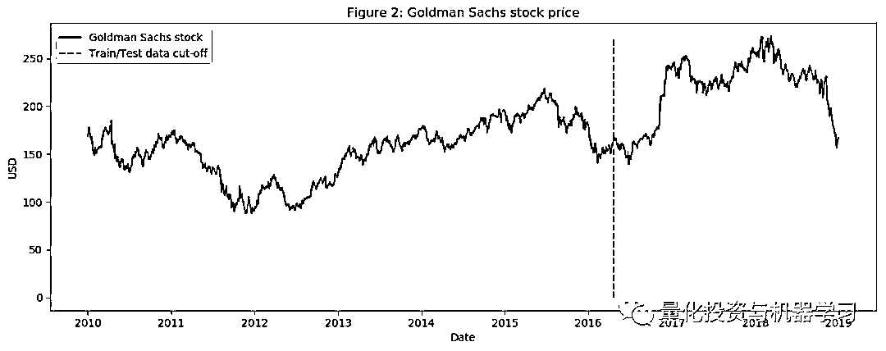

```py
num_training_days = int(dataset_ex_df.shape[0]*.7)
print('Number of training days: {}. Number of test days: {}.'.format(num_training_days, \
                                                                    dataset_ex_df.shape[0]-num_training_days))
Number of training days: 1585. Number of test days: 680.
```

**2.1 相关资产**

如前所述，我们将使用其他资产作为特性，而不仅仅是 GS。

那么，还有哪些资产会影响高盛的股价走势呢？对公司、业务线、竞争环境、依赖关系、供应商和客户类型等的良好理解对于选择正确的相关资产集非常重要：

1、首先是类**似于 GS 的公司**。我们将把摩根大通和摩根士丹利等公司加入数据集。

2、作为一家投资银行，高盛依赖于**全球经济**。糟糕或不稳定的经济意味着没有并购或 IPO，可能限制自营交易收入。这就是我们将纳入全球经济指数的原因。此外，我们还将包括 LIBOR（以美元和英镑计价）利率，因为分析师设定这些利率可能会考虑到经济中的冲击。

3、每日波动率指数（**VIX**）。

4、综合指数。例如纳斯达克和纽约证券交易所、FTSE100 指数、Nikkei225 指数、恒生指数和 BSE Sensex 指数。

5、**货币。**全球贸易经常反映在货币的走势上，因此我们将使用一篮子货币(如美元兑日元、英镑兑美元等)作为特征。

**2.2 技术指标**

我们已经讨论了什么是技术指标以及为什么使用它们，现在让我们直接跳到代码。我们将只为 GS 创建技术指标。

```py
def get_technical_indicators(dataset):
    # Create 7 and 21 days Moving Average
    dataset['ma7'] = dataset['price'].rolling(window=7).mean()
    dataset['ma21'] = dataset['price'].rolling(window=21).mean()

    # Create MACD
    dataset['26ema'] = pd.ewma(dataset['price'], span=26)
    dataset['12ema'] = pd.ewma(dataset['price'], span=12)
    dataset['MACD'] = (dataset['12ema']-dataset['26ema'])

    # Create Bollinger Bands
    dataset['20sd'] = pd.stats.moments.rolling_std(dataset['price'],20)
    dataset['upper_band'] = dataset['ma21'] + (dataset['20sd']*2)
    dataset['lower_band'] = dataset['ma21'] - (dataset['20sd']*2)

    # Create Exponential moving average
    dataset['ema'] = dataset['price'].ewm(com=0.5).mean()

    # Create Momentum
    dataset['momentum'] = dataset['price']-1

    return dataset
```

所以我们有每个交易日的技术指标（包括 MACD、布林带等）。我们总共有 12 个技术指标。

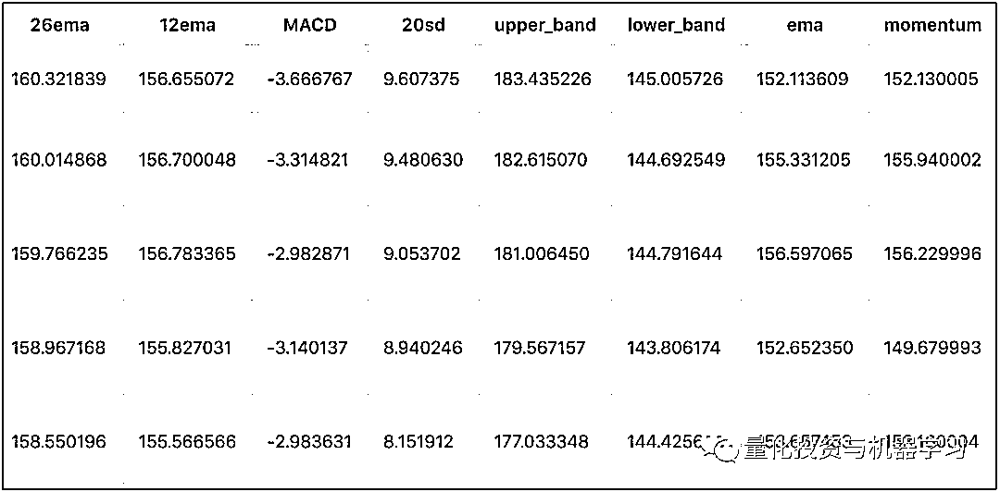

部分指标

让我们来看看这些指标的最后 400 天的走势：

```py
def plot_technical_indicators(dataset, last_days):
    plt.figure(figsize=(16, 10), dpi=100)
    shape_0 = dataset.shape[0]
    xmacd_ = shape_0-last_days

    dataset = dataset.iloc[-last_days:, :]
    x_ = range(3, dataset.shape[0])
    x_ =list(dataset.index)

    # Plot first subplot
    plt.subplot(2, 1, 1)
    plt.plot(dataset['ma7'],label='MA 7', color='g',linestyle='--')
    plt.plot(dataset['price'],label='Closing Price', color='b')
    plt.plot(dataset['ma21'],label='MA 21', color='r',linestyle='--')
    plt.plot(dataset['upper_band'],label='Upper Band', color='c')
    plt.plot(dataset['lower_band'],label='Lower Band', color='c')
    plt.fill_between(x_, dataset['lower_band'], dataset['upper_band'], alpha=0.35)
    plt.title('Technical indicators for Goldman Sachs - last {} days.'.format(last_days))
    plt.ylabel('USD')
    plt.legend()

    # Plot second subplot
    plt.subplot(2, 1, 2)
    plt.title('MACD')
    plt.plot(dataset['MACD'],label='MACD', linestyle='-.')
    plt.hlines(15, xmacd_, shape_0, colors='g', linestyles='--')
    plt.hlines(-15, xmacd_, shape_0, colors='g', linestyles='--')
    plt.plot(dataset['log_momentum'],label='Momentum', color='b',linestyle='-')

    plt.legend()
    plt.show()

plot_technical_indicators(dataset_TI_df, 400)
```

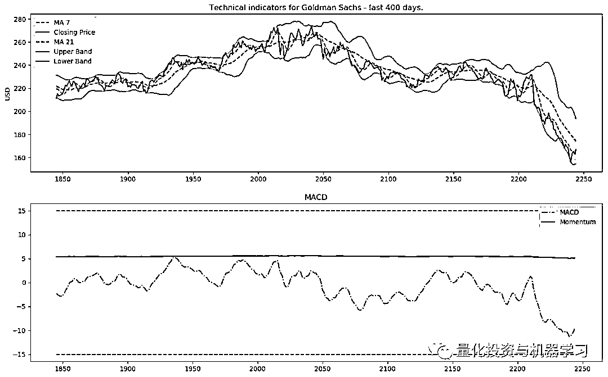

**2.3 基本面分析**

对于基本面分析，我们将对所有关于 GS 的每日新闻进行情绪分析。最后使用 sigmoid，结果将在 0 到 1 之间。得分越接近 0，负面消息就越多（接近 1 表示正面情绪）。对于每一天，我们将创建平均每日分数（作为 0 到 1 之间的数字），并将其添加为一个特征。

**2.3.1 BERT**

为了将新闻分类为积极的或消极的（或中性的），我们将使用 BERT，这是一种预先训练的语言表示。

```py
import bert
```

*已经在 MXNet/Gluon 中提供了训练有素的 BERT 模型。我们只需要实例化它们并添加两个（任意数字）Denselayers，到 softmax—分数从 0 到 1。*

**2.4 用于趋势分析的傅里叶变换**

傅里叶变换取一个函数并创建一系列正弦波（具有不同的振幅和帧）。当这些正弦波合在一起时，就近似于原始函数。从数学上讲，变换是这样的：

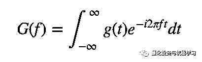

我们将使用傅里叶变换来提取 GS 股票的整体和局部趋势，并对其进行降噪。我们来看看它是如何工作的。

```py
data_FT = dataset_ex_df[['Date', 'GS']]
close_fft = np.fft.fft(np.asarray(data_FT['GS'].tolist()))
fft_df = pd.DataFrame({'fft':close_fft})
fft_df['absolute'] = fft_df['fft'].apply(lambda x: np.abs(x))
fft_df['angle'] = fft_df['fft'].apply(lambda x: np.angle(x))
plt.figure(figsize=(14, 7), dpi=100)
fft_list = np.asarray(fft_df['fft'].tolist())
for num_ in [3, 6, 9, 100]:
    fft_list_m10= np.copy(fft_list); fft_list_m10[num_:-num_]=0
    plt.plot(np.fft.ifft(fft_list_m10), label='Fourier transform with {} components'.format(num_))
plt.plot(data_FT['GS'],  label='Real')
plt.xlabel('Days')
plt.ylabel('USD')
plt.title('Figure 3: Goldman Sachs (close) stock prices & Fourier transforms')
plt.legend()
plt.show()
```


如图 3 所示，我们使用的傅里叶变换的分量越多，逼近函数就越接近真实股价（100 个分量的变换几乎与原始函数相同——红色和紫色的线几乎重合）。我们使用傅里叶变换的目的是提取长期和短期的趋势，所以我们将使用含有 3、6 和 9 个分量的变换。可以推断，包含 3 个组件的转换是长期趋势。

```py
from collections import deque
items = deque(np.asarray(fft_df['absolute'].tolist()))
items.rotate(int(np.floor(len(fft_df)/2)))
plt.figure(figsize=(10, 7), dpi=80)
plt.stem(items)
plt.title('Figure 4: Components of Fourier transforms')
plt.show()
```

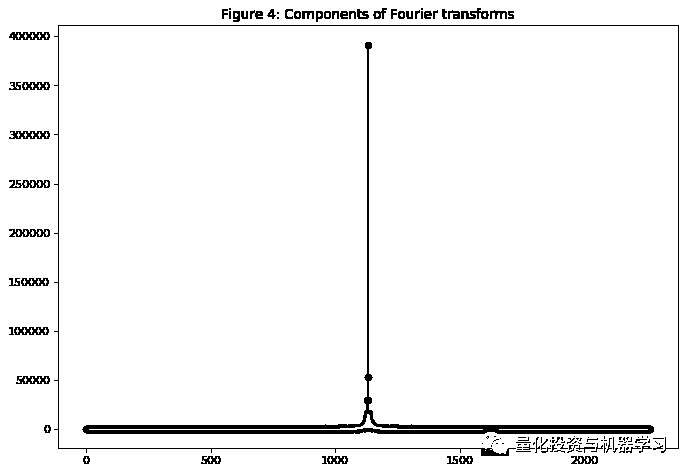

用于降噪数据的另一种技术是调用小波。小波和傅里叶变换给出了相似的结果所以我们只使用傅里叶变换。

**2.5 ARIMA 作为一个特征**

ARIMA 是一种预测时间序列数据的方法。我们将展示如何使用它，虽然 ARIMA 不能作为我们的最终预测，但我们将使用它作为一种技术来稍微降低库存的噪声，并（可能）提取一些新的模式或特性。

```py
from statsmodels.tsa.arima_model import ARIMA
from pandas import DataFrame
from pandas import datetime

series = data_FT['GS']
model = ARIMA(series, order=(5, 1, 0))
model_fit = model.fit(disp=0)
print(model_fit.summary())
```

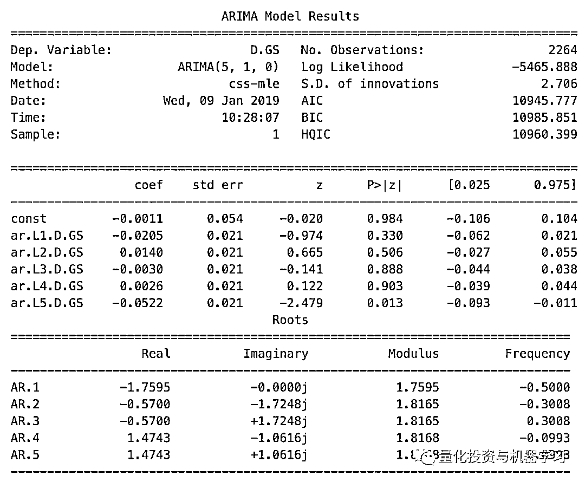

```py
from pandas.tools.plotting import autocorrelation_plot
autocorrelation_plot(series)
plt.figure(figsize=(10, 7), dpi=80)
plt.show()
```


```py
plt.figure(figsize=(12, 6), dpi=100)
plt.plot(test, label='Real')
plt.plot(predictions, color='red', label='Predicted')
plt.xlabel('Days')
plt.ylabel('USD')
plt.title('Figure 5: ARIMA model on GS stock')
plt.legend()
plt.show()
```

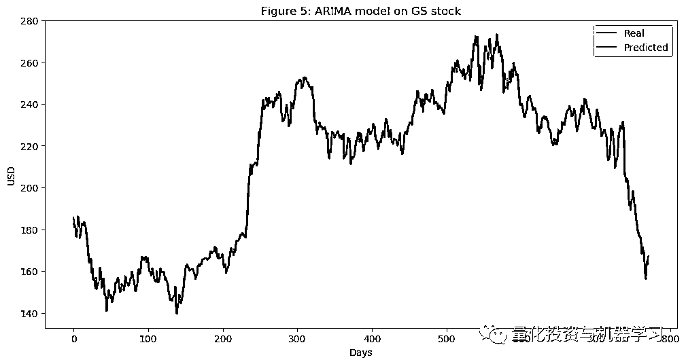

从图 5 中可以看出，ARIMA 给出了一个非常接近实际股价的结果。我们将通过 ARIMA 使用预测价格作为 LSTM 的输入特征，因为正如我们前面提到的，我们希望尽可能多地捕获关于高盛的特性和模式。我们测试 MSE（均方误差）为 10.151，这本身并不是一个坏结果（考虑到我们有很多测试数据），但是我们仍然只将其作为 LSTM 中的一个特征。

**2.6 统计检查**

对于我们的模型来说，确保数据具有良好的质量是非常重要的。为了确保我们的数据是合适的，我们将执行几个简单的检查，以确保我们实现和观察到的结果是真实的，而不是因为底层数据分布存在基本错误而受到损害。

**2.6.1 异方差，多重共线性，序列相关**

1、条件异方差发生在误差项（通过回归得到的预测值与实际值之间的差）依赖于数据时例如，误差项随着数据点（沿 x 轴）的增长而增长。

2、多重共线性是指错误项（也称为残差）相互依赖。

3、序列相关性是指一个数据（特征）是另一个特征的公式（或完全不相关）。

**2.7 特征工程**

```py
print('Total dataset has {} samples, and {} features.'.format(dataset_total_df.shape[0],                                                          dataset_total_df.shape[1]))
output >>> Total dataset has 2265 samples, and 112 features.
```

因此，在添加了所有类型的数据（相关资产、技术指标、基础分析、傅立叶和 ARIMA）之后，我们在这 2,265 天中总共有 112 个特征（如前所述，训练数据只有 1,585 天）。

我们还将从自动编码器中生成更多的特征。

**2.7.1 XGBoost 的特性重要性**

有这么多的特点，我们必须考虑是否所有这些都是真正的指示方向，GS 股票将采取。例如，我们在数据集中包含了以美元计价的 LIBOR 利率，因为我们认为 LIBOR 的变化可能表明经济的变化，而经济的变化又可能表明 GS 的股票行为的变化。但我们需要测试。测试特性重要性的方法有很多，但是我们将使用 XGBoost，因为它在分类和回归问题中都给出了最好的结果之一。

由于特性数据集非常大，因此在这里我们仅使用技术指标进行演示。在实际的特征重要性测试中，所有选择的特征都被证明是比较重要的，所以我们在训练 GAN 时不会排除任何东西。

```py
def get_feature_importance_data(data_income):
    data = data_income.copy()
    y = data['price']
    X = data.iloc[:, 1:]

    train_samples = int(X.shape[0] * 0.65)

    X_train = X.iloc[:train_samples]
    X_test = X.iloc[train_samples:]

    y_train = y.iloc[:train_samples]
    y_test = y.iloc[train_samples:]

    return (X_train, y_train), (X_test, y_test)
# Get training and test data
(X_train_FI, y_train_FI), (X_test_FI, y_test_FI) = get_feature_importance_data(dataset_TI_df)
regressor = xgb.XGBRegressor(gamma=0.0,n_estimators=150,base_score=0.7,colsample_bytree=1,learning_rate=0.05)
xgbModel = regressor.fit(X_train_FI,y_train_FI, \
                         eval_set = [(X_train_FI, y_train_FI), (X_test_FI, y_test_FI)], \
                         verbose=False)
eval_result = regressor.evals_result()
training_rounds = range(len(eval_result['validation_0']['rmse']))
```

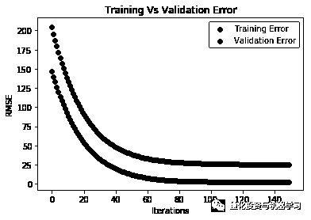

```py
fig = plt.figure(figsize=(8,8))
plt.xticks(rotation='vertical')
plt.bar([i for i in range(len(xgbModel.feature_importances_))], xgbModel.feature_importances_.tolist(), tick_label=X_test_FI.columns)
plt.title('Figure 6: Feature importance of the technical indicators.')
plt.show()
```

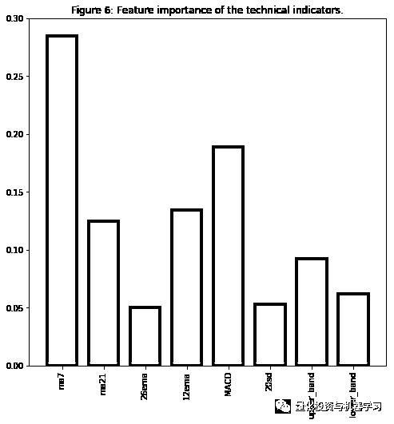

毫不奇怪（对于那些有股票交易经验的人来说），MA7、MACD 和 BB 都是重要的特征。

我使用相同的逻辑在整个数据集中执行特征重要性——只是训练花费的时间更长，结果也更难以阅读，相比之下，只有少量的特征。

**2.8 使用**栈式自动编码器**提取高级特性**

在继续讨论自动编码器之前，我们将探索另一种激活函数。

**2.8.1 激活函数- GELU（高斯误差）**

GELU -高斯误差线性单元是近年来提出的一种新的激活函数。在这篇论文中，作者展示了几个使用 GELU 的神经网络优于使用 ReLU 作为激活的神经网络的实例。GELU 也被用于 BERT，我们用于新闻情绪分析的 NLP 方法。

论文地址：https://arxiv.org/pdf/1606.08415.pdf

我们将使用 GELU 作为自动编码器。

> 注：下面的单元格展示了 GELU 数学背后的逻辑。它不是作为激活函数的实际实现。我必须在 MXNet 中实现 GELU。如果您按照代码将 act_type='relu'更改为 act_type='gelu'，那么它将不起作用，除非您更改 MXNet 的实现。对整个项目发出 pull 请求，以访问 GELU 的 MXNet 实现。

让我们来看看 GELU、ReLU 和 LeakyReLU（最后一个主要用于 GANs，我们也使用它）。

```py
def gelu(x):
    return 0.5 * x * (1 + math.tanh(math.sqrt(2 / math.pi) * (x + 0.044715 * math.pow(x, 3))))
def relu(x):
    return max(x, 0)
def lrelu(x):
    return max(0.01*x, x)
plt.figure(figsize=(15, 5))
plt.subplots_adjust(left=None, bottom=None, right=None, top=None, wspace=.5, hspace=None)
ranges_ = (-10, 3, .25)
plt.subplot(1, 2, 1)
plt.plot([i for i in np.arange(*ranges_)], [relu(i) for i in np.arange(*ranges_)], label='ReLU', marker='.')
plt.plot([i for i in np.arange(*ranges_)], [gelu(i) for i in np.arange(*ranges_)], label='GELU')
plt.hlines(0, -10, 3, colors='gray', linestyles='--', label='0')
plt.title('Figure 7: GELU as an activation function for autoencoders')
plt.ylabel('f(x) for GELU and ReLU')
plt.xlabel('x')
plt.legend()
plt.subplot(1, 2, 2)
plt.plot([i for i in np.arange(*ranges_)], [lrelu(i) for i in np.arange(*ranges_)], label='Leaky ReLU')
plt.hlines(0, -10, 3, colors='gray', linestyles='--', label='0')
plt.ylabel('f(x) for Leaky ReLU')
plt.xlabel('x')
plt.title('Figure 8: LeakyReLU')
plt.legend()
plt.show()
```

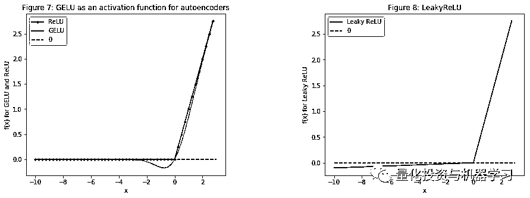

> 注意：在未来研究中，我将尝试使用 U-Net ，并尝试利用卷积层，提取并创建更多关于股票基本移动模式的特征。现在，我们将只使用一个简单的自动编码器只由密集的层。

好了，回到自动编码器，如下图所示（图像只是示意图，它不代表真实的层数、单元数等）。

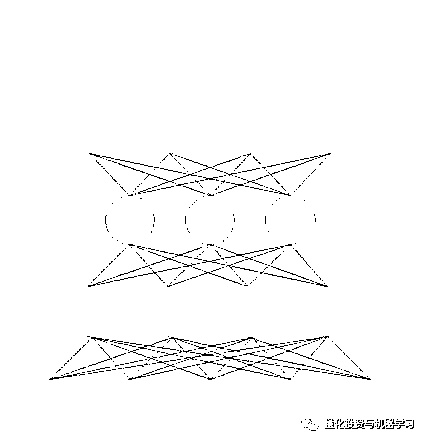

由于代码超长，我们只给出一段代码：

```py
model_ctx =  mx.cpu()
class VAE(gluon.HybridBlock):
    def __init__(self, n_hidden=400, n_latent=2, n_layers=1, n_output=784, \
                 batch_size=100, act_type='relu', **kwargs):
        self.soft_zero = 1e-10
        self.n_latent = n_latent
        self.batch_size = batch_size
        self.output = None
        self.mu = None
        super(VAE, self).__init__(**kwargs)

        with self.name_scope():
            self.encoder = nn.HybridSequential(prefix='encoder')

            for i in range(n_layers):
                self.encoder.add(nn.Dense(n_hidden, activation=act_type))
            self.encoder.add(nn.Dense(n_latent*2, activation=None))

            self.decoder = nn.HybridSequential(prefix='decoder')
            for i in range(n_layers):
                self.decoder.add(nn.Dense(n_hidden, activation=act_type))
            self.decoder.add(nn.Dense(n_output, activation='sigmoid'))

    def hybrid_forward(self, F, x):
        h = self.encoder(x)
        #print(h)
        mu_lv = F.split(h, axis=1, num_outputs=2)
        mu = mu_lv[0]
        lv = mu_lv[1]
        self.mu = mu

        eps = F.random_normal(loc=0, scale=1, shape=(self.batch_size, self.n_latent), ctx=model_ctx)
        z = mu + F.exp(0.5*lv)*eps
        y = self.decoder(z)
        self.output = y

        KL = 0.5*F.sum(1+lv-mu*mu-F.exp(lv),axis=1)
        logloss = F.sum(x*F.log(y+self.soft_zero)+ (1-x)*F.log(1-y+self.soft_zero), axis=1)
        loss = -logloss-KL

        return loss
```

> 注意：在以后的版本中探讨的一件事是删除解码器中的最后一层。通常，在自动编码器中，编码器的数量==解码器的数量。但是，我们希望提取更高级别的特征（而不是创建相同的输入），这样我们就可以跳过解码器中的最后一层。在训练过程中，我们使用相同数量的层来创建编码器和解码器，但是当我们创建输出时，我们使用唯一层旁边的层，因为它将包含更高级别的特征。

**生成对抗网络（GAN）**

GAN 的概念大家可以百度一下，这里不再论述。

**3.1** **为什么使用 GAN 预测股市**

生成对抗网络（GAN）最近主要用于创建现实图像、绘画和视频剪辑。在我们的例子中，并没有很多 GANs 用于预测时间序列数据。然而，主要思想应该是一样的——我们希望预测未来的股市走势。在未来，GS 股票的模式和行为应该或多或少是相同的（除非它开始以一种完全不同的方式运作，或者经济发生剧烈变化）。因此，我们希望为未来“生成”与我们已有的历史交易数据分布类似（当然不是完全相同）的数据。因此，理论上，这应该行得通。

在我们的例子中，我们将使用 LSTM 作为时间序列生成器，CNN 作为鉴别器。

**3.2 Metropolis-Hastings GAN 和 Wasserstein GAN**

注意：接下来的几个部分假设您有一些使用 GANs 的经验。

#### **I. **Metropolis-Hastings GAN****

最近，Uber 的工程团队对传统的甘系统进行了改进，并将其命名为**Metropolis-Hastings GAN** （MHGAN）。Uber 的方法背后的想有点类似于谷歌和加州大学伯克利分校创建的另一种方法，称为甄别器拒绝抽样（Discriminator Rejection Sampling, DRS）。基本上，当我们训练 GAN 时，我们使用鉴别器（D）的唯一目的是更好地训练生成器（G）。通常，在训练完 GAN 后，我们不再使用 D。然而，MHGAN 和 DRS 试图使用 D 来选择 G 生成的接近真实数据分布的样本（稍微不同的是，MHGAN 使用 Markov Chain Monte Carlo (MCMC)进行抽样）。 

MHGAN 从 G 中提取 K 个样本（从图中 G - z0 到 zK 的独立噪声输入创建）。然后按顺序贯穿 K 输出（x′0 x′K）和后一个验收规则决定是否接受当前样本或保持最后接受。最后保留的输出被认为是 G 的实际输出。

注：MHGAN 最初由 Uber 在 Pytorch 中实现。我们只是把它转到了 MXNet/Gluon 上。

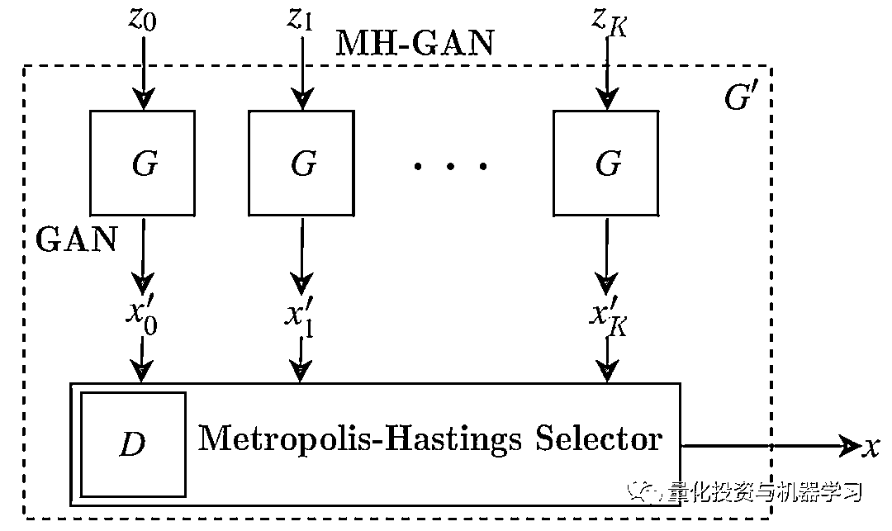

#### **II. Wasserstein GAN**

训练**GANs**是相当困难的。模型可能永远不会收敛，很容易崩溃。我们将使用 Wasserstein GAN - WGAN 进行。

正如我们所知，GANs 背后的主要目标是让生成器开始将随机噪声转换成我们想要模拟的某些给定数据。因此，在 GAN 中，比较两个分布之间的相似性的是非常必要的。最广泛使用的两种指标是：

*   KL divergence (Kullback–Leibler) — DKL(p‖q)=∫xp(x)logp(x)q(x)dx. DKL is zero when p(x) is equal to q(x)。

*   JS Divergence (Jensen–Shannon)。JS Divergence 以 0 和 1 为界，与 KL divergence 不同，它是对称的，更平滑。当损失从 KL 转移到 JS 散度时，GAN 训练取得了显著的成功。

WGAN 使用 Wasserstein distance，W(pr,pg)=1Ksup‖f‖L≤K𝔼x∼pr[f(x)]−𝔼x∼pg[f(x)] （supsup 代表上确界），作为损失函数。与 KL 和 JS 的差异相比，Wasserstein 给出了一个平滑的度量。这使得它更适合在梯度下降过程中创建一个稳定的学习过程。

而且，与 KL 和 JS 相比，Wasserstein 距离几乎在任何地方都是可微的。正如我们所知，在反向传播期间，我们对损失函数进行微分，以创建梯度，从而更新权重。因此，有一个可微损失函数是非常重要的。

毫无疑问，这是本文本中最难的部分。

**3.4 一层 RNN**

**3.4.1 LSTM 或 GRU**

如前所述，生成器是 LSTM 网络，是一种递归神经网络（RNN）。RNN 用于时间序列数据，因为它们跟踪所有以前的数据点，并可以捕获随时间发展的模式。因仓储物的性质、RNNs 很多时间受到消失的梯度，也就是权重变化期间接受的培训变得如此之小，他们不改变，使网络无法收敛到最小损失（有时也可以观察到相反的问题——当梯度太大了。这叫做梯度爆炸，但是解决这个问题的方法很简单——如果梯度开始超过某个常数，即梯度渐变）。有两种方法可以解决这个问题——门控循环单元（GRU）和长短期记忆（LSTM）。两者最大的区别是：

1、GRU 有 2 个门（update and reset），LSTM 有 4 个门（update, input, forget, and output）。

2、LSTM 保持内部内存状态，而 GRU 没有。

3、LSTM 在输出门之前应用非线性（sigmoid）， GRU 没有。

在大多数情况下，LSTM 和 GRU 在准确率方面给出了类似的结果，但 GRU 的计算量要小得多，因为 GRU 的可训练参数要少得多。然而，LSTMs 使用得更多。

严格地说，LSTM 单元背后的数学是：

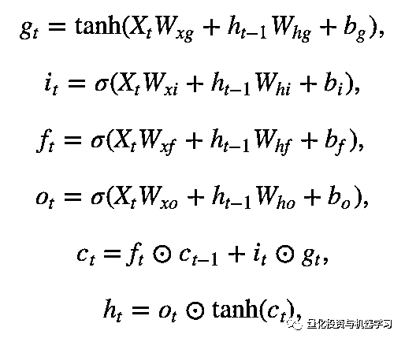

⊙是乘法算子，对所有 x =(x1,x2,…,xk)⊤∈R ^ k 两个激活函数：

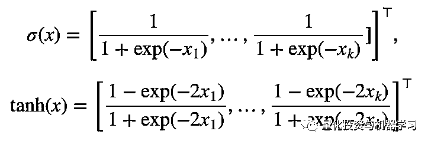

**3.4.2 LSTM**

LSTM 非常简单——一个 LSTM 层有 112 个输入单元（正如我们在数据集中有 112 个特征一样）和 500 个隐藏单元，一个密集层有 1 个输出——每天的价格。初始化器是 Xavier，我们将使用 L1 损耗（L1 正则化的平均绝对误差损耗——见 3.4.5）。有关正则化的更多信息)。

注意：在代码中，你可以看到我们使用 Adam（学习率为 0.01）作为优化器。有一节专门解释我们使用什么超参数（学习速率被排除在外，因为我们有学习速率调度器见第 3.4.3）以及我们如何优化这些超参数见第 3.6。

```py
gan_num_features = dataset_total_df.shape[1]
sequence_length = 17
class RNNModel(gluon.Block):
    def __init__(self, num_embed, num_hidden, num_layers, bidirectional=False, sequence_length=sequence_length, **kwargs):
        super(RNNModel, self).__init__(**kwargs)
        self.num_hidden = num_hidden
        with self.name_scope():
            self.rnn = rnn.LSTM(num_hidden, num_layers, input_size=num_embed, bidirectional=bidirectional, layout='TNC')
            self.decoder = nn.Dense(1, in_units=num_hidden)

    def forward(self, inputs, hidden):
        output, hidden = self.rnn(inputs, hidden)
        decoded = self.decoder(output.reshape((-1,self.num_hidden)))
        return decoded, hidden

    def begin_state(self, *args, **kwargs):
        return self.rnn.begin_state(*args, **kwargs)

lstm_model = RNNModel(num_embed=gan_num_features, num_hidden=500, num_layers=1)
lstm_model.collect_params().initialize(mx.init.Xavier(), ctx=mx.cpu())
trainer = gluon.Trainer(lstm_model.collect_params(), 'adam', {'learning_rate': .01})
loss = gluon.loss.L1Loss()
```

我们将在 LSTM 层使用 500 个神经元，并使用 Xavier 初始化。对于正则化，我们用 L1。让我们看看 MXNet 打印的 LSTM 里面是什么。

```py
print(lstm_model)
output >>>
RNNModel(
   (rnn): LSTM(112 -> 500, TNC)
   (decoder): Dense(500 -> 1, linear)
)
```

我们可以看到，LSTM 的输入是 112 个特征 dataset_total_df.shape[1]，这些特性随后进入 LSTM 层的 500 个神经元，然后转换为单个输出—股票价格值。

LSTM 背后的逻辑是：我们取 17 天的数据（同样，这些数据是 GS 股票每天的股价+当天的所有其他特性——相关资产、情绪等），并尝试预测第 18 天。然后我们用一天移动 17 天窗口，再次预测第 18 天。我们这样迭代整个数据集。

**3.4.3 Learning rate scheduler**

最重要的超参数之一是学习速率。在训练神经网络时，为几乎每个优化器（如 SGD、Adam 或 RMSProp）设置学习率是非常重要的，因为它控制了收敛速度和网络的最终性能。最简单的学习速率策略之一是在整个培训过程中有一个固定的学习速率。选择较小的学习率允许优化器找到好的解决方案，但这是以限制收敛的初始速度为代价的。随着时间的推移改变学习速率可以克服这种权衡。

最近的论文，比如这篇，展示了在培训过程中改变全球学习速度的好处，包括收敛性和时间。让我们画出每个时期的学习速率。

```py
schedule = CyclicalSchedule(TriangularSchedule, min_lr=0.5, max_lr=2, cycle_length=500)
iterations=1500
plt.plot([i+1 for i in range(iterations)],[schedule(i) for i in range(iterations)])
plt.title('Learning rate for each epoch')
plt.xlabel("Epoch")
plt.ylabel("Learning Rate")
plt.show()
```

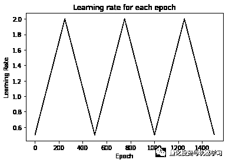

**3.4.4 如何防止过拟合和偏方差权衡**

有很多特征和神经网络，我们需要确保我们避免过拟合，并注意总损失。

我们使用几种技术来防止过拟合（不仅在 LSTM 中，而且在 CNN 和自动编码器中）：

**1、确保数据质量。**我们已经进行了统计检查，确保数据不受多重共线性或序列自相关的影响。进一步，我们对每个特性执行了特性重要性检查。最后，利用一些有关股票市场运作机制的领域知识进行了初始特征选择(例如，选择相关资产、技术指标等)。

**2、正则化**。最常用的两种正则化技术是 LASSO (L1)和 Ridge (L2)。L1 加上平均绝对误差 L2 加上平均平方误差。没有太多的数学细节，基本的区别是：lasso 回归(L1)既做变量选择又做参数收缩，而 Ridge 回归只做参数收缩，并最终包含模型中的所有系数。在相关变量存在的情况下，岭回归可能是首选。此外，岭回归在最小二乘估计方差较大的情况下效果最好。因此，这取决于我们的模型目标。这两种规范化的影响是完全不同的。虽然它们都对较大的权值不利，但 L1 正则化会导致在零点处出现不可微函数。L2 正则化倾向于权值较小，但 L1 正则化倾向于权值趋于 0。L1 正则化可以得到一个稀疏模型，一个参数更少的模型。在这两种情况下，L1 和 L2 正则化模型的参数都“收缩”，但是在 L1 正则化的情况下，收缩直接影响模型的复杂性(参数的数量)。准确地说，岭回归在最小二乘估计方差较大的情况下最有效。L1 对异常值更加健壮，在数据稀疏的情况下使用 L1，并且具有重要的特性。我们用 L1。

3、Dropout. Dropout layers randomly remove nodes in the hidden layers

4、Dense-sparse-dense training

5、Early stopping

在构建复杂神经网络时，另一个重要的考虑因素是偏方差权衡。基本上，我们得到的错误当训练网是一个函数的偏差，方差和不可约错误-σ（由于噪声和随机误差）。最简单的权衡是：

**Error=bias²+variance+σ**

**Bias**。偏差衡量的是一个训练过的（在训练数据集上）算法在不可见数据上的泛化程度。高偏差（欠拟合）意味着模型不能很好地处理不可见数据。

**Variance**。方差度量模型对数据集中的更改的敏感性。高方差是过拟合。

**3.5 鉴别器-一维 CNN**

**3.5.1 为什么 CNN 是鉴别器?**

我们通常使用 CNNs 进行与图像相关的工作（分类、上下文提取等）。它们在从特征中提取特征方面非常强大。例如，在狗的图像中，第一个卷积层将检测边缘，第二个将开始检测圆圈，第三个将检测鼻子。在我们的例子中，数据点形成小趋势，小趋势形成大趋势，趋势反过来形成模式。CNNs 检测特征的能力可用于提取有关 GS 股价走势模式的信息。

使用 CNN 的另一个原因是，CNNs 可以很好地处理空间数据——这意味着彼此距离较近的数据点之间的关系比分布在各处的数据点之间的关系更密切。这对于时间序列数据应该是正确的。在我们的例子中，每个数据点（对于每个特征）都是连续的。人们很自然地认为，两天的时间越近，它们之间的关系就越密切。有一件事需要考虑，那就是季节性以及它可能如何改变 CNN 的工作。

注：在本文其他部分，使用 CNN 作为时间序列数据是实验性的。我们将检查结果，不提供数学或其他证明。使用不同的数据、激活函数等可能会导致不同的结果。

**3.5.2 CNN**

```py
num_fc = 512

# ... other parts of the GAN

cnn_net = gluon.nn.Sequential()
with net.name_scope():

    # Add the 1D Convolutional layers
    cnn_net.add(gluon.nn.Conv1D(32, kernel_size=5, strides=2))
    cnn_net.add(nn.LeakyReLU(0.01))
    cnn_net.add(gluon.nn.Conv1D(64, kernel_size=5, strides=2))
    cnn_net.add(nn.LeakyReLU(0.01))
    cnn_net.add(nn.BatchNorm())
    cnn_net.add(gluon.nn.Conv1D(128, kernel_size=5, strides=2))
    cnn_net.add(nn.LeakyReLU(0.01))
    cnn_net.add(nn.BatchNorm())

    # Add the two Fully Connected layers
    cnn_net.add(nn.Dense(220, use_bias=False), nn.BatchNorm(), nn.LeakyReLU(0.01))
    cnn_net.add(nn.Dense(220, use_bias=False), nn.Activation(activation='relu'))
    cnn_net.add(nn.Dense(1))

# ... other parts of the GAN
```

展示由 MXNet 打印的 CNN。

```py
Sequential(
  (0): Conv1D(None -> 32, kernel_size=(5,), stride=(2,))
  (1): LeakyReLU(0.01)
  (2): Conv1D(None -> 64, kernel_size=(5,), stride=(2,))
  (3): LeakyReLU(0.01)
  (4): BatchNorm(axis=1, eps=1e-05, momentum=0.9, fix_gamma=False, use_global_stats=False, in_channels=None)
  (5): Conv1D(None -> 128, kernel_size=(5,), stride=(2,))
  (6): LeakyReLU(0.01)
  (7): BatchNorm(axis=1, eps=1e-05, momentum=0.9, fix_gamma=False, use_global_stats=False, in_channels=None)
  (8): Dense(None -> 220, linear)
  (9): BatchNorm(axis=1, eps=1e-05, momentum=0.9, fix_gamma=False, use_global_stats=False, in_channels=None)
  (10): LeakyReLU(0.01)
  (11): Dense(None -> 220, linear)
  (12): Activation(relu)
  (13): Dense(None -> 1, linear)
)
```

**3.6 超参数**

我们将跟踪和优化的超参数是：

*   batch_size : batch size of the LSTM and CNN

*   cnn_lr: the learningrate of the CNN

*   strides: the number of strides in the CNN

*   lrelu_alpha: the alpha for the LeakyReLU in the GAN

*   batchnorm_momentum: momentum for the batch normalisation in the CNN

*   padding: the padding in the CNN

*   kernel_size':1: kernel size in the CNN

*   dropout: dropout in the LSTM

*   filters: the initial number of filters

**超参数优化**

GAN 训练 200 期后，它将记录（LSTM 的误差函数,GG）并将其作为奖励价值传递给强化学习，将决定是否改变 hyperparameters 与同一组 hyperparameters 保持训练。正如后面所描述的，这种方法严格用于 RL 的试验。 

如果 RL 决定更新超参数，它将调用贝叶斯优化库（下文将讨论），该库将给出下一个最佳预期超参数集。

**4.1 超参数优化的强化学习**

为什么我们在超参数优化中使用强化学习？股票市场一直在变化。即使我们成功地训练了 GAN 和 LSTM 来创建非常准确的结果，结果也可能只在一定时期内有效。也就是说，我们需要不断优化整个过程。为了优化流程，我们可以：

1、添加或删除功能（例如添加可能相关的新股票或货币）

2、完善我们的深度学习模式。改进模型最重要的方法之一是使用 hyper 参数（在第 5 节中列出），一旦找到了一组特定的超参数，我们需要决定何时更改它们以及何时使用已知的集(探索 vs.利用)。此外，股票市场代表了一个依赖于数百万参数的连续空间。

注：本文整体强化学习部分的目的更偏向于研究。我们将探索使用 GAN 作为环境的不同 RL 方法。在不使用 RL 的情况下，有许多方法可以成功地对深度学习模型执行超参数优化。

注：接下来的几个部分假设您对 RL 有一定的了解，特别是策略方法和 Q-learning。

**4.1.1 强化学习理论**

在不解释 RL 的基础知识的情况下，我们将跳到这里实现具体方法的细节。我们将使用无模型的 RL 算法，原因很明显，我们不了解整个环境，因此没有定义了环境如何工作的模型——如果有的话，我们不需要预测股价走势——他们只会遵循模型。我们将使用无模型 RL-策略优化和 Q-learning 这两个部分。

**Q-learning**

在 Q-learning 中，我们从给定的状态学习采取行动的价值。q 值是采取行动后的预期收益。我们将使用 Rainbow，它是 7 个 Q-learning 算法的组合。

**策略优化**

在策略优化中，我们学习从给定状态采取的操作。

构建 RL 算法的一个关键方面是准确设置奖励。它必须捕获环境的所有方面以及代理与环境的交互。我们将奖励 R 定义为：

**Reward=2∗lossG+lossD+accuracyG**

**4.2 贝叶斯优化**

我们将使用贝叶斯优化，而不是网格搜索，这将花费大量的时间来寻找超参数的最佳组合。我们将要使用的库已经实现了。

**4.2.1 准备高斯过程**

```py
# Initialize the optimizer
from bayes_opt import BayesianOptimization
from bayes_opt import UtilityFunction

utility = UtilityFunction(kind="ucb", kappa=2.5, xi=0.0)
```

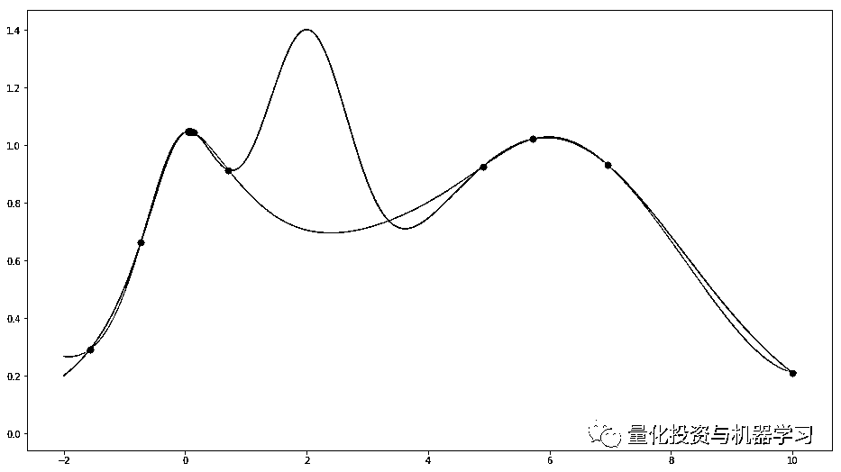

**结果**

最后，我们将比较在流程的不同阶段之后将不可见的（测试）数据用作输入时 LSTM 的输出。 

在第一阶段之后绘图：

```py
from utils import plot_prediction
plot_prediction('Predicted and Real price - after first epoch.')
```


2\. after 50 epochs


```py
plot_prediction('Predicted and Real price - after first 200 epochs.')
```

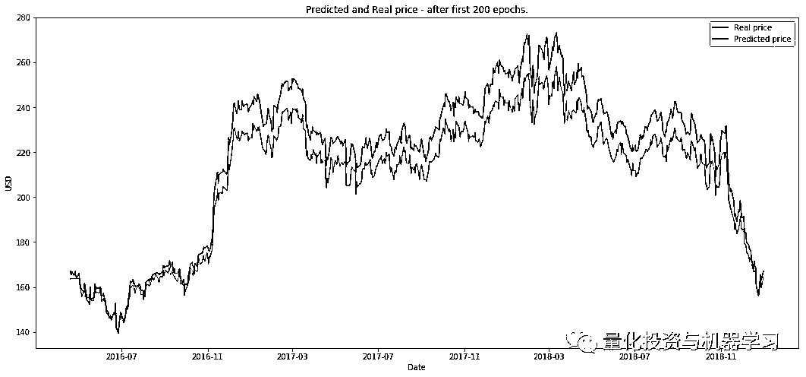

RL 运行 10episodes（我们将 eposide 定义为 200 个 epochs 上的一个完整 GAN 训练）。

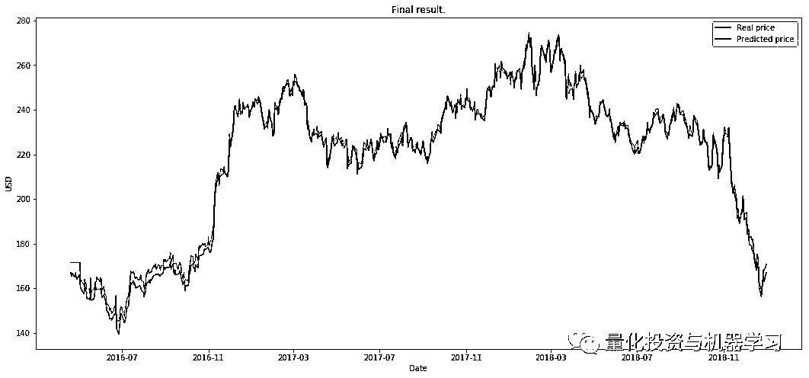

下一步，我将尝试将所有内容分开，并提供一些关于什么是有效的以及为什么有效的分析。为什么我们会得到这些结果呢？

接下来，我将尝试创建一个 RL 环境来测试决定何时以及如何进行交易的交易算法。GAN 的输出将是环境中的一个参数。

还有很多很多的细节需要探索，选择数据特征，选择算法，调优算法等等。

文章来源：https://medium.com/@borisborev/aifortrading-2edd6fac689d

**推荐阅读**

[01、经过多年交易之后你应该学到的东西（深度分享）](https://mp.weixin.qq.com/s?__biz=MzAxNTc0Mjg0Mg==&mid=2653289074&idx=1&sn=e859d363eef9249236244466a1af41b6&chksm=802e3867b759b1717f77e07a51ee5671e8115130c66562577280ba1243cba08218add04f1f00&token=449379994&lang=zh_CN&scene=21#wechat_redirect)

[02、监督学习标签在股市中的应用（代码+书籍）](https://mp.weixin.qq.com/s?__biz=MzAxNTc0Mjg0Mg==&mid=2653289050&idx=1&sn=60043a5c95b877dd329a5fd150ddacc4&chksm=802e384fb759b1598e500087374772059aa21b31ae104b3dca04331cf4b63a233c5e04c1945a&token=449379994&lang=zh_CN&scene=21#wechat_redirect)

[03、全球投行顶尖机器学习团队全面分析](https://mp.weixin.qq.com/s?__biz=MzAxNTc0Mjg0Mg==&mid=2653289018&idx=1&sn=8c411f676c2c0d92b0dd218f041bee4b&chksm=802e382fb759b139ffebf633ac14cdd0f21938e4613fe632d5d9231dab3d2aca95a11628378a&token=449379994&lang=zh_CN&scene=21#wechat_redirect)

[04、使用 Tensorflow 预测股票市场变动](https://mp.weixin.qq.com/s?__biz=MzAxNTc0Mjg0Mg==&mid=2653289014&idx=1&sn=3762d405e332c599a21b48a7dc4df587&chksm=802e3823b759b135928d55044c2729aea9690f86752b680eb973d1a376dc53cfa18287d0060b&token=449379994&lang=zh_CN&scene=21#wechat_redirect)

[05、使用 LSTM 预测股票市场基于 Tensorflow](https://mp.weixin.qq.com/s?__biz=MzAxNTc0Mjg0Mg==&mid=2653289238&idx=1&sn=3144f5792f84455dd53c27a78e8a316c&chksm=802e3903b759b015da88acde4fcbc8547ab3e6acbb5a0897404bbefe1d8a414265d5d5766ee4&token=2020206794&lang=zh_CN&scene=21#wechat_redirect)

[06、美丽的回测——教你定量计算过拟合概率](https://mp.weixin.qq.com/s?__biz=MzAxNTc0Mjg0Mg==&mid=2653289314&idx=1&sn=87c5a12b23a875966db7be50d11f09cd&chksm=802e3977b759b061675d1988168c1fec06c602e8583fbcc9b76f87008e0c10b702acc85467a0&token=1972390229&lang=zh_CN&scene=21#wechat_redirect)

[07、利用动态深度学习预测金融时间序列基于 Python](https://mp.weixin.qq.com/s?__biz=MzAxNTc0Mjg0Mg==&mid=2653289347&idx=1&sn=bf5d7899bc4a854d4ba9046fdc6fe0d6&chksm=802e3996b759b080287213840987bb0a0c02e4e1d4d7aae23f10a225a92ef6dd922d8006123d&token=290397496&lang=zh_CN&scene=21#wechat_redirect)

[08、Facebook 开源神器 Prophet 预测时间序列基于 Python](https://mp.weixin.qq.com/s?__biz=MzAxNTc0Mjg0Mg==&mid=2653289394&idx=1&sn=24a836136d730aa268605628e683d629&chksm=802e39a7b759b0b1dcf7aaa560699130a907716b71fc9c45ff0e5d236c5ae8ef80ebdb09dbb6&token=290397496&lang=zh_CN&scene=21#wechat_redirect)

[09、Facebook 开源神器 Prophet 预测股市行情基于 Python](https://mp.weixin.qq.com/s?__biz=MzAxNTc0Mjg0Mg==&mid=2653289437&idx=1&sn=f0dca7da8e69e7ba736992cb3d034ce7&chksm=802e39c8b759b0de5bce401c580623d0729ecca69d13926479d36e19aff8c9c9e8a20265afff&token=290397496&lang=zh_CN&scene=21#wechat_redirect)

[10、2018 第三季度最受欢迎的券商金工研报前 50（附下载）](https://mp.weixin.qq.com/s?__biz=MzAxNTc0Mjg0Mg==&mid=2653289358&idx=1&sn=db6e8ab85b08f6e67790ec0e401e586e&chksm=802e399bb759b08d6eec855f9901ea856d0da68c7425cba62791b8948da6ad761a3d88543dad&token=290397496&lang=zh_CN&scene=21#wechat_redirect)

[11、实战交易策略的精髓（公众号深度呈现）](https://mp.weixin.qq.com/s?__biz=MzAxNTc0Mjg0Mg==&mid=2653289447&idx=1&sn=f2948715bf82569a6556d518e56c1f9e&chksm=802e39f2b759b0e4502d1aaac562b87789573b55c76b3c85897d8c9d88dbf9a0b7ee34d86a4e&token=290397496&lang=zh_CN&scene=21#wechat_redirect)

[12、Markowitz 有效边界和投资组合优化基于 Python](https://mp.weixin.qq.com/s?__biz=MzAxNTc0Mjg0Mg==&mid=2653289478&idx=1&sn=f8e01a641be021993d8ef2d84e94a299&chksm=802e3e13b759b7055cf27a280c672371008a5564c97c658eee89ce8481396a28d254836ff9af&token=290397496&lang=zh_CN&scene=21#wechat_redirect)

[13、使用 LSTM 模型预测股价基于 Keras](https://mp.weixin.qq.com/s?__biz=MzAxNTc0Mjg0Mg==&mid=2653289495&idx=1&sn=c4eeaa2e9f9c10995be9ea0c56d29ba7&chksm=802e3e02b759b7148227675c23c403fb9a543b733e3d27fa237b53840e030bf387a473d83e3c&token=1260956004&lang=zh_CN&scene=21#wechat_redirect)

[14、量化金融导论 1：资产收益的程式化介绍基于 Python](https://mp.weixin.qq.com/s?__biz=MzAxNTc0Mjg0Mg==&mid=2653289507&idx=1&sn=f0ca71aa07531bbbdbd33213f0bab89f&chksm=802e3e36b759b720138b3b17a4dd0e198e054b9de29a038fdd50805f824effa55831111ad026&token=1936245282&lang=zh_CN&scene=21#wechat_redirect)

[15、预测股市崩盘基于统计机器学习与神经网络（Python+文档）](https://mp.weixin.qq.com/s?__biz=MzAxNTc0Mjg0Mg==&mid=2653289533&idx=1&sn=4ef964834e84a9995111bb057b0fc5dd&chksm=802e3e28b759b73e0618eb1262c53aa0601fbf5805525a7c7ff40dc3db62c7704496611bdbf1&token=1950551577&lang=zh_CN&scene=21#wechat_redirect)

[16、实现最优投资组合有效前沿基于 Python（附代码）](https://mp.weixin.qq.com/s?__biz=MzAxNTc0Mjg0Mg==&mid=2653289609&idx=1&sn=c7f0b3e47025862d10bb53b6ab88bcda&chksm=802e3e9cb759b78abf6b8b049c59bf18ccfb2ead7580d1f557d36de2292f59dcbd94dcd41910&token=2085008037&lang=zh_CN&scene=21#wechat_redirect)

[17、精心为大家整理了一些超级棒的机器学习资料（附链接）](https://mp.weixin.qq.com/s?__biz=MzAxNTc0Mjg0Mg==&mid=2653289615&idx=1&sn=1cdc89afb997d0c580bf0cef296d946c&chksm=802e3e9ab759b78ce9f0cd152a680d4a413d6c8dcb02a7a296f4091993a7e4137e7520394575&token=2085008037&lang=zh_CN&scene=21#wechat_redirect)

[18、海量 Wind 数据，与全网用户零距离邂逅！](https://mp.weixin.qq.com/s?__biz=MzAxNTc0Mjg0Mg==&mid=2653289623&idx=1&sn=28a3600fd7a72d7be00b066ca0f98244&chksm=802e3e82b759b7943f43a4f6ef4a91e4153fa6b8210de9590235fa8ee66eb9811ce177054dbc&token=1389401983&lang=zh_CN&scene=21#wechat_redirect)

[19、机器学习、深度学习、量化金融、Python 等最新书籍汇总下载](https://mp.weixin.qq.com/s?__biz=MzAxNTc0Mjg0Mg==&mid=2653289640&idx=1&sn=34e94fcbe99052b8e7381ecc48a36dc0&chksm=802e3ebdb759b7ab897cd329a680715b6f8294e63550ddf0c57b9e1320b2b7d1408c6fdca0c7&token=1389401983&lang=zh_CN&scene=21#wechat_redirect)

[20、各大卖方 2019 年 A 股策略报告，都是有故事的人！](https://mp.weixin.qq.com/s?__biz=MzAxNTc0Mjg0Mg==&mid=2653289725&idx=1&sn=4b65cd1fb8331438e4c0b3d0eae6b51f&chksm=802e3ee8b759b7fe1b94e84d54cc23b0ab05853d5cd227812574b350e9fc2cce9e5f1bc6cb7a&token=1389401983&lang=zh_CN&scene=21#wechat_redirect)

**下载本期源代码**

在**后台**输入

**20190111**

**后台获取方式介绍**


