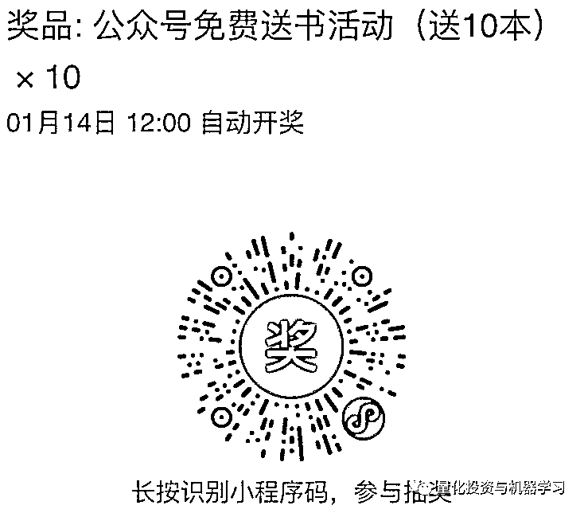

# 【Python 进阶，一学就会】系列 1（文末免费送 10 本书）

> 原文：[`mp.weixin.qq.com/s?__biz=MzAxNTc0Mjg0Mg==&mid=2653290050&idx=1&sn=d653f9ccb9ecdbb7e514651be97b6b59&chksm=802e3c57b759b541ae4fbc5582224829971301d724daee1549ca799ee3a1929fdb956cd8d88a&scene=27#wechat_redirect`](http://mp.weixin.qq.com/s?__biz=MzAxNTc0Mjg0Mg==&mid=2653290050&idx=1&sn=d653f9ccb9ecdbb7e514651be97b6b59&chksm=802e3c57b759b541ae4fbc5582224829971301d724daee1549ca799ee3a1929fdb956cd8d88a&scene=27#wechat_redirect)


请**标星公众号**，第一时间获取最新资讯

本期作者：Ravindra Parmar

本期编辑：Dotton | 公众号翻译部成员

****↓**↓**年度巨献**↓↓**


**↑↑****点我****↑**↑****

**送书活动在文末**

本系列，我们将会对 Python 的一些高级用法进行介绍。

**列表推导式**

列表推导式（list comprehension）为 for 循环提供了一个简短且更好的选择。它用于我们需要对列表中的每一个元素执行操作的迭代过程中。 

**语法：**


**示例：**

```py
# Python program to segregate positive and negative numbers in an array.

def segregate(arr):
  return [x for x in arr if x%2 == 0] + [x for x in arr if x%2 != 0]

if __name__ == '__main__':
  arr = [1, 8, 5, 3, 2, 6, 7, 10]
  arr = segregate(arr)
  print (arr)
  # prints [8, 2, 6, 10, 1, 5, 3, 7]
```

我们将连接从列表推导式中返回的两个列表，第一个是对列表中的每个元素应用偶数检查，第二个则是执行奇数检查。

**切片**

切片（slicing）是用来提取连续列（子序列）所给定的序列中的元素。默认情况下步长是 1，从而生成一个连续序列。然而，我们能够为步长赋值去获取非连续序列的元素。 

**语法：**


****示例：****

```py
# Python program to rotate an array by 'd' elements.

def rotate(arr, d):
  return arr[d:] + arr[:d]

if __name__ == '__main__':
  arr = [1, 2, 3, 4, 5, 6, 7, 8]
  arr = rotate(arr, 3)
  print (arr)
  # prints [3 ,4, 5, 6, 7, 8, 1, 2]
```

我们将再次连接两个切片操作的结果。首先，我们将从索引”d”到结尾的列表进行切片，再从开始到索引”d”进行切片操作。

```py
# Python program to reverse an array.

def reverse(arr):
  return arr[::-1]

if __name__ == '__main__':
  arr = [1, 2, 3, 4, 5, 6, 7, 8]
  arr = reverse(arr)
  print (arr)
  # prints [8 ,7, 6, 5, 4, 3, 2, 1]
```

另一个例子则是 step_size 的用法。步长为 1 意味着从头到尾进行切片。

**Lambda**

Lambda()是一个匿名函数，只能保存单行表达式。它可以说是函数的简写，并且可以用在需要表达式的任何地方 

**语法：**


****示例：****

```py
import math

square_root = lambda x: math.sqrt(x)
# is an equivalant lambda expression for below function
def square_root(x): 
  return math.sqrt(x)
```

**Map**

Map()用于在一系列元素中，需要运用函数如 Lambda()函数的场景，并且你几乎随时可以根据需要替换为带列表推导式的映射。 

**语法：**


**示例：**

```py
# Square the numbers in the list.
import math

if __name__ == '__main__':
  arr = [1, 2, 3, 4, 5]
  arr = list(map(lambda x : x**2, arr))
  print (arr)
  # prints [1, 4, 9, 16, 25]
```

MAP()函数用以将序列中每个元素进行平方， 当 MAP()返回一个 iterable 类型对象，我们需要用所需要的类型封装结果（列出以上所有结果）

**Filter**

Filter()函数将一个函数如 Lambda()函数应用于一个函数列，并当该函数如 Lambda()函数的返回值为 ture 时则返回其中的元素序列。

**语法：**


**示例：**

```py
# Print all even numbers in an array.

if __name__ == '__main__':
  arr = [1, 2, 3, 4, 5, 6]
  arr = list(filter(lambda x : x%2 == 0, arr))
  print (arr)
  # print [2, 4, 6]
```

在这里。我们用 filter()函数返回序列中的偶数。

**迭代协议**

迭代协议和迭代是贯穿 Python 编程的一个重要概念。简单来说，一次迭代是用迭代协议来进行迭代的过程。理解迭代协议最简单的方法是查看它如何与内置类型一起工作，下面我们以一个文件为例子，这个命名为 script.py 的文件内容如下：

```py
import os
print (os.name)
print (os.getcwd())
```

我们有很多读取阅读 Python 中的文件的方法，有些方法与其他方法相比更具有效。其中一种方法是使用 readline。

**示例：**

```py
file_obj = open('script.py')

file_obj.readline()
# 'import os'             # first line.
file_obj.readline()
# 'print (os.name)'       # next line.
file_obj.readline()
# 'print (os.getcwd())'   # next line.
file_obj.readline()
# ''                      # empty string at the end of file.
```

另一种更可取、更准确的方法是使用 for 循环:

```py
# Reading file using 'for loop' based on iteration protocol.

for line in open('script.py')
  print ('line')
```

这仅仅是一行用来阅读整个文件的代码。但它是如何工作的呢？如何知道如此繁琐的循环能一行一行的读懂整个文件呢？

那么，我们可以运用迭代协议。总结如下：

> 任何用 _next_ 方法来进行到下一个结果，和一系列结果结束时引发停止循环异常的事件称为迭代，任何此类对象也可以使用单步执行 for 循环或其他迭代工具。

在上面的例子中，文件对象本身就是一个迭代（当它实现时），而 for 循环是一个迭代工具。下面是我们在 Python 中称为迭代协议的大部分接口（下述大部分很重要）

**示例：**

```py
file_obj = open('script.py')

file_obj.__next__() 
# 'import os'
file_obj.__next__()
# 'print (os.name)'
file_obj.__next__()
# 'print (os.getcwd())'
file_obj.__next__()
# Traceback (most recent call last):
#  File "<stdin>", line 1, in <module>
# StopIteration
```

这就是循环或者任何迭代工具从头到尾调用 _next_ 方法会用到的示例。除了 for 循环，python 里还有其他迭代工具，例如列表推导式、映射、压缩等。

进展不错，但是迭代协议还有一个步骤，就是获取底层对象的迭代器。这一步不仅是让文件对象成为它是自己的迭代器，对于就像列表中的其他对象，我们需要完成检索迭代器的这一额外步骤。

**示例：**

```py
L = [1,2,3]

I = iter(L)
print (I.__next__())
# '1'
print (I.__next__())
# '2'
print (I.__next__())
# '3'
print (I.__next__())
# Traceback (most recent call last):                                                                                                                                                  
# StopIteration 
view raw
```

**生成器**

生成器是创建迭代器的一种简单方法。严格来说，生成器是我们返回要返回的对象（迭代器）可以迭代（一次迭代一个值）的函数。如果我们用 Python 写相同形式的函数，那将会是这样的： 

```py
# Iterator for next power of two.
class NextPowTwo:
    def __init__(self, max_ele = 0):
        self.max_ele = max_ele

    def __iter__(self):
        self.n = 0
        return self

    def __next__(self):
        if self.n <= self.max_ele:
            result = 2 ** self.n
            self.n += 1
            return result
        else:
            raise StopIteration

if __name__ == '__main__':
    it = iter(NextPowTwo(20))
    print (next(it))     # prints '1'
    print (next(it))     # prints '2'
    print (next(it))     # prints '4'
    print (next(it))     # prints '8'
```

然而，Python 为我们提供了方便。下面是一些类似的生成器的用法。如你所见，上面所提到的所有调用 _iter_()和 _next_()是由生成器自动处理的。

**示例：**

```py
# Generator for next power of two.
def NextPowTwo(max_ele):
    n = 0
    while n < max_ele:
        yield 2 * n
        n += 1
    raise StopIteration

obj = NextPowTwo(20)
print (obj.next())
print (obj.next())
print (obj.next())
print (obj.next())
```

生成器以 yield 语句而非 return 语句来创建的。换言之，如果函数至少包含一个 yield 语句，他就变成了一个生成器函数。Yiled 语句和 return 语句都将从函数返回一些值 ，而 return，yield 语句的执行暂停了函数，保存了函数的所有内容的状态，然后从那里继续进行后续调用，

基本的生成器：

*   至少有一个 yield 语句

*   返回一个对象（迭代值），但不立即开始执行

*   记住局部变量和连续变量之间的状态调用

*   补充迭代协议

**生成器表达式**

在 python 中，生成器表达式用于生成器正如 lambda 用于函数。换言之，生成器表达式创建一个匿名生成器函数。他的语法与列表推导式非常相似

**示例：**

```py
# generator function example.

def func():
  n = 1
  while n < 25:
    yield n**n
    n += 1

if __name__ == '__main__':
  it = func()
  print (next(it))
  print (next(it))
  print (next(it))
```

**列表推导式和生成器之间的主要区别是当列表生成式产生完整列表时，生成器表达式一次生成一个项目。他们本质上是一种列表推导式的一部分惰性计数器。**

****Python 中为什么需要生成器****

**1、他们很容易实现，我们可以通过生成器将数十行代码转换为三行生成器代码；**

**2、他们使得存储变得更效率，要返回普通函数下一个 2 的幂将在内存中创建一个完整的序列。在数据量巨大的情况下成本很大，生成器可以更好的存储方式实现他们，因为他们一次只生成一个元素，而不是整个元素序列。**

**3、生成器可以用于表示 inbnite 数据流，由于 inbnite 数据流不能储存在内存，生成器在这个场景也被证明是有用的。**

****送书活动****

> ****本书全面系统地讲解了 MATLAB 金融算法分析与应用，以及金融数据挖掘中的趋向和发展趋势指标，并结合具体的机器学习算法分析，让读者深入学习和掌握 MATLAB 金融数据机器学习算法。本书注重实战，通过大量的案例，帮助读者更好地理解书中的内容。****

**考虑到前几次大家参与的热度很高，后台留言直接炸了。也考虑到微信公众号后台精选留言有限制。公众号以后一直延续这种方式：**

****直接抽****

****

**看各位手气啦~**

****开奖时间：****2018 年 01 月 14 日 12:00****

****如何赠送：****获奖者将获赠上面书籍**。然后添加公众号官方微信：**zxlgglr**，备注【获奖者】。届时工作人员会和您取得联系，沟通具体邮寄地址。**

****