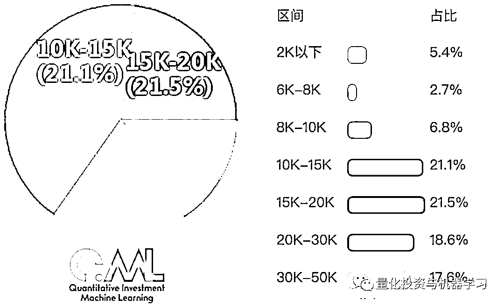
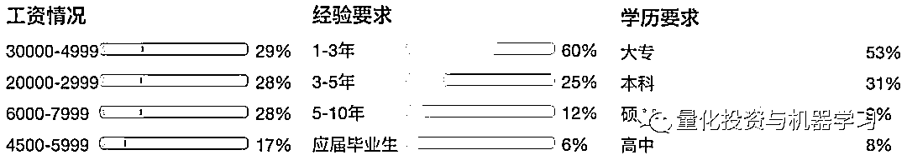
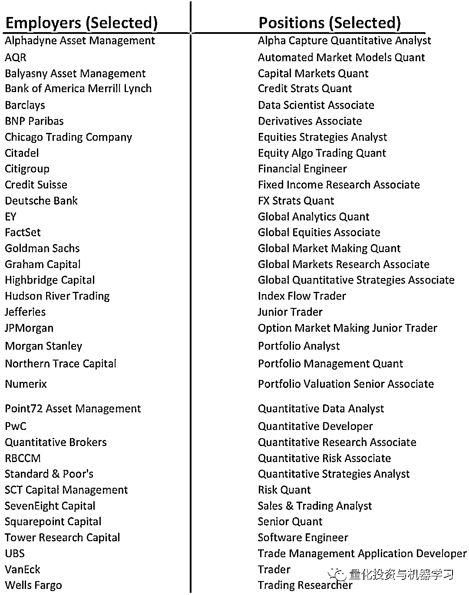
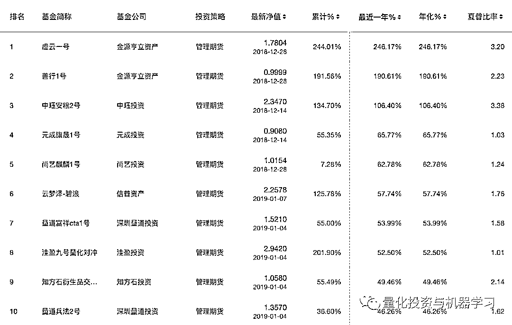
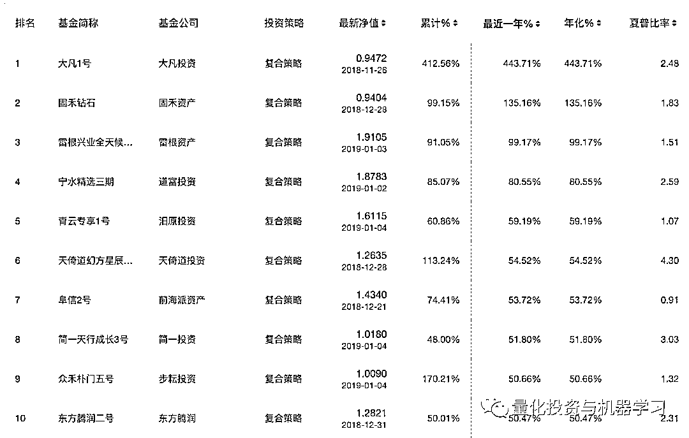

# 【重磅发布】2018 中国量化投资年度盘点

> 原文：[`mp.weixin.qq.com/s?__biz=MzAxNTc0Mjg0Mg==&mid=2653290036&idx=1&sn=79dd3529dd9300b0a5d3d6fee4607904&chksm=802e3c21b759b537eda936128dd5e13a22257d623b605b4a52d1c0ccc7f05abfefc93d10e366&scene=27#wechat_redirect`](http://mp.weixin.qq.com/s?__biz=MzAxNTc0Mjg0Mg==&mid=2653290036&idx=1&sn=79dd3529dd9300b0a5d3d6fee4607904&chksm=802e3c21b759b537eda936128dd5e13a22257d623b605b4a52d1c0ccc7f05abfefc93d10e366&scene=27#wechat_redirect)

请**标星公众号**，第一时间获取最新资讯

**量化投资与机器学习出品**

迟来的一份 2018 量化投资年度报告。

公众号尽量从多个维度去进行编写，同时也参考了各大数据平台，确保数据的准确性。我们希望让国内量化爱好者尽可能多的去了解这个行业的发展现状。公众号创办 3 年来，也一直致力于为国内量化事业贡献一份自己的力量。

公众号从以下几个方面进行了盘点：

*   **量化投资热度盘点**

*   **券商金工盘点**

*   **量化岗位薪资盘点**

*   **量化岗位就业盘点**

*   **私募盘点**

*   **量化平台盘点**

*   **量化大赛盘点**

**感谢大家一直以来的支持与厚爱，公众号努力成为量化领域最优质自媒体！**

**热度盘点**

**360 趋势『量化投资』关注指数**

2018 年

2017 年

对比 2017 年和 2018 年，我们可以看出 2018 年大家对量化投资的关注度明显低于 2017 年，从指数平均数据也可以看出，**2017 年**的**关注指数****平均数是 191**，**2018 年**则为**109**。2018 年的行情大家都懂的，今年市场整体数量化投资确实不是那么好做。2019 年会不会得到改善？从目前来说，有可能在第三第四季度会逐步得到改善吧~

除了 360 趋势，我们再从百度指数看一下：

**百度指数『量化投资』搜索指数**

2018 年全国（PC+移动）

2017 年全国（PC+移动）

**2017 年**量化投资**搜索指数平均值为 613**，**2018 年为 505**。原因上面也说了。大家看到没有，从 y 坐标轴的基数来看，就很能说明问题。

再看看地域分布：

2018 年区域

2018 年省份

2018 年城市

**华东**、**华北**、**华南**前三，说明量化投资还是在沿海城市比较集中。从另一个角度来说，这也**和当地教学有着密切关系**。华东、华北、华南这些区域在量化投资、金融科技的整体教学水平，要比中西部地区更加开放和前沿。从每个院校的专业设置、学科规划、校企合作等方面都能感受到这一点。想必很多读者也深有体会吧，我们就不展开讲啦~

从城市分布也印证了这点：**北京**、**上海**，**深圳**、**广州**意料之中。我们还可以看到靠近上海的江苏、浙江两省也是紧随其后，其中杭州和玉皇山南的基金小镇有着密不可分的关系。成都也是如此，天府国际基金小镇的建立带动了当地金融机构的发展。我们从《清科研究中心》的报告就可以很明显的看到这点：

据不完全统计，截至 2018 年 11 月，**全国已公布的基金小镇合计 80 个，覆盖了全国 21 个省（市/自治区）**，遍布于从东南沿海至西北腹地的广大地区。

根据公开资料查询发现，已披露入驻机构数量的 47 个基金小镇，**合计入驻了超过 3 万家的基金、基金管理机构和相关金融机构**；已披露资金管理规模的 37 个基金小镇，**各类资金管理规模合计约 8.7 万亿人民币。**

图片来源：清科研究中心

其中**浙江省基金小镇**（含类似新金融集聚区） **数量**仍**居全国第一位**，占全国基金小镇数量的四分之一左右

但是，中国基金小镇在地区分布上仍不均衡。首先，**全国基金小镇在数量分布**上呈现**“东多西少，南密北疏”**的局面；此外，中国基金小镇**从东南向西北方向**，基金小镇**运营活跃度整体逐步降低**。

**2012-2018 年中国历年新设基金小镇数量变化趋势**

图片来源：清科研究中心

**2018 年新发布的基金小镇数量较前一年有明显下降**。 首先，受到 2016-2017 年全国范围内新建基金小镇的热潮影响，全国大部分地区已启动了创建基金小镇的工作，造成 2018 年新设基金小镇数量相对减少；其次，**2018 年国内外经济形势和金融政策出现诸多变化，各方在设立基金小镇方面相对谨慎，追求差异化和稳健发展**。

**2018 年中国基金小镇在各省(市/自治区)分布情况**

图片来源：清科研究中心

从 2018 年中国基金小镇在各省（市/自治区）分布来看， 浙江省基金小镇数量仍稳居全国首位，占全国基金小镇总数的 26.3%；**山东省基金小镇数量增长明显**，并**超过广东省居全国第二位；**此外，**云南、安徽、福建等地基金小镇数量增加较多**。

所有啊，各位，以后找量化相关类的工作，就选这些地方！

最后我们看看搜索指数年龄与性别的分布：

年龄分布

性别比例

投资不分年龄老少，七分看本事，三分看造化。但是，我们要**为搞量化的小姐姐们点赞！**

**券商金工盘点**

券商的金工团队和量化走的最紧密啦。根据 Wind 权威统计，2018 年：

国内券商共有**59 家金融工程团队**

共发布**7425 份**研报，其中深度研报 808 份

累计阅读总量达**241265 次**

**研报总量**

2018 全年，**海通证券**、**天风证券**、**兴业证券**的金融工程团队发布的**研报总量位居前三**。

**研报总量 TOP20**

**阅读总量**

2018 全年，广发证券、兴业证券、天风证券金融工程团队的研报阅读总量位居前三。

**研报阅读总量 TOP30**

2018 全年，单篇研报按照阅读量排名第一的是：

**申万宏源金融工程研究团队**

**《申万主动量化之彼得林奇选股模型 A 股实证研究》**

其中，前 200 研报累计数量最多的三家金融工程团队为：**兴业证券**、**广发证券**、**天风证券**。

2018 年精选研报免费下载（1 月-12 月）

[**热点 1**](https://mp.weixin.qq.com/s?__biz=MzAxNTc0Mjg0Mg==&mid=2653288446&idx=1&sn=9c9eff76734dc2a9f1b046eb9184704a&chksm=802e35ebb759bcfdf5843d5b0892c8c2142e15a62454e31846fd979c215ae56ebab2a717cefa&scene=21#wechat_redirect) | [**热点 2**](https://mp.weixin.qq.com/s?__biz=MzAxNTc0Mjg0Mg==&mid=2653288146&idx=1&sn=bd43689e8b566872b93a6026f35480cc&chksm=802e34c7b759bdd1efa8b23b409321c14f3f056ad11375f28ca603a4315237a852f159b0fe55&scene=21#wechat_redirect) | [**热点 3**](https://mp.weixin.qq.com/s?__biz=MzAxNTc0Mjg0Mg==&mid=2653288683&idx=1&sn=e986298df44c954e405f01814c0745a7&chksm=802e3afeb759b3e824b7de6aac11e857fc306ad06f7afe466209923726d3a423aa65f0cf611e&token=1389401983&lang=zh_CN&scene=21#wechat_redirect) | [**热点 4**](https://mp.weixin.qq.com/s?__biz=MzAxNTc0Mjg0Mg==&mid=2653289804&idx=1&sn=6234ec52657b302f9bee3c46a74823e1&chksm=802e3f59b759b64f0e393987a5897f1198b4fba64373e4d8b79f51d63f09aed8eef361f78e88&token=1149638946&lang=zh_CN&scene=21#wechat_redirect)

**量化岗位薪资盘点**

我们以**『量化研究员』**为关键词进行分析**（薪酬只是税前基本工资、不包含每家机构分红、年终奖和有的没的）**：

数据来源：职友集

**平均工资：¥ 19690/月**

取自近 1 年 315 份样本，该数据仅供参考

该数据仅供参考

## **市场招聘条件分析**

*   **招聘待遇：**工资 50000 以上占比最多，达 35%

*   **经验要求：**1-3 年工作经验要求的占比最多，达 45%

*   **学历要求：**本科学历要求的占比最多，达 60%

**平均工资：¥ 16670/月**

取自近 1 年 484 份样本，该数据仅供参考

该数据仅供参考

**市场招聘条件分析**

*   **招聘待遇：**工资 20000-29999 占比最多，达 35%

*   **经验要求：**1-3 年工作经验要求的占比最多，达 54%

*   **学历要求：**本科学历要求的占比最多，达 51%

该数据仅供参考

**平均工资：¥ 15440/月**

取自近 1 年 290 份样本，该数据仅供参考

该数据仅供参考

## 市场招聘条件分析

**招聘待遇：**工资 30000-49999 占比最多，达 29%

**经验要求：**1-3 年工作经验要求的占比最多，达 60%

**学历要求：**大专学历要求的占比最多，达 53%。

该数据仅供参考

**平均工资：¥ 13170/月**

取自近 1 年 94 份样本，该数据仅供参考

该数据仅供参考

该数据仅供参考

由于各大网站数据比较难统一，上文的数据仅供参考。并不代表整个行业。

为了更权威，也顺带做个比较，我们看看海外对待量化研究员岗位的薪酬是如何的？

这里必须要把 PayScale 搬出来。PayScale 最大的不同之处在于其所有的报告都是基于调查的原始数据，而不是由对地域，经济条件等因素进行“估算”所得出的。PayScale 绝不会对不同来源的数据进行混合使用，报告中出现的任何数据都是 PayScale 的工作人员认真收集，过滤，分析得到的。每一份提交到 PayScale 的档案都要经过一道道严格的过滤系统，这套过滤系统包含了 32 重检验条款，在最大限度上保证了档案信息的真实性和可靠性。在检验过程中，所有重复出现的档案都会被过滤掉，那些比较反常的档案也会被单独提取出来，由 PayScale 专家进行验证分析。最终，所有检验合格的档案会被添加到 PayScale 的数据库当中。 PayScale 薪酬调查报告反映了工作地点，教育背景，职称水平，企业性质以及其他因素对个人薪酬的综合影响程度。

**Quantitative Researcher**平均一年：

**$101600**

**Quantitative Analyst Researcr**平均一年：

**$85020**

**Quantitative Analyst**平均一年：

**$83036**

最后看看 Hedge Fund Manager 平均一年：

**$106000**

同时巴鲁克学院（Bernard M.Baruch College，CUNY）2016—2018MFE 就业分析报告显示：金融工程方向的毕业生第一年薪资平均为 11 万美金。金工我们会在后文详细说。

下文我们将详细讨论一些量化岗位问题。

**量化岗位就业盘点**

**一、硕士是门槛**

从上文的一些结论，我们看到统计并不是很准确。不过从公众号这几年对行业的观察来看，**大专学历首先 pass**，如果非要给个标准，那么**硕士是一个进门槛**。公众号在这里**不讨论学历是否决定能力**，大多数机构就是这么要求的，只有进了门，再说其他。

我们在某招聘网站，搜索关键字看到，无论券商、私募、公募岗位要求一栏明确写着：

**二、金工、金数为主**

1、**金融工程**和**金融数学**专业是与量化岗位最匹配的两个专业。国内外的量化机构都对这两个专业毕业的学生比较青睐。

我们通常把**金融工程硕士**（Master of Financial Engineering）简称**MFE**。不同学校对这个专业设置不一样，有的叫 Financial Mathematics、Quantitative/Mathematical Finance 等，这些专业本质上都算是一类。

MFE 主要是用计算机来实现数学模型，从而解决金融相关的问题。所以，MFE 不同于 MBA 和 MSP，它主要是培养金融界的技术工作者，也称作金融工程师——**Quant**。

Quant 的职位主要集中在投资银行、对冲基金、商业银行和金融机构。负责的主要工作根据职位也有很大区别，比较有代表性的包括**Pricing**、**Model Validation**、**Research**、**Develop and Risk Management**，分别负责衍生品定价模型的建立和应用、模型验证、模型研究、程序开发和风险管理。

在美国，比较主流的排名体系有 QuantNet 和 TFE，公众号也拿到了 QuantNet 2019 年的最新 MFE 美国排名，计算权重如下：

**Peer Assessment Score (20%)**

**Placement Success (55%)**

**Student selectivity (25%)**

*   GRE Scores (15%)

*   Undergraduate GPA (7.5%)

*   Acceptance Rate (2.5%)

点击图片查看大图

**2018 年 TFE 金融工程排名**

**MFE 就业前景**

我们也拿到了巴鲁克学院（Bernard M.Baruch College，CUNY）2016—2018MFE 就业分析报告：

下面这张表，左边是毕业生去往的公司，右边是对应的职位。像全球顶尖的量化对冲基金公司 AQR，各大顶尖金融机构 UBS、美林、巴克莱、德意志、JPMorgan、Morgan Stanley 等。

再从这张图我们来看：

从事行业前三的是：**投资银行**、**对冲基金公司**、**资产管理公司**

工作职能前三的是：**Quant**、**交易**、**风险\数据科学**

结论和我们预想的大致一样。在国内也是如此。不过也有一些细微的差别，在国内来说，没有一个全面的统计，也就是在圈子里，大家的一些总结，比如：

**1、买方：公募**

**特点：**朝九晚五，人际关系处理好，当甲方爸爸的感觉真好！

**工作：**做好研究，大多以股票为主，少数投资债券或者货币市场。手握数亿资金，与上市公司董秘、高管运筹帷幄。

**要求：****本科忽略！****最基本是硕士，PhD 也是挤破头，985&211，有些只招清北复交**，很正常。名校海龟也很吃香。其他的要求我们在下文介绍。

**评价：**从业情况，盈利能力、抗风险能力、稳定性等。还有管理基金的业绩综合排名、业绩排名稳定性等。

**未来：**研究员、基金经理助理、基金经理、某部门 MD 等出了本事以外。越想往上就得耗啊！

**2、卖方：券商金融工程团队\研究所**

**特点：**朝九晚不知道，**一年坐的飞机可环绕地球 N 圈，真的很辛苦**。

**工作：****写研报、**写研报、****写研报****（你能想到的各种模型各种方法），**各种路演**（可能一份报告已经倒背如流，买方会根据卖方的表现来派点给卖），****寻创新****（多因子已经写烂啦哈哈~），保持与机构的密切沟通。

**要求：本科确实很难啊！**基本硕士起，有些甚至要求 985，211 都不要。同等水平可能海龟会优先考虑。其他的要求我们在下文介绍。

**评价：**研报热度啊！新财富啊！不知道以后还有不。等~

**未来：**成为首席或者高级研究员，跳槽去买方、私募等。

**3、风云之地：私募**

**特点：**看的是结果，各种投资思路、投资标的都有涉及。

**要求：**有来自券商、基金或者自民间的投资高手。所以学历相对不是特别严格。

**评价：****研究要和收益挂钩**。站在研究的角度，总有人愿意为高屋建瓴的所谓前瞻性和理论买单，私募却行不通。你可以基于你优漂亮的净值曲线去包装，但反着来不行！这样你作为研究员就没有了价值，**最终沦为发产品时宣传三折页上打酱油的角色，熊市或震荡市时裁员降薪的首选。**

**未来：**继续留用 or 成为大佬 or 走人。

**4、金融科技公司**

**特点：**服务产品，写相关研究报告，搞培训等。

**要求：**很典型的例子，现在国内很多量化平台都会招聘有一帮人为平台社区写各种研报复现、论文复现、策略复现等等。再者就是针对某一量化产品做深度开发研究。还有一些专门做量化课程培训。

**评价：**研报热度（主要为平台流量）、产品的功能好坏、培训口碑等。

**未来：**卖方、买方、私募或者自己干都有可能。

还有一个是在银行的量化部门。但主要是前四者居多。

**三、跨专业入行 Quant**

最近几年，很多跨专业的朋友（计算机、生物、物理、通信等专业）也想在量化的领域展示一下自己的抱负。还是劝各位：**量化有风险，入坑需谨慎。**

像计算机、物理等专业有自身的优势，做 Quant 不能一辈子当开发吧。得全面发展。

**矿姐**曾经说过一段话，可以分享给大家：大家可能觉得搞量化的人就是整天和大量数据打交道，用一行行代码写出复杂的模型，然后没完没了地 Run，在回测和优化中挣扎，沉浸在数学和统计海洋里的一群人。实际上，这只是表面现象。虽然每个搞量化的人必须会写代码，也必须具备扎实的数学功底，在开发策略的过程中，的确需要分析大量数据，不断做回测和优化，但是，**这一切的背后是强大的金融思维和对金融市场的深刻理解在支撑的**。换句话说，**如果你没有经济、金融的完整知识体系和工作经验，或者没有正确的、科学的思维方式，无论数学多么地好，也很可能在做无用功**；即便编程多么在行，也只能沦为码农一枚（没有歧视程序员的意思哦）。反过来说，如果你具备科学的思维和逻辑，并发现了经济、金融的某些规律，想做 Quant 就不难了。接下来，你只需花点时间学习编程工具，好好利用数据和代码为你实现自己的想法。

**程序员鄙视链**

来源：知乎

**矿姐**也用亲身经历告诉大家使用 C++、JAVA、C#的程序员鄙视的 Python、R、Matlab 在量化界是非常好用的工具。国内程序员连看都不愿意看一眼的 VBA 用起来也是极其方便的（顺便提一下，千万不要鄙视 Excel，国外很多 Quant 都是用 VBA 做研究，量化领域著名的考试 CQF 也只要求会用 VBA 哦）。作为平时的研究工具，Python、Matlab、VBA 就已经足够了。语言是相通的，有一天惊奇地发现自己也能读懂 JAVA 的代码，完全没有障碍。

当然，今年最火的要属 Python 了，原因大家都知道。但是不能代表其他语言都不用了，一些公募还在用 SAS，包括 R、MATLAB 等照用不误。

除了编程，作为 Quant，最避不开的就是和各种主流数据库和 API 接口打交道；如果因为某些原因而无法使用完善的 API 接口，从数据库里调用数据也是很花功夫的。

对于 Quant 这个词，人们或多或少存在一些误解或偏见。Quant 是 Quantitative 的简写形式，成为了一个名词，专指量化工作者。Quantitative 是形容词，后面跟 Strategist，意为“量化策略师”；跟 Researcher，是“量化研究员”的意思；跟 Trader，是“量化交易员”的意思；还可以跟 Finance，意为“数量金融学”。

多数人把“Quant”理解成和交易相关的量化交易员和策略开发者，这属于狭义的定义。其实，金融领域的量化的涵义是很宽泛的。从前中后台来看，量化可分为前台的量化交易、中台的量化研究和后台的量化风控。量化交易主要指算法交易，也就是交易员利用程序化交易平台，输入交易指令的相关算法，形成交易策略。量化研究除了量化策略的开发，还包括运用量化的方法研究经济、金融相关课题，比如宏观经济建模。就算只是量化策略研究，也分基本面量化和技术面量化。

从某种程度讲，不懂基本面的量化研究员是不合格的。量化风控是指用量化的指标对风险进行识别、监测和控制的过程，如果能够搭建一套成体系的量化风控平台，对交易监控、交易分析、绩效归因等整体环节都能起到积极的作用。

**各位跨专业的朋友，还要入坑嘛？**

**私募盘点**

根据中国证券投资基金业协会最新统计数据：

截至 2018 年 11 月底，协会已登记私**募基金管理人 24418 家**，较上月增加 151 家，增长 0.62%；**已备案私募基金 75220 只**，较上月增长 241 只，增长 0.32%；**管理基金规模 12.79 万亿元**，较上月增长 0.16%。其中，**已登记私募证券投资基金管理人 8966 家**，较上月增加 43 家；**已备案私募证券投资基金 36053 只**，基金规模 2.26 万亿元，较上月减少 151 亿元，减少 0.66%。2018 年以来，已备案的证券投资私募基金管理人数量及备案基金数量总体小幅提升，管理的基金规模呈现下降趋势（此处仅统计证券投资私募基金管理人和基金产品）。

截至 2018 年 11 月底，已登记私募基金管理人数量从注册 地分布来看（按 36 个辖区），集中在上海、深圳、北京、浙江 （除宁波）、广东（除深圳），总计占比达 71.67%。其中，**上海 4798 家**、**深圳 4624 家**、**北京 4356 家**、**浙江（除宁波）2067 家**、**广东（除深圳）1655 家**，数量占 比分别为 19.65%、18.94%、17.84%、8.47%、6.78%。 

截至 2018 年 11 月底，已登记私募基金管理人管理基金规模在 100 亿元及以上的有 233 家，管理基金规模在 50 亿—100 亿元的 277 家，管理基金规模在 20 亿—50 亿元的 672 家，管理基金规模在 10 亿—20 亿元的 796 家，管理基金规模在 5 亿—10 亿元的 1151 家，管理基金规模在 1 亿—5 亿元的 4320 家，管理基金规模在 0.5 亿—1 亿元的 2306 家。截至 2018 年 11 月底， 已登记的私募基金管理人有管理规模的共 21460 家，平均管理基金规模 5.96 亿元。

根据私募排排网介绍，目前国内私募机构是收取是 1.5％-2％的管理费和 20％的业绩提成，其中又以业绩提成为主要盈利来源。而募集和运营成本构成私募的固有成本，据估算，一个小型私募证券基金的年度运营成本不少于 400 万元，一家 5 亿规模的私募，在没有业绩提成的前提下，管理费按照 1%（另有通道和渠道各方的费用）来算，一年可获得的确定性现金流入为 500 万元，**所以 5 亿规模可以看成是私募的生死线，今年以来中小私募面临严重“挤压”。**

**金斧子**

今年跌幅最大的是事件驱动策略，金斧子数据显示，截至 12 月中旬，纳入统计的 108 只事件驱动私募产品，其平均亏损高达 18.47%，所有产品中亏损的占比 92.54%。

金斧子数据显示，截至 12 月中旬，纳入统计的 288 只股票多空产品，其平均亏损达到 11.01%；317 只组合基金的平均亏损为 6.09%，500 只复合策略基金的平均亏损为 6.05%，143 只宏观策略基金的平均亏损为 3.33%。

**今年私募各大策略产品表现**

来源：金斧子

**朝阳永续、兴业证券**

从兴业证券和朝阳永续提供的朝阳私募指数来看，各策略的私募当年平均累计收益率区间处于[-30%，10%]，同期的上证综指今年以来累计收益率为-21.74%。

今年以来，**表现最差的策略为事件驱动**，累计收益率为-27.04%，**其次为股票策略及宏观策略**，累计收益分别为-16.55%和-8.67%。今年以来**表现最好的策略为 CTA 策略**，累计收益 5.43%，**其次为套利策略的 2.67%**。

来源：朝阳永续、兴业证券

**股票策略：**股票多头及多空策略产品收益率分化较大，整体表现不佳。截止 11 月纳入统计的规模高于 50 亿的 34 家管理人，**今年以来仅九章资本获小幅正收益， 其余均亏损**，重阳投资本月取得较高正收益。

**股票多头及多空绩优管理人(总管理规模高于 50 亿)**

来源：朝阳永续，兴业证券

注：此处仅统计该策略下纳入统计产品数量不低于 3 只的管理人，各业绩指标为平均值，选取绩 优管理人主要指标为今年以来收益率。

**股票市场中性策略：**截止 11 月纳入统计的股票市场中性策略管理人共 8 家，业绩分化较大，其中 6 家今年以来获得正收益，且回撤控制较好。**深圳前海进化论资产表现最佳，今年以来获得收益 33.60%，回撤控制极佳仅 1.41%**。

**股票市场中性绩优管理人(总管理规模高于 10 亿)**

来源：朝阳永续，兴业证券

注：此处仅统计该策略下纳入统计产品数量不低于 3 只的管理人，各业绩指标为平均值，选取绩 优管理人主要指标为今年以来收益率。

**债券基金：**截止 11 月纳入统计的债券基金管理人共 20 家，今年以来**收益超过 5%**的分别为宁**聚资产**、**乐瑞资产**、**恒天中岩**、**北京千为投资**和**恒基浦业**。今年以来回撤控制较好的为恒基浦业和恒天中岩，均控制在 0.5%以下。管理规模大于 100 亿的管理人有乐瑞资产、银叶投资、合晟资产和上海茂典资产，仅上海茂典资产今年以来有 1.18%的亏损。

**债券基金绩优管理人(总管理规模高于 10 亿)**

来源：朝阳永续，兴业证券

注：此处仅统计该策略下纳入统计产品数量不低于 3 只的管理人，各业绩指标为平均值，选取绩 优管理人主要指标为今年以来收益率。

**管理期货：**截止 11 月纳入统计的管理期货策略管理人共 12 家，今年以来均取得正收益，**排名前五**的分别为**明汯投资**、**双隆投资**、**呈瑞投资**、**九坤投资**和**千象资产**，这 5 家管理人在 11 月均取得较好的正收益。

**管理期货绩优管理人(总管理规模高于 10 亿)**

来源：朝阳永续，兴业证券

注：此处仅统计该策略下纳入统计产品数量不低于 3 只的管理人，各业绩指标为平均值，选取绩 优管理人主要指标为今年以来收益率。

**宏观策略：**纳入统计的宏观策略管理人共 11 家，其中**熵一资本**、**久期投资**和**乐瑞资产**今年以来获得正收益，熵一资本表现尤为突出，今年以来获得收益 32.25%，最大回撤 5.29%，较好地控制了下行风险。

**宏观策略绩优管理人(总管理规模高于 10 亿)**

来源：朝阳永续，兴业证券

注：此处仅统计该策略下纳入统计产品数量不低于 3 只的管理人，各业绩指标为平均值，选取绩 优管理人主要指标为今年以来收益率。

**事件驱动：**事件驱动策略产品数量不低于 3 只的管理人共 4 家，分别为**北京和聚投资**、**德清瑞智投资**、**福建海西晟乾投资**和**向日葵投资；**相比上个月，上海秋阳予梁投资旗下产品数由 3 只减少至 2 只。这 4 家管理人 11 月均取得正收益; 今年以来业绩分化较大，其中仅北京和聚投资今年以来取得 22.76%的正收益，其余 3 家亏损 15%至 48%。

**私募排排网**

根据私募排排网数据：整个 2018 年，截至 12 月 21 号，**表现最好的策略为管理期货策略**，平均收益率为 3.88%，其次是**固定收益**的 1.76%，而股票策略以-16.50%的表现，排名倒数第二，仅好于事件驱动策略的-19.12%。

来源：私募排排网 

据私募排排网数据中心不完全统计，2018 年 1-11 月份共有 5669 只成立时间满 11 个月且有业绩记录的股票策略对冲基金产品纳入排名统计，平均收益率跌幅较大，录得-13.43%；首尾收益率相差高达 210.94%。846 只股票策略产品实现正回报，比例为 14.92%，其中收益在 10%以上的有 195 只；多达 4823 只产品亏损，占比高达 85.08%。多达 3342 只产品收益在-10%以下，其中 135 只产品收益在-50%以下。

**最新股票策略最近一年前 10 名（2019/1/8 统计数据）**

来源：私募排排网

据私募排排网数据中心统计，2018 年 1-11 月纳入统计排名且成立时间满 11 个月的基金组管理期货策略产品共有 536 只，平均收益录得 8.49%，首尾收益相差 322.74%。正收益方面，多达 381 只产品获得正收益，占总数的 71.08%。从收益区间来看，186 只产品收益率在 10%以上；负收益方面，142 只产品收益在-1%以下，有 57 只收益在-10%以下。

**最新管理期货最近一年前 10 名（2019/1/8 统计数据）**

来源：私募排排网

据私募排排网数据中心不完全统计，今年以来共有 324 只成立时间满 11 个月的相对价值策略对冲基金产品纳入排名统计，平均收益率录得 3.99%，首尾收益相差 122.19%；其中正回报的产品有 201 只，占总数的 62.04%；收益在 10%以上的产品有 88 只，收益在 1%以上的产品有 185 只。负收益方面，97 只产品收益在-1%以下，收益率在-10%以下的产品有 29 只。

**最新****相对价值****最近一年前 10 名（2019/1/8 统计数据）**

来源：私募排排网

据私募排排网数据中心不完全统计，2018 年今年以来总共有 135 只成立时间满 11 个月的事件驱动策略产品纳入排名统计，其平均收益率跌幅有所收窄，录得-17.70%，首尾收益相差高达 135.77%。事件驱动前 11 月仅 5 只产品录得正收益，比例为 3.70%。负收益方面，117 只产品收益在-1%以下，92 只产品收益在-10%以下。

**最新****事件驱动****最近一年前 10 名（2019/1/8 统计数据）**

来源：私募排排网

据私募排排网数据中心不完全统计，2018 年 1-11 月总共有 1023 只成立时间满 11 个月的复合策略对冲基金纳入统计，它们的平均收益率为-3.94%，首尾收益相差达 423.11%。从收益区间来看，107 只产品收益在 10%以上，收益率在 1%以上的有 219 只；负收益方面，多达 598 只产品收益率在-1%以下，收益在-10%以下的产品有 309 只。

**最新复合策略****最近一年前 10 名（2019/1/8 统计数据）**

来源：私募排排网

**监管越来越严格，新规越来越细化**

同时根据**积募**统计的 2018 年私募基金监管新规 TOP25：

1、商业银行委托贷款管理办法

2、证监会首度明确三类股东问题

3、私募投资基金备案须知

4、私募证券投资基金管理人会员信用信息报告工作规则（试行）

5、关于加强私募投资基金等产品账户管理有关事项的通知

6、关于转发《非居民金融账户涉税信息报送规范》的通知

7、关于市场化银行债权转股权实施中有关具体政策问题通知

8、关于开展 2018 年私募基金专项检查工作的通知

9、上市公司创业投资基金股东减持股份的特别规定

10、关于开展创新企业境内发行股票或存托凭证试点若干意见的通知

11、关于规范金融企业对地方政府和国有企业投融资行为有关问题的通知

12、私募投资基金非上市股权投资估值指引（试行）

13、中国证券投资基金业协会会费收缴办法

14、关于推进住房租赁资产证券化相关工作的通知

15、关于规范金融机构资产管理业务的指导意见

16、关于进一步加强证券公司场外期权业务监管的通知

17、关于创业投资企业和天使投资个人有关税收政策的通知

18、关于进一步明确规范金融机构资产管理业务指导意见有关事项的通知

19、关于创业投资企业和天使投资个人税收政策有关问题的公告

20、商业银行理财业务监督管理办法

21、关于推动创新创业高质量发展打造“双创”升级版的意见

22、证券期货经营机构私募资产管理业务管理办法、证券期货经营机构私募资产管理计划运作管理规定

23、私募投资基金命名指引

24、商业银行理财子公司管理办法

25、私募基金管理人登记须知

用**积募**的话总结：资管新规落地，私募基金行业监管政策趋严，很多私募基金出现“募资难”的问题，同时募基金税收预期不稳定，部分地区出现税负追溯现象，也不利于私募基金募投积极性。

中基协会长洪磊曾谈到：**当一个国家的经济规模上了一定的台阶，完成了初步工业化，一定是以基金为代表的资产管理登上历史舞台，这个过程一定很曲折，会付出很多的代价，但是这个大趋势，一定是不可阻挡的，一定是一往无前的。认识到困难和问题总是存在的，遇到的困难和问题都是前进中的困难和问题！**

**量化平台盘点**

之前公众号写过一篇破万的文章[：京东量化平台宣告下线，其他平台该何去何从？](https://mp.weixin.qq.com/s?__biz=MzAxNTc0Mjg0Mg==&mid=2653289787&idx=1&sn=ba9c0b62af511c708db58696f62ac0fb&chksm=802e3f2eb759b638aea077ae127e447333da71f112fc15284f1632a3e5e822f33a1a61e6f09b&token=1149638946&lang=zh_CN&scene=21#wechat_redirect)

截止目前，公众号统计到国内的量化平台，有 30+之多：

我们把所有平台分为五大类：

*   第一大类别为互联网思维

*   第二大类别为数据业务延伸

*   第三大类别为 IT 技术派

*   第四大类别为互联网巨头跨界

*   第五大类传统老牌

在这里不再展开分析。

**量化大赛盘点**

公众号统计了 2018 年大部分国内有关量化的比赛（顺序随机）：

⊙ 天风证券开启第二届私募大赛 

⊙ 首届“智胜杯”策略交易大赛

⊙ 首届平安慧投量化大赛

⊙ 陕西省大学生第二届量化金融大赛

⊙ 第三届华量杯量化投资大赛

⊙ “量子杯”全国高校量化大赛

⊙ 第一届 UBS 全球量化大赛

⊙ 第二届智慧中国杯（ICC）凤凰金融量化投资大赛

⊙ “华鑫杯”京东量化大赛

⊙ 全国高校量化投资策略设计大赛

⊙ 首届 FQI 量化大师赛

⊙ 第二届中国西部量化金融大赛

⊙ “给你三个亿”全球量化大赛

⊙ WorldQuant2018 国际量化建模大赛

⊙ 中国 ( 横琴 ) 国际高校量化金融大赛

⊙ MindGo 量化交易大赛

⊙ CCTV 期货实盘大赛

⊙ 第十二届全国期货实盘交易大赛

⊙ 2018 年“信•服”私募实盘大赛

⊙ 长安之星杯第一届期货实盘大赛

⊙ 东方杯期货实盘大赛

⊙ “迈科杯”——期货实盘交易大赛

⊙ 东海期货模拟交易大赛

**希望 2019 年比 2018 年好过点**

- End -

**在量化投资的道路上，你不是一个人在战斗!**

**你不是一个人在奋斗**

