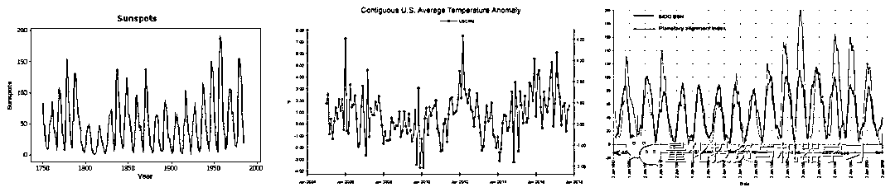
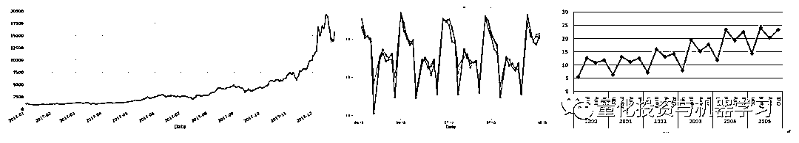
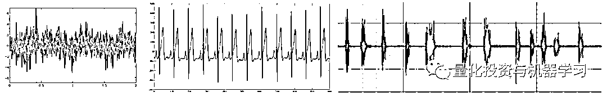
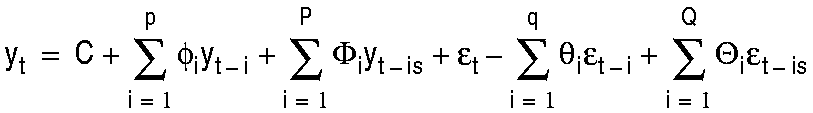
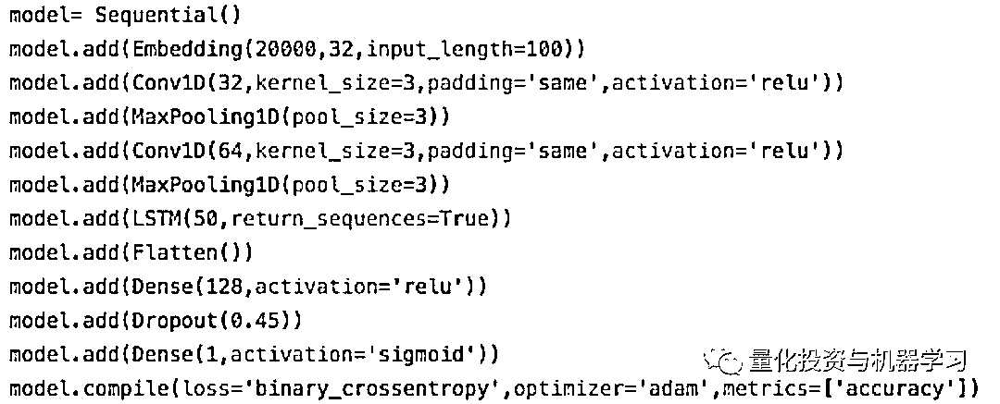
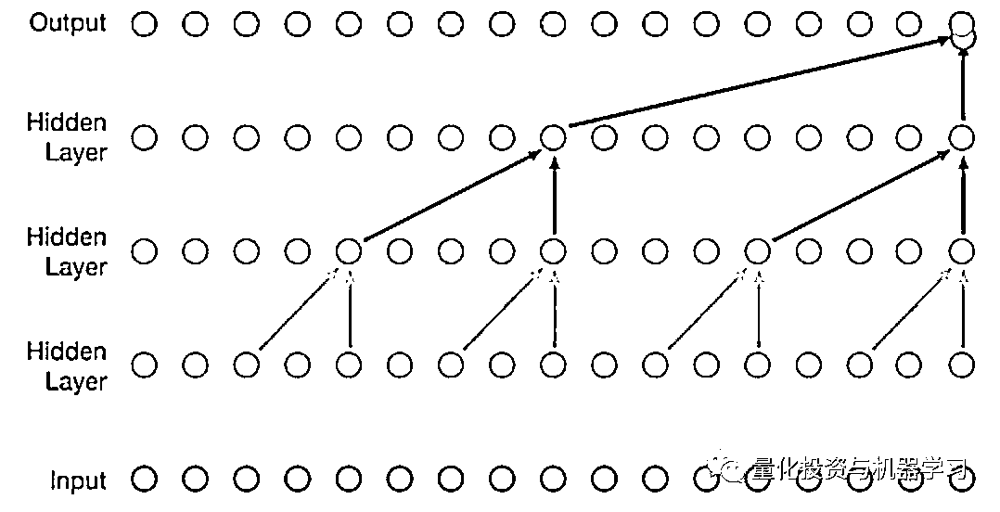
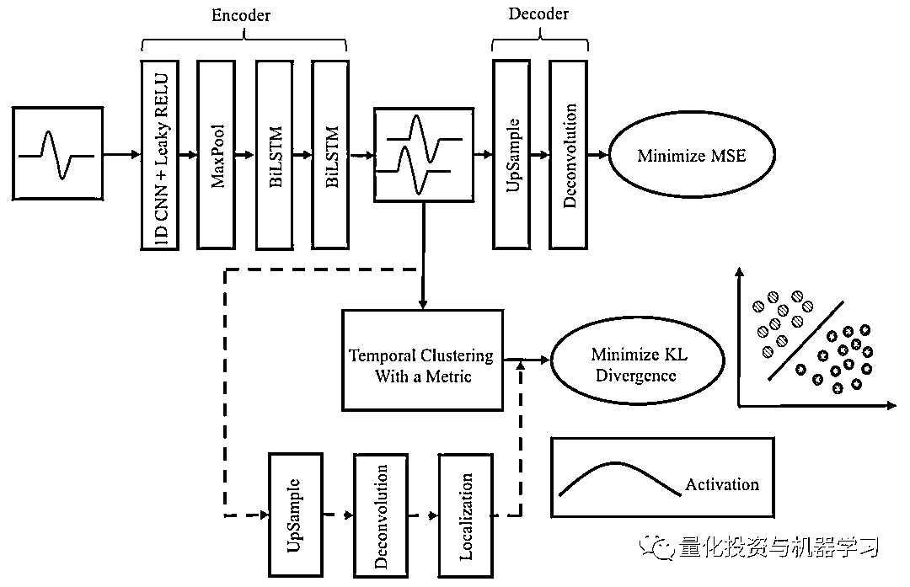
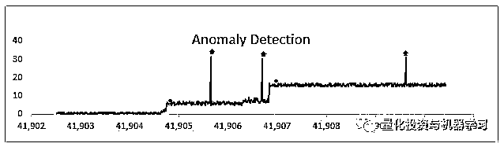
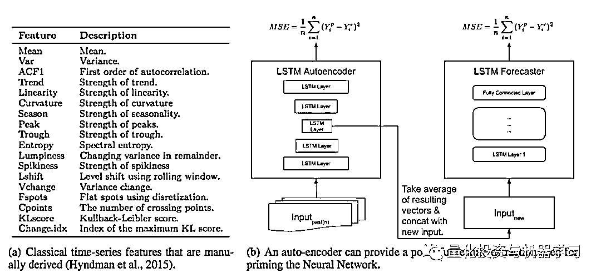

# 『深度学习』信号处理和时序分析的最后选择？

> 原文：[`mp.weixin.qq.com/s?__biz=MzAxNTc0Mjg0Mg==&mid=2653289999&idx=1&sn=800b645653a3e36ce57ff82260d030dc&chksm=802e3c1ab759b50cf9fb931574f84001f4858997be6330251c139deef0272e9217aa62276ea5&scene=27#wechat_redirect`](http://mp.weixin.qq.com/s?__biz=MzAxNTc0Mjg0Mg==&mid=2653289999&idx=1&sn=800b645653a3e36ce57ff82260d030dc&chksm=802e3c1ab759b50cf9fb931574f84001f4858997be6330251c139deef0272e9217aa62276ea5&scene=27#wechat_redirect)

请**标星公众号**，第一时间获取最新资讯

本期作者：Alexandr Honchar

本期译者：Liam | 公众号翻译部成员

**前言**

现如今，人们将深度学习运用到几乎所有领域，那些最“时髦的”领域包括计算机视觉、自然语言处理、语音分析、推荐系统以及预测系统。但是，有一个领域被大家遗忘在机器学习的角落，那就是信号分析（或时间序列分析）。本文中，将首先向大家展示信号和时间序列的重要性，接下来简要地回顾一下经典的方法，然后分享一下在 Mawi 公司运用深度学习处理信号的经验以及在算法交易领域的经验。

我相信，不但研究时间序列数据的人将从本文中获益，计算机视觉研究者也将发现研究方法的相似之处，NLP 研究者将会对序列模型有进一步的认识，其他方面的专家也会有有趣的发现。

**信号和时间序列的来源**

首先，地球这颗行星以及她周围的空间都是信号的来源——我们测量太阳黑子的数量，不同地区温度的变化，风速，小行星的速度以及许许多多其他事件：

当然，时间序列最普遍的例子莫过于与金融和交易有关的：股票价格及相关衍生品，大小企业的销售额，制造业，互联网相关活动，能源生产，政治和社会事件以及其他方面：

我们也不能忘记另外一种重要的来源——生物信号：大脑活动（EGG），心脏活动（ECG），肌肉张力（EMG），以及从可穿戴设备上收集的数据比如脉搏、基于加速度计测量的活动、睡眠、压力指标——如今所有这些重要的信号都可以方便的搜集并拿来做分析：

还有另外一些例子比如车载数据等等，希望你已经注意到这里有大量的应用场景。

最有意思的是 ECG 数据不光可以告诉你心脏的状态，它还可以跟踪情绪和压力水平，身体状态，睡意和精神状态，酒精和香烟对心脏的影响以及其他很多东西。如果你想要做这方面进一步研究，你就要搜集这方面生物信息，并验证你的假设（即使是最疯狂的假设），我们建立了一个数据搜集和分析的共享平台。*https://www.research.mawi.band*

**经典方法**

The equation for a SARMA(p,q)(P,Q) model

在机器学习和深度学习时代来临之前，人们针对时间序列和信号分析领域创造出一系列数学模型和方法。以下是一些最重要模型的汇总：

**时域分析：**这是关于“看”时间序列在一段时间内如何演变的分析方法。它包括时序的长度宽度、统计特征以及其他“可见的”特征。

**频域分析：**很多信号很难用时间变化来描述，但是可以用幅度及其变化来表示。傅里叶分析和小波分析是这类方法的代表。

**近邻分析：**有时候我们仅仅需要对比两个信号或者测量这两个信号之间的距离，我们不能使用常规的距离矩阵比如欧几里得矩阵，因为信号的长度和相似度会同时改变。动态时间扭曲（dynamic time warping）是运用在时间序列方面的典型矩阵技术。

**(S)AR(I)MA(X)****模型：**这是一类非常流行的数学模型，它根据时间序列中线性自相关来解释将来的波动。

**分解：**另一个重要的预测方法是将时间序列分解成几个逻辑部分：趋势部分、季节部分、以及剩余部分。这些被被分解的部分可以通过加总和乘法还原成原来的序列。

**非线性动力学：**我们会经常忘记把信号或者时间序列当成动态系统，用微分方程（常规微分方程，偏微分方程，随机微分方程以及其他微分方程）作为研究工具来研究他们。虽然到现如今这种方法仍然很不普遍，但是从 DE 得到的特征却对机器学习很有用。

**机器学习：**以上几种技术都可以为机器学习模型提供特征。但是在 2018 年，我们不想依靠带有人类偏见的数学模型或者特征。我们想用 AI 即深度学习来为我们服务。

**深度学习**

深度学习很容易。从操作的角度来看，你只需要使用你最喜爱的网络并设置好层级，小心过拟合的风险就行了。但是事情不总那么简单。四年前大多数研究者困惑这种设置层级的方法是否只对信号处理起作用，但对其他更广泛的领域不起作用。四年以后我们有了答案：神经网络对所有上述领域都是一种超级强力的工具，它在销售预测和交通预测等方面的 Kaggle 大赛中屡屡胜出，在生物信号分析的准确性以及证券交易方面超过了人类。在这一节中，我将谈谈这些产生神奇结果的主要的深度学习方法，以及为何他们会表现得如此优异。

**递归神经网络（****RNN****）**

当我们谈到用神经网络来进行序列分析（从时间序列到语言）时，第一个想到的就是递归神经网络。作为一种专为序列分析开发的神经网络，它能保存潜在的模式并学习时间依赖关系，是完全的图灵机并能对付任何长度的序列。但是正如最近的研究所揭示的一样，我们很少将这种优势在实践上发挥出来。再者，我们在将其运用到太长的序列时（当我们对流信号进行高频采样时，比如 500-100Hz，会出现这种问题。）遇到了一系列问题，详细资料请参阅本文结论部分的列表。以我个人的经验，在每个时间片使用多变量（可以是多元时间序列或字嵌入）的情况下，递归网络比较适用与短序列（10-100 时间片）。其他情况我们最好用下面的技术：

**卷积神经网络（****CNN****）**

CNNs 在计算机视觉领域表现非常棒，因为它能在图片甚至 3D 数据中抓住微小的细节（局部特征）。为什么我们不能把它运用到更简单的一维数据上呢？我们确实应该这样，把它纳入考虑范围，我们所要做的就是采用开源的艺术深度学习构架，比如 ResNet 或者 DenseNet，将 2D 卷积替换为 1D。它们性能不错，很快，并可以用并行进行优化，对分类和回归问题都表现不错，因为时间序列中所有局部模式的组合定义了它们。我已经测试了很多次，它们要比 RNNs 表现好太多了。我补充一下，我处理信号时有两个主要的基准：逻辑回归和 2-3 层 CNN。

**CNN+RNN**

RNNs 和 CNNs 可能是你能想到的，但是让我们考虑更有趣的模型。局部模式很好，但是如果我们还要考虑这些模式的短时间依赖会怎样呢（考虑到将 RNNs 直接用在原始信号上不是最好的选择）？我们应该记得，运用各种池技术，卷积网络在降维方面有很好的应用。通过降维，我们就可以运用递归神经网络，其“物理意义”就是“检查跨时间的局部特征的依赖性”，这对一些应用是绝对有意义的。

CNN-LSTM in the code example

**自回归神经网络**

如果我们想避免有关递归神经网络不必要的麻烦该怎么办？有没有办法去“仿真”过去 N 个时间片所产生的依赖性，而且 N 非常大呢？这里 WaveNet 和相似结构加入了游戏。更一般的我们称之为自回归前馈模型，这种模型用扩展的卷积来处理 N 个时间片。你可以在文后的链接里验证为何它们在序列模型里表现如此出色。在这里我要补充一条，从递归神经网络转换到（自回归）前馈模型的趋势不光在语音识别和时间序列分析领域，而且在 NLP 领域中同样如此。

*https://bair.berkeley.edu/blog/2018/08/06/recurrent/*

**聚集**

除了用 RNNs/CNNs/自回归模型外，我们还对把时间序列聚集成有意义的群组有兴趣。我们可以用专门的时间序列距离（之前提过的 DTW）以及矩阵为基础的聚集算法来处理这类问题，但是这样处理起来非常慢而且不是最优的方法。我们希望有一种能处理不同长度的信号，并且非常高效的方法。当然，我们可以要求神经网络为我们提供一个嵌入空间（例如自编码器），在那里我们可以进行聚集。我们可以在这些空间进行信号聚集或者增加自编码器完成附加任务，如这项研究所完成的一样。

*https://arxiv.org/pdf/1802.01059.pdf*

**异常检测**

另一个与序列数据（常常是流数据）相关的重要的和流行的任务是异常检测——即发现数据中“非在此刻希望看到的”情况。通常我们用设置阈值方法和测量距离（有时是随机距离）来处理这类问题，但并非每次我们都可以依靠测量两个时间序列之间的欧几里得距离来完成任务。正如上节中提到的聚集技术一样，我们可以依靠用自编码器将数据嵌入到新空间去再使用深度学习，或者我们可以通过部署鉴别器网络作为异常检测器（检查更细微的细节和编码）使用 GANs（生成对抗网络）来进行异常检测。

*https://blogs.technet.microsoft.com/machinelearning/2014/11/05/anomaly-detection-using-machine-learning-to-detect-abnormalities-in-time-series-data/*

**混合解决方案**

有时候你已经拥有通过良好定义的数学模型，或者能清晰代表你的数据的特征，并且性能还不错。但是你仍然需要动用深度学习的力量，将你的专家模型和通过神经网络学习所得的进行组合。你可以从 Uber Labs 经验中学到怎样建立混合解决方案。

*https://eng.uber.com/neural-networks/*

这个想法是将图左边一组特征与图右边嵌入自编码器组合训练一个联合模型，这样你就可以控制不同特征的重要性并跟踪其对模型最后表现的影响。

**结论**

1、到处都存在着信号，从外太空到我们的身体。

2、对序列模型，CNN>CNN>RNN

3、采用嵌入式空间进行聚集，而不是用 DTW+K-Means

4、用 GANs 而不是生成模型

5、将深度学习与数学模型组合起来

6、这些技术在 NLP，语音以及其他序列分析中同样有效！

**推荐阅读**

[01、经过多年交易之后你应该学到的东西（深度分享）](https://mp.weixin.qq.com/s?__biz=MzAxNTc0Mjg0Mg==&mid=2653289074&idx=1&sn=e859d363eef9249236244466a1af41b6&chksm=802e3867b759b1717f77e07a51ee5671e8115130c66562577280ba1243cba08218add04f1f00&token=449379994&lang=zh_CN&scene=21#wechat_redirect)

[02、监督学习标签在股市中的应用（代码+书籍）](https://mp.weixin.qq.com/s?__biz=MzAxNTc0Mjg0Mg==&mid=2653289050&idx=1&sn=60043a5c95b877dd329a5fd150ddacc4&chksm=802e384fb759b1598e500087374772059aa21b31ae104b3dca04331cf4b63a233c5e04c1945a&token=449379994&lang=zh_CN&scene=21#wechat_redirect)

[03、全球投行顶尖机器学习团队全面分析](https://mp.weixin.qq.com/s?__biz=MzAxNTc0Mjg0Mg==&mid=2653289018&idx=1&sn=8c411f676c2c0d92b0dd218f041bee4b&chksm=802e382fb759b139ffebf633ac14cdd0f21938e4613fe632d5d9231dab3d2aca95a11628378a&token=449379994&lang=zh_CN&scene=21#wechat_redirect)

[04、使用 Tensorflow 预测股票市场变动](https://mp.weixin.qq.com/s?__biz=MzAxNTc0Mjg0Mg==&mid=2653289014&idx=1&sn=3762d405e332c599a21b48a7dc4df587&chksm=802e3823b759b135928d55044c2729aea9690f86752b680eb973d1a376dc53cfa18287d0060b&token=449379994&lang=zh_CN&scene=21#wechat_redirect)

[05、使用 LSTM 预测股票市场基于 Tensorflow](https://mp.weixin.qq.com/s?__biz=MzAxNTc0Mjg0Mg==&mid=2653289238&idx=1&sn=3144f5792f84455dd53c27a78e8a316c&chksm=802e3903b759b015da88acde4fcbc8547ab3e6acbb5a0897404bbefe1d8a414265d5d5766ee4&token=2020206794&lang=zh_CN&scene=21#wechat_redirect)

[06、美丽的回测——教你定量计算过拟合概率](https://mp.weixin.qq.com/s?__biz=MzAxNTc0Mjg0Mg==&mid=2653289314&idx=1&sn=87c5a12b23a875966db7be50d11f09cd&chksm=802e3977b759b061675d1988168c1fec06c602e8583fbcc9b76f87008e0c10b702acc85467a0&token=1972390229&lang=zh_CN&scene=21#wechat_redirect)

[07、利用动态深度学习预测金融时间序列基于 Python](https://mp.weixin.qq.com/s?__biz=MzAxNTc0Mjg0Mg==&mid=2653289347&idx=1&sn=bf5d7899bc4a854d4ba9046fdc6fe0d6&chksm=802e3996b759b080287213840987bb0a0c02e4e1d4d7aae23f10a225a92ef6dd922d8006123d&token=290397496&lang=zh_CN&scene=21#wechat_redirect)

[08、Facebook 开源神器 Prophet 预测时间序列基于 Python](https://mp.weixin.qq.com/s?__biz=MzAxNTc0Mjg0Mg==&mid=2653289394&idx=1&sn=24a836136d730aa268605628e683d629&chksm=802e39a7b759b0b1dcf7aaa560699130a907716b71fc9c45ff0e5d236c5ae8ef80ebdb09dbb6&token=290397496&lang=zh_CN&scene=21#wechat_redirect)

[09、Facebook 开源神器 Prophet 预测股市行情基于 Python](https://mp.weixin.qq.com/s?__biz=MzAxNTc0Mjg0Mg==&mid=2653289437&idx=1&sn=f0dca7da8e69e7ba736992cb3d034ce7&chksm=802e39c8b759b0de5bce401c580623d0729ecca69d13926479d36e19aff8c9c9e8a20265afff&token=290397496&lang=zh_CN&scene=21#wechat_redirect)

[10、2018 第三季度最受欢迎的券商金工研报前 50（附下载）](https://mp.weixin.qq.com/s?__biz=MzAxNTc0Mjg0Mg==&mid=2653289358&idx=1&sn=db6e8ab85b08f6e67790ec0e401e586e&chksm=802e399bb759b08d6eec855f9901ea856d0da68c7425cba62791b8948da6ad761a3d88543dad&token=290397496&lang=zh_CN&scene=21#wechat_redirect)

[11、实战交易策略的精髓（公众号深度呈现）](https://mp.weixin.qq.com/s?__biz=MzAxNTc0Mjg0Mg==&mid=2653289447&idx=1&sn=f2948715bf82569a6556d518e56c1f9e&chksm=802e39f2b759b0e4502d1aaac562b87789573b55c76b3c85897d8c9d88dbf9a0b7ee34d86a4e&token=290397496&lang=zh_CN&scene=21#wechat_redirect)

[12、Markowitz 有效边界和投资组合优化基于 Python](https://mp.weixin.qq.com/s?__biz=MzAxNTc0Mjg0Mg==&mid=2653289478&idx=1&sn=f8e01a641be021993d8ef2d84e94a299&chksm=802e3e13b759b7055cf27a280c672371008a5564c97c658eee89ce8481396a28d254836ff9af&token=290397496&lang=zh_CN&scene=21#wechat_redirect)

[13、使用 LSTM 模型预测股价基于 Keras](https://mp.weixin.qq.com/s?__biz=MzAxNTc0Mjg0Mg==&mid=2653289495&idx=1&sn=c4eeaa2e9f9c10995be9ea0c56d29ba7&chksm=802e3e02b759b7148227675c23c403fb9a543b733e3d27fa237b53840e030bf387a473d83e3c&token=1260956004&lang=zh_CN&scene=21#wechat_redirect)

[14、量化金融导论 1：资产收益的程式化介绍基于 Python](https://mp.weixin.qq.com/s?__biz=MzAxNTc0Mjg0Mg==&mid=2653289507&idx=1&sn=f0ca71aa07531bbbdbd33213f0bab89f&chksm=802e3e36b759b720138b3b17a4dd0e198e054b9de29a038fdd50805f824effa55831111ad026&token=1936245282&lang=zh_CN&scene=21#wechat_redirect)

[15、预测股市崩盘基于统计机器学习与神经网络（Python+文档）](https://mp.weixin.qq.com/s?__biz=MzAxNTc0Mjg0Mg==&mid=2653289533&idx=1&sn=4ef964834e84a9995111bb057b0fc5dd&chksm=802e3e28b759b73e0618eb1262c53aa0601fbf5805525a7c7ff40dc3db62c7704496611bdbf1&token=1950551577&lang=zh_CN&scene=21#wechat_redirect)

[16、实现最优投资组合有效前沿基于 Python（附代码）](https://mp.weixin.qq.com/s?__biz=MzAxNTc0Mjg0Mg==&mid=2653289609&idx=1&sn=c7f0b3e47025862d10bb53b6ab88bcda&chksm=802e3e9cb759b78abf6b8b049c59bf18ccfb2ead7580d1f557d36de2292f59dcbd94dcd41910&token=2085008037&lang=zh_CN&scene=21#wechat_redirect)

[17、精心为大家整理了一些超级棒的机器学习资料（附链接）](https://mp.weixin.qq.com/s?__biz=MzAxNTc0Mjg0Mg==&mid=2653289615&idx=1&sn=1cdc89afb997d0c580bf0cef296d946c&chksm=802e3e9ab759b78ce9f0cd152a680d4a413d6c8dcb02a7a296f4091993a7e4137e7520394575&token=2085008037&lang=zh_CN&scene=21#wechat_redirect)

[18、海量 Wind 数据，与全网用户零距离邂逅！](https://mp.weixin.qq.com/s?__biz=MzAxNTc0Mjg0Mg==&mid=2653289623&idx=1&sn=28a3600fd7a72d7be00b066ca0f98244&chksm=802e3e82b759b7943f43a4f6ef4a91e4153fa6b8210de9590235fa8ee66eb9811ce177054dbc&token=1389401983&lang=zh_CN&scene=21#wechat_redirect)

[19、机器学习、深度学习、量化金融、Python 等最新书籍汇总下载](https://mp.weixin.qq.com/s?__biz=MzAxNTc0Mjg0Mg==&mid=2653289640&idx=1&sn=34e94fcbe99052b8e7381ecc48a36dc0&chksm=802e3ebdb759b7ab897cd329a680715b6f8294e63550ddf0c57b9e1320b2b7d1408c6fdca0c7&token=1389401983&lang=zh_CN&scene=21#wechat_redirect)

[20、各大卖方 2019 年 A 股策略报告，都是有故事的人！](https://mp.weixin.qq.com/s?__biz=MzAxNTc0Mjg0Mg==&mid=2653289725&idx=1&sn=4b65cd1fb8331438e4c0b3d0eae6b51f&chksm=802e3ee8b759b7fe1b94e84d54cc23b0ab05853d5cd227812574b350e9fc2cce9e5f1bc6cb7a&token=1389401983&lang=zh_CN&scene=21#wechat_redirect)

来源：

https://medium.com/@alexrachnog/deep-learning-the-final-frontier-for-signal-processing-and-time-series-analysis-734307167ad6

****公众号官方 QQ 群****

**量化、技术人士深度交流群**

