# 清华毕业就要月薪 3 万！你凭什么？

> 原文：[`mp.weixin.qq.com/s?__biz=MzAxNTc0Mjg0Mg==&mid=2653289982&idx=1&sn=6dda3159f9fd55578a82337d6bb283a0&chksm=802e3febb759b6fdd6a5fa098bcb577754514b5470c485aed43dcb0522840474f6f064a5ca11&scene=27#wechat_redirect`](http://mp.weixin.qq.com/s?__biz=MzAxNTc0Mjg0Mg==&mid=2653289982&idx=1&sn=6dda3159f9fd55578a82337d6bb283a0&chksm=802e3febb759b6fdd6a5fa098bcb577754514b5470c485aed43dcb0522840474f6f064a5ca11&scene=27#wechat_redirect)

请**标星公众号**，第一时间获取最新资讯

在文章开始之前

**我们想请所有读者看完这段 2 分钟左右的视频**

[`v.qq.com/iframe/preview.html?width=500&height=375&auto=0&vid=i0819nueze5`](https://v.qq.com/iframe/preview.html?width=500&height=375&auto=0&vid=i0819nueze5)

**没有人**

**比你自己更清楚**

**有多么的困难**

**有多么的不容易**

**但是当你在享受荣誉的这一瞬间**

**一切都是值得的**

**加油，各位读者**

**公众号祝大家在 2019 年**

**走过不一样的人生！**

**正文开始**

本期作者：Uni 酱

文章来源：UniCareer

清华应届面试，张口要价三万月薪 

结果遭 HR 狂怼

光有学历没经验，就敢喊价三万+期权？

究竟是 HR 格局太小，还是清华生太狂妄

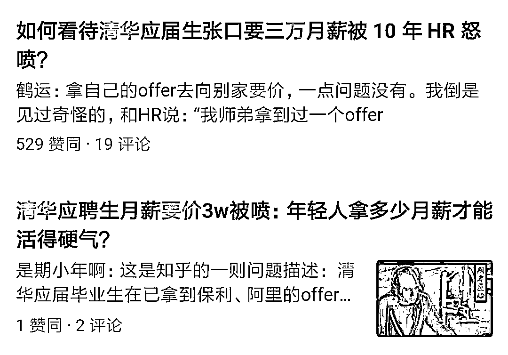

正常情况下，清北应届究竟能拿多少？

**春招在即，怎么谈薪资最得体？**

******清华应届生要价月薪三万******

******遭 HR 狂怼******

近日，一位清华应届生应聘产品经理，惹怒了从业 10 年的 HR。

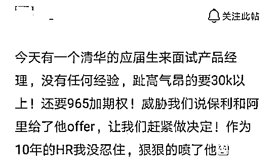

* 图片来源：脉脉

据爆料，这位清华应届生没有任何经验，不仅张口就开价 3 万加期权，态度还极其傲慢，HR 即便有着 10 年的工作经验，还是没忍住当场怼了对方。

此事一出，引起了很多网友的讨论，其中知乎点赞最高的回答是“这届同学很好，知道自己值几个钱了，不容易啊。”

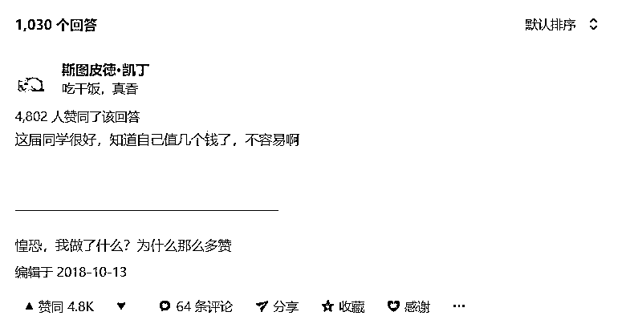

* 图片来源：知乎

没想到，清华学生看似“狂妄”的行为竟然获得了这么多人的肯定，那么，清华毕业是否就能要高价？

我们不妨分析一下，首先，产品经理是非技术岗，平均工资要比开发少上一截，跟最近大火的算法岗更是没法比。那么，什么样的公司能给应届产品经理发超高的薪水？

> *头号金主：在招人上舍得砸钱的一线/准一线大厂，典型代表为今日头条。*
> 
> *二号金主：风口上的独角兽，典型代表为猿辅导。*

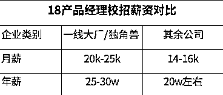

* 图片来源：Uni 自制

对比 18 产品经理校招薪资，**清华毕业生要价月薪 3w，对应年薪 36w，实属偏高。**如果真能拿到月薪 3w，要么是和公司老大看对眼了，要么是这位清华候选人硬实力极其优秀，**但在产品经理岗位招聘中，“毕业于清华”并不能算极其优秀。**

至于他为什么在拿到阿里保利 Offer 之后，还要去小公司面试？主要原因可能就是为了多拿钱。其实不光清北，这届 95 应届生追求高薪或比往届毕业生更甚，而且往往也认为自己值这么多钱。

据《第十六届中国大学生最佳雇主调研综合报告》显示，2019 届应届生平均期望薪资为 8431 元/月，****其中，北京 19 应届大学生的期待月薪高达一万三，********但据 18 年数据，应届本科**实际平均薪资仅有 5429 元。******

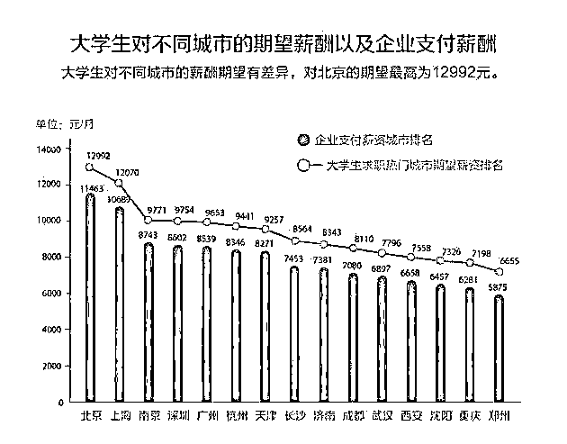

* 图片来源：网络

**期望和实际薪资差距为何如此之大**

**对于应届毕业生来说，估计自己的身价是很难的一件事。**如果你实习履历非常丰富，早早就接触到社会，还有名校光环加持，尚可能有一些客观的判断。 

但对于那些双非学校毕业，也没有什么拿得出手的实习经验，对职场一无所知的同学，到了毕业季往往是最茫然无措的一批人。

一流大学和普通高校在找工作时候的区别，并不仅仅是工资高低，还有面试时候的底气。双非很容易在初筛死掉，但是清华北大往往更容易获得 HR 的关注，进面试也相对更容易。所以清北被拒了也不怂，大不了再找一个。**然而面对激烈的竞争市场，普通大学毕业的同学们极容易不自信，**觉得自己“一文不值”，一被拒就怂，很可能为了找个饭碗向 HR 妥协，白菜价把自己卖掉了。

那么薪资究竟该怎么谈呢？一般来说，走到谈薪资这一步，说明专业能力各方面都没有问题了，你离 offer 也只差这一步了。谈得拢就可以顺利入职。但很多人都会遇到一个问题：不知道怎么开口。

这一点在应届生身上特别明显，毕竟脸皮薄，谈到钱总有点扭扭捏捏。

**举个例子：**

> *假如面试官问道：“你的期望薪资是多少”*
> 
> *你说“按照行业平均水平就好”*
> 
> *然后 HR 给你报了个价说这就是行业平均水平*
> 
> *你觉得低了，那怎么办？*
> 
> *腆着脸继续提价么？*

其实谈薪资待遇并没有什么可害羞的，只不过要从实际出发，给自己定一个合理的期望值。**如果你以没有经验为由等着公司开价，一般来说待遇不会太理想。**以下为谈薪资的参考话术：

**HR：“你对薪酬有什么要求？”**

> *——选择投贵公司是我经过慎重考虑之后的选择，我在贵公司发布的职位信息中看到了薪资范围 8k-10k，这个范围就是我对薪资的预期。*

**HR：“你觉得我们该给你多少钱？”**

> *——作为第一份工作，我对薪资的考虑是希望能结合公司的发展空间和学习成长空间来综合判断。同时，我也认真对自己的综合实力做过评估，我希望我的薪资不低于 8k。*

**HR：“你的期望薪资是多少？”**

> *——我看了公司的岗位薪资是 8k～15k，我希望达到公司的要求转正后能拿到 10k，试用期拿 80%，也是岗位薪资的最低值。*

**只要能力强，想拿多少都没问题**

在以往大多人的认知里，很多工作两三年的人都不一定能拿到 3 万，即便是清华毕业没有工作经验也很难拿到这么高。

然而事实是残酷的，当你还在几千块的工资苦逼加班、熬夜掉发时，刚毕业的学生已经年薪几十万了。

在今年最新发出的一批 offer 中，**字节跳动、美团、滴滴****等互联网独角兽的技术岗位，校招最低工资稳定在 22 万起跳，平均最高工资则是 72 万。**

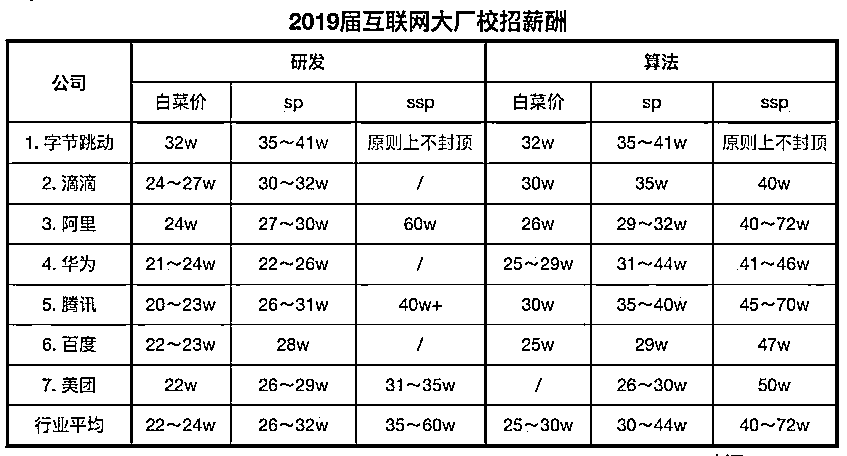

* 图片来源：网络

不仅如此，今日头条的 HR 为了鼓励候选人投递移动端岗位，还开出了入职满一年即可获得 3 个月工资的签约金奖励福利。总之，在这人才抢夺战中，大厂释放出的信号就是：**只要你能力够强，想要多少钱都不是问题。**

除了有钱多金，这类独角兽公司背后都有资本巨头撑腰。比如专注“吃喝玩乐”的美团，背后就有腾讯支持。在美团 IPO 后，腾讯一举成为美团最大股东。这样的公司往往资金充足，有资源，而且领导团队大多也是 BAT 出身。比如滴滴 CEO 程维就是阿里系出身，小红书合伙人曾秀莲就是腾讯系出身。**在公司比较小的时候，会有极大的几率被大牛亲自带，能学到的东西不亚于大厂。**

在招聘选人方面，独角兽公司体量小，对员工上手速度要求高，所以，独角兽公司在筛选简历的时候，极其重视应试者是否有相关项目经验。正因为如此，在面试过程中，面试官也会侧重考量同学们的项目开发实际经验，并会针对简历上的项目进行提问。

**名校光环在求职中有多重要？**

中国的教育就是：20%的人拿 80%的资源，这位清华毕业生能拿到阿里、保利 Offer 实属幸运，但也有很多双非院校的学生因“非名校”身份屡遭碰壁。拥有名校光环在求职中真的快人一步吗？

**1、 名校简历更易过关**

以五百强招聘为例，网申简历投递环节中，HR 会根据候选人的教育经历划分等级：

> *一档：北清复交 + 海外名校(G2+藤校)*
> 
> *二档：985+211+澳洲 G8+英国 G5+北美前 80+欧洲 10*
> 
> *三档：双非一本+其他海归*
> 
> *四档：二本*

其次还会对候选人的 GPA、实习经历作出要求作出要求，GPA 低于 3.5，无相关项目实习经历基本无望。相应的，带着名校光环的同学在学习和就业上会以更高标准要求自己，比如下图这位北大学生简历，基本比同龄人多积累出 3 年以上职场社会经历。

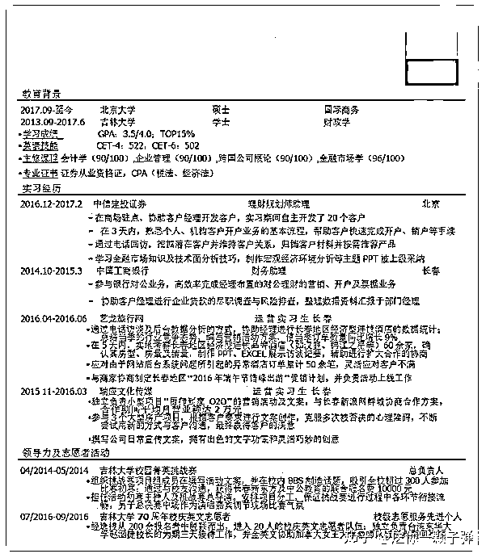

*图片来源：知乎

再看看下面这位双非院校的学生简历，高下立判。

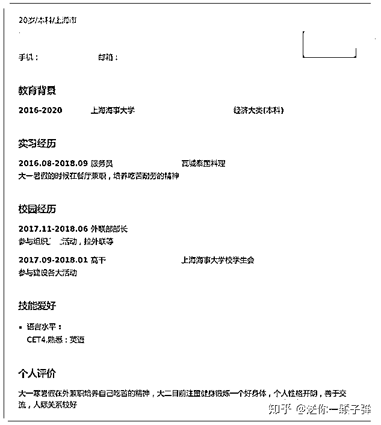

*图片来源：知乎

对于用人单位来说，这样简单粗暴的筛选方式，的确可以最大限度地节约时间成本。

**2、名校毕业工资更高 **

在平均薪酬上，清北复交的同学也是领跑其他高校，足以见“名校”光环带来的含金量。

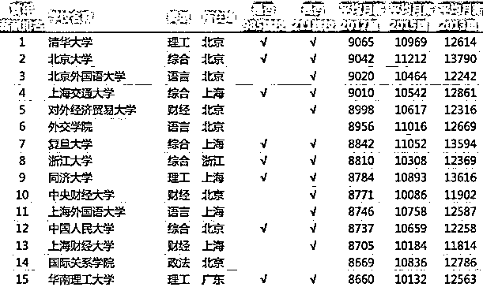

* 图片来源：网络 | 2018 中国大学毕业生薪酬排行榜

**3、名企只认 Target School**

我们都听说过 Target school 这个说法，投行、咨询、BAT、四大都只会在 target school 做宣讲会，会优先在 target school 招人：

> *MBB 在中国只招 TOP10 学校，*
> 
> *投行则是非 985 不要；*
> 
> *顶级 PEVC，只要清北复交，甚至只要实习生转正，不再另外招人*

据调查，来自 target school 的学生获得面试的机会要比社会招聘多 70%。早在 14 年，微博网友@金融圈第一猎头（现已改名）就曾爆出一张中金校招目标学校梯队：

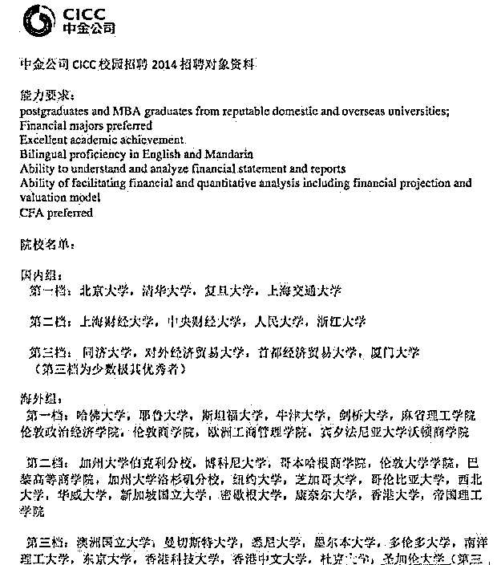

* 图片来源：网络

国内及海外院校依照学校实力及名气被分为三个档次，除了中金，国泰公司 2016 英国校园招聘的要求也在网上流传：

**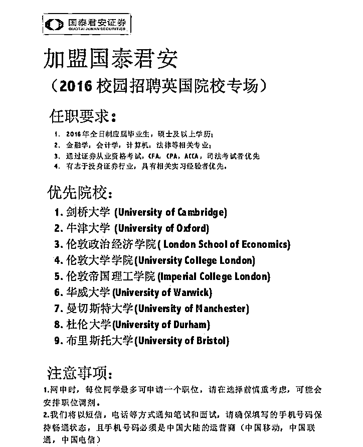**

* 图片来源：网络

可以看出，**英国 G5 和商科专业前几名的学校脱颖而出。面对这样的优先选择，其他学校的留学生在招聘时只能是陪跑。**

**求职工作沉住气，你就能收获更多**

11 月，“95 后平均 7 个月就离职”登上微博热搜，引发热议。比起 70 后工作踏实、80 后跳槽谨慎，95 后将“一不顺心就炸”表现得淋漓尽致。据领英《第一份工作趋势洞察》显示，**从 70 后到 80 后，再到 95 后，第一份工作在职时间依次递减：4 年，3 年半，7 个月。**

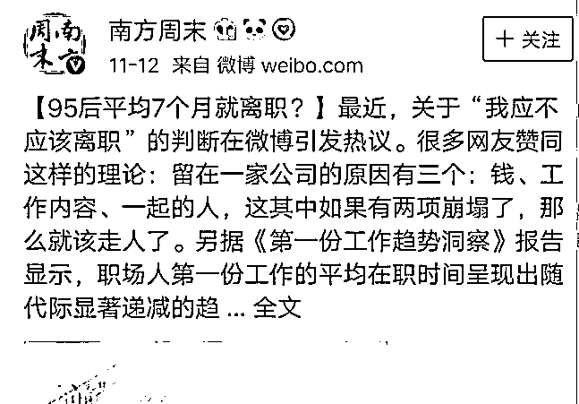

* 图片来源：微博

尽管工作换来换去，但这届 95 后仍然觉得没有一份工作是自己满意的。

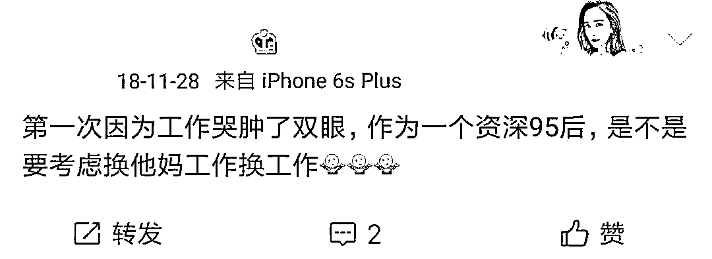

* 图片来源：微博 

而且除开那些被平均的薪资数据，这届 95 后的个体薪资样本的差距其实特别大，为此，Uni 采访了身边一些同学：

> *@P*：普通一本，广东某市，银行柜员，期望年薪 10w，到手只有 3k；*
> 
> *@G****：深圳，某跨国零售服装连锁公司，期待年薪 10W，实际月薪 6k；*
> 
> *@泽*：一本，上海，程序员，期望 1-2w，现在 9k，加班有补贴*

“普通本科”涵盖了大多数人，但不代表个体之间的差异就此消失。毕业拿着 4-6k 的应届生大有人在，动辄 20w 年薪的应届生也确有其人。面对距离差，应届生该如何调整自己的心态？

首先，别人拿多少工资其实和你都没太大关系，每个人都有自己要走的路，也许这条路曲折一些，但终点或许是一样的。其次，**作为应届生，能决定你薪资的，永远都是你的价值，而不是你的期望值。**如果你期望企业给你开出 1 万月薪，那么企业期望你能带来超过 1 万的利润。

不过呢，应届生也不能只关心企业开给你的工资，工资只是显性的一部分，隐性的一部分，便是企业给你带来的学习和成长的机会，这些才是你不断升值、不断加薪的充电器。

毕业，可以是游戏再续，也可以是重新洗牌，你有选择权。刚毕业，工资可以不是很高，但你从不缺少让它变高的机会，而你要有让它变高的想法和能力。

**推荐阅读**

[01、经过多年交易之后你应该学到的东西（深度分享）](https://mp.weixin.qq.com/s?__biz=MzAxNTc0Mjg0Mg==&mid=2653289074&idx=1&sn=e859d363eef9249236244466a1af41b6&chksm=802e3867b759b1717f77e07a51ee5671e8115130c66562577280ba1243cba08218add04f1f00&token=449379994&lang=zh_CN&scene=21#wechat_redirect)

[02、监督学习标签在股市中的应用（代码+书籍）](https://mp.weixin.qq.com/s?__biz=MzAxNTc0Mjg0Mg==&mid=2653289050&idx=1&sn=60043a5c95b877dd329a5fd150ddacc4&chksm=802e384fb759b1598e500087374772059aa21b31ae104b3dca04331cf4b63a233c5e04c1945a&token=449379994&lang=zh_CN&scene=21#wechat_redirect)

[03、全球投行顶尖机器学习团队全面分析](https://mp.weixin.qq.com/s?__biz=MzAxNTc0Mjg0Mg==&mid=2653289018&idx=1&sn=8c411f676c2c0d92b0dd218f041bee4b&chksm=802e382fb759b139ffebf633ac14cdd0f21938e4613fe632d5d9231dab3d2aca95a11628378a&token=449379994&lang=zh_CN&scene=21#wechat_redirect)

[04、使用 Tensorflow 预测股票市场变动](https://mp.weixin.qq.com/s?__biz=MzAxNTc0Mjg0Mg==&mid=2653289014&idx=1&sn=3762d405e332c599a21b48a7dc4df587&chksm=802e3823b759b135928d55044c2729aea9690f86752b680eb973d1a376dc53cfa18287d0060b&token=449379994&lang=zh_CN&scene=21#wechat_redirect)

[05、使用 LSTM 预测股票市场基于 Tensorflow](https://mp.weixin.qq.com/s?__biz=MzAxNTc0Mjg0Mg==&mid=2653289238&idx=1&sn=3144f5792f84455dd53c27a78e8a316c&chksm=802e3903b759b015da88acde4fcbc8547ab3e6acbb5a0897404bbefe1d8a414265d5d5766ee4&token=2020206794&lang=zh_CN&scene=21#wechat_redirect)

[06、美丽的回测——教你定量计算过拟合概率](https://mp.weixin.qq.com/s?__biz=MzAxNTc0Mjg0Mg==&mid=2653289314&idx=1&sn=87c5a12b23a875966db7be50d11f09cd&chksm=802e3977b759b061675d1988168c1fec06c602e8583fbcc9b76f87008e0c10b702acc85467a0&token=1972390229&lang=zh_CN&scene=21#wechat_redirect)

[07、利用动态深度学习预测金融时间序列基于 Python](https://mp.weixin.qq.com/s?__biz=MzAxNTc0Mjg0Mg==&mid=2653289347&idx=1&sn=bf5d7899bc4a854d4ba9046fdc6fe0d6&chksm=802e3996b759b080287213840987bb0a0c02e4e1d4d7aae23f10a225a92ef6dd922d8006123d&token=290397496&lang=zh_CN&scene=21#wechat_redirect)

[08、Facebook 开源神器 Prophet 预测时间序列基于 Python](https://mp.weixin.qq.com/s?__biz=MzAxNTc0Mjg0Mg==&mid=2653289394&idx=1&sn=24a836136d730aa268605628e683d629&chksm=802e39a7b759b0b1dcf7aaa560699130a907716b71fc9c45ff0e5d236c5ae8ef80ebdb09dbb6&token=290397496&lang=zh_CN&scene=21#wechat_redirect)

[09、Facebook 开源神器 Prophet 预测股市行情基于 Python](https://mp.weixin.qq.com/s?__biz=MzAxNTc0Mjg0Mg==&mid=2653289437&idx=1&sn=f0dca7da8e69e7ba736992cb3d034ce7&chksm=802e39c8b759b0de5bce401c580623d0729ecca69d13926479d36e19aff8c9c9e8a20265afff&token=290397496&lang=zh_CN&scene=21#wechat_redirect)

[10、2018 第三季度最受欢迎的券商金工研报前 50（附下载）](https://mp.weixin.qq.com/s?__biz=MzAxNTc0Mjg0Mg==&mid=2653289358&idx=1&sn=db6e8ab85b08f6e67790ec0e401e586e&chksm=802e399bb759b08d6eec855f9901ea856d0da68c7425cba62791b8948da6ad761a3d88543dad&token=290397496&lang=zh_CN&scene=21#wechat_redirect)

[11、实战交易策略的精髓（公众号深度呈现）](https://mp.weixin.qq.com/s?__biz=MzAxNTc0Mjg0Mg==&mid=2653289447&idx=1&sn=f2948715bf82569a6556d518e56c1f9e&chksm=802e39f2b759b0e4502d1aaac562b87789573b55c76b3c85897d8c9d88dbf9a0b7ee34d86a4e&token=290397496&lang=zh_CN&scene=21#wechat_redirect)

[12、Markowitz 有效边界和投资组合优化基于 Python](https://mp.weixin.qq.com/s?__biz=MzAxNTc0Mjg0Mg==&mid=2653289478&idx=1&sn=f8e01a641be021993d8ef2d84e94a299&chksm=802e3e13b759b7055cf27a280c672371008a5564c97c658eee89ce8481396a28d254836ff9af&token=290397496&lang=zh_CN&scene=21#wechat_redirect)

[13、使用 LSTM 模型预测股价基于 Keras](https://mp.weixin.qq.com/s?__biz=MzAxNTc0Mjg0Mg==&mid=2653289495&idx=1&sn=c4eeaa2e9f9c10995be9ea0c56d29ba7&chksm=802e3e02b759b7148227675c23c403fb9a543b733e3d27fa237b53840e030bf387a473d83e3c&token=1260956004&lang=zh_CN&scene=21#wechat_redirect)

[14、量化金融导论 1：资产收益的程式化介绍基于 Python](https://mp.weixin.qq.com/s?__biz=MzAxNTc0Mjg0Mg==&mid=2653289507&idx=1&sn=f0ca71aa07531bbbdbd33213f0bab89f&chksm=802e3e36b759b720138b3b17a4dd0e198e054b9de29a038fdd50805f824effa55831111ad026&token=1936245282&lang=zh_CN&scene=21#wechat_redirect)

[15、预测股市崩盘基于统计机器学习与神经网络（Python+文档）](https://mp.weixin.qq.com/s?__biz=MzAxNTc0Mjg0Mg==&mid=2653289533&idx=1&sn=4ef964834e84a9995111bb057b0fc5dd&chksm=802e3e28b759b73e0618eb1262c53aa0601fbf5805525a7c7ff40dc3db62c7704496611bdbf1&token=1950551577&lang=zh_CN&scene=21#wechat_redirect)

[16、实现最优投资组合有效前沿基于 Python（附代码）](https://mp.weixin.qq.com/s?__biz=MzAxNTc0Mjg0Mg==&mid=2653289609&idx=1&sn=c7f0b3e47025862d10bb53b6ab88bcda&chksm=802e3e9cb759b78abf6b8b049c59bf18ccfb2ead7580d1f557d36de2292f59dcbd94dcd41910&token=2085008037&lang=zh_CN&scene=21#wechat_redirect)

[17、精心为大家整理了一些超级棒的机器学习资料（附链接）](https://mp.weixin.qq.com/s?__biz=MzAxNTc0Mjg0Mg==&mid=2653289615&idx=1&sn=1cdc89afb997d0c580bf0cef296d946c&chksm=802e3e9ab759b78ce9f0cd152a680d4a413d6c8dcb02a7a296f4091993a7e4137e7520394575&token=2085008037&lang=zh_CN&scene=21#wechat_redirect)

[18、海量 Wind 数据，与全网用户零距离邂逅！](https://mp.weixin.qq.com/s?__biz=MzAxNTc0Mjg0Mg==&mid=2653289623&idx=1&sn=28a3600fd7a72d7be00b066ca0f98244&chksm=802e3e82b759b7943f43a4f6ef4a91e4153fa6b8210de9590235fa8ee66eb9811ce177054dbc&token=1389401983&lang=zh_CN&scene=21#wechat_redirect)

[19、机器学习、深度学习、量化金融、Python 等最新书籍汇总下载](https://mp.weixin.qq.com/s?__biz=MzAxNTc0Mjg0Mg==&mid=2653289640&idx=1&sn=34e94fcbe99052b8e7381ecc48a36dc0&chksm=802e3ebdb759b7ab897cd329a680715b6f8294e63550ddf0c57b9e1320b2b7d1408c6fdca0c7&token=1389401983&lang=zh_CN&scene=21#wechat_redirect)

[20、各大卖方 2019 年 A 股策略报告，都是有故事的人！](https://mp.weixin.qq.com/s?__biz=MzAxNTc0Mjg0Mg==&mid=2653289725&idx=1&sn=4b65cd1fb8331438e4c0b3d0eae6b51f&chksm=802e3ee8b759b7fe1b94e84d54cc23b0ab05853d5cd227812574b350e9fc2cce9e5f1bc6cb7a&token=1389401983&lang=zh_CN&scene=21#wechat_redirect)

****公众号官方 QQ 群****

**量化、技术人士深度交流群**

