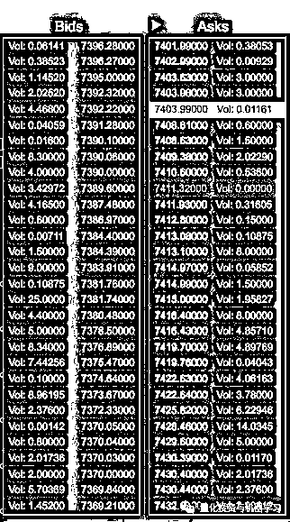
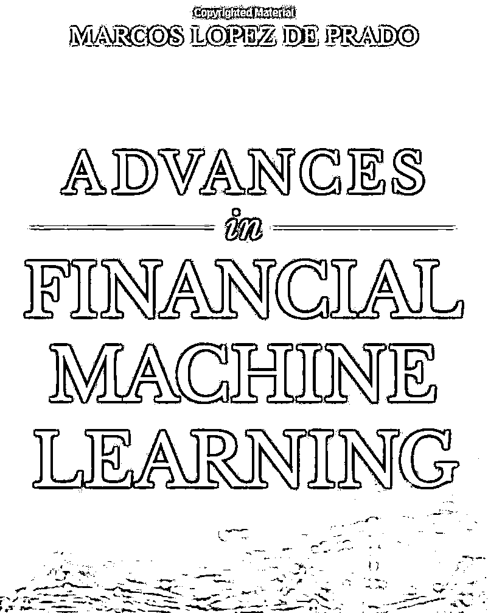
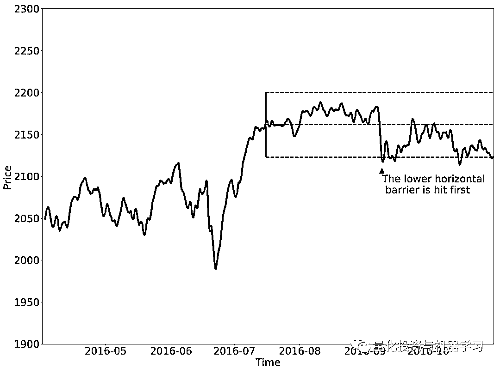
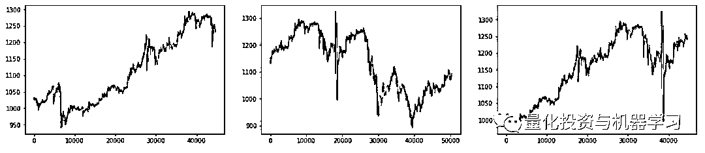
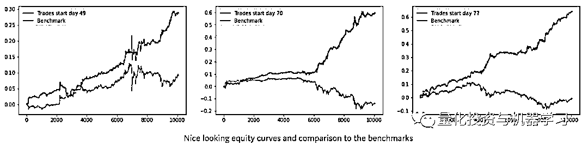
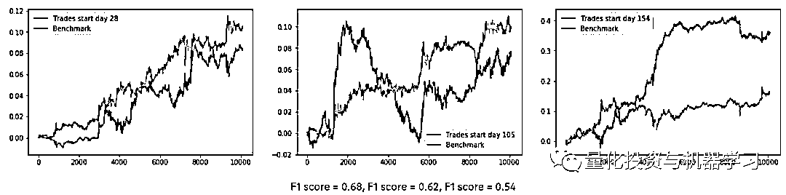

# 【独家】人工智能『AI』应用算法交易，7 个必踩的坑！

> 原文：[`mp.weixin.qq.com/s?__biz=MzAxNTc0Mjg0Mg==&mid=2653289974&idx=1&sn=88f87cb64999d9406d7c618350aac35d&chksm=802e3fe3b759b6f5eca6e777364270cbaa0bf35e9a1535255be9751c3a77642676993a861132&scene=27#wechat_redirect`](http://mp.weixin.qq.com/s?__biz=MzAxNTc0Mjg0Mg==&mid=2653289974&idx=1&sn=88f87cb64999d9406d7c618350aac35d&chksm=802e3fe3b759b6f5eca6e777364270cbaa0bf35e9a1535255be9751c3a77642676993a861132&scene=27#wechat_redirect)


请**标星公众号**，第一时间获取最新资讯

**未经允许，禁止转载**

本期作者：Alexandr Honchar

本期翻译：1+1=6 | 公众号翻译部成员

**Bars data == weak data**

大多数人在一段时间内使用 HOLC（高、开、低、收）价格和交易量。这些信息不足以反映出市场的有关信息和交易者的行为。我们需要从订单中获取更直接的价格 bids 和 asks，它将给我们最“原始”的信息。



**专注于单一资产**

我们之前的研究大多都集中在选取某一单一资产，在某一固定时间内对其进行预测，并对多空股票策略进行回测。也许一些口袋里揣着 1 万美元的散户可以这么做——他们针对某些标的建立基于指标的策略，并进行交易。但如果我们仔细考虑一下，它看起来很像对这种特定资产的过度拟合！对于单个时间序列来说，拥有一个过度适合的策略有什么意义（我们甚至不确定它在过去是否会有同样的效果）。对冲基金从不这么做。他们确实在所谓的资产范围内进行交易（可能采用相同的策略）。投资组合做多或做空这些资产使其保持平衡，或者如果使用某种策略进行交易，那么预期所有这些资产都将有良好的表现。 

此外，当你将策略性能与某个基准进行比较时（例如，在 Crypto 交易中，此基准可以是 HODL 策略），你感兴趣的是计算 Alpha（优于基准的部分）和 beta（策略风险敞口）。

**固定预测界限**

当我们准备一个数据集来训练一个模型时，每一对{x_i, y_i}都是在历史窗口中的最后一个日期之后的 N 段时间内价格变化（或价格移动方向）的窗口。让我们再想想。一段时间后。固定的时间。在金融领域，“固定”这个词很是荒谬的。我们甚至不能确定在一段时间内会有出价或要求执行交易!这是一个非常严重的问题，它实际上破坏了我们所有的预测框架。但我们还没有找到一个简单的方法来解决这个问题。目前只有两种，但它们都是极端的。第一个解决方案是停止预测，开始执行交易，这将使我们立即控制理论和强化学习。它将帮助我们处理任何固定的时间范围（至少在某种程度上），但它现在有点偏离主题。我在下面这书中找到的第二个方案，非常有趣：



公众号有提供下载：

[**传送门**](https://mp.weixin.qq.com/s?__biz=MzAxNTc0Mjg0Mg==&mid=2653289640&idx=1&sn=34e94fcbe99052b8e7381ecc48a36dc0&chksm=802e3ebdb759b7ab897cd329a680715b6f8294e63550ddf0c57b9e1320b2b7d1408c6fdca0c7&token=728085508&lang=zh_CN&scene=21#wechat_redirect)




***图片论文地址：***

***http://www.smallake.kr/wp-content/uploads/2018/07/SSRN-id3104816.pdf***

在上面的图片中，你可以看到数据集标签的“非固定时间”创建。它被称为“三重障碍”，其工作原理如下：我们建立三个障碍——一个在顶部，这意味着将利润，底部作为止损，最后一个，垂直的，将意味着某种有效期限。这种标记方法允许基于预测构建更加灵活和现实的策略。

**独立同分布（I.I.D.）**

如果你之前读过一些统计学或 ML 理论的文章，你会看到这三个字母 i.i.d。表示独立同分布，用于描述一些随机变量。对于大多数 ML 在 CV、NLP、推荐系统中的应用，甚至一些时间序列分析和信号处理中都是如此……**但是对于金融时间序列就不是这样的**！看看我们是如何准备数据的:

```py
for i in range(N):
    x_i = features[i:i+WINDOW]
    y_i = (close[i+WINDOW] - open[i+WINDOW]) / open[i+WINDOW]
```

当我们在 i 上迭代时，我们在一个时间序列上滚动某个步骤并且它会发生，不同的目标 ys 实际上不是独立的！对应的 xs 具有相同的特性，内部返回相同，只是位置不同。它实际上违反了我们所有的 ML 框架。解决方案是相当困难的，而我们自己尝试过的方法也是无效的——在使用分钟 bar 时，只采用了不重叠的窗口，这些数据是足够的。但如果你处理更大的时间表时，这样做肯定是不够的 。 

**验证集实用性**

当我们讨论用 Keras 进行神经网络训练时，我们通常传递给 fit()函数诸如 X_train, Y_train, X_test, Y_test, X_val, Y_val 这样的数据样本。（蓝色时间序列部分为训练，橙色为验证，绿色为测试）



这些分割代表了一种情况，当我们每 N 天重新训练一个网络（例如 N = 21），验证未来 3-7 天的性能，如果它满足运行在样本交易周期之外。看起来合理，如果训练，验证和测试集是相似的：例如上面第一张图片有相同的趋势和或多或少相同的波动率，所以神经网络训练向上趋势，在相同的趋势验证并测试同样的趋势会显示出良好的效果。但再过一个月会发生什么呢？情况可能会急剧变化，市场行为可能完全不同，我们的假设将完全错误！解决办法是什么？**首先，变量的分析和选择，不会随着时间而改变。这些特征的一个例子可以是基本数据或一些 bar 的模式。第二，使用交叉验证、前向测试和模型集成等。**

**回测过拟合**

对策略进行回测，该策略应该让你直观了解它将来的表现。我的意思是，你相信，如果策略在过去的数据上表现良好，那么它在未来或多或少都会带来相同的利润。这根本不是真的。



1、基于 5 分钟的开、高、低、收、成交量和一些非常简单的特征的 QDA，预测下一分钟的变化（二元分类）。

2、训练和 val 测试 21 / 30 天和 7 / 14 天（优化）。

3、用简单的多空股票策略进行回测（周调仓）。

它们几乎每周都超过基准。你能相信这些回测结果的真实性吗？

## 更多过拟合问题，请查看公众号往期推文（点击标题阅读）：

## [**美丽的回测——教你定量计算过拟合概率**](https://mp.weixin.qq.com/s?__biz=MzAxNTc0Mjg0Mg==&mid=2653289314&idx=1&sn=87c5a12b23a875966db7be50d11f09cd&chksm=802e3977b759b061675d1988168c1fec06c602e8583fbcc9b76f87008e0c10b702acc85467a0&token=728085508&lang=zh_CN&scene=21#wechat_redirect)

**好的预测 =! 好的交易**

让我们再讨论一下上面的回测。我们能从策略那里更多的了解什么？例如，让我们检查策略是否真的与 ML 算法的准确性相关联？



在上图中，有三条权益曲线和相关的 F1 分数。 首先，我们在图表中看到基准优于我们的策略，F1 得分分别为 0.68 和 0.62，在相反的情况下，F1 得分数略低于 55%。后面你还会发现 F1 得分最高的股票是 55%左右。更准确地说，夏普比率改善与 F1 得分的相关系数为-0.425。我们能得出什么结论？如果实验设置错误，数据真的是随机的，没有准备好，那么其他的一切也是随机的。**垃圾进垃圾出。**

**结论**

**机器学习应用量化金融是不同的，也是困难的**。我们确信在这个过程中仍然遗漏了很多，我们使用的资源并不能涵盖所有的问题，但是我们可以看到，仅仅使用 Keras 神经网络是远远不够的。这是一个很好的开始，可以避免过度拟合，也可以很好的证明你的数据，你的特征和你的算法有一些一般的预测价值，**但它不会让你赚钱。我们有 99.99%的把握，把剩下的 0.01%留给运气**。但我们不认为对冲基金经理会投资于这个 Alpha。

祝你好运，最后补充一句：不要放弃！这篇文章虽然告诉大家 ML 可能在量化金融领域并不是那么一帆风顺，但实际上它与机器学习应用的其他领域并没有太大的不同。无论如何，你要全面的研究整个市场，正确的建模。量化金融也是一样——我们只需要更细致地研究市场，建立模型。

**欢迎大家在文末给公众号翻译部的小伙伴们打赏！**

**推荐阅读**

[01、经过多年交易之后你应该学到的东西（深度分享）](https://mp.weixin.qq.com/s?__biz=MzAxNTc0Mjg0Mg==&mid=2653289074&idx=1&sn=e859d363eef9249236244466a1af41b6&chksm=802e3867b759b1717f77e07a51ee5671e8115130c66562577280ba1243cba08218add04f1f00&token=449379994&lang=zh_CN&scene=21#wechat_redirect)

[02、监督学习标签在股市中的应用（代码+书籍）](https://mp.weixin.qq.com/s?__biz=MzAxNTc0Mjg0Mg==&mid=2653289050&idx=1&sn=60043a5c95b877dd329a5fd150ddacc4&chksm=802e384fb759b1598e500087374772059aa21b31ae104b3dca04331cf4b63a233c5e04c1945a&token=449379994&lang=zh_CN&scene=21#wechat_redirect)

[03、全球投行顶尖机器学习团队全面分析](https://mp.weixin.qq.com/s?__biz=MzAxNTc0Mjg0Mg==&mid=2653289018&idx=1&sn=8c411f676c2c0d92b0dd218f041bee4b&chksm=802e382fb759b139ffebf633ac14cdd0f21938e4613fe632d5d9231dab3d2aca95a11628378a&token=449379994&lang=zh_CN&scene=21#wechat_redirect)

[04、使用 Tensorflow 预测股票市场变动](https://mp.weixin.qq.com/s?__biz=MzAxNTc0Mjg0Mg==&mid=2653289014&idx=1&sn=3762d405e332c599a21b48a7dc4df587&chksm=802e3823b759b135928d55044c2729aea9690f86752b680eb973d1a376dc53cfa18287d0060b&token=449379994&lang=zh_CN&scene=21#wechat_redirect)

[05、使用 LSTM 预测股票市场基于 Tensorflow](https://mp.weixin.qq.com/s?__biz=MzAxNTc0Mjg0Mg==&mid=2653289238&idx=1&sn=3144f5792f84455dd53c27a78e8a316c&chksm=802e3903b759b015da88acde4fcbc8547ab3e6acbb5a0897404bbefe1d8a414265d5d5766ee4&token=2020206794&lang=zh_CN&scene=21#wechat_redirect)

[06、美丽的回测——教你定量计算过拟合概率](https://mp.weixin.qq.com/s?__biz=MzAxNTc0Mjg0Mg==&mid=2653289314&idx=1&sn=87c5a12b23a875966db7be50d11f09cd&chksm=802e3977b759b061675d1988168c1fec06c602e8583fbcc9b76f87008e0c10b702acc85467a0&token=1972390229&lang=zh_CN&scene=21#wechat_redirect)

[07、利用动态深度学习预测金融时间序列基于 Python](https://mp.weixin.qq.com/s?__biz=MzAxNTc0Mjg0Mg==&mid=2653289347&idx=1&sn=bf5d7899bc4a854d4ba9046fdc6fe0d6&chksm=802e3996b759b080287213840987bb0a0c02e4e1d4d7aae23f10a225a92ef6dd922d8006123d&token=290397496&lang=zh_CN&scene=21#wechat_redirect)

[08、Facebook 开源神器 Prophet 预测时间序列基于 Python](https://mp.weixin.qq.com/s?__biz=MzAxNTc0Mjg0Mg==&mid=2653289394&idx=1&sn=24a836136d730aa268605628e683d629&chksm=802e39a7b759b0b1dcf7aaa560699130a907716b71fc9c45ff0e5d236c5ae8ef80ebdb09dbb6&token=290397496&lang=zh_CN&scene=21#wechat_redirect)

[09、Facebook 开源神器 Prophet 预测股市行情基于 Python](https://mp.weixin.qq.com/s?__biz=MzAxNTc0Mjg0Mg==&mid=2653289437&idx=1&sn=f0dca7da8e69e7ba736992cb3d034ce7&chksm=802e39c8b759b0de5bce401c580623d0729ecca69d13926479d36e19aff8c9c9e8a20265afff&token=290397496&lang=zh_CN&scene=21#wechat_redirect)

[10、2018 第三季度最受欢迎的券商金工研报前 50（附下载）](https://mp.weixin.qq.com/s?__biz=MzAxNTc0Mjg0Mg==&mid=2653289358&idx=1&sn=db6e8ab85b08f6e67790ec0e401e586e&chksm=802e399bb759b08d6eec855f9901ea856d0da68c7425cba62791b8948da6ad761a3d88543dad&token=290397496&lang=zh_CN&scene=21#wechat_redirect)

[11、实战交易策略的精髓（公众号深度呈现）](https://mp.weixin.qq.com/s?__biz=MzAxNTc0Mjg0Mg==&mid=2653289447&idx=1&sn=f2948715bf82569a6556d518e56c1f9e&chksm=802e39f2b759b0e4502d1aaac562b87789573b55c76b3c85897d8c9d88dbf9a0b7ee34d86a4e&token=290397496&lang=zh_CN&scene=21#wechat_redirect)

[12、Markowitz 有效边界和投资组合优化基于 Python](https://mp.weixin.qq.com/s?__biz=MzAxNTc0Mjg0Mg==&mid=2653289478&idx=1&sn=f8e01a641be021993d8ef2d84e94a299&chksm=802e3e13b759b7055cf27a280c672371008a5564c97c658eee89ce8481396a28d254836ff9af&token=290397496&lang=zh_CN&scene=21#wechat_redirect)

[13、使用 LSTM 模型预测股价基于 Keras](https://mp.weixin.qq.com/s?__biz=MzAxNTc0Mjg0Mg==&mid=2653289495&idx=1&sn=c4eeaa2e9f9c10995be9ea0c56d29ba7&chksm=802e3e02b759b7148227675c23c403fb9a543b733e3d27fa237b53840e030bf387a473d83e3c&token=1260956004&lang=zh_CN&scene=21#wechat_redirect)

[14、量化金融导论 1：资产收益的程式化介绍基于 Python](https://mp.weixin.qq.com/s?__biz=MzAxNTc0Mjg0Mg==&mid=2653289507&idx=1&sn=f0ca71aa07531bbbdbd33213f0bab89f&chksm=802e3e36b759b720138b3b17a4dd0e198e054b9de29a038fdd50805f824effa55831111ad026&token=1936245282&lang=zh_CN&scene=21#wechat_redirect)

[15、预测股市崩盘基于统计机器学习与神经网络（Python+文档）](https://mp.weixin.qq.com/s?__biz=MzAxNTc0Mjg0Mg==&mid=2653289533&idx=1&sn=4ef964834e84a9995111bb057b0fc5dd&chksm=802e3e28b759b73e0618eb1262c53aa0601fbf5805525a7c7ff40dc3db62c7704496611bdbf1&token=1950551577&lang=zh_CN&scene=21#wechat_redirect)

[16、实现最优投资组合有效前沿基于 Python（附代码）](https://mp.weixin.qq.com/s?__biz=MzAxNTc0Mjg0Mg==&mid=2653289609&idx=1&sn=c7f0b3e47025862d10bb53b6ab88bcda&chksm=802e3e9cb759b78abf6b8b049c59bf18ccfb2ead7580d1f557d36de2292f59dcbd94dcd41910&token=2085008037&lang=zh_CN&scene=21#wechat_redirect)

[17、精心为大家整理了一些超级棒的机器学习资料（附链接）](https://mp.weixin.qq.com/s?__biz=MzAxNTc0Mjg0Mg==&mid=2653289615&idx=1&sn=1cdc89afb997d0c580bf0cef296d946c&chksm=802e3e9ab759b78ce9f0cd152a680d4a413d6c8dcb02a7a296f4091993a7e4137e7520394575&token=2085008037&lang=zh_CN&scene=21#wechat_redirect)

[18、海量 Wind 数据，与全网用户零距离邂逅！](https://mp.weixin.qq.com/s?__biz=MzAxNTc0Mjg0Mg==&mid=2653289623&idx=1&sn=28a3600fd7a72d7be00b066ca0f98244&chksm=802e3e82b759b7943f43a4f6ef4a91e4153fa6b8210de9590235fa8ee66eb9811ce177054dbc&token=1389401983&lang=zh_CN&scene=21#wechat_redirect)

[19、机器学习、深度学习、量化金融、Python 等最新书籍汇总下载](https://mp.weixin.qq.com/s?__biz=MzAxNTc0Mjg0Mg==&mid=2653289640&idx=1&sn=34e94fcbe99052b8e7381ecc48a36dc0&chksm=802e3ebdb759b7ab897cd329a680715b6f8294e63550ddf0c57b9e1320b2b7d1408c6fdca0c7&token=1389401983&lang=zh_CN&scene=21#wechat_redirect)

[20、各大卖方 2019 年 A 股策略报告，都是有故事的人！](https://mp.weixin.qq.com/s?__biz=MzAxNTc0Mjg0Mg==&mid=2653289725&idx=1&sn=4b65cd1fb8331438e4c0b3d0eae6b51f&chksm=802e3ee8b759b7fe1b94e84d54cc23b0ab05853d5cd227812574b350e9fc2cce9e5f1bc6cb7a&token=1389401983&lang=zh_CN&scene=21#wechat_redirect)

****公众号官方 QQ 群****

**量化、技术人士深度交流群**

