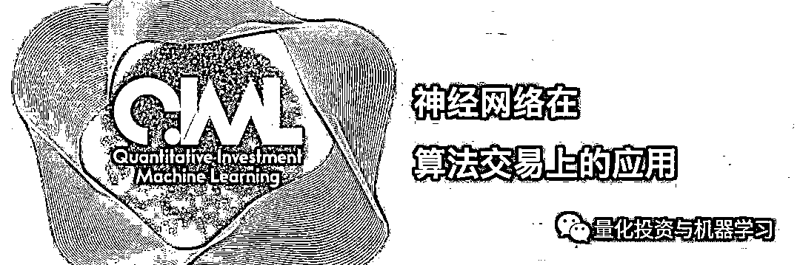

# 神经网络在算法交易上的应用系列——简单时序预测

> 原文：[`mp.weixin.qq.com/s?__biz=MzAxNTc0Mjg0Mg==&mid=2653289962&idx=1&sn=5f5aa65ec00ce176501c85c7c106187d&chksm=802e3fffb759b6e9f2d4518f9d3755a68329c8753745333ef9d70ffd04bd088fd7b076318358&scene=27#wechat_redirect`](http://mp.weixin.qq.com/s?__biz=MzAxNTc0Mjg0Mg==&mid=2653289962&idx=1&sn=5f5aa65ec00ce176501c85c7c106187d&chksm=802e3fffb759b6e9f2d4518f9d3755a68329c8753745333ef9d70ffd04bd088fd7b076318358&scene=27#wechat_redirect)


请**标星公众号**，第一时间获取最新资讯

**未经允许，禁止转载**

本期作者：Alexandr Honchar

本期翻译：Lin | 公众号翻译部成员



**这是公众号关于深度学习在金融领域特别是算法交易上的一个连载系列：**

> **1、简单时间序列预测**
> 
> 2、正确的时间序列预测+回测
> 
> 3、多变量时间序列预测
> 
> 4、波动率预测和自定义损失函数
> 
> 5、多任务和多模式学习
> 
> 6、超参数优化
> 
> 7、用神经网络增强传统策略
> 
> 8、概率编程和 Pyro 进行预测

欢迎大家**关注公众号**查看此系列。本期我们从第一部分讲起。

**正文**

我们想从零实现只基于深度学习模型的交易系统，对于在研究过程中我们遇到的任何问题（**价格预测，交易策略，风险管理**）我们都将采用不同类型的人工神经网络（ANNS）来解决，同时也会检验它们在处理这些问题的效果到底如何。

在第一部分，我们想演示**MLPs**（多层感知机）,**CNNs**（卷积神经网络）和**RNN**（递归或循环神经网络）是如何应用到时间序列预测上的。这部分中，我们不准备使用任何特征工程。而只考虑 S&P500 指数价格变化的历史数据。我们有 1950 年到 2016 年每天的开、高、低、收和成交量数据。首先，我们尝试预测下一个交易日最后的收盘价，然后，尝试预测收益率（收到开）。从 Yahoo Finance 下载数据。


链接：

***https://finance.yahoo.com/quote/%5EGSPC/history?ltr=1***

**问题定义**

我们把我们问题看作：

1、**回归问题**（预测具体的收盘价格或第二天的收益率）

2、**二分类问题**（价格上涨[1;0]或下跌[0;1]）

我们将使用 Keras 框架对 NNs 进行训练。

首先让我们准备训练数据。我们想根据 N 天前的信息来预测 t+1 的值。例如，有过去 30 天的行情数据，我们想预测明天，即第 31 天的价格是多少。

我们使用了 90%的时间序列作为训练集（把它当作历史数据），剩下的 10%作为模型评估的测试集。

这里是导入数据，将数据分成训练集和原始数据的预处理例子：

```py
def load_snp_close():
    f = open('table.csv', 'rb').readlines()[1:]
    raw_data = []
    raw_dates = []
    for line in f:
        try:
            close_price = float(line.split(',')[4])
            raw_data.append(close_price)
            raw_dates.append(line.split(',')[0])
        except:
            continue
    return raw_data, raw_dates

def split_into_chunks(data, train, predict, step, binary=True, scale=True):
    X, Y = [], []
    for i in range(0, len(data), step):
        try:
            x_i = data[i:i+train]
            y_i = data[i+train+predict]
            if binary:
                if y_i > 0.:
                    y_i = [1., 0.]
                else:
                    y_i = [0., 1.]
                if scale: x_i = preprocessing.scale(x_i)
            else:
                timeseries = np.array(data[i:i+train+predict])
                if scale: timeseries = preprocessing.scale(timeseries)
                x_i = timeseries[:-1]
                y_i = timeseries[-1]
        except:
            break
        X.append(x_i)
        Y.append(y_i)
    return X, Y
```

**回归问题 MLP**

它只是含 2 个隐藏层的感知器。隐藏神经元的数量是根据经验选择的，我们将在下一个部分进行超参数的最优化。在两个隐藏层之间，我们添加一个退出层来防止过拟合。

编译器中重要的是 Dense(1)，Activation(‘Linear’) 和 ‘mse’。我们想得到一个可以在任意范围内的输出结果（我们预测真实价格），损失函数定义成均方差。

```py
model = Sequential()
model.add(Dense(500, input_shape = (TRAIN_SIZE, )))
model.add(Activation('relu'))
model.add(Dropout(0.25))
model.add(Dense(250))
model.add(Activation('relu'))
model.add(Dense(1))
model.add(Activation('linear'))
model.compile(optimizer='adam', loss='mse')
```

让我们看看如果我们仅输入 20 天的收盘价来预测第 21 天的价格结果会是什么样的。最终 MSE= 46.3635263557，但它不是非常具有代表性的信息。下面是测试集前 150 个点的预测图，黑线是实际数据，蓝线是预测数据。我们可以清楚地看到，我们的算法甚至都不接近真实值，但可以学习到趋势。

```py
predicted = model.predict(X_test)
try:
    fig = plt.figure(figsize=(width, height))
    plt.plot(Y_test[:150], color='black')
    plt.plot(predicted[:150], color='blue')
    plt.show()
except Exception as e:
    print str(e)
```


让我们使用 sklearn 的方法 preprocessing.scale() 把时间序列数据标准化为均值为 0，方差为 1 的序列。然后用同样的 MLP 来训练。现在我们有了 MSE = 0.0040424330518（但是它是基于标准化的数据）。在下面的图中，你可以看到标准化的时间序列（黑色）和我们的预测值（蓝色）:


实际中我们使用这个模型时，我们需要对时间序列进行去标准化。我们可以通过乘上用来预测的时间序列的 20 天标准差，然后加上它的均值来实现：

```py
params = []
for xt in X_testp: 
    xt = np.array(xt)
    mean_ = xt.mean()
    scale_ = xt.std()
    params.append([mean_, scale_])

predicted = model.predict(X_test)
new_predicted = []

for pred, par in zip(predicted, params):
    a = pred*par[1]
    a += par[0]
    new_predicted.append(a)
```

这个例子中 MSE 等于 937.963649937\. 下图是还原的预测值（红色）和真实数据（绿色）：


是不是还可以？ 但是，让我们尝试更加复杂的算法来解决这个问题。

**回归问题 CNN**

我们不打算深入讲解卷积神经网络理论，但你可以查看下列非常棒的资源：

1、Stanford CNNs for Computer Vision course


链接：***http://cs231n.github.io***

2、Denny Britz 的博客，内容真的超级棒！


链接：***http://www.wildml.com***

让我们定义一个带一个全连接层的两层卷积神经网络（卷积层和池化层组合），输出和前面的相同：

```py
model = Sequential()
model.add(Convolution1D(input_shape = (TRAIN_SIZE, EMB_SIZE), 
                        nb_filter=64,
                        filter_length=2,
                        border_mode='valid',
                        activation='relu',
                        subsample_length=1))
model.add(MaxPooling1D(pool_length=2))

model.add(Convolution1D(input_shape = (TRAIN_SIZE, EMB_SIZE), 
                        nb_filter=64,
                        filter_length=2,
                        border_mode='valid',
                        activation='relu',
                        subsample_length=1))
model.add(MaxPooling1D(pool_length=2))

model.add(Dropout(0.25))
model.add(Flatten())

model.add(Dense(250))
model.add(Dropout(0.25))
model.add(Activation('relu'))

model.add(Dense(1))
model.add(Activation('linear'))
```

检验我们的结果。标准化的和恢复的数据 MSE 分别是 0.227074542433 和 935.520550172.如图所示： 


即便是看标准化数据的 MSE，这个神经网络学习效果更差。最有可能的是，更深层的架构需要更多的数据来训练，否则只是大量过滤或层数造成的过拟合。

**回归问题 RNN**

作为循环架构，我想去用两个堆叠的 LSTM 层。

更多关于 LSTM 信息读这里：


链接：

***http://colah.github.io/posts/2015-08-Understanding-LSTMs/***

```py
model = Sequential()
model.add(LSTM(input_shape = (EMB_SIZE,), input_dim=EMB_SIZE, output_dim=HIDDEN_RNN, return_sequences=True))
model.add(LSTM(input_shape = (EMB_SIZE,), input_dim=EMB_SIZE, output_dim=HIDDEN_RNN, return_sequences=False))
model.add(Dense(1))
model.add(Activation('linear'))
```

预测图如下：

MSEs=0.0246238639582,939.948636707


RNN 预测看起来更像移动平均模型，他不能学习和预测所有的波动。

所以，这是一个有点出乎意料的结果，但我们可以看到，对于这个时间序列的预测,MLPs 工作得更好。让我们看看如果我们从回归转变到分类问题的结果。现在我们不用收盘价，而用每天收益（收盘到开盘），我们想基于过去 20 天的日收益率来预测收盘价比开盘价高还是低。


**分类问题 MLP**

代码只做了微调，我们改变了最后的 Dense 层，令结果为[0;1]或[1;0]，并增加逻辑回归使输出结果为期望概率。

为了得到二元输出，下面代码做修改：

```py
split_into_chunks(timeseries, TRAIN_SIZE, TARGET_TIME, LAG_SIZE, binary=False, scale=True)
split_into_chunks(timeseries, TRAIN_SIZE, TARGET_TIME, LAG_SIZE, binary=True, scale=True)
```

同样，我们修改损失函数为二元交叉熵，并增加准确率指标。

```py
model = Sequential()
model.add(Dense(500, input_shape = (TRAIN_SIZE, )))
model.add(Activation('relu'))
model.add(Dropout(0.25))
model.add(Dense(250))
model.add(Activation('relu'))
model.add(Dense(2))
model.add(Activation('softmax'))
model.compile(optimizer='adam', 
        loss='binary_crossentropy', 
        metrics=['accuracy'])
```


不比随机猜测好到哪去（50%准确率），我们尝试些更好的。看看下面的结果。

**分类问题 CNN**

```py
model = Sequential()
model.add(Convolution1D(input_shape = (TRAIN_SIZE, EMB_SIZE), 
                        nb_filter=64,
                        filter_length=2,
                        border_mode='valid',
                        activation='relu',
                        subsample_length=1))
model.add(MaxPooling1D(pool_length=2))

model.add(Convolution1D(input_shape = (TRAIN_SIZE, EMB_SIZE), 
                        nb_filter=64,
                        filter_length=2,
                        border_mode='valid',
                        activation='relu',
                        subsample_length=1))
model.add(MaxPooling1D(pool_length=2))

model.add(Dropout(0.25))
model.add(Flatten())

model.add(Dense(250))
model.add(Dropout(0.25))
model.add(Activation('relu'))
model.add(Dense(2))
model.add(Activation('softmax'))

history = TrainingHistory()

model.compile(optimizer='adam', 
        loss='binary_crossentropy', 
        metrics=['accuracy'])
```


**分类问题 CNN**

```py
model = Sequential()
model.add(LSTM(input_shape = (EMB_SIZE,), input_dim=EMB_SIZE, output_dim=HIDDEN_RNN, return_sequences=True))
model.add(LSTM(input_shape = (EMB_SIZE,), input_dim=EMB_SIZE, output_dim=HIDDEN_RNN, return_sequences=False))
model.add(Dense(2))
model.add(Activation('softmax'))
model.compile(optimizer='adam', 
        loss='binary_crossentropy', 
        metrics=['accuracy'])
```


**结论**

我们可以看到，将时间序列预测作为回归问题对待的方法更好，它可以学习到序列的趋势并且预测价格和真实值接近。

令我们吃惊的是，**MLPs 处理序列数据的效果比被认为更擅长处理时间序列数据的 CNNs 和 RNNs 更好**。我是用非常小的数据集（16K 时间序列）和虚拟超参数选择来解释的。

你可以使用文中代码来重现结果和获得更好的结果。

我们认为可以在回归和分类上得到更好的结果，通过使用不同的特征（不仅仅是标准化的时间序列），像一些技术指标等。我们还可以尝试更高频率的数据，比如说分钟数据，可以获得更多的训练数据。

所有这些我们都将在后面的系列介绍。

**也欢迎大家在文末给公众号翻译部的小伙伴们打赏！**

原文链接：

https://medium.com/@alexrachnog/neural-networks-for-algorithmic-trading-part-one-simple-time-series-forecasting-f992daa1045a

**推荐阅读**

[01、经过多年交易之后你应该学到的东西（深度分享）](https://mp.weixin.qq.com/s?__biz=MzAxNTc0Mjg0Mg==&mid=2653289074&idx=1&sn=e859d363eef9249236244466a1af41b6&chksm=802e3867b759b1717f77e07a51ee5671e8115130c66562577280ba1243cba08218add04f1f00&token=449379994&lang=zh_CN&scene=21#wechat_redirect)

[02、监督学习标签在股市中的应用（代码+书籍）](https://mp.weixin.qq.com/s?__biz=MzAxNTc0Mjg0Mg==&mid=2653289050&idx=1&sn=60043a5c95b877dd329a5fd150ddacc4&chksm=802e384fb759b1598e500087374772059aa21b31ae104b3dca04331cf4b63a233c5e04c1945a&token=449379994&lang=zh_CN&scene=21#wechat_redirect)

[03、全球投行顶尖机器学习团队全面分析](https://mp.weixin.qq.com/s?__biz=MzAxNTc0Mjg0Mg==&mid=2653289018&idx=1&sn=8c411f676c2c0d92b0dd218f041bee4b&chksm=802e382fb759b139ffebf633ac14cdd0f21938e4613fe632d5d9231dab3d2aca95a11628378a&token=449379994&lang=zh_CN&scene=21#wechat_redirect)

[04、使用 Tensorflow 预测股票市场变动](https://mp.weixin.qq.com/s?__biz=MzAxNTc0Mjg0Mg==&mid=2653289014&idx=1&sn=3762d405e332c599a21b48a7dc4df587&chksm=802e3823b759b135928d55044c2729aea9690f86752b680eb973d1a376dc53cfa18287d0060b&token=449379994&lang=zh_CN&scene=21#wechat_redirect)

[05、使用 LSTM 预测股票市场基于 Tensorflow](https://mp.weixin.qq.com/s?__biz=MzAxNTc0Mjg0Mg==&mid=2653289238&idx=1&sn=3144f5792f84455dd53c27a78e8a316c&chksm=802e3903b759b015da88acde4fcbc8547ab3e6acbb5a0897404bbefe1d8a414265d5d5766ee4&token=2020206794&lang=zh_CN&scene=21#wechat_redirect)

[06、美丽的回测——教你定量计算过拟合概率](https://mp.weixin.qq.com/s?__biz=MzAxNTc0Mjg0Mg==&mid=2653289314&idx=1&sn=87c5a12b23a875966db7be50d11f09cd&chksm=802e3977b759b061675d1988168c1fec06c602e8583fbcc9b76f87008e0c10b702acc85467a0&token=1972390229&lang=zh_CN&scene=21#wechat_redirect)

[07、利用动态深度学习预测金融时间序列基于 Python](https://mp.weixin.qq.com/s?__biz=MzAxNTc0Mjg0Mg==&mid=2653289347&idx=1&sn=bf5d7899bc4a854d4ba9046fdc6fe0d6&chksm=802e3996b759b080287213840987bb0a0c02e4e1d4d7aae23f10a225a92ef6dd922d8006123d&token=290397496&lang=zh_CN&scene=21#wechat_redirect)

[08、Facebook 开源神器 Prophet 预测时间序列基于 Python](https://mp.weixin.qq.com/s?__biz=MzAxNTc0Mjg0Mg==&mid=2653289394&idx=1&sn=24a836136d730aa268605628e683d629&chksm=802e39a7b759b0b1dcf7aaa560699130a907716b71fc9c45ff0e5d236c5ae8ef80ebdb09dbb6&token=290397496&lang=zh_CN&scene=21#wechat_redirect)

[09、Facebook 开源神器 Prophet 预测股市行情基于 Python](https://mp.weixin.qq.com/s?__biz=MzAxNTc0Mjg0Mg==&mid=2653289437&idx=1&sn=f0dca7da8e69e7ba736992cb3d034ce7&chksm=802e39c8b759b0de5bce401c580623d0729ecca69d13926479d36e19aff8c9c9e8a20265afff&token=290397496&lang=zh_CN&scene=21#wechat_redirect)

[10、2018 第三季度最受欢迎的券商金工研报前 50（附下载）](https://mp.weixin.qq.com/s?__biz=MzAxNTc0Mjg0Mg==&mid=2653289358&idx=1&sn=db6e8ab85b08f6e67790ec0e401e586e&chksm=802e399bb759b08d6eec855f9901ea856d0da68c7425cba62791b8948da6ad761a3d88543dad&token=290397496&lang=zh_CN&scene=21#wechat_redirect)

[11、实战交易策略的精髓（公众号深度呈现）](https://mp.weixin.qq.com/s?__biz=MzAxNTc0Mjg0Mg==&mid=2653289447&idx=1&sn=f2948715bf82569a6556d518e56c1f9e&chksm=802e39f2b759b0e4502d1aaac562b87789573b55c76b3c85897d8c9d88dbf9a0b7ee34d86a4e&token=290397496&lang=zh_CN&scene=21#wechat_redirect)

[12、Markowitz 有效边界和投资组合优化基于 Python](https://mp.weixin.qq.com/s?__biz=MzAxNTc0Mjg0Mg==&mid=2653289478&idx=1&sn=f8e01a641be021993d8ef2d84e94a299&chksm=802e3e13b759b7055cf27a280c672371008a5564c97c658eee89ce8481396a28d254836ff9af&token=290397496&lang=zh_CN&scene=21#wechat_redirect)

[13、使用 LSTM 模型预测股价基于 Keras](https://mp.weixin.qq.com/s?__biz=MzAxNTc0Mjg0Mg==&mid=2653289495&idx=1&sn=c4eeaa2e9f9c10995be9ea0c56d29ba7&chksm=802e3e02b759b7148227675c23c403fb9a543b733e3d27fa237b53840e030bf387a473d83e3c&token=1260956004&lang=zh_CN&scene=21#wechat_redirect)

[14、量化金融导论 1：资产收益的程式化介绍基于 Python](https://mp.weixin.qq.com/s?__biz=MzAxNTc0Mjg0Mg==&mid=2653289507&idx=1&sn=f0ca71aa07531bbbdbd33213f0bab89f&chksm=802e3e36b759b720138b3b17a4dd0e198e054b9de29a038fdd50805f824effa55831111ad026&token=1936245282&lang=zh_CN&scene=21#wechat_redirect)

[15、预测股市崩盘基于统计机器学习与神经网络（Python+文档）](https://mp.weixin.qq.com/s?__biz=MzAxNTc0Mjg0Mg==&mid=2653289533&idx=1&sn=4ef964834e84a9995111bb057b0fc5dd&chksm=802e3e28b759b73e0618eb1262c53aa0601fbf5805525a7c7ff40dc3db62c7704496611bdbf1&token=1950551577&lang=zh_CN&scene=21#wechat_redirect)

[16、实现最优投资组合有效前沿基于 Python（附代码）](https://mp.weixin.qq.com/s?__biz=MzAxNTc0Mjg0Mg==&mid=2653289609&idx=1&sn=c7f0b3e47025862d10bb53b6ab88bcda&chksm=802e3e9cb759b78abf6b8b049c59bf18ccfb2ead7580d1f557d36de2292f59dcbd94dcd41910&token=2085008037&lang=zh_CN&scene=21#wechat_redirect)

[17、精心为大家整理了一些超级棒的机器学习资料（附链接）](https://mp.weixin.qq.com/s?__biz=MzAxNTc0Mjg0Mg==&mid=2653289615&idx=1&sn=1cdc89afb997d0c580bf0cef296d946c&chksm=802e3e9ab759b78ce9f0cd152a680d4a413d6c8dcb02a7a296f4091993a7e4137e7520394575&token=2085008037&lang=zh_CN&scene=21#wechat_redirect)

[18、海量 Wind 数据，与全网用户零距离邂逅！](https://mp.weixin.qq.com/s?__biz=MzAxNTc0Mjg0Mg==&mid=2653289623&idx=1&sn=28a3600fd7a72d7be00b066ca0f98244&chksm=802e3e82b759b7943f43a4f6ef4a91e4153fa6b8210de9590235fa8ee66eb9811ce177054dbc&token=1389401983&lang=zh_CN&scene=21#wechat_redirect)

[19、机器学习、深度学习、量化金融、Python 等最新书籍汇总下载](https://mp.weixin.qq.com/s?__biz=MzAxNTc0Mjg0Mg==&mid=2653289640&idx=1&sn=34e94fcbe99052b8e7381ecc48a36dc0&chksm=802e3ebdb759b7ab897cd329a680715b6f8294e63550ddf0c57b9e1320b2b7d1408c6fdca0c7&token=1389401983&lang=zh_CN&scene=21#wechat_redirect)

[20、各大卖方 2019 年 A 股策略报告，都是有故事的人！](https://mp.weixin.qq.com/s?__biz=MzAxNTc0Mjg0Mg==&mid=2653289725&idx=1&sn=4b65cd1fb8331438e4c0b3d0eae6b51f&chksm=802e3ee8b759b7fe1b94e84d54cc23b0ab05853d5cd227812574b350e9fc2cce9e5f1bc6cb7a&token=1389401983&lang=zh_CN&scene=21#wechat_redirect)

****公众号官方 QQ 群****

**量化、技术人士深度交流群**

