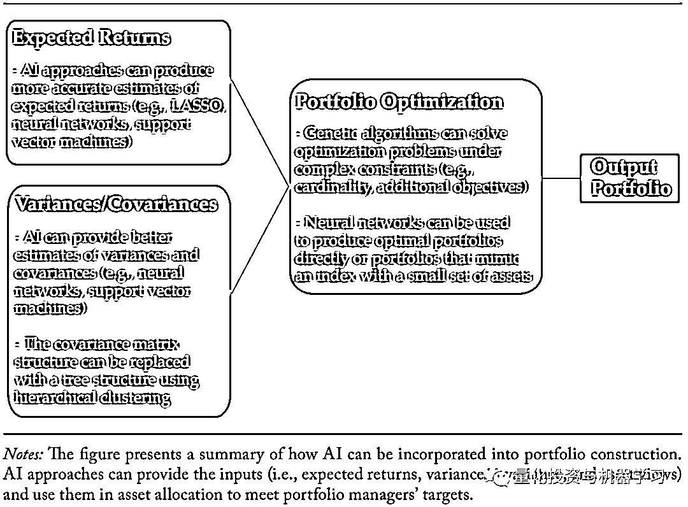
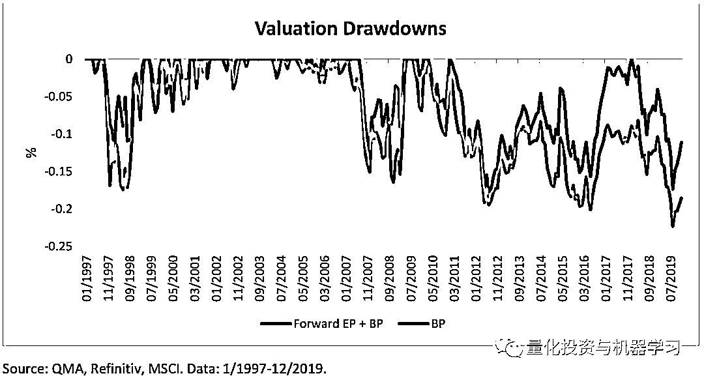
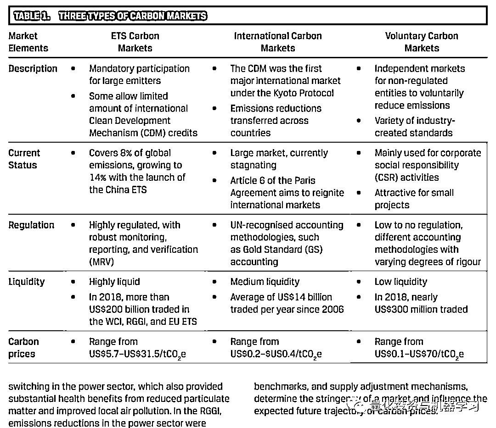
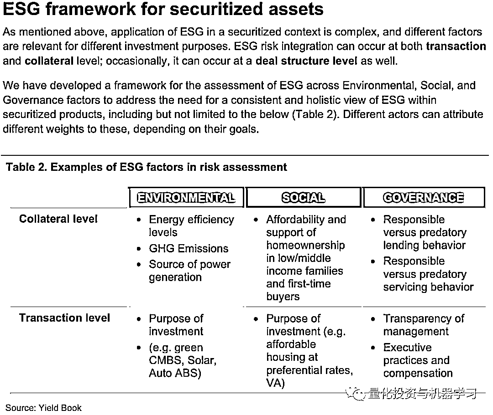
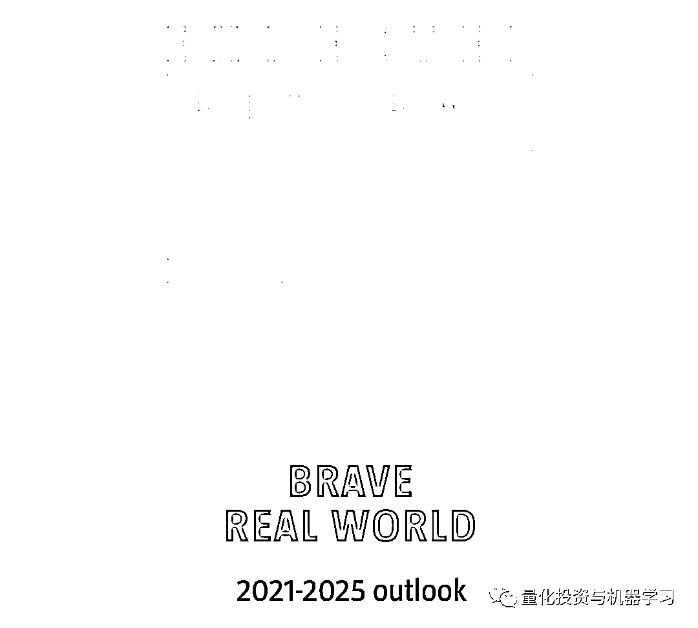
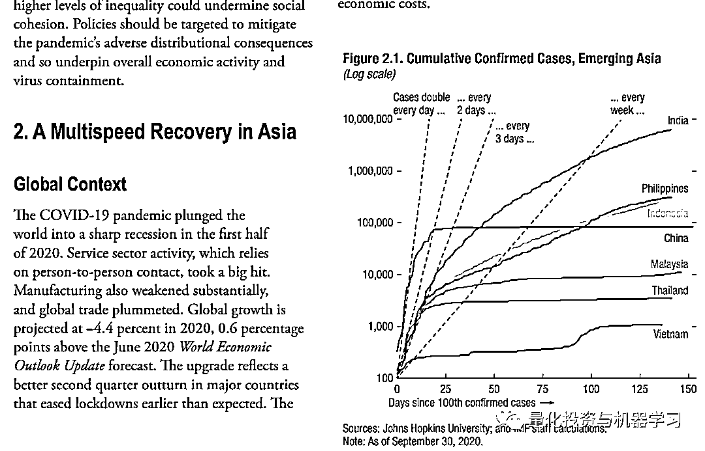

# 2020『量化圈』年度最佳论文出炉！

> 原文：[`mp.weixin.qq.com/s?__biz=MzAxNTc0Mjg0Mg==&mid=2653310056&idx=1&sn=9af613c11235301bd9d86f3844826885&chksm=802d8e7db75a076bfde1b69cfce3ae472647533fed715e8f48be0be8f2cee48d2dbbb9014c56&scene=27#wechat_redirect`](http://mp.weixin.qq.com/s?__biz=MzAxNTc0Mjg0Mg==&mid=2653310056&idx=1&sn=9af613c11235301bd9d86f3844826885&chksm=802d8e7db75a076bfde1b69cfce3ae472647533fed715e8f48be0be8f2cee48d2dbbb9014c56&scene=27#wechat_redirect)

***全网 Quant 都在看！***

一年一度的 QIML 年度总结大会如约而至~

今天我们首先要介绍的是 2020 年度最佳论文榜单。SI 评选了年度最佳：**量化、因子投资、ESG、固收、资产配置、新兴市场**领域的最佳论文，下面让我们一睹为快吧！

**获取全部论文，见文末**

**量化**

2020 年度最佳量化论文来自**CFA Institute Research Foundation：**

2020 年度最佳

✎

**量化**

**《Artificial Intelligence in Asset Management》**

“CFA 研究基金会会的这篇综述为资管行业的机构投资者在人工智能各个方面提供了充实的内容。涵盖了人工智能的概念，如深度学习、神经网络和遗传算法，以及人工智能如何在投资组合中应用等。”

相关人气论文

**1、****Quantifying Macroeconomic Risk**（Qontigo 和 State Street）

**2、How to Reduce the Sources of Forecasting Error**（Morgan Stanley IM）

**3、Tail Risk Hedging: Contrasting put and trend strategies**（AQR）

****4、Learning From a Decade of Managed Volatility**（PIMCO）**

****因子投资****

**2020 年度最佳因子投资论文来自**QMA：****

**2020 年度最佳**

**✎**

****因子投资****

****《Fasten Your Value Belt: Growth could take you for a wild ride!》****

**“QMA 提出了一个新框架，将估值倍数与基本面结合起来。利用这个框架和一种估值方法，他们探索了基本面分析和假设的变化如何影响全球股票市场的定价。QMA 发现，成长型公司比价值型公司对某些基本估值指标的变化更为敏感。最后，他们认为，成长型股票的向下重新定价是可能的，这很可能促使价值回归，这是自然的结果。”**

****

**相关人气论文**

****1、****Inverting Factor Strategies: No more ‘monkey business’**（FTSE Russell）**

****2、The Math of Value and Growth**（Morgan Stanley IM）**

****3、A Risk-based Approach to Harnessing Alternative Sources of Income**（Nuveen）**

******4、Redefining 'Value' for a Modern Economy**（Wellington Management）****

******5、Value in Recessions and Recoveries**（Research Affiliates）**** 

******ESG******

****2020 年度最佳 ESG 论文来自**CFA Institute：******

****2020 年度最佳****

****✎****

******ESG******

******《Climate Change Analysis in the Investment Process》******

****“CFA 协会的这篇这份报告旨在使用多种方法对投资界进行有关气候变化问题的教育。调查数据、案例研究和其他方法被用来帮助说明和指导。论文的重点是什么是气候变化，其潜在的经济影响，以及在进行环境、社会和治理为重点的投资分析时的最佳做法。”****

********

****相关人气论文****

******1、****The Big Green Short**（Man Group）****

******2、Corporate ESG News and the Stock Market**（Amundi）****

******3、Finding the Greenest Generation: ESG views across the generations**（Legal & General Investment Management）****

******4、Guide to Responsible Investment in Private Equity for LPs**（UN Principles for Responsible Investment）****

******固定收益******

****2020 年度最佳固定收益论文来自**FTSE Russell：******

****2020 年度最佳****

****✎****

******固定收益******

******《ESG Taxonomy for Securitized Products》******

****“利用 YieldBook 的 ESG 分类法，富时罗素采用了一种自下而上的方法，对住宅抵押贷款支持证券市场进行可持续分析。负责任的借贷行为被定义为反对掠夺性行为和高风险贷款。同样，掠夺性服务的做法在性质上不是不公平的、欺诈性的。”****

********

****相关人气论文****

******1、****Bonds Have Style: A new model for capturing bond risk premia**（Qontigo）****

******2、Informed Trading in Government Bond Markets**（Bank of England）****

******3、Fixed Income Quarterly Report, Q4**（Federated Hermes）****

******4、Fallen Angels in Focus**（MetLife Investment Management）****

******5、Q4 Fixed Income Outlook**（PGIM Fixed Income）****

******资产配置******

****2020 年度最佳资产配置论文来自**Robeco：******

****2020 年度最佳****

****✎****

******资产配置******

******《5-year Expected Returns 2021-2025: Brave real world》******

****“新冠肺炎的影响分深远。未来 5 年，投资者将面临一些重大挑战，因为他们将决定如何将资金配置到不同的资产类别，以及如何管理投资组合风险。这份 109 页的报告提供了关于投资前景、经济前景的有益见解和数据，并讨论了决定我们这个时代的五个关键议题。”****

********

****相关人气论文****

******1、****Stocks, Bonds, Bills, and Inflation® (SBBI®): 2020 Summary Edition**（CFA Institute Research Foundation）****

******2、2021 Long-Term Capital Market Assumptions**（Invesco）****

******3、Liquidity Trends in the Wake of Covid-19: Implications for portfolio construction**（Amundi）****

******4、Managing Multi-Asset Portfolios in Turbulent Market Environments**（American Century）****

******5、Capital Market Assumptions — Five Year Outlook 2021 Edition**（Northern Trust AM）**** 

******新兴市场******

****2020 年度最佳新兴市场论文来自**IMF：******

****2020 年度最佳****

****✎****

******新兴市场******

******《Navigating the Pandemic: A multispeed recovery in Asia 》******

****“国际货币基金组织这份 35 页的报告详细分析了今年经济衰退对亚洲不同经济体的影响。它考察了该地区正在进行的多速复苏，并探讨了政府如何能够放松封锁限制。该报告还强调了决策者可能面临的一些潜在风险，如不平等加剧和社会动荡。由于新冠肺炎远未结束，建议政策支持应该持续，在某些情况下，应该增加。”****

********

****相关人气论文****

******1、****The Shifting Dynamics in Emerging Markets Local Currency Investing**（PGIM Fixed Income）****

******2、Emerging Market Fixed Income: Characteristics of the asset class**（FTSE Russell）****

******3、China’s Biopharma Industry Moves Closer to Inflection Point**（Capital Group）****

******4、ESG Investing in Asia: An invisible evolution**（Manulife IM）****

******5、China Fixed Income: Investing in a new world**（UBS AM）**** 

******论文下载******

****在**后台**输入****

*******2020 最佳论文*******

******手慢无****** 

*****—End—*****

****量化投资与机器学习微信公众号，是业内垂直于**量化投资、对冲基金、Fintech、人工智能、大数据**等领域的主流自媒体。公众号拥有来自**公募、私募、券商、期货、银行、保险、高校**等行业**20W+**关注者，2019 年被腾讯云+社区评选为“年度最佳作者”。****