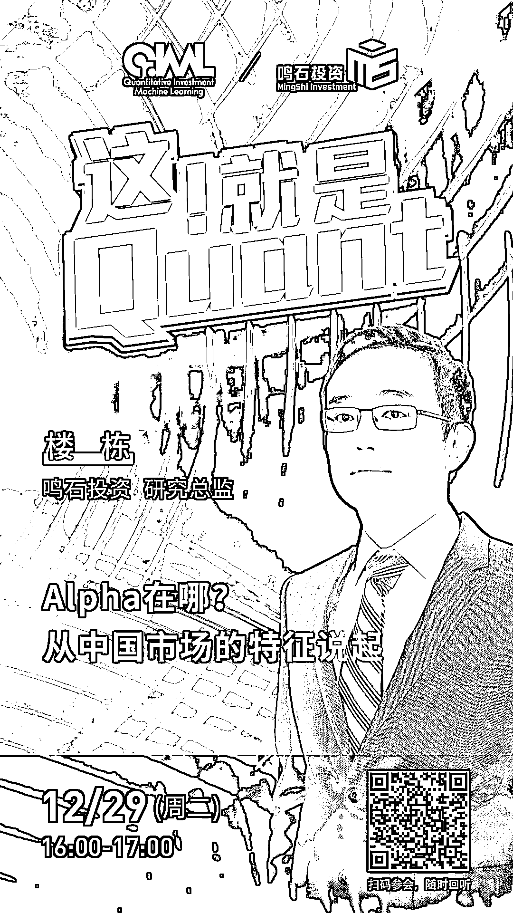

# 鸣石投资：Alpha 在哪？从中国市场的特征说起

> 原文：[`mp.weixin.qq.com/s?__biz=MzAxNTc0Mjg0Mg==&mid=2653309964&idx=1&sn=bdaf4e7bd7b3607ecc41393b471b30e7&chksm=802d8e19b75a070f9b0552a005a6dd4ce7b841d32cdc61b510516161c8079a88831306cba54d&scene=27#wechat_redirect`](http://mp.weixin.qq.com/s?__biz=MzAxNTc0Mjg0Mg==&mid=2653309964&idx=1&sn=bdaf4e7bd7b3607ecc41393b471b30e7&chksm=802d8e19b75a070f9b0552a005a6dd4ce7b841d32cdc61b510516161c8079a88831306cba54d&scene=27#wechat_redirect)

***1***

**关于鸣石投资**

鸣石投资（MingShi Investment）成立于 2010 年。作为金牛私募管理公司，鸣石团队注重因子的金融学逻辑，叠加 AI 算法，是业内少有的拥有全频段信号的私募之一。2020 年鸣石的管理规模已超百亿。鸣石倡导“Win Together”的理念，致力于以适合中国市场的量化投资方法，为投资者寻求稳健的投资收益。

***2***

**嘉宾介绍**

**楼栋** | 哥伦比亚大学计算机科学学士、耶鲁大学金融学博士。2015 年以来担任鸣石团队因子产品研究总监。

***3***

**嘉宾互动环节**

本次网络直播会议将设置：**读者问答环节**。大家如有问题向嘉宾提问，请**扫码下方二维码**填写问卷。我们将根据问题质量，选择性在直播中进行回答。欢迎大家踊跃提问哦！

***4***

**如何参会？**

**扫描**海报**二维码**

或点击**阅读原文**

即可收听！

点击**阅读原文**，收看直播与回放！