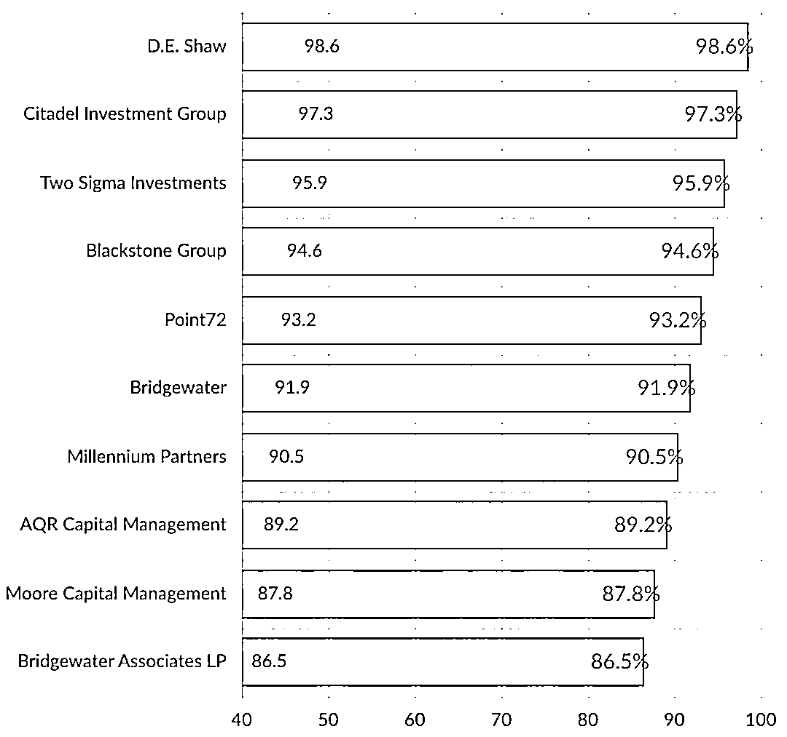

# 二千零二十、全球对冲基金年终盘点：薪酬、面试、文化、就业！

> 原文：[`mp.weixin.qq.com/s?__biz=MzAxNTc0Mjg0Mg==&mid=2653309899&idx=1&sn=613b2867bc286e7d019f9061a7dc7289&chksm=802d89deb75a00c8670c396e2a684249a9e19614136f70c0faa3948e094bab61cf6564254e28&scene=27#wechat_redirect`](http://mp.weixin.qq.com/s?__biz=MzAxNTc0Mjg0Mg==&mid=2653309899&idx=1&sn=613b2867bc286e7d019f9061a7dc7289&chksm=802d89deb75a00c8670c396e2a684249a9e19614136f70c0faa3948e094bab61cf6564254e28&scene=27#wechat_redirect)

***全网 Quant 都在看！***

#### 通过 WSO 截止 12 月提交的 104641 份报告，我们统计了全球对冲基金行业有关如下内容的数据统计内容：

*   #### 平均总薪酬

*   最难面试机构

*   最佳面试机构

*   薪酬最佳机构

*   成长机会最佳机构

*   满意程度最佳机构

*   女性最多机构

*   高校就业情况

#### **平均总薪酬**

#### 

VP 最高也是必然~

部分机构明细：

举个例子：

Citadel 第一年分析师的总薪酬为 35 万美元，其中包括 18.6 万美元的奖金。Oaktree 则支付第一年分析师 9 万美元的薪水，平均奖金为 18 万美元。

**最难面试机构**

**AQR、Oaktree、Blackstone、桥水、德邵**的难度排名前五：

**最佳面试机构**

**科恩的 Point72**面试体验最佳！后四位是：Ruane、德邵 D.E. Shaw、Citadel、Two Sigma：

我们举例看看 D.E. Shaw 面试的整体情况：

**学校分布**

*   哈佛大学（29％）

*   哥伦比亚大学（24％）

*   宾夕法尼亚大学（10％）

*   弗吉尼亚大学 UVA（10％）

*   加州大学伯克利分校（10％）

*   耶鲁大学（10％）

*   麻省理工学院（10％）

**学科分布**

*   经济学（44％）

*   计算机科学（24％）

*   数学（15％）

*   金融（12％）

*   电气工程（6％）

**D.E. Shaw 量化岗面试流程与难点（部分）**

**1、面试内容**

**电话面试、一对一面谈、技能测试、背景调查。**

**2、面试流程**

面试过程从电话面试开始，首先是一系列心算问题。在后再现场进行为期一天的长面，其间还有一次考试。面试过程非常全面：**高级概率论知识、数学证明、数据分析能力、机器学习算法如何工作的细节**等。之后需要完成背景调查，要求提交 5 封推荐信。

**3、面试中最困难或最出乎意料的问题**

有 100 个人站成一圈，贴上 1 到 100 的标签。第一个人拿到一把刀，kill 站在他旁边的人，然后交给下一个活着的人。也就是说，一号会 kill 二号，把刀交给三号。第三个人会遵循和第一个人一样的行为，这个过程一直持续下去，直到圈子里的所有人都被 kill，只剩下一个人。那这个人的标签是多少?

可以把它类似看作是 Josephus 问题。大家自己想想，你要去面试 D.E. Shaw，能解出来吗？

**在今后的推文中，公众号会为大家详细介绍头部对冲基金有关面试的内容，敬请期待！**

**薪酬最佳机构**

求职者对**德邵 D.E. Shaw**的薪酬最为满意，接下来是 Citadel、Two Sigma、BlackStone、Point72 等：

德邵 D.E. Shaw 薪资情况（样本数据）：

**成长机会最佳机构** 

求职者对在德邵 D.E. Shaw 工作的成长发展满意程度又一次获得第一。接下来是 AQR、Two Sigma、Citadel、Point72：

****

**满意程度最佳机构** 

Two Sigma 成为求职者满意程度最佳的机构。接下来是德邵 D.E. Shaw、Citadel、BlackStone、Point72：

****

**高校就业情况**

总体百分比分布表中绿色数字代表，某所高校在某一机构中所占比例相对于其自身总体分布百分比较高。

哈佛大学、哥伦比亚大学、宾夕法尼亚大学、麻省理工学院、普林斯顿大学、加州大学伯克利分校、纽约大学、斯坦福大学、康奈尔大学、德克萨斯大学奥斯汀分校、杜克大学、沃顿商学院、芝加哥大学、耶鲁大学、达特茅斯学院、弗吉尼亚大学、伊利诺伊大学厄巴纳-香槟分校、卡内基梅隆大学、布朗大学、密歇根大学等都是很受欢迎的！

总体百分比（部分）

**女性最多机构**

每家机构向上和向下箭头表示的是与上一年度相变化情况。= =表示没有变化，+ +表示有新公司加入。

第一名是这家机构：

量化投资与机器学习微信公众号，是业内垂直于**量化投资、对冲基金、Fintech、人工智能、大数据**等领域的主流自媒体。公众号拥有来自**公募、私募、券商、期货、银行、保险、高校**等行业**20W+**关注者，2019 年被腾讯云+社区评选为“年度最佳作者”。