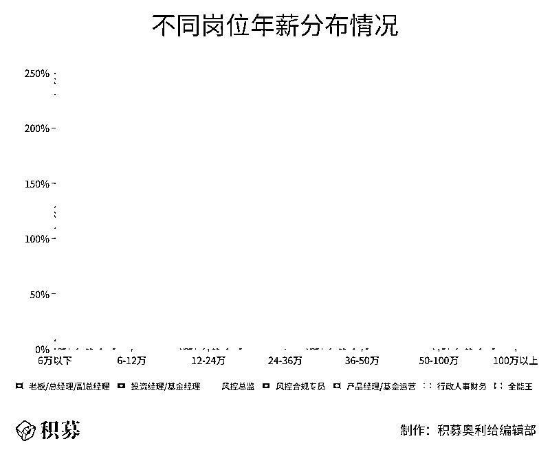
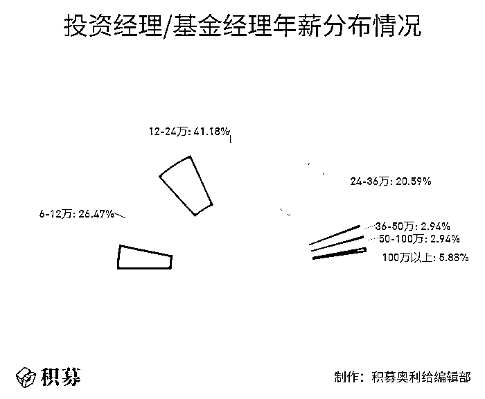
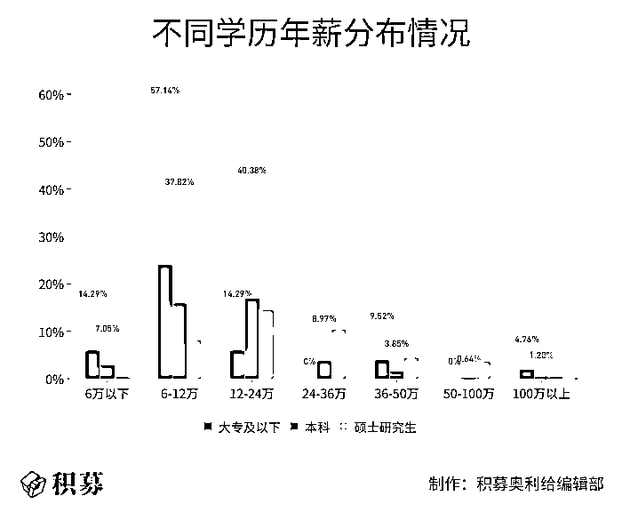

# 日薪月亿！2020 年私募人『薪资』大盘点！

> 原文：[`mp.weixin.qq.com/s?__biz=MzAxNTc0Mjg0Mg==&mid=2653309781&idx=1&sn=09c6609f45f9711fd10e7731aaf44865&chksm=802d8940b75a0056a4abd0785ce5cef258fd8b83ed204d491aaf1bf3d0e61e00515a64027361&scene=27#wechat_redirect`](http://mp.weixin.qq.com/s?__biz=MzAxNTc0Mjg0Mg==&mid=2653309781&idx=1&sn=09c6609f45f9711fd10e7731aaf44865&chksm=802d8940b75a0056a4abd0785ce5cef258fd8b83ed204d491aaf1bf3d0e61e00515a64027361&scene=27#wechat_redirect)

***全网 Quant 都在看！***

转眼间 2020 年就马上过去了，年初制定的目标实现了吗？升职加薪的愿望成真了吗？在被疫情困扰的这一年里，私募从业人员的薪资状况怎么样？公司业务受到影响了吗？对行业未来发展充满信心吗？针对这些问题，积募做了个调查——私募从业人员薪资大揭秘。本期内容就为大家展示调查的结果。**特别提醒**★ 本结果仅供参考，请谨慎使用。★ 本结果统计岗位以风控、运营及产品经理为主，其他岗位可参考。 

年底了，春节放假回家最怕啥？不外乎就两件事儿：除了被催婚，就是被问工资！面对这些世纪难题，你都是怎么处理的？留言和我们说说吧！

对于关乎大家生命线的工资问题，积募前些天做了个《私募人薪资大揭秘》的小调查，收到了 273 个私募小伙伴的回应，在此对大家表示特别的敬意！今天，我们就来为大家揭晓调查结果，看看你的薪资有没有拖后腿？

**01**

**社会私募人的年薪有多少？**

话不多说，先来看看大家最关心的薪资水平，我们从私募行业整体情况，以及证券、股权等不同类型的角度进行了统计。

从上面两张图片可以看出，**私募从业人员年薪最多的是 12-24 万，其次是 6-12 万，这两个档次占比将近 70%。**

**证券类私募**从业人员年薪分布最多的是 6-12 万，其次是 12-24 万；**股权/创投类私募**从业人员年薪最多的档次是 12-24 万，其次是 6-12 万。从上面的图中可以看出，股权/创投类的薪资状况整体好于证券类。其他类、资产配置类私募由于样本数量较少，在此不作展示。

影响薪资水平的因素有很多，比如个人能力/学历背景、职位及工作内容、管理费及业绩报酬收入、行业变化，有时候还要看老板心情。

从我们调查的情况来看，**27.41%的人认为薪资水平与管理费及业绩报酬收入相关，22.84%的人认为与职位及工作内容相关****，**排名第三的是看老板心情，占比达 16.24%，这个选项还真是有点微妙。

还有小伙伴认为，私募人的薪资收入与资产管理规模相关，小编理解本质上也是管理费与业绩报酬收入相关，因为管理规模高了，收入也会增加。来自央企的小伙伴还会受到工资管控的影响，这个也是有很多无奈，市场化的薪资水平或许会有很大空间，但也缺乏稳定性，而央企的工资管控或许也是稳定性与上升空间的互相平衡，正所谓鱼和熊掌不可兼得。

**02**

**不同管理规模、岗位**

**年薪有多少？**

这部分我们来看两个私募行业特有的因素对薪资的影响：管理规模和职位。

**不同管理规模，薪资都有多少？**

从管理规模的角度来看，我们分四个梯度来分析：

**■ 管理规模 100 亿以上**

根据调查结果，基金管理规模在 100 亿以上的私募从业人员，39.53%的人年薪范围是 12-24 万，20.93%的人年薪范围是 6-12 万，16.28%的人年薪范围是 24-36 万，13.95%的人年薪范围是 36-50 万。

**■ 管理规模 50-100 亿**

这个规模的管理人有点意思，40.74%的人年薪范围是 12-24 万，22.22%的人年薪范围是 24-36 万，14.81%的人年薪范围是 50-100 万，整体情况甚至好于百亿私募。 

**■ 管理规模 10-50 亿**

根据调查结果，这个管理规模的从业人员年薪最多的分布在 12-24 万，达到 45.45%；其次是 6-12 万，占比 25.76%；24-36 万年薪的占比 12.12%。

**■ 管理规模 10 亿以下**

这个梯度的从业人员中，43.65%的年薪水平是 6-12 万，31.75%的年薪水平在 12-24 万，11.11%的年薪水平在 24-36 万。

综合来看，管理规模在 10 亿以上的私募从业人员，其年薪范围分布占比最多的是 12-24 万；管理规模在 10 亿以下的超过 40%是 6-12 万。所以，管理规模对薪资具有一定的影响，双方呈正相关。

**不同岗位，薪资都有多少？**

下图展示了私募管理人不同工作岗位的年薪分布情况，我们再来详细看看具体的调查结果。

**■ 老板/总经理/副总经理**

作为高管人员，他们自然而然地是年薪最高的一个梯队，年薪范围主要是 36 万以上。

**■ 投资经理/基金经理**

令人意外的是，投资经理/基金经理的薪资并不是特别高。调查显示，41.18%的人年薪范围在 12-24 万，20.59%的人是 24-36 万。年薪百万的只有 5.88%。

**■ 风控总监/风控合规专员**

作为监管关注度较大的关键人员，风控总监的年薪范围也不是特别高，和投资经理/基金经理一样，41.18%的人年薪范围在 12-24 万，23.53%的人年薪范围在 6-12 万，13.73%的人年薪范围在 24-36 万。

风控合规专员的年薪整体稍微低一些，35.29%的人分布在 6-12 万，31.37%是 12-24 万，15.69%分布在 24-36 万。

**■ 产品经理/基金运营**

产品经理和基金运营的年薪情况中，51.28%的人是 12-24 万，35.9%的人是 6-12 万，10.26%的人是 24-36 万。 

**■ 行政人事财务**

这几个岗位的年薪最多的是 6-12 万，占比 33.33%；其次是 12-24 万，占比 29.17%；第三是 24-36 万，占比 20.83%。

**■ 全能王**

行政、人事、财务、运营等，有时候只需一个人就能搞定，我们称之为“全能王”，他们的年薪主要是 6-12 万，占比 46.81%；12-24 万占比 36.17%，24-36 万占比 8.51%。

**03**

**城市、性别、学历、工作年限**

**对薪资有什么影响？**

除了私募行业具有特色的管理规模、岗位以外，我们的城市、性别、学历、工作年限，对薪资有什么影响吗？一起来看看！

从城市分布来看，一线城市私募从业人员的薪资普通高于二三线城市。其中，一线城市 40.12%的人年薪在 12-24 万，二线城市 42.31%的人年薪在 6-12 万，三线城市 52.38%的人年薪在 6-12 万。

从性别来看，男女年薪差距不大，大家看图即可，不做赘述。

从学历来看，和我们猜测的基本一致，学历越高整体薪资也更好一些，具体如上图。

从工作年限来看，年限高的整体薪资也更高。其中，工作时间在 1 年以下的人，年薪主要在 12 万以内，工作时间在 1-5 年的年薪主要分布在 6-12 万之间，工作时间 5-10 年的年薪主要分布在 12-24 万，工作时间在 10 年以上的年薪主要分布在 12-36 万之间。

**04**

**你对 2020 年的薪资还满意吗？**

**你们有年终奖吗？**

从薪资满意度上来看，我们设置了 1-5 共计五个档次，1 代表非常不满意、5 代表非常满意，其中**49.08%的人选择了中间第三档的一般满意度****，**其次是第四档比较满意的占比有 18.32%，非常满意的仅有 4.76%。

在调薪这件事上，40.66%的小伙伴在 2020 年调整了薪资标准，33.33%的小伙伴明确表示明年还将有调薪计划。有位小伙伴留言说，每年会固定涨薪，涨薪比例根据工作情况而定，小编忍不住想问：这是哪家私募，这么好！ 

除此之外，2020 年末将至，大家最关心的是年终奖，各位私募小伙伴能拿到吗？从我们的调查结果来看还很可喜的，希望今年能把去年没过好新年全都补上！

**05**

**你对私募行业未来发展**

**有信心吗？**

2020 年，突如其来的新冠疫情席卷全国，上半年多个行业停工停产。私募小伙伴们都受到疫情影响了吗？在我们的调查中，意外地发现 69.6%的私募人表示，疫情对公司并没有产生实质性的影响，23.44%的小伙伴表示影响很大，差点过不下去。有的小伙伴表示：

有点影响，但影响没有太大

对募资端有影响

一般，明年是关键

还以为疫情会对募投管退都有影响，没想到只对退有影响

有一定/部分影响

对于 2020 年制定的业绩目标，49.82%的私募小伙伴表示妥妥滴完成了，27.84%的小伙伴没完成。近半数完成了全年目标，数据好于我们的预期。

自疫情以来，2020 年虽然踏着荆棘前行，坎坷不断，但我们仍然看到许多亮点在闪光，比如二级市场的火爆、注册制改革的实施、IPO 数量的增长、行业的合规稳健发展……各位私募小伙伴对于未来的发展仍然充满着信心。不信，来看我们的调查：

**06**

**关于 2020 年的私募行业，还有什么想说的？**

关于 2020 年的私募行业，你有什么想说的？一起来看看大家写了什么，和你心中所想是否一致呢？

**第一类：自我鼓励，认真前行的小伙伴**

*   努力吧，私募人。沧海横流，方显英雄本色；时代弄潮，堪称经世掣鲸

*   不忘初心，砥砺前行

*   踏实做事才能长久

*   逆境中生存下去不易，对企业和团队都是一种锻炼，熬过去会有更强生命力，更广阔的天地！

*   稳住

*   提高公信力，提高合规化，一起加油！

*   继续努力，加油

*   黑暗中继续前行

*   快过去吧，希望明天会更好

*   加油吧，老板们，带我们吃饭

*   熬下来不容易，再接再厉

*   坚持意味着一切

*   加油吧，希望能更好地发展

*   加油吧，私募的小伙伴们

*   现金为王，先活下来再说！

*   尽人事，听天命 

**第二类：对未来充满期望和信心的小伙伴**

*   希望公司业绩越来越好，奖金越来越多会更好的！

*   希望投资业绩继续上升

*   希望轻舟已过万重山吧！

*   希望早日走出募资寒冬，融通国际国内资本，扩展产品范围，遴选优质标的

*   注重合规同时，拓展创新业务。疫情虽有影响，但是阻碍不了大家前进的步伐。

*   愿私募越来越好

*   向阳而生

*   抓住机会发展

*   一切都还顺利，希望 2021 年也顺利

*   要做精品的 PE 机构

*   一片大好~

*   看好私募发展

*   寒冬即将过去！春暖花开～

*   危机中蕴涵机会

*   中国的私募一定会更成熟～

*   挥手 2020，展望 2021……监管爸爸们轻点虐。

*   2020 结束了，2021 合规进行中……

*   打铁还需自身硬        

**第三类：冷静思考和提出建议的小伙伴** 

*   希望有关部门能合理完善私募行业，尽量简化制度流程！尽快解决其他类型备案！

*   监管加强，希望退出渠道更加通畅。

*   拓宽募集市场化资金渠道

*   希望在这个行业的寒冬，正规专业化的机构能韬光养晦，磨练内功，以后随着行业的发展能越来越好

*   快速发展的行业，两极分化严重，合规经营，投资者教育越来越重要！

*   优胜劣汰，有利于行业更好的发展

*   IPO 退出大年，募资小年

*   监管日趋严格，行业越来越正规

*   今年疫情爆发以来，实体企业受到波及影响较大，私募二级市场应该还没有多大影响，估计一级不太好做，但相比实体企业还是有优势的，至少失业率应该不会很大，现在行业监管并不太明确，但是随着行业发展以及推动坚信行业会越来越正规化，也会完全纳入监管体系，但是伴随着正规化，行业分化也会加剧，有能力的强者恒强，没能力的可能会死掉一批。

*   疫情使得实体经济发展出现了一定阻碍

*   希望多多发扬员工文化

*   希望国家给予充分的政策支持，行业规范逐渐完善，基金有更多的退出方式。

*   不知道做什么事的时候，做好事；不知道做什么人的时候，做好人。练好内功，等待机会。

*   且行且珍惜，金融业本质上还是看天吃饭，要敬畏市场。

*   还是要做好自己的研究，拿得住票

*   合规发展很重要

*   行业越来越规范，规模逐步增加，私募基金为更多人熟知

*   合规性更强，事情更多，募资更难

*   监管不要太严啊

*   希望各种法规不要变化太多   

**第四类：最最单纯直白小伙伴**

*   我们公司很棒

*   让我拿 50 年终奖吧哈哈哈

*   让 IPO 来的更猛烈一些吧

*   牛市来吧！大家都多赚钱！

*   活久见

*   冲冲冲！

*   让我钱多多

*   魔幻的 2020，利好茅台

*   活过来了

*   多发奖金

*   我只想加工资

*   中个彩票吧

*   让我赚钱

*   合规搞钱！

*   当然是越来越多靠谱的！方便找工作

*   早日完成业绩

**第五类：表示度日艰难的小伙伴**

*   暴雷太多，接下来很难

*   几家欢喜几家愁

*   艰难的度过，艰难中前行

*   监管越来越严，工作量越来越大…

*   原来做运营和一般公司行政到手差不多，那我为什么要这么辛苦

*   太难了，两极分化严重

*   活下来，这很重要～

*   没啥可说的，大家都很难，赶紧翻遍吧    

量化投资与机器学习微信公众号，是业内垂直于**量化投资、对冲基金、Fintech、人工智能、大数据**等领域的主流自媒体。公众号拥有来自**公募、私募、券商、期货、银行、保险、高校**等行业**20W+**关注者，2019 年被腾讯云+社区评选为“年度最佳作者”。