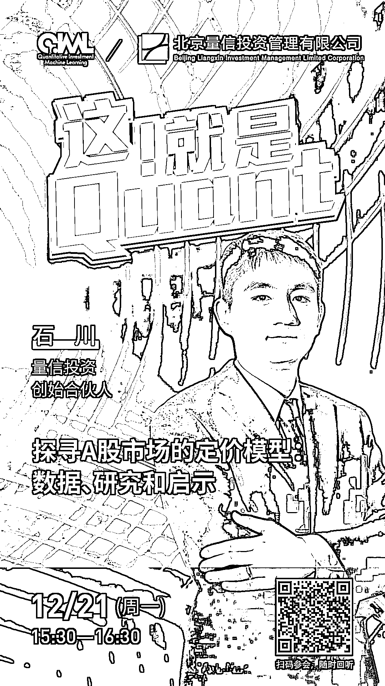

# 石川博士：探寻 A 股市场的定价模型：数据、研究和启示

> 原文：[`mp.weixin.qq.com/s?__biz=MzAxNTc0Mjg0Mg==&mid=2653309631&idx=1&sn=0e0d4ace76a7756140a94c184d5bec9c&chksm=802d88aab75a01bc3a1d4330bd8c596ed25032dc6ba4926cd9a02a1e981d00f60ad3ffbc6b3c&scene=27#wechat_redirect`](http://mp.weixin.qq.com/s?__biz=MzAxNTc0Mjg0Mg==&mid=2653309631&idx=1&sn=0e0d4ace76a7756140a94c184d5bec9c&chksm=802d88aab75a01bc3a1d4330bd8c596ed25032dc6ba4926cd9a02a1e981d00f60ad3ffbc6b3c&scene=27#wechat_redirect)

***1*** 

**嘉宾介绍**

**石川** | 北京量信投资管理有限公司创始合伙人；清华大学学士、硕士，麻省理工学院博士；知名期刊 Computers in Industry 编委会委员；因子投资中文版首著《因子投资：方法与实践》的领衔作者。

***2***

****嘉宾互动环节****

本次网络直播会议将设置：**读者问答环节**。大家如有问题向嘉宾提问，请**扫码下方二维码**填写问卷。我们将根据问题质量，选择性在直播中进行回答。欢迎大家踊跃提问哦！

***3***

**如何参会？**

**扫描**海报**二维码**

或点击**阅读原文**

即可收听！

点击**阅读原文**，收看直播与回放！