# 私募行业 2020 年度『十大关键词』出炉！

> 原文：[`mp.weixin.qq.com/s?__biz=MzAxNTc0Mjg0Mg==&mid=2653309513&idx=1&sn=3998923f1e5cef1c0753c1814590e82a&chksm=802d885cb75a014a71561ffe266e948e55170632ee6fc3eeabccffb6f0cbbf36194732869f48&scene=27#wechat_redirect`](http://mp.weixin.qq.com/s?__biz=MzAxNTc0Mjg0Mg==&mid=2653309513&idx=1&sn=3998923f1e5cef1c0753c1814590e82a&chksm=802d885cb75a014a71561ffe266e948e55170632ee6fc3eeabccffb6f0cbbf36194732869f48&scene=27#wechat_redirect)

***全网 Quant 都在看！***

2020 年只剩下最后十几天了，各类年度总结盘点也提上了日程，今天我们来做 2 个盘点：

*   私募打工人的个人年度总结

*   2020 年私募行业十大热门关键词

**01**

首先是私募打工人的个人

**年度总结**

**私募人的工作：一报到底**

**▼**

**私募人的存款：一目了然**

▼

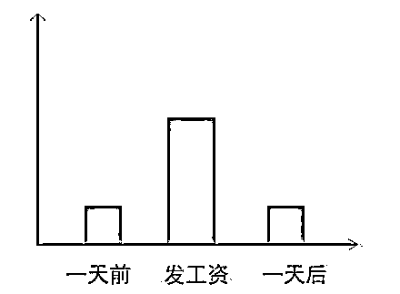

**私募人的备案：极速 T+0**

▼

**私募人的愿望：项目 IPO**

▼

**私募人的发量：盈盈一握**

▼

**私募人的状态：生活艰难**

▼

**私募人的体重：节节攀升**

**▼**

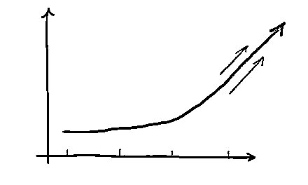

当然，大家也在

不断地学习和提升自己 

比如：

**学会了一门乐器** 

▼

**练就了一个好心态**

▼

......

总的来说 2020

用年度流行语概括就是

▼

**02**

接下来，我们说点正经的！

2020 年即将结束，我们选择了 10 个关键词，来回顾今年的私募行业，不知道是否和你想的一样呢？欢迎文末留言，与大家分享你心目中的年度关键词！

KEYWORDS

*   15 万亿

*   百亿私募

*   外资私募

*   公奔私

*   量化大年

*   IPO 大爆发

*   创业板注册制

*   异地办公

*   监管检查及处罚

*   抗击疫情

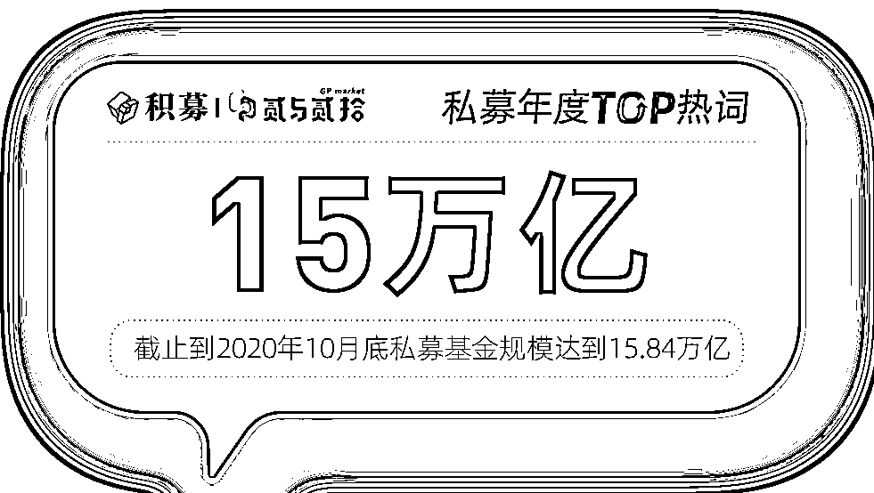

2020 年，私募基金管理规模再上新台阶。**据中国基金业协会数据显示，2020 年 8 月，私募基金规模正式突破 15 万亿，截止到 10 月底达到 15.84 万亿。**其中，证券类私募基金管理规模为 3.68 万亿，股权/创投类管理规模为 10.97 万亿，其他类 1.18 万亿，资产配置类 8.76 亿。

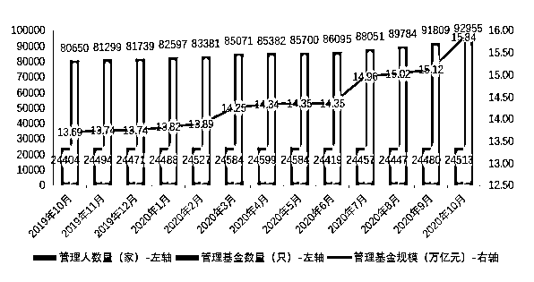

图片来源：中国基金业协会

**今年以来，私募基金管理规模连续突破 14 万亿和 15 万亿大关，背后是证券类基金的大爆发。**由于 A 股走出结构性行情，基金的赚钱效应凸显，权益市场的吸引力显著提升，2019 年底，证券类私募基金规模仅有 2.45 万亿，**今年 10 月个月增长了 1.23 万亿，增幅达 50.2%。**与此同时，股权/创投类私募基金管理规模在今年前 10 个月也增长了 1.23 万亿，增幅为 12.63%。

对于私募行业来来说，2020 年是飞速发展的一年，特别是 A 股结构化特征明显，证券类私募在本轮行情中实现大规模扩容。据私募排排网统计，**截止到 12 月初，国内百亿私募数量为 62 家。**

从百亿私募年内（1-11 月）收益表现来看，老牌百亿与新锐百亿收益不相上下。根据私募排排网不完全统计，百亿私募前 11 月平均收益 33.02%，较上月提升 4.71 个百分点，其中股票策略百亿私募平均收益超过 40%，为 40.12%。

从高收益私募来看，40 家百亿私募前十月平均收益超过 20%，在 56 家正常更新净值的百亿私募中数量占比达到 71.43%，其中有 9 家百亿私募平均收益更是超过 50%，最高收益超过 80%。

**百亿私募名单及核心策略**

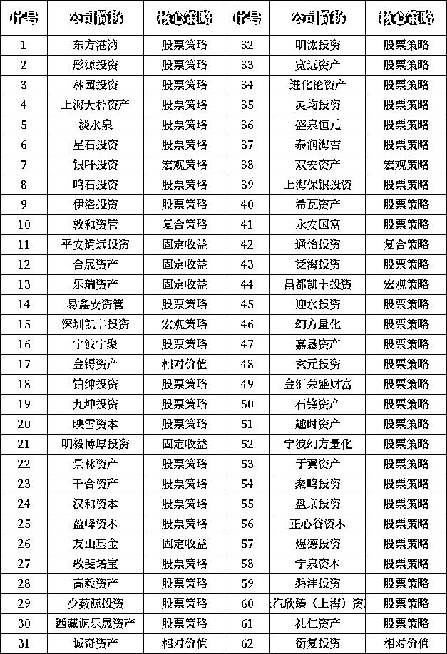

图片来源：私募排排网

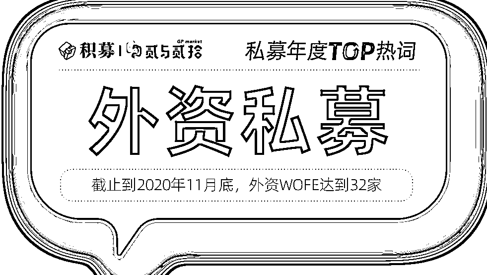

随着国内资本行情大好，外资巨头也在加速布局。**截止到 2020 年 11 月底，外资 WOFE 达到 32 家，其中今年入驻****的有 9 家****，**与外资进军中国高峰期的 2017 年持平。

**截止到 12 月 14 日，32 家外资私募在中基协共计备案了 95 只产品。**其中，产品备案最多的是瑞银资产管理（上海）有限公司，目前总共备案了 16 只产品，管理规模在 20-50 亿。

值得一提的是，**有 21 家外资私募已经成为中国基金业协会的观察会员，10 家已经申请了投顾资质。**其中路博迈投资管理（上海）有限公司于今年 6 月 23 日备案完成的“华润信托•路博迈中国股票 1 号集合资金信托计划”，是外资私募发行的首只担任投顾的信托产品。据私募排排网数据显示，成立半年以来，该产品已实现累计收益 27.30%，超过其同公司的代表作“路博迈债券 1 号”15.52%的累计收益率。

**32 家外商独资私募证券投资基金管理人**

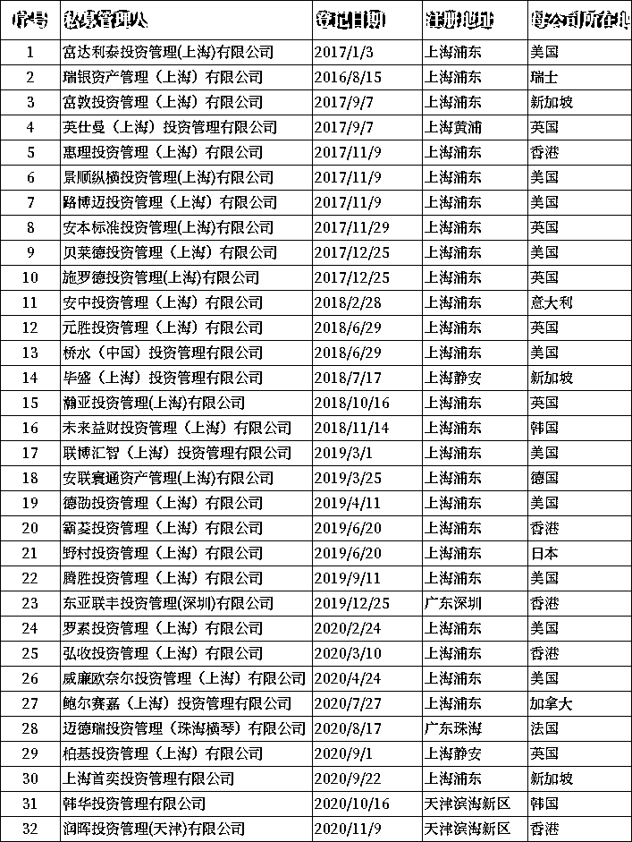

数据截止：2020.11

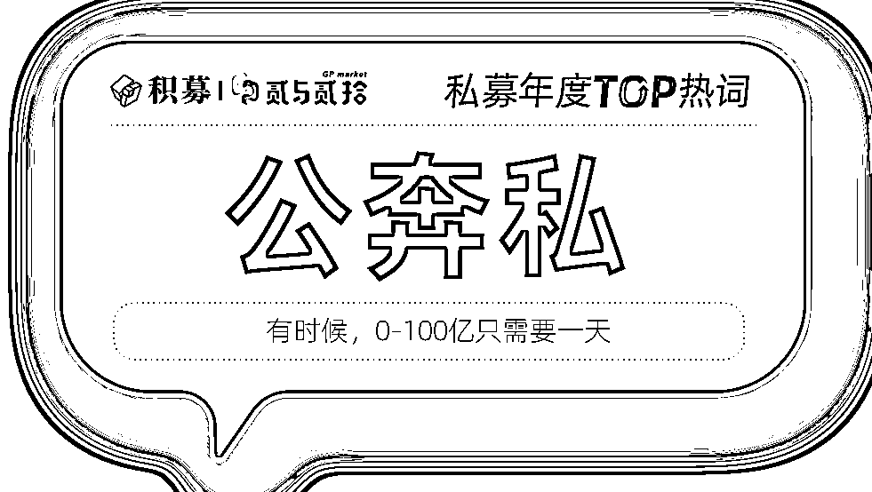

自 2015 年经历了基金经理“公奔私”的高峰过后，随着今年 A 股市场结构性行情持续演绎，又有不少基金经理离开公募，寻求新的发展。

**2020 年 8 月 29 日，原东证资管副总林鹏担任法人代表的上海和谐汇一资产管理有限公司完成私募管理人登记。**10 月 19 日，和谐汇一正式开售首只私募基金——和谐汇一远景系列。发行首日，该产品单日已售 150 亿，创造了国内二级市场私募基金单日募集纪录。至此，林鹏的和谐汇一资产跃升为百亿私募行列。

**2020 年 12 月 9 日，原工银瑞信基金、工银瑞信资管董事长郭特华选择“公奔私”，出资设立了一家证券类私募公司——海南富道私募基金管理有限公司，**并担任法定代表人、总经理。郭特华是公募行业从业时间最长的基金公司女性掌门人，她从 2005 年到 2019 年一直担任工银瑞信基金总经理，2019 年转任董事长，陪跑工银瑞信基金 15 年之久。

两个公募大佬“奔私”引起了行业的广泛关注，权益市场的火热行情、私募基金灵活的收费标准和投资策略，以及投资者观念逐步走向成熟，都对“公奔私”产生了较大吸引力。

今年以来，国内量化行业发展迅猛，各类量化私募产品业绩可观，掀起了规模增长的浪潮。私募排排网数据显示，**截至 11 月底，年内共计发行量化策略私募产品 4692 只，同比增幅达到 40.06%。目前量化私募管理规模已经超过 5000 亿元，晋升为百亿私募的量化私募数量达到 10 家，和去年底的 5 家相比实现翻倍**，包括金锝资产、进化论资产、明汯投资、九坤投资、灵均投资、诚奇资产、鸣石投资、幻方量化、宁波幻方量化和衍复投资。

过去十年里，量化私募发展迅速，甚至出现“量化四大天王”的说法。近年来，优质资产稀缺，量化策略凭借风险可控、低回撤、收益稳健等优势，开始受到各类投资者的关注，未来量化策略仍然具有较大的发展空间，海内外高端人才的引进、量化策略的迭代进步都会推动行业进一步向前，但同时竞争也越来越剧烈。

**2020 年 1-11 月量化私募产品备案情况**

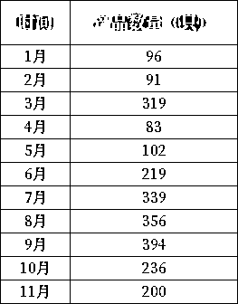

数据来源：第一财经

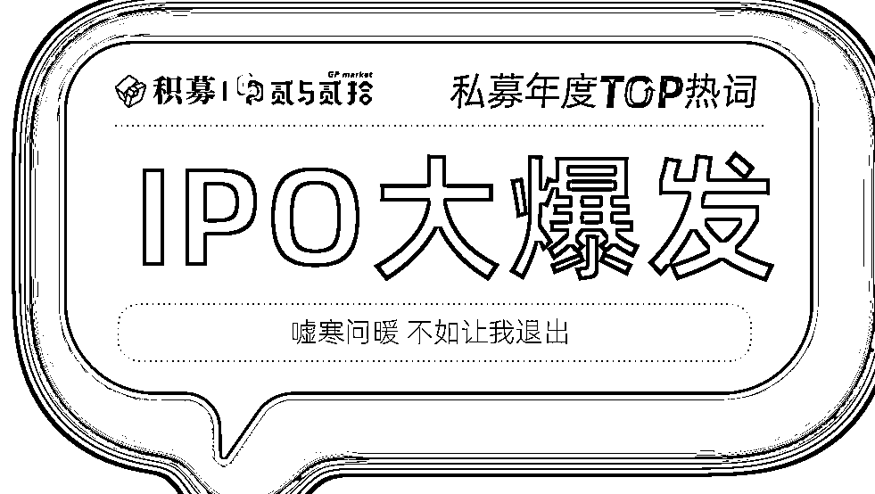

今年以来，全球市场中企 IPO 数量规模大爆发，IPO 募资规模创近十年新高。据投中数据统计，**2020 年 1-11 月，共计 490 家中国企业在 A 股、港股以及美股成功 IPO，IPO 数较 2019 年上升 31.37%募资总额共计 7490 亿元，IPO 规模较 2019 年上升 45.52% 。**整体看来，第一季度虽受新冠疫情的影响，市场表现低迷，随着疫情在境内得到控制，第三季度呈现爆发式增长，新《证券法》及创业板注册制改革，推动 IPO 步伐明显加快，整体较去年同期大幅上涨。

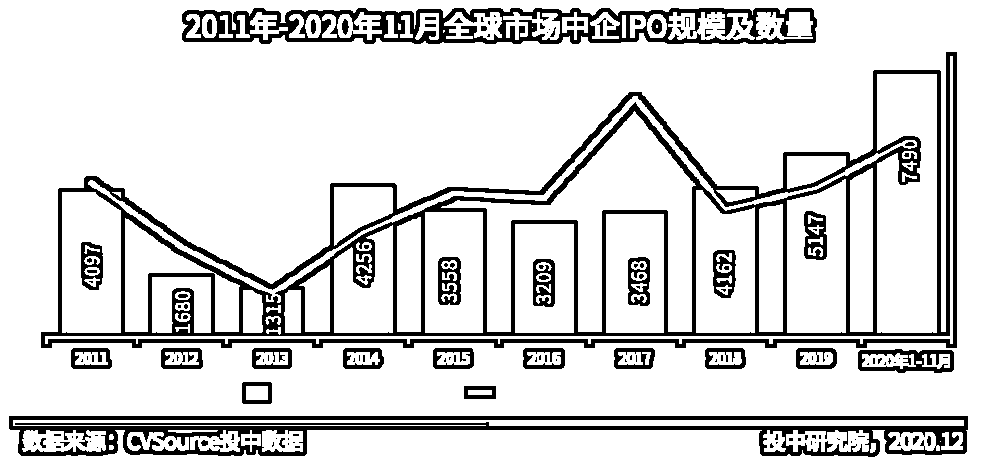

图片来源：投中网

IPO 大潮之际，**VC/PE 机构的 IPO 渗透率也创下新高。**据清科研究数据显示，1999 年以来中企境内外上市的 VC/PE 渗透率逐步增长；2001 年，有 VC/PE 支持的公司占上市公司的比例只有不到 5%，从中小板开板后，这个比例就达到了两位数，且一路攀升至 50%-60%，去年科创板开板以后，这个比例大幅提升，**2020 年更是跃升至 70%以上，创近十年新高。**

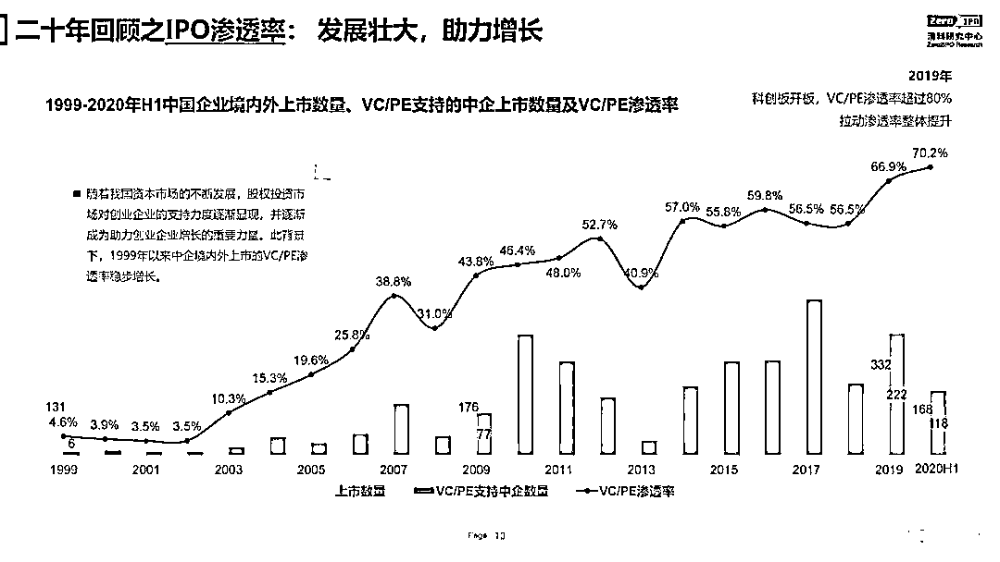

图片来源：清科研究

2020 年，继科创板注册制以后，6.8 万亿总市值的创业板终于迎来期待已久的注册制改革。

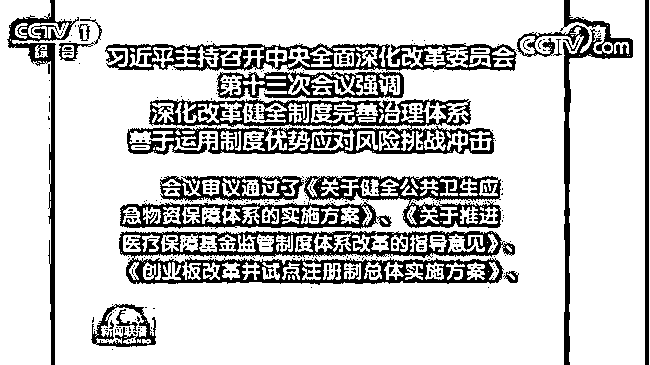

4 月 27 日，中央全面深化改革委员会第十三次会议审议通过了《创业板改革并试点注册制总体实施方案》，意味着创业板改革的大幕正式拉开。随后，中国证监会就创业板改革并试点注册制主要制度规则向社会公开征求意见↓↓↓

*   《创业板首次公开发行股票注册管理办法（试行）》

*   《创业板上市公司证券发行注册管理办法（试行）》

*   《创业板上市公司持续监管办法（试行）》

*   《证券发行上市保荐业务管理办法》

深交所同步也就《创业板股票发行上市审核规则》等 8 项业务规则向社会公开征求意见。

创业板注册制有以下显著特点：

*   放宽涨跌幅比例，将**创业板股票涨跌幅限制比例由 10%提高至 20%；**

*   对创业板新股**上市前五日不设涨跌幅限制，**并设置 30%、60%两档停牌指标以稳定价格防止过度波动；

*   针对新增个人投资者，**增设了前 20 个交易日日均资产不低于 10 万元，且具备 24 个月的 A 股交易经验的准入门槛；**

*   将净利润连续亏损的退市指标调整为包括净利润、营收、市值等多因素在内的复合指标，从而加大对“僵尸”企业和空壳公司的出清力度；

*   上市效率加快，**20 个工作日决定是否予以注册；**

*   **允许特殊股权结构企业和红筹企业上市，制定负面清单。**

对于创投行业来说，创业板注册制最大的利好就是：退出渠道将大大拓宽。

东方富海董事长陈玮表示，对于创投机构而言，创业板注册制意味着更为清晰、明确的退出渠道，退出痛点将得到缓解。**创业板注册制也会作用于募资、投资等前置环节，整个募投管退的链条会变得更为顺畅，特别是行业当前的募资困境，将迎来一定程度的改善。**注册制将带来一二级市场更为紧密高效的联动，意味着一二级市场的溢价空间将被压缩，未来上市也不一定能赚到钱，二级市场投资人也将更加关注 IPO 企业未来的成长性。

盛世投资管理合伙人陈立志认为，在投资机构所投的存量项目中，能够符合科创板“硬科技”属性要求的项目相对较少。**创业板注册制的推行将为诸如移动互联网、文化娱乐、传统产业改造等技术属性并不突出的项目提供机会，从而加速创投行业存量项目的退出，提高创投机构资金使用效率。**

**2020 年 9 月 11 日，中国证监会发布了《关于加强私募投资基金监管的若干规定（征求意见稿）》（简称《若干规定》），引发私募圈广泛关注。**

**其中，《若干规定》中指出，**私募基金管理人的注册地与主要办事机构所在地应当设于同一省级、计划单列市行政区域内。**如果按照新规实施，异地办公将被禁止，因此该条规定甫一发出便引起大家热议。据统计，异地办公的私募基金管理人超过 4000 家，而此前管理人登记时，中国基金业协会允许注册地和实际办公地不在同一地区，并不会一刀切，未来这些私募可能会面临合规性风险及整改压力。**

****各地区私募异地办公情况****

**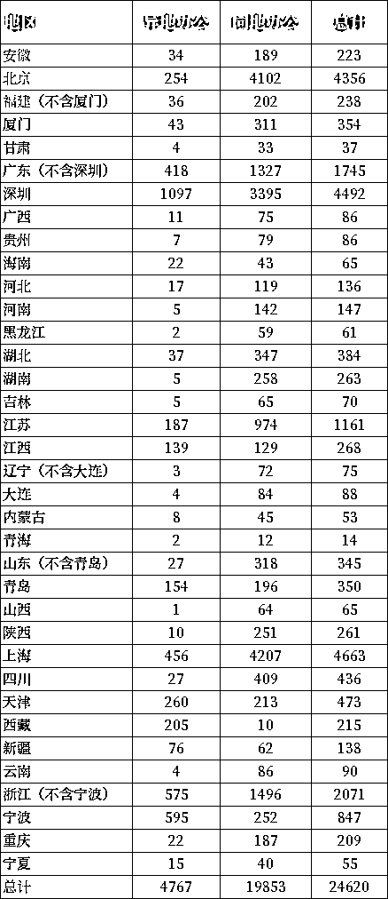**

**注：异地办公指注册地和办公地不在同一省、计划单列市，同地办公指注册地和办公地在同一省、计划单列市。数据截止时间：2020.11**

****

**对私募行业而言，合规运营是大势所趋。2020 年，私募基金专项检查以及与之对应的监管处罚仍然是不可忽视的重要事件，这种常态化的监管手段也在日益变得更加严格和细致。**

**今年以来，各地证监局先后开展了针对私募管理人的风险自查工作，要求私募管理人限期提交自查报告及其他相关材料。自查内容涉及到私募管理人及基金运营的方方面面，包括**登记备案、合格投资者、资金募集、投资交易、内控及风险管理、信息披露、投资者适当性、合规管理、利益冲突、基金产品信息、宣传舆情信息等**方方面面，部分地区针对证券类管理人还制定了特别的自查清单，增加了**资金募集禁止条款、结构化产品禁止条款、第三方机构禁止条款、提供交易便利禁止条款、业务禁止条款、资金池禁止条款、员工激励禁止条款**等风险高发区的合规检查。**

**值得一提的是，**上海浦东也开展了针对私募管理人的专项检查工作，并引进律师事务所、会计师事务所等专业机构，**私募排查+现场检查双管齐下，全面提升辖区的私募合规运营。**

****深圳证监局**也开展了全面的私募自查自纠工作，除了常规的检查以外，还引入白名单制度，将私募管理人自查结果与日常监管信息进行比对，结果吻合的，验收通过后纳入白名单，可享受相关政策支持；结果不吻合的，将视情况约谈或开展现场检查。截止到 11 月底，共计 2371 家私募机构完成了自查自纠，占辖区私募机构的 52.7%。深圳证监局以红、黄、绿三色来标识私募机构的审核结果，对于红色或黄色机构，将通过邮件方式告知具体情况。可以说，深圳证监局对辖区私募管理人进行了一次全面深入的摸排检查和管理。**

**与监管检查相对应的是对违规行为的处罚。据统计，**截止到 11 月底，有超百家私募管理人被各地证监局处罚，处罚原因集中在投资者适当性管理不当、向非合格投资者募集资金、承诺保本保收益、未按要求向投资者信披、投资交易环节违规、基金未备案或者未及时在中基协更新管理人和基金的信息、资金池、挪用基金财产等方面，处罚措施上也不一而足，轻则责令改正、公开谴责、出具警示函、提交整改报告，或者记录证券期货市场诚信档案，重则罚款，处罚金额在 3 万-40 万之间。****

**除了各地证监局的行政监管措施以外，**中基协**也对违规的私募管理人及其从业人员进行自律处罚，**处罚措施主要是取消私募管理人的会员资格、撤销私募管理人登记、暂停基金产品备案、限期改正等等，对于从业人员主要是加入黑名单。****

**从以上可以看出，针对私募基金的监管体系正在变得越来越完善，证监会的行政监管与中基协的自律管理相结合，上下联动，推动私募基金合规运营进入一个良性的发展循环，事前准入、事中检查、事后监管环环相扣，相信未来的私募行业会更加的专业和规范。**

****

**2020 年初，突出其来的新冠疫情让各行各业措手不及，私募行业也受到波及。**

**上半年，受疫情影响，各行各业停工停产、阻击疫情，私募行业也变得很困难，**一方面私募管理人本身的资金募集、投资人服务、项目尽调、投后退出等各工作环节受到影响；另一方面投资项目公司的经营情况不容乐观，进而影响到基金的业绩表现。****

**除了少数在疫情期间表现抢眼的行业外，整个市场都很低迷，募资困难加剧，投资节奏放缓，许多私募面临生存危机。许多机构主动降薪、裁员，像头部财富管理机构诺亚财富、新加坡主权财富基金淡马锡等也主动降薪，受到市场关注。红杉资本全球执行合伙人沈南鹏也以自身经历和体会发文告诫创业者：“有短期内的应对措施和必要的调整，其中管理好现金流尤为重要”。**

**困难之外，大家也在齐心协力抗击疫情。国家部委、各地方政府陆续出台多项支持受疫情影响严重企业的扶持政策，同时成立纾困基金、抗疫基金，助中小企业“过冬”。私募行业也积极应对、众志成城，纷纷为抗击新冠疫情捐款捐物，展现出私募人的爱心和社会责任心，有困难我们一起抗。中国基金业协会发布通知，针对参与抗击疫情所需的医药卫生类的私募股权基金、创业投资基金备案申请，提供办理私募基金产品备案的绿色通道，加急加快办理备案并对外公示。**

**疫情之下，难字当头。虽然困难重重，但是大家始终相信，疫情只是对我国经济发展产生了阶段性影响，并不改变长期向好的局面。事实证明的确如此，从第二季度开始，我国 GPD 由负转正，国民经济稳步恢复。**

**量化投资与机器学习微信公众号，是业内垂直于**量化投资、对冲基金、Fintech、人工智能、大数据**等领域的主流自媒体。公众号拥有来自**公募、私募、券商、期货、银行、保险、高校**等行业**20W+**关注者，2019 年被腾讯云+社区评选为“年度最佳作者”。**