# 另类 Alpha：研报情绪因子（附代码）

> 原文：[`mp.weixin.qq.com/s?__biz=MzAxNTc0Mjg0Mg==&mid=2653309512&idx=1&sn=e99f385476f0b8f28fa5d5221909dcfa&chksm=802d885db75a014b16dde760981bdeb7469d6013458fa06128996448883ed92aabfbe2883e57&scene=27#wechat_redirect`](http://mp.weixin.qq.com/s?__biz=MzAxNTc0Mjg0Mg==&mid=2653309512&idx=1&sn=e99f385476f0b8f28fa5d5221909dcfa&chksm=802d885db75a014b16dde760981bdeb7469d6013458fa06128996448883ed92aabfbe2883e57&scene=27#wechat_redirect)


量化投资与机器学习微信公众号，是业内垂直于**量化投资、对冲基金、Fintech、人工智能、大数据**等领域的主流自媒体。公众号拥有来自**公募、私募、券商、期货、银行、保险、高校**等行业**20W+**关注者，2019 年被腾讯云+社区评选为“年度最佳作者”。

QIML 编辑部独家撰写报道

***1***

**研报因子化**

随着量化投资竞争的加剧，我们需要从越来越多的数据中寻找 Alpha，文本数据如新闻数据、社交评论数据、搜索数据及研究报告是常见的另类数据来源。随着 NLP 技术的发展，对文本数据的结构化加工，包括关键信息的提取及情绪的判断，已越来越多的应用到策略投资决策中。

我们来看一组数据：

2020 年全年至今，国内共有**100+家****券商**近**3000 位****分析师**，发布了**245341 份****研报**，覆盖了近一半 A 股上市公司，平均每天就有 711 份研报发布。

这些凝聚了分析师们对公司对行业专业解读的报告，我们该**如何有效利用？**特别是从量化投资的角度，该如何使用？是一篇一篇的看吗？当然不是。

答案是：

**因子化**

当谈到某个分析师对某个公司的观点时，作为资深韭菜的小编总是一笑而过，微笑中透露出”相信分析师等于跟钱过不去“的执拗

那如果一个分析师看好一只股票，你不确信，那一群分析师看好一只股票呢？或者换个角度，**分析师看好的股票和分析师不看好的相比？真的未来收益会好吗？**这就是**研报情绪因子化**所要回答的问题。

所以站在**量化基本面**的角度，我们就是要用量化的手段，对数以万计的基本面报告进行关键信息的提取，并挖掘这些信息与股票收益之间的相关性。为了完成研报信息的因子化，我们需要回答以下几个问题。

***2***

**研报哪里来？**

首先需要解决的是研报哪里来？十分感谢**通联数据**为 QIML 的这次研究提供了海量的研报数据支持。通联数据通过与券商合作、供应商采购及公开采集等方式构建了 **180 万+ ****的研报数****据库，覆盖了****98%****的券商、****95%****的分析师、****3500****多只股票**。并且研报库以每天的 700 多篇的速度在不断扩充。

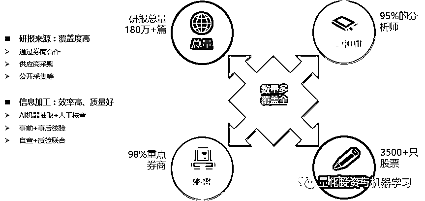

图片来自：通联数据

***3***

**研报怎么看？**

一篇篇自己看？

你试试看

**当然是机器看！**

那机器怎么看？NLP 算法的快速发展为我们加工文本类的非结构化信息提供了很好的工具，机器在将研报这类非结构化数据转换成结构化数据过程中，主要完成两个工作。**首先是第一维度，我们可以通过算法提取研报中的关键信息，如股票代码、核心观点等，然后我们可以通过算法（BERT 在手，天下我有）对这些核心观点进行情绪打分。**

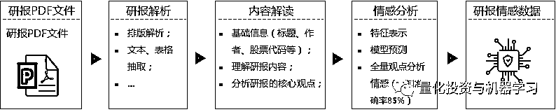

图片来自：通联数据

具体有如下步骤：

*   **研报解析：**排版解析，文本及表格抽取等；

*   **内容解读：**基础信息提取，获取每篇报告的标题、作者及股票代码及核心观点；

*   **情感分析：**根据上个步骤中提炼的核心观点，利用 BERT 模型对每个观点进行情绪得分的计算。汇总所有核心观点的情绪得分就得到了该篇报告的情绪得分。

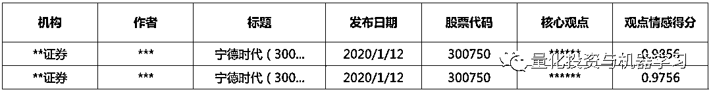

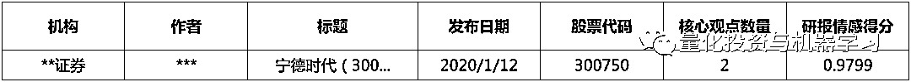

相比于传统的分析师盈利预测数据，研报情感数据变化更高频，信息更及时，从分析师盈利预测数据的变动周期统计来看，分析师评级调整和盈利调整时间间隔的中位数是**226 天**和**94 天**，评级调整和盈利调整中间发的研报数平均为**4.2 篇**和**1.8 篇**。 

出于谨慎的原因，分析师不会轻易调整盈利/评级预测，但分析师的态度可以从文本中反映出来，新闻情感可以更快、更准确的反映分析师的真实看法。

***4***

**研报情绪因子**

利用已汇总好的每篇报告的情感得分，**筛选个股最近 90 日内的所有分析师报告，采用时间加权（半衰期配权法）、数字比例加权方式来对所有的报告进行汇总，最后再用研报个数的对数值对得分进行转化**。具体计算公式如下：

#### <embed style="vertical-align: -1.469ex;width: 50.815ex;height: auto;" src="https://mmbiz.qlogo.cn/mmbiz_svg/a18XcQ1EBBhyibvpTibmHqfUFRx2p8Sy675GMOajf6txfXVG8bbSkibBUpUAhDOjiayAGPxNb1NHpj1fOFSKPn5U1U36gEHxIx8O/0?wx_fmt=svg" data-type="svg+xml">

其中表示最近 90 日内个股的报告数量，表示每篇研报的情感值，表示每篇研报的时间权重，表示距离今天的时间天数。表示在第 i 天同时有 N 篇研报时每篇报告的权重值，表示该研报的观点数量。

***5***

**因子测试**

研报情绪因子（以下简称因子）在**沪深 300 的平均覆盖度为 91%，中证 500 为 75%，中证全指为 56%**。

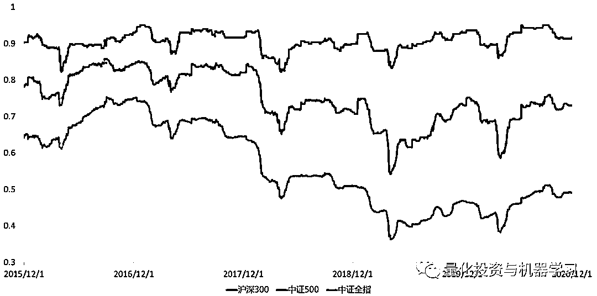

数据来自：通联数据，QIML 独家绘制

因子在申万一级行业的覆盖度如下图所示，可以看出在**银行的覆盖度最高且一直很稳定**，在**综合的覆盖度最低**。

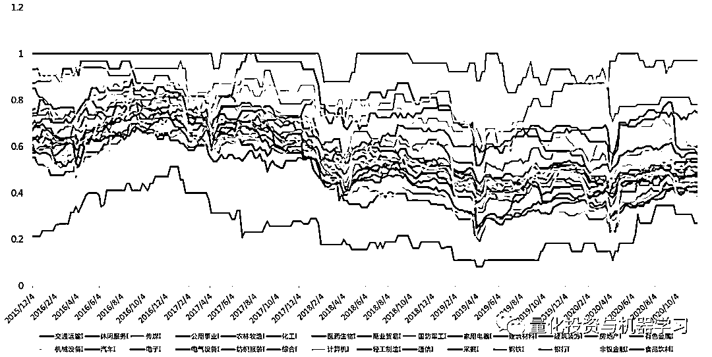

数据来自：通联数据，QIML 独家绘制

**一个优秀的因子往往有自己独特的魅力，不随波逐流，不同流合污**。如果因子与风格因子相关性过高，因子的表现可能会受风格的影响。所以我们看一下与常见风格因子的相关性，如果因子与风格因子相关性过高，因子的表现可能会受风格的影响，所以测试的时候需要做**风格中性化处理**。

由下图可以发现**研报情绪因子与大部分风格因子相关性较低，与 MOMENTUM 和 BTOP 风格因子存在较大的相关性。**

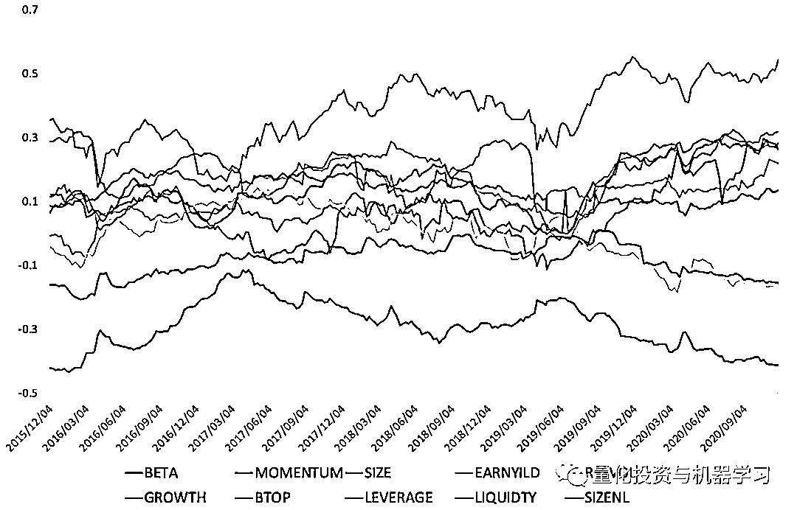

数据来自：通联数据，QIML 独家绘制

接下来我们在中证全指、沪深 300 及中证 500 的成分股测试因子的周度及月度表现，**采用指数成分股是因子指数成分剔除了 st 及上市不满一定时间的股票。**

由于因子在行业上的暴露不是很稳定，且存在明显的倾向，我们对情绪因子在特定股票池进行标准化及市值行业中性化处理后进行测试，同时由于研报因子与风格因子的相关性，**我们还测试了经风格因子中性化后因子的表现。**

标准化采用了**MAD**和**Z-Score**的方法：

**核心代码**

```py
def mad_scale(data, n=3):
    mad = (data - data.median()).abs().median()
    up_bund = data.median() + n*mad
    low_bund = data.median() - n*mad
    scaled = data.clip(lower=low_bund, upper=up_bund)
    return scaled

def standardize_norm(data):
    mu = data.mean()
    std = data.std()
    return data.subtract(mu).divide(std)

def clean_factor(data):
    data_cleaned = data.groupby(level=0).apply(mad_scale)
    data_cleaned = data_cleaned.groupby(level=0).apply(standardize_norm)
    return data_cleaned
```

市值行业中性化采用**申万行业及对数市值**的回测残差（标准化后）：  

**核心代码**

```py
def to_dummy_variable(data):
    if isinstance(data, pd.DataFrame):
        data = data.iloc[0]

    oht_coder = OneHotEncoder()
    ind_oht = oht_coder.fit_transform(data.values.reshape(-1,1))
    df_dummy = pd.DataFrame(data=ind_oht.toarray(), index=data.index, columns=oht_coder.categories_[0])
    return df_dummy

ind_all_dummy = ind_all_com.loc[w_end]['ind'].dropna().groupby(level=0).apply(lambda x: to_dummy_variable(x))
```

```py
def factor_neutralize(factor, neu_type=None):

    def _neutralize(df):
        df = df.reset_index(level=0, drop=True)
        df_tar_temp = df[tar_col]
        df_base = df[base_cols]

        try:
            model = sm.OLS(df_tar_temp, df_base, missing='drop')
            results = model.fit()
        except Exception as e:
            print(e)
            return pd.DataFrame()

        residual = results.resid.reindex(df.index)
        residual = (residual - residual.mean()) / residual.std()
        return residual

    factor_cp = factor.copy()

    factor_cp= pd.merge(factor_cp.to_frame(name='factor'), np.log(cap_all_com), left_index=True, right_index=True, how='left').dropna()
    factor_cp['cap'] = clean_factor(factor_cp['cap'])

    if neu_type == 'all':
        factor_cp = pd.merge(factor_cp, style_factor, left_index=True, right_index=True, how='left').dropna()
        for col in neu_cols:
            factor_cp[col] = clean_factor(factor_cp[col])
            factor_cp[col] = clean_factor(factor_cp[col])

    factor_cp['factor'] = clean_factor(factor_cp['factor'])

    factor_cp = pd.merge(factor_cp, ind_all_dummy, left_index=True, right_index=True, how='left').dropna()

    tar_col = 'factor'
    base_cols = [col for col in factor_cp.columns if col not in ['factor']]

    factor_cp = factor_cp.groupby(level=0).apply(_neutralize)

    return factor_cp
```

具体测试了周度与月度的因子表现（最后一个交易日的因子值）：  

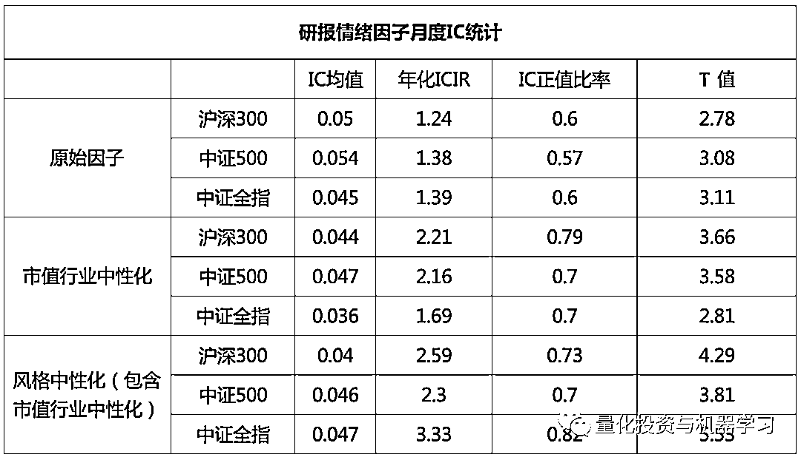

数据来自：通联数据，QIML 独家绘制

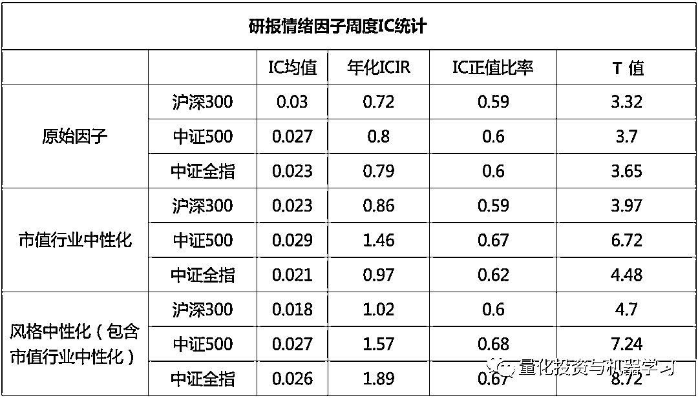

数据来自：通联数据，QIML 独家绘制

由以上数据我们可以发现：

*   **周度因子 IC 平均在 2.5%左右，月度因子 IC 平均在 4.5%左右。**

*   **月度因子的 IC 明显高于周度因子，中性化后的月度因子 ICIR 平均在 2.5 左右。**

*   **因子中性化处理后效果有明显的提升，特别是风格中性化后因子表现最佳。**

*   **风格中性化后，因子在中证全指的表现最佳。整体看来，因子在中证 500 的表现要优于沪深 300。**

接下来我们对**风格中性化**之后的研报情绪因子进行分组测试，多空收益统计数据如下， 我们可以发现月度因子的多空收益比较显著，再考虑交易成本后也能有明显的超额收益，周度因子的超额收益仅能覆盖交易成本。**因子在中证 500 和中证全指上的夏普比率能达到 3 左右，且月度最大回撤控制在 2%以内，周度回撤控制在 5%左右。**

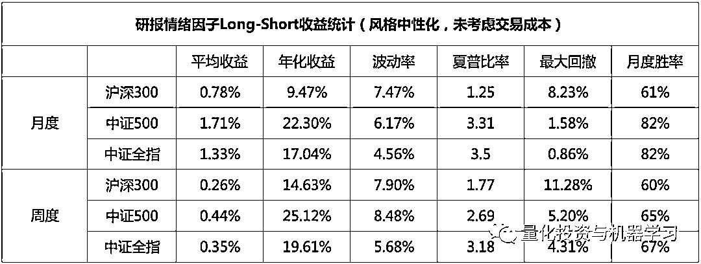

数据来自：通联数据，QIML 独家绘制

**多空月度收益**

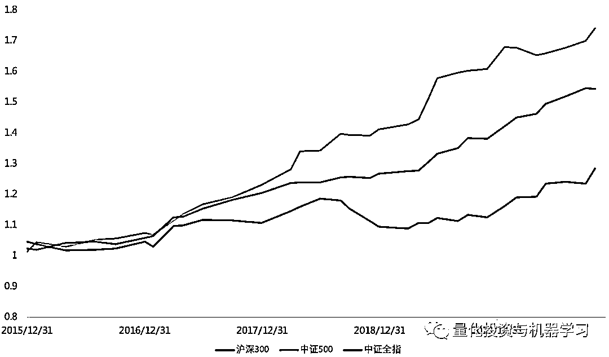

数据来自：通联数据，QIML 独家绘制

**多空周度收益**

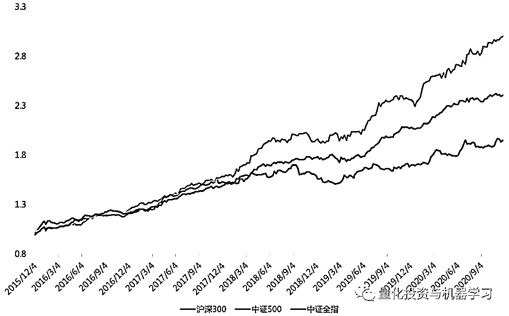

数据来自：通联数据，QIML 独家绘制

内容参考：《华创金工因子研究系列——研报情感因子》

***6***

**总结**

通过机器学习的方法对分析师研报观点的提取并进行情绪的打分，由此得到相对于传统分析师预测更高频的数据，基于这些数据，我们能够捕捉分析师对于某一股票情绪的变化，并基于此数据构建的情绪因子有着优异的表现，特别体现在中证 500 和中证全指上，具体体现在如下几点：

1、相对于原始因子，**经风格及行业中性化后的因子表现更加稳定**，月度年化 ICIR 超过 3；

2、经风格中性化处理后的**月度因子 IC 在 4.5%，且非常稳定，IC 为正值的比率超过 80%**；

3、因子整体表现在中证全指上效果比较稳定，**多空夏普比率超过 3.5，年化收益 17%，最大回撤只有 0.86%**；

4、**在中证 500 上年化收益最高，能达到 22.3%，夏普 3.31，最大回撤 1.58%**。

这是基本面量化的又一实践，将传统的研报知识通过机器学习的算法转换为情绪因子，通过对所有研报情绪的汇总，能够整合全部分析师对于同一股票的情绪倾向。这也是机器学习从传统的策略端向数据端转化的成功案例。

***7***

**如何使用数据？**

策略需要逻辑支撑，因子更需要逻辑！对该数据感兴趣的小伙伴可点击**阅读原文**查看获取。

点击**阅读原文**，查看更多**研报情绪数据**！