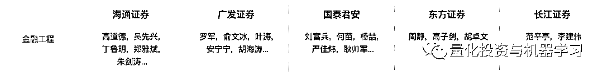

# 新财富『金融工程』：扎心！

> 原文：[`mp.weixin.qq.com/s?__biz=MzAxNTc0Mjg0Mg==&mid=2653309233&idx=1&sn=bef9780d7e6710397e32ea16b91cb37c&chksm=802d8b24b75a02325c1772041915edfa64b39a918bd0d6b592c82b5b0ee43449f70a4f7d9219&scene=27#wechat_redirect`](http://mp.weixin.qq.com/s?__biz=MzAxNTc0Mjg0Mg==&mid=2653309233&idx=1&sn=bef9780d7e6710397e32ea16b91cb37c&chksm=802d8b24b75a02325c1772041915edfa64b39a918bd0d6b592c82b5b0ee43449f70a4f7d9219&scene=27#wechat_redirect)

***全网 Quant 都在看！***

**今日最扎心的图**

啥也不说了！

**金融工程**太苦了

来个放大版：

QIML 公众号分析：金融工程受关注比较低主要有两个原因：

**第一，金融工程本来就不是一个行业，金融工程是一种方法，在越来越倡导基本面量化的情况下，金融工程更多的发展空间来自于与主观行业研究的结合。**

**第二，近几年量化在公募基金的发展比较缓慢，公募基金还是以主观投资为主，所以出现了公募私募量化两重天的现象。**

**『金融工程』评选结果**

量化投资与机器学习公众号每年都会报道新财富的评选情况，主要是针对**金融工程**这块，因为与 Quant 最密切。 

在刚刚结束的 2020 第十八届新财富最佳分析师评选中，长江证券、广发证券、国盛证券、海通证券、天风证券、兴业证券、招商证券成功入围。

另外，**由于每家券商对新财富有不同的考核标准，部分券商没有参与新财富的评选**。所以榜单里面可能少了几家大家熟悉的面孔。 

在最后的评选中，**国盛证券、长江证券、招商证券、海通证券、广发证券**获得了本年度金融工程组的前五名。希望**天风证券、兴业证券**明年再接再厉！

总分排名如下：

获奖代表合影留念： 

**『金融工程』热点报告**

那么，我们来看看，今年上榜的五家券商金工团队，他们都有哪些比较热门的研报值得我们关注。我们通过第三方平台慧博的数据来看看。

我们筛选的日期从**2020 年 1 月 1 日—2020 年 12 月 16 日**。选取**热点前 10**的研报。

**免责声明：**以下所引述机构或个人的观点、言论、数据及其他信息仅作参考和资讯传播之目的，不代表公众号赞同其观点或证实其描述。

**1、国盛证券**

**2、长江证券**

**3、**招商证券****

******4、海通证券******

****

******5、广发证券******

****

****历届新财富「**金融工程**」榜单****

****2013 年****

****

****

****2014 年****

****

**** 

****2015 年****

****

**** 

****2016 年****

****

**** 

****2017 年****

****

**** 

****2018 年****

**因为大家都知道的原因没有举办。** 

****2019 年****

****

**** 

**量化投资与机器学习微信公众号，是业内垂直于**量化投资、对冲基金、****Fintech、人工智能、大数据**等领域的**主流自媒体**。公众号拥有来自**公募、私募、券商、期货、银行、保险、高校**等行业**20W+**关注者，2019 年被腾讯云+社区评选为“年度最佳作者”。**