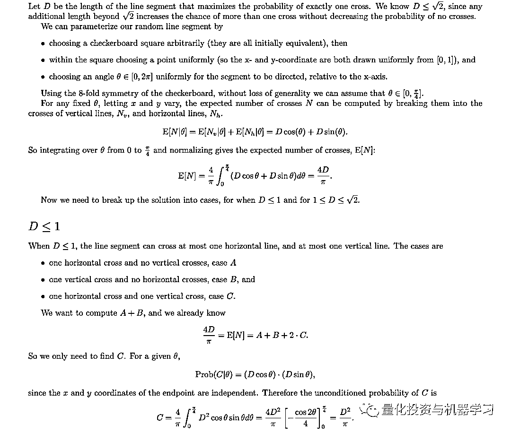

# 二千零二十、全球 Quant 年终奖：Market Making 拔头筹！

> 原文：[`mp.weixin.qq.com/s?__biz=MzAxNTc0Mjg0Mg==&mid=2653309170&idx=1&sn=041f0d7fc982aae35bbe2007369ad700&chksm=802d8ae7b75a03f15107cff4427904a281921074cd3ada7d2d9831fa7a1f304250ed2c544cbb&scene=27#wechat_redirect`](http://mp.weixin.qq.com/s?__biz=MzAxNTc0Mjg0Mg==&mid=2653309170&idx=1&sn=041f0d7fc982aae35bbe2007369ad700&chksm=802d8ae7b75a03f15107cff4427904a281921074cd3ada7d2d9831fa7a1f304250ed2c544cbb&scene=27#wechat_redirect)

***全网 Quant 都在看！***

如果你是高频交易量化分析师/研究员，今年的年终奖可能很丰厚哦！ 

根据 Selby 的一项最新调查显示，从事**高频交易**\**做市商（BS）**的 Quant 对今年的奖金预期很高。其他领域的量化分析师就不那么乐观了。

根据数据显示，2020 年 7 月，一些主要*电子做市商机构新发布的工作岗位数量比 2 月份增加了 28% ，仅略低于 1 月份。

** **Virtu、Jump Trading、Hudson River、Citadel Securities、G-Research、Two Sigma、Tower Research、DRW Trading、Hudson River、Quantlab、IMC Trading、CTC Trading、Jane Street、Susquehanna International Group*

 

尽管如此，进入做市商领域并不容易。因为很多公司在员工相对较少的情况下需要创造较高的收入和利润，他们雇佣的员工都是十分出色的技术人员。

**Virtu Financial**

我们就拿**Virtu Financial**来说。像 Virtu 这样的高频交易机构来说，2020 年他们取得了创纪录的收入，业绩非常出色，其奖金预计能涨 50% 。

Virtu Financial 在第三季度表现仍高于历史平均水平，第三季度仍比前两年高出 30-45%：

Virtu 有着庞大的股票做市商业务，第二季度收入增长 343%，达到 4.76 亿美元，固收的做市商业务收入增长 176%，达到 7800 万美元，也还行：

其他一些数据：

**Jane Street**

2016 年，纽约时报将 Jane Street 描述为：

Jane Street 平均每天在全球范围内交易超过 210 亿美元的股票、债券和 ETF，并在纽约、伦敦、阿姆斯特丹和香港设有办事处。

Jane Street 的员工薪酬是一个迷。*根据网媒未经证实的消息称*，Jane Street 在美国为实习生每月工资为$14.5K，外加每周$500 在家工作的津贴，每月总计为$16.5k。

对于 Jane Street 相对 junior 的工作，你不一定需要懂金融或经济，但你需要知道如何编程。Jane Street 的代码几乎全部使用 OCAML，因为他们是**函数式编程**的拥护者，Jane Street 从系统自动化到交易系统，从监控工具到代码研究，Jane Street 使用 OCaml 编写所有其能写的东西。

**OCaml**

全称 Objective Caml，是 Caml 编程语言的主要实现，由 Xavier Leroy，Jérôme Vouillon，Damien Doligez，Didier Rémy 及其他人于 1996 年创立。OCaml 是开放原始码项目。此项目的管理和大部分维护工作交由 INRIA。

由于 caml 的读音与 camel 一致，OCaml 的吉祥物自然被定为骆驼，而以 OCaml 服务为主的软件也通常以骆驼的形象作为其 LOGO。

OCaml 将 Caml 语言在面向对象方面做了延展。Caml 是函数式编程语言，它的扩展语言还有基于微软.net 平台的 f# (fsharp)语言。Caml 的代码大多可以在 f#中使用。F#的开发工具有 VS .net，Caml 的代码也可使用。OCaml 的开发工具包含交互式顶层解释器，字节码编译器，以及最优本地代码编译器。

**OCaml 有一个巨大并强悍的标准库，这使得她可以像 Python 或者 Perl 语言一样可以方便地开发各种应用程序，健壮的模块化与面向对象编程结构又使得她可以胜任大规模软件工程项目。**

如果你想在 Jane Street 找到一份收入最高的工作，你需要有解决一些极难的脑筋急转弯。Jane Street 因在面试时向其候选人提出具有挑战性的脑筋急转弯而闻名。公众号列出几个给各位 Quant 瞧瞧，看看你们能做出来否，祝你好运！

***Puzzle1***

*Each of the grids below is incomplete. Place numbers in some of the empty cells so that in total each grid’s interior contains one 1, two 2’s, etc., up to seven 7’s. Furthermore, each row and column within each grid must contain exactly 4 numbers which sum to 20\. Finally, the numbered cells must form a connected region, but every 2-by-2 subsquare in the completed grid must contain at least one empty cell.* 

*Some numbers have been placed inside each grid. Additionally, some blue numbers have been placed outside of the grids. These blue numbers indicate the first value seen in the corresponding row or column when looking into the grid from that location.*

*Once each of the grids is complete, create a 7-by-7 grid by “adding” the four grids’ interiors together (as if they were 7-by-7 matrices). The answer to this month’s puzzle is the sum of the squares of the values in this final grid.*

最新一期，答案未公布

***Puzzle2***

*A random line segment of length D is chosen on a plane marked with an infinite checkerboard grid (i.e., a unit side length square grid).  What length D maximizes the probability that the segment crosses exactly one line on the checkerboard grid, and what is this maximal probability?*

**答案：**

The answer to this puzzle is that D = 1 and the resulting probability is 2/pi (or about .6366). 

  

***Puzzle3***

*Call a “ring” of circles a collection of six circles of equal radius, say r, whose centers lie on the six vertices of a regular hexagon with side length 2r. This makes each circle tangent to its two neighbors, and we can call the center of the regular hexagon the “center” of the ring of circles. If we are given a circle C, what is the maximum proportion of the area of that circle we can cover with rings of circles entirely contained within C that all are mutually disjoint and share the same center?

When submitting an answer, you can either send in a closed-form solution, or your answer out to 6 decimal places.*

**答案**

The answer when rounded to 6 decimal places is 0.783464.

*****Puzzle4*****

*Two friends, Alter and Nate, have a conversation:*

*Alter: Nate, let’s play a game. I’ll pick an integer between 1 and 10 (inclusive), then you’ll pick an integer between 1 and 10 (inclusive), and then I’ll go again, then you’ll go again, and so on and so forth. We’ll keep adding our numbers together to make a running total. And whoever makes the running total be greater than or equal to 100 loses. You go first.

Nate: That’s not fair! Whenever I pick a number X, you’ll just pick 11-X, and then I’ll always get stuck with 99 and I’ll make the total go greater than 100.

Alter: Ok fine. New rule then, no one can pick a number that would make the sum of that number and the previous number equal to 11\. You still go first. Now can we play?

Nate: Um… sure.*

*Who wins, and what is their strategy?*

**答案**  

Nate (the first player) can always win in this game, by starting with the number 3.After this first turn, Nate can force the running total to increment by units of 12.This could happen 2 different ways:

1、If Alter picks some number X between 2 and 10, Nate chooses 12-X

2、If Alter picks 1, Nate responds by picking 1 as well.  Now Alter cannot pick 10 (since this would force the sum of the previous two numbers to be 11), and must pick some other number Y.  Nate then picks 10-Y.

In this way, Nate can force Alter to choose numbers when the running total is equal to 3, 15, 27, 39, 51, 63, 75, 87, and 99.  At this point, Alter is forced to take the total to 100 or greater.

**G-Research**

说起 G-Research，它更像是一个算法研究机构。这家总部位于伦敦的量化研究和技术公司，目前大概雇佣了 800 名员工。

**G-Research 在公众号眼里一直很神秘！**

说起 G-Research，公众号在这里也提一下当年发生在行业内的一段真实故事：

**一个中国数学神童，一路学霸剑桥毕业，入职 G-Research，不满 400 万人民币奖金辞职，然后身陷旷日持久的牢狱之灾。**

彭博在 18 年写过一篇很长的文章，大家感兴趣可以看看。**公众号觉得都是过去的事了，我们就不必纠结，也不必去评论是与非，一切向前看！**

G-Research 成立于 2012 年，由 Ben Leadsom 运营。Leadsom 曾是巴克莱银行的银行家，但自 2009 年以来一直是 Island Research 的董事（G-Research 是该有限责任合伙企业的一个组成部分）。根据 Island Research 最近提交的账目：

G-Research2019 年的营业额为£289m，营业利润为£56m。

G-Research 和 Island Research 的非合伙人级别员工受雇于一家名为 Trenchant Employment Services 的实体。2019 年，该公司雇佣了 753 人，高于前一年的 599 人。2019 年，热门岗位的人均薪酬为 15.8 万英镑。

G-Research 有一种独特的文化。能够将学界的智力挑战与快节奏的商业环境结合完美结合。其不断改进文化，为员工提供了最好的教育环境，确保他们在整个职业生涯中都能在 G-Research 持续学习与发展。

G-Research 的伦敦办公室有自己的演讲厅和活动场所，在那里，Hannah Fry、bo-shen Lo、Dermot Turing 和《Surveillance Capitalism》一书的作者 Shoshana Zuboff 都给员工们做过讲座。

**G-Research 对量化新人的面试很严格。首先是量化金融能力测试，接着是 HackeRank 测试，然后是技术面试。**

**Hackerank**在金融服务领域欢迎程度很高，高盛、摩根士丹利、美国银行、彭博、BNY Mellon 和德意志银行都是他的客户，像 Two Sigma 这样的对冲基金也有使用。

好了，今天的推文就到这里，希望大家对 Market Making 有一个多元的了解。后续公众号会报道更多这样的内容！

量化投资与机器学习微信公众号，是业内垂直于**量化投资、对冲基金、****Fintech、人工智能、大数据**等领域的**主流自媒体**。公众号拥有来自**公募、私募、券商、期货、银行、保险、高校**等行业**20W+**关注者，2019 年被腾讯云+社区评选为“年度最佳作者”。