# 干货满满！2020 陆家嘴量化年会全程回顾~

> 原文：[`mp.weixin.qq.com/s?__biz=MzAxNTc0Mjg0Mg==&mid=2653309104&idx=1&sn=5c4e6332d188afb14043c9b3f6f15fdf&chksm=802d8aa5b75a03b30b42a05da24cf6b37bac9621a6b53697deeffbd9caf80a6d062bc7aa6e83&scene=27#wechat_redirect`](http://mp.weixin.qq.com/s?__biz=MzAxNTc0Mjg0Mg==&mid=2653309104&idx=1&sn=5c4e6332d188afb14043c9b3f6f15fdf&chksm=802d8aa5b75a03b30b42a05da24cf6b37bac9621a6b53697deeffbd9caf80a6d062bc7aa6e83&scene=27#wechat_redirect)

***全网 Quant 都在看！***

**版权声明：**未经许可，任何机构和个人不得以任何形式复制、引用本文内容和观点，包括不得制作镜像及提供指向链接。

**免责声明**：本文所引述机构或个人的观点、言论、数据及其他信息仅作参考和资讯传播之目的，不代表公众号赞同其观点或证实其描述。

12 月 11 日，由**卡方科技主办，量化投资与机器学习公众号联合主办**的“探索量化新趋势——2020 陆家嘴量化年会”在上海隆重举办。本次大会以**算法、大数据与高性能计算**为主题，邀请到了国内外顶尖量化金融专家，通过前沿、专业的视角，为大家解读最新市场动态，分享最新量化投资理念与实践经验。

2 分钟精彩回顾视频：

[`mp.weixin.qq.com/mp/readtemplate?t=pages/video_player_tmpl&action=mpvideo&auto=0&vid=wxv_1649992935108640774`](https://mp.weixin.qq.com/mp/readtemplate?t=pages/video_player_tmpl&action=mpvideo&auto=0&vid=wxv_1649992935108640774)

大会现场座无虚席，后排都站满了前来参会的小伙伴们。

在茶歇环节，英伟达、华锐、申万宏源、数库科技、腾闪、阿里云和卡方科技设置了展区体验时间，各机构工作人员为与会嘉宾答疑解惑。

同时，我们还在会场门口准备了 2020 量化关键字签名墙，经过量化投资与机器学习公众号的全网征集，最终挑选出代表 2020 的年度量化关键字。

下面，公众号将对出席本次大会嘉宾分享的观点进行重点回顾：

*   **卡方科技：科技改变交易——频率赋能**
*   **申万宏源：财富管理视角下的特色主经纪商服务**
*   **英伟达：GPU 在投资交易领域中的应用**
*   **路博迈：多元资本与 A 股量化投资**
*   **圆桌论坛 1：TEZA Capital Management、路博迈、思勰投资、敦和资产、雷根基金**
*   **圆桌论坛 2：英伟达、万得资讯、华锐金融技术、数库科技、阿里云、卡方科技**

**科技改变交易——频率赋能**

**卡方科技创始人 | 陆洋**

回顾过去的 2020 年，卡方在这一年里主要是为了做好一件事情，就是服务量化机构的**交易执行环节**。

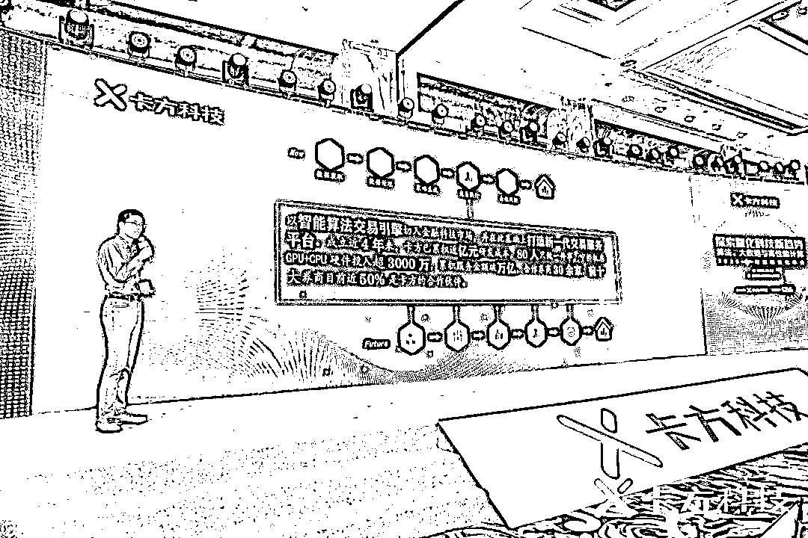

今年以来出现了很多超大型机构，从几十亿涨到了几百亿，甚至出现了千亿级别，一再刷新大家对量化机构管理规模的认知。同时量化机构也向大家展示了什么叫做“钞”能力，有花几千万去购买另类数据，也有花几个亿去建 AI 超算的机房。年初的时候，一个神奇的男人也向我们展示了什么叫做“一顿操作猛如虎，涨跌还看特朗普”，“Quant 内卷”成为知乎热议的话题。下半年的时候，我们告别了量化祖师爷 Quantopian，11 月的时候很多量化私募经历了全面回撤。

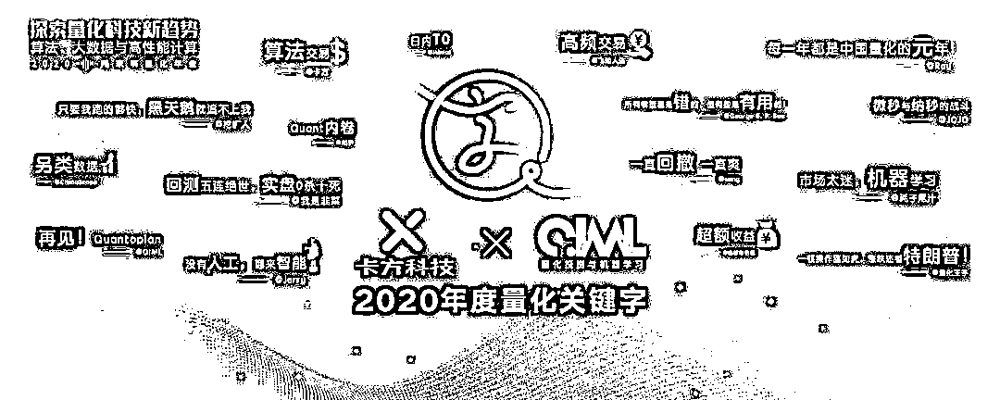

最近我和一个做 Alpha 的小伙伴聊天，他的感受是，这几年的市场风格变化特别快。主要原因是市场投资的结构一直在变，15 年以前，整个市场主要以散户为主，量化机构占比特别小。但从 15 年量化投资逐渐兴起后，到了今年变化幅度突然加快，一下子呈现出指数级的增长。其中最明显的变化就是因子衰退期的加快——在 15 年的时候做出过很多很有效并且周期很长的因子，做完之后可以躺着赚钱赚好几年。这几年来，尤其是到了今年，很多因子就开始失效了。他测了一下自己因子的衰退期，大概已经衰减到了半年左右的时间。最近他也因为这些事情开始焦虑地睡不着觉，一方面是出于净值回撤的原因，另一方面他也在思考量化私募的一个未来：

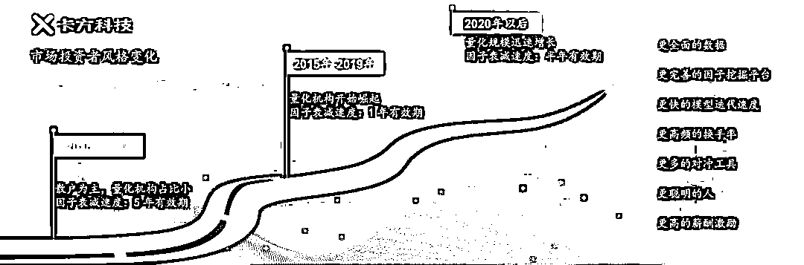

那么，作为为客户提供算法服务与交易软件的我们，应该怎样为他们提供帮助本？

**在频率上的赋能！**

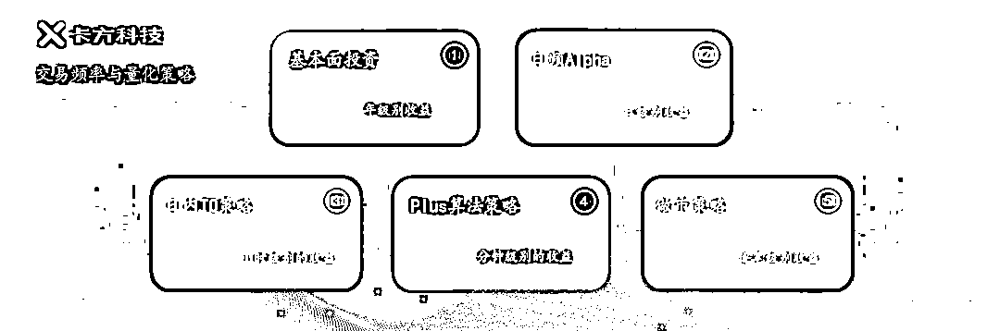

那么频率赋能是什么意思呢？市场上常见的策略根据频率可以分成这五类：**年度级别、日级别、小时级别、分钟级别和逐笔级别**，每个频率级别下面都有一些很经典的策略。比如一些做基本面的机构可能会持有茅台很多年，并不关注日级别的波动。一些机构可能会在日级别上建模，不关注日内的波动。而日内的 T0 主要关注小时级别的数据，卡方的 Plus 算法则关注分钟级别的波动，一些做市策略则关注到了逐笔频率的数据。

回看历史，在 15 年以前，中国主流的量化机构主要做的是日频 Alpha 模型。16 年开始，一些机构开始组建自己的量化 T+0 团队，他们在小时级别建模。17 年年底，卡方科技推出 Plus 算法 1.0 功能，具备了小时级别和分钟级别能力，对 D 日的价格也形成一些观点，在这些观点的辅助下，客户在 D 日建仓时也有了择时的余地，通过低点买入实现更低的交易成本。到了今年，卡方的算法终于实现了一次大的跃升，进入了 2.0 版本，我们**在 D 日的价格预测上加入了一个更高级别的显微镜，让我们能看到更精细的市场结构的变化，在逐笔级别上有了一些观点，也实现了更低的交易成本。**

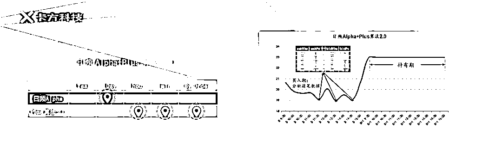

我把卡方频率赋能的升级过程分为四步：特征工程、低延时架构开发、仿真模拟测试、实盘调微上线。

**1、特征工程**

这一步主要做的就是构建模型，基于历史数据预测未来收益率。我们用到的数据有沪深 L2，盘中新闻实时公告，一些爬虫数据，还有卡方特色数据，比如一些大 V 的荐股信息。基于这些结构化或者非结构化数据，卡方分别使用不同的工具箱，比如线性模型，机器学习，深度学习等等去学习不同频率的数据，**我们对模型的共识是模型只是工具，是为了应对不同场景不同需求而使用的，复杂的模型效果不一定不好，简单的模型也有可能描绘最有效的信息**。而我们推崇的唯一标准是样本外显著，也就是“实践是检验真理的唯一标准”。如果样本外表现仍然像样本内这么优秀的话，接下来就会逐步推进上线。而卡方的优势在于高频数据的大样本易于获取，与低频策略只有几万甚至几千个样本点不同，高频 Level2 数据积攒三个月就可以实现一个非常大的样本量。也就是说，在构建模型之后，只需要等待三个月，我们就可以获得足够多的样本进行样本外检验。

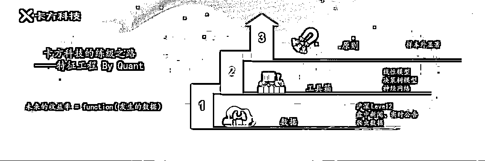

**2、低延时架构开发**

与高频常常一起出现的词汇——低延时，也是我们练级之路上的第二大技能。在日频 Alpha 策略中，只需要在第二天开盘前给出换仓列表即可。而刚刚提到的卡方 Plus 算法分钟级模型则需要做到 10 毫秒级别的延时，做到**逐笔级别**的时这个要求需要达到**10 微妙**。为了做到这一点，卡方的开发部门做了很多工作，**首先在开发中使用更接近底层的 C++和纯 C 的软件进行软件开发，在设计模式上接近边际，处理实时的资产结构，另外一方面在程序设计上通过逻辑分片等最大化 CPU 性能的发挥，使用内存数据库来处理数据等等**。中间我们也会做一些非常有用的小程序，帮助我们接近低延时。比如说深交所的极速切片行情，对深交所实时的盘口信息进行处理，获得更高频的信息，尤其是在行情快速变化的时候更能捕捉交易机会，提高交易的成功率。

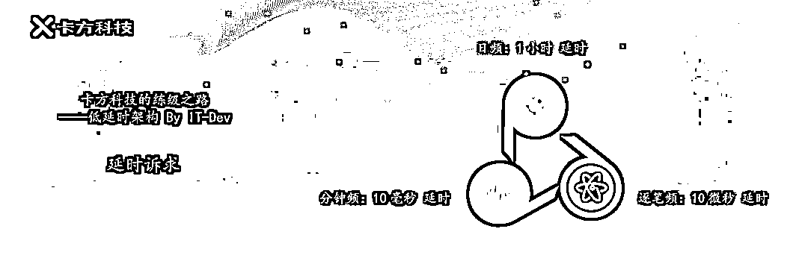

**3、仿真模拟测试**

卡方的质量控制部门会在一个尽可能贴近实盘交易的场景进行仿真测试，与真实交易的不同是路由链接终端的不同，在实盘中直接路由到交易所，而在我们的仿真测试中则是路由到卡方根据交易所实际交易数据建立的高精度撮合平台，当然在实盘的时候我们还会加入“亿点点”细节。具体操作中要求能做到高倍速的历史回放，高精度的仿真测试等等。

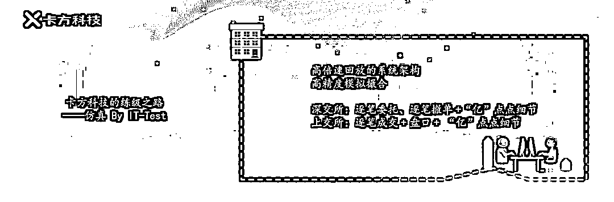

**4、实盘调微上线**

包括机房速度的测试，设备的配置等等。

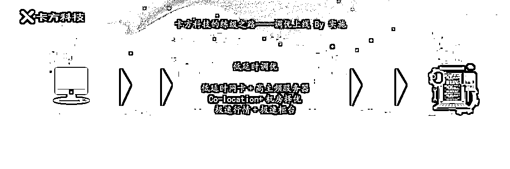

通过卡方频率上的赋能，最终为客户实现了收益的增强。比如某位客户通过自己的量化选股能力实现了 20%的年化，而卡方的算法则相对于传统的机械式算法交易为客户实现了 10%的收益提升。

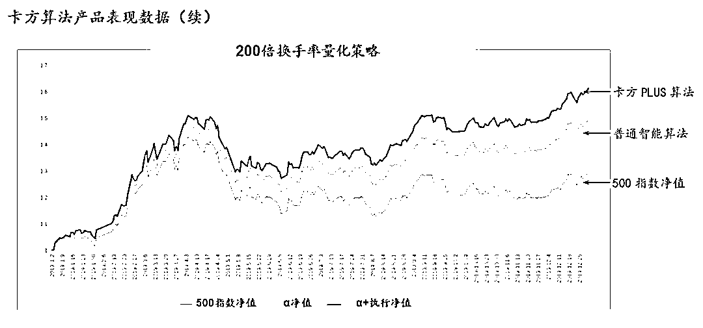

**财富管理视角下的特色主经纪商服务**

**申万宏源证券财富管理事业部总经理 | 杨正平**

未来财富管理会迎来一个高速发展的使命。2020 年中国的大众富裕阶级的财富会突破 3000 万；在过去的十年里，中国居民的储蓄率从 50-55%下降到去年的 44%，相比于发达国家和日韩，中国的居民储蓄率还有下降的空间，两者都给中国的财富管理一个很大的发展机遇。

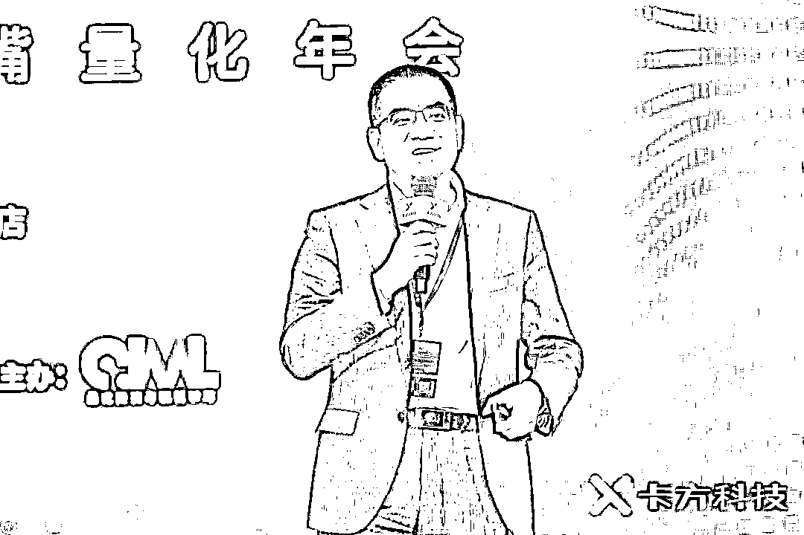

站在国际化的视野下，投资人对产品化的需求也很高，今年量化产品的需求也很大，从一些沟通和交流中，我们估算到量化投资在 A 股市场的市值占比应该在 15%-20%。对标发达国家的资本市场，从 2004 年到今年的三季度，美国的主动管理和私募基金都有了很大的发展，但中国的量化私募对标全球还有很大的发展空间。

伴随着百亿私募乃至千亿私募的出现，券商的视角也从关注资金渠道逐渐转移到提升综合服务能力。对标全球，投行的业务可能涵盖同步式的通道服务，可能会有做市、产品创设、交易执行等等，年轻的服务能力和高效的资本定投成为他们的主要收益来源。国内的客户对财富管理的需求很高，同时量化策略凭借本身的低回撤高收益的属性受到一类投资者的青睐。

我们在今年的 10 月 18 号顺应这样的需求推出了 matrix 主经纪商服务。我们在高速交易这个领域相对而言属于跟跑者，以往我们给投资者留下的印象是央企，规模大，但最让我们脸红的是我们的服务器比较烂，不是差。19 年开始，公司把整个系统、量化、私募和产品架构全部交给了财富管理师。我们怎么跟我们的同行竞争呢？继续打极速交易，那肯定绕不开速度之战，所以我们还是决定助攻主经纪商服务，利用 matrix，矩阵式的服务去满足特定的投资需求。

技术策略在今年这样一个高波动的环境下我个人认为是最有效的，但是投资者面临的一个最大的难题还是券，券从何来？过去的一年中，申万宏源在融券业务这方面还是有一个很大的发展的，目前在全市场可以排到前三名。通过一年的发展，我们跟全国社保也做了一个很好的合作，目前已经被四家全国社保纳入主经纪商。围绕全国社保 300，我想未来申万宏源一定是这一类股票全市场最大的供应商。目前我们也跟 18-25 家公募基金达成合作。除了融券，申万在代销、投资等等领域也取得很大的提升，助力客户规模的高速发展。在衍生品领域目前申万在前三，当然明年也会有更高的目标。

今年政策上提供的福利也提醒大家关注，比如注册制带来打新策略的稳健收益。申万宏源在全国大宗交易方面有三百多支分支机构，明年也会有更好的发展。跨境投资方面，我们的产品也在南向和北向解决了一些交易难题。我们的主经纪商服务矩阵主要是在交易系统、融资交易、资金募集、研究培训等方面提供服务。

**英伟达 GPU 在投资交易领域中的应用**

****英伟达（NVIDIA）公司中国解决方案架构总监** | 罗华平**

关于人工智能在金融中的应用有很多，包括数字金融顾问、客户风险预警、承保，定价和信用风险评估、自动索赔流程、合同分析器、流失预测、算法交易、估值模型、增强的研究工具。接下来给大家介绍几个应用场景。

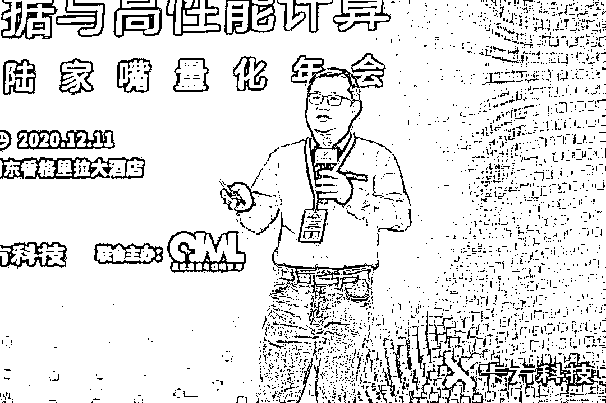

**1、利用新闻数据将深度学习应用于金融市场**

在这个场景中需要大量的新闻数据，在此基础上使用深度神经网络都贱预测模型，预测相关股票的市场走向。原始的工作流程是找文章，推断影响，进行投资决策，最后在市场中作出反应，但是存在的一个问题是文章的范围十分有限，寻找这个信息的过程也非常耗时，甚至最终会错过这个投资机会。而现在的工作流程是浏览文章，链接相关的股票，根据这个信息确定一个情绪分数，从而判断市场走势，最终在市场中做出反应。在这种应用场景下，可以分析更多文章，判断更加准确和及时，从而更快地作出投资决策。

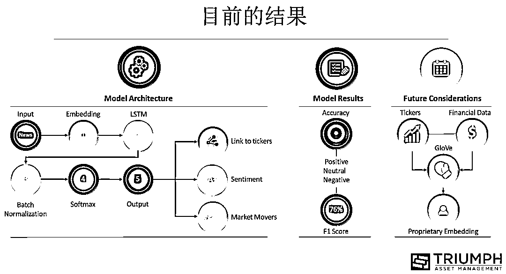

**2、使用深度学习提高算法交易策略的性能**

算法会创建一个粗略的交易时间表，比如“何时”、“多少股”和“以什么价格”买卖，并遵循这个时间表，直到所有的订单数量都交易完成。每当市场发生变化时，算法就检查当前情况是否符合触发执行的要求。预测股票价格将发生重大变化的情况，算法交易策略性能的预期改进为 1 个百分点。

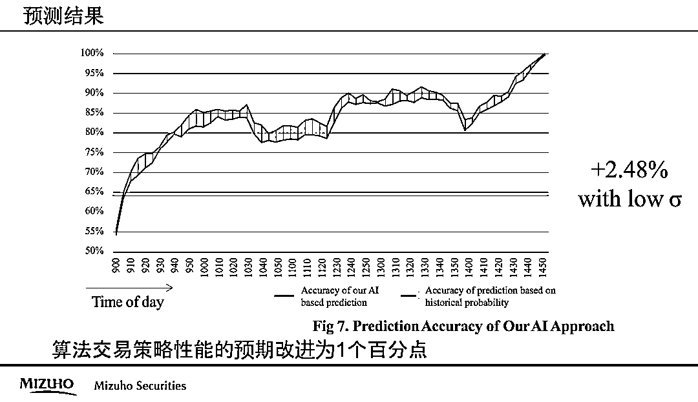

**3、利用人工智能来主动进行资产管理**

散户投资者的需求是更积极地管理投资组合，从明智的投资决策中获得额外回报。但是他们也面临着一些问题：数字平台专注于被动管理产品，监管限制了投资者进入对冲基金风格活跃的产品，现有的主动管理的产品收费很高。**现代人工智能技术能否取代 PM 或交易员吗？**FlinkAI 智能数据感知 AI 代理，用于主动投资决策：使用人工智能驱动的智能 Beta ETF 替代品，采用人工智能监督和自动交易策略。可以实现智能数据驱动决策的额外回报，完全自动化，没有人工干预，不会错过市场机会，将工作委托给智能代理，极大节省了交易成本和时间。

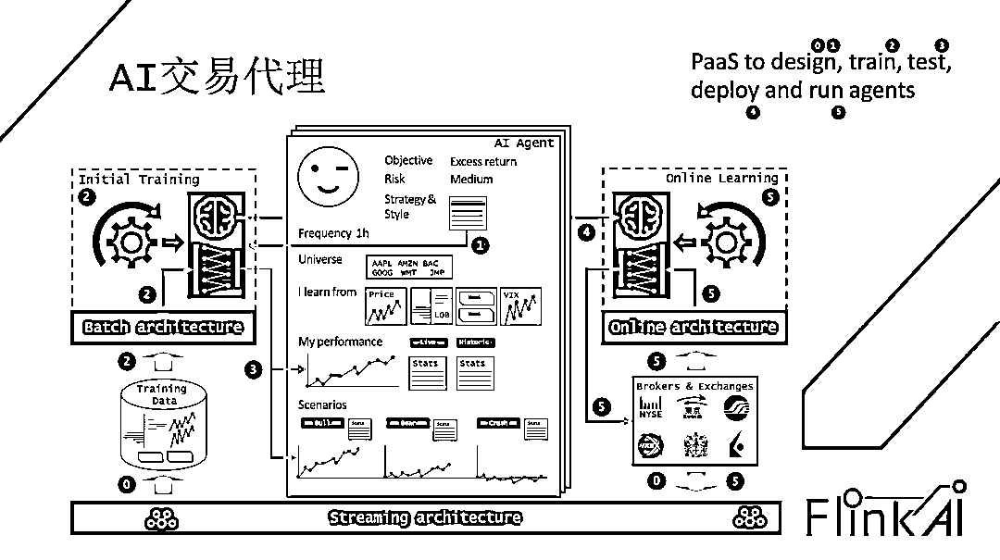

我们与幻方合作的 AI LAB，用大型神经网络探索世界，包括经济金融分析、自然语义理解，基础科学研究。**幻方「萤火一号」：达到 18.416 Pflop/s，存储集群提供每秒 1.3 亿次 IO 响应、4.1Tbps 读写带宽以及 1.2PB 容量。计算集群搭载 1100 张高端显卡，每秒可以进行 1.8416 亿亿次浮点运算，所有节点通过 200 Gbps Infiniband 交换机进行互联。4 台 DGX-2/100G-InfiniBand 互联训练一个复杂神经网络模型需 2 个月，而「萤火一号」当前处理 2 倍复杂度模型训练时间仅需一周，训练结果的预测错误率降低一半以上，性能整体提升了 10 倍。**

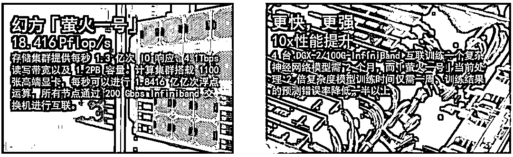

而我们的 AI 平台通过智能分析和训练、推理、应用程序训练等环节，在多个赛道加速 AI 应用和普及，我们有 DGX，GPU，包括各种云上的 AI 加速功能。发布的 Nvidia A100 80GB 可以大幅加速 AI 超级计算。也是专为人工智能定制，希望大家**买的更多，省的更多，赚得更多！**

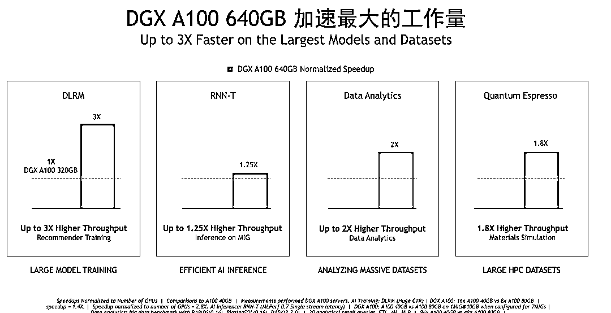

**多元资本与 A 股量化投资**

**路博迈 NEUBERGER BERMAN 董事总经理 | 周平博士**

今天分享的内容主要是我对美国的量化投资和中国的量化投资的一些思考。

路博迈成立于 1939 年，**截止到今年 9 月管理资金规模已达 3740 亿美金**。我们管理的资产主要投资在三个方向，约 1700 亿美金投资在固定收益证券中，权益占了 1000 亿美金，另类投资也超过了 1000 亿美金。

我在中国资本市场的两年可以用四个字来形容：大开眼界。为什么这么说？首先 Quantitative 这个词在美国已经不流行了，美国这样的量化机构有很多经历了大爆仓，现在大家更多用到的是 Systematic；相对应的主动投资（Discretionary）这个词也不准确，因为无论是否使用量化最终都是主动投资。量化和主动投资的具体规模没有明确的统计，因为两者之间的界定并非黑白分明。据美国著名量化投资管理公司 AQR 估计，截止 2017 年，量化股票管理规模在各资管子行业中的比例大致如下：共同基金占 14%，对冲基金占 26%，机构账户占 25%。截止今年，对冲基金中自称量化基金的管理规模大概是一万亿美元，共同基金中约 1.5 万亿美元，机构账户大概 1-2 万亿，所以合计起来大概是 3.5-4.5 万亿美元。总体来说，主动投资仍然是大头，量化占少数。

这些量化策略是什么？绝大多数是股票策略，少数宏观、商品、期权策略，固收策略极少。绝大多数在管规模是股票多头，对冲型产品管理规模相对较小。

接下来我们看一下美国量化基金的投资业绩，从对冲基金披露的业绩来看，过去 5 年量化策略和主动策略的平均收益都非常低，过去 5 年（截止 2020/10/31），市场中性对冲基金的年化收益是 +1.18%，系统化宏观策略的年化收益是 0.60%，同期对冲基金指数的年化收益是 +3.80%，其中包含了大量多头基金。明星基金的表现呢？文艺复兴科技的大奖章基金（自 93 年起不再对外开放）表现极为耀眼，但其对外开放的股票基金（可以多空，有杠杆）相对标普 500 的长期年化超额收益不足 3%。

为了突出咱们中国的基金经理到底有多牛，往前看十五年，美国的大型股票基金当中，跑赢对标基准的比例是多少？百分之八。对标中盘股百分之五，对标小盘股只有百分之三。跑赢的水平呢？在十五年一共，注意是一共，百分之八。所以如果带着对中国基金经理的期望来美国，你一定会失望。A 股的量化投资业绩表现优异，远超美国同行，根据开源证券的研究，以量化多头产品为例，从 2018 年到现在，量化私募业绩远超沪深 300 指数，量化公募主要在 2020 年超额显著。

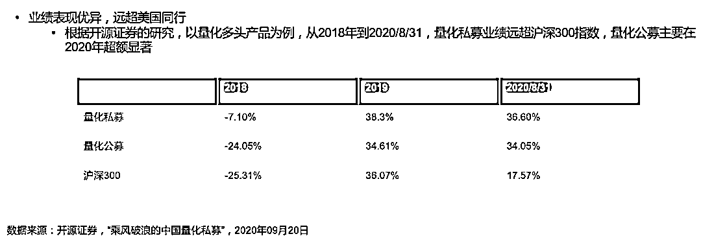

超额收益的来源是什么呢？第一个是机构化程度，美国高度机构化，散户占比很低；而中国机构化程度较低，散户占比很高。从竞争的充分程度来看，美国竞争非常充分，投资限制很少，工具多样，费用低廉；中国不充分，不同机构面临不同限制，工具不足，费用高昂。美国的业绩评价标准多元化，长期化；而在中国收益率是唯一的硬道理。从客户需求来看，美国的客户需求非常多样，而在中国仍然是收益率唯一的硬道理。在美国的基准设定基准给予大型成长股很高的权重而中国的基准设定基准对大型成长股覆盖不足。美国的政策红利很少，但中国因为投资门槛限制而产生的红利很多，例如打新，有些机构甚至会把一百亿的资金分拆成一百个产品，就是为了最大化打新收益。

从量化研究的发展来看，**所有的量化投资都可以看作是某种形式的多因子投资，所以量化投资的核心在于因子的挖掘和使用**。大家主要都集中在做两件事：**因子挖掘和因子使用。**

因子挖掘：各种另类数据包括非结构化数据，文本挖掘，舆情分析，图片分析，微观交易数据等等，有些策略会分析公司发布财报时，公司的 CEO 或者经理出来说一句话，然后根据这句话的语气语调等等来判断这里面是不是有财务造假的嫌疑，甚至把一些 FBI 审问犯人的技巧都用上，如果有录像，还会去分析他的神态动作等等。有的人会去探索旧数据的新使用方法：比如财报的重组和学习，在比如说使用机器学习来大量挖掘因子。第二个，因子的使用，比如因子择时：探索因子表现背后的原因，预测因子的收益。非线性合成：算法，人工智能。

接下来这张图片可能与本次大会格格不入，会让人感到不适，AIEQ 是人工智能选股的一次尝试，完全人工智能驱动的美股 ETF，其核心模型在 IBM 大型计算机 Watson 上运行，模型算法没有公开。2017 年 10 月 27 日上线，截至上周，它热盎然大幅跑输标普 500。之前也有一些类似的尝试，比如分析推特上的一些数据，最后也不是很成功，但这些都没有阻挡大家对人工智能的尝试，只是表明了这个应用没有我们想象得那么简单，不是简单的堆砌数据，堆砌高级的模型就可以的。

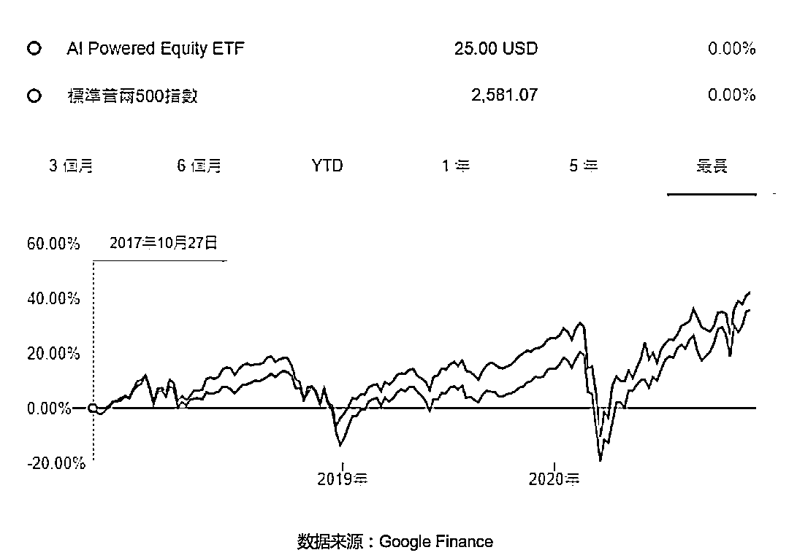

量化投资面临的挑战是什么呢？做过量化的都知道**因子动物园（Factor Zoo）**。发表在顶级学术期刊的因子已经有 300 多个，还有更多的没有发表，即使这些权威文献这么难发表，我们至今也有了至少 300 个权威的因子。国内和国外的一些量化机构号称拥有几十万到几百万个因子，买方和卖方的分析师每天都在研究新的因子。

还有一个问题：**P-hacking**，在同样的样本里重复筛选，反复强调显著性，最终选出来一个在样本外没有解释性的一个因子。举个例子，今天演讲的四个人三个人名字里带平，你可以挖出一个信号，只有名字里带平的有比较大的可能被卡方邀请做演讲嘉宾，这就是过度拟合的现象。考虑到大部分发表的结果是经过多次测试后的发现，这些发现对未来没有预测能力的可能性很高。大数据呢？数据与资产价格的关系不直接，不稳定。经历层层迭代，原本每个环节预测准确性是 70%，两层时候是 50%，三层之后是 35%，四层之后 24%，五层之后 15%。当环节链很长很复杂的时候，就会造成这种问题。**所以核心不是追求更多的数据，而是更高的信噪比**。当然机器学习、人工智能是非线性模型的必经之路，但是过拟合的风险上升，对模型的理解和信心下降。

最后想跟大家分享一下我的几点思考：

**第一，A 股的定价权属于****谁？**很多人觉得是一个纯粹的自然现象。不是的，这个价格通过不断的交易实现的。为什么同样的拍卖品在一个拍卖场值一个亿，在另一个拍卖场只拍出十分之一的价格？那么 A 股的定价权到底属于谁？我们认为，A 股的主动管理基金是一个很重要的定价方。他们的偏好和风格变化会影响整个市场，包括北向资金等等。但是量化投资者本质上只是参与者不是定价者，我们要去分析这些有定价权的投资者。

**第二，高收益和低回撤之间的矛盾。**实际上我们要求在未来越来越短的周期中对越来越细微的波动有越来越准确的预测，当策略频率达到毫秒的时候，可能每个周期的准确率并没有很高，但积累一天后，这个收益还是很好的。这种策略容量极其有限，所以高收益和低回撤之间是有矛盾。

**第三，集中还是分散。**对于中高频，分散是一个更好的选择，因为分散可以规避个股的一些风险。但是当交易频率比较低的时候可能还是集中好一些。

**第四，产品设计的长期合理性。**今年量化、主动管理都很火爆，但股票指数并没有很火爆，原因很简单，收益率很高，但这样的收益率有没有可持续性呢？这个需要大家去思考。很多人选择量化是因为中性可以对冲掉很多风险。但是今年的收益来源是什么样的？扣掉打新的收益剩下多少？但打新没有门槛，这种收益并不具备可持续性。给大家举个简单的例子，一个年化 7%的市场中性产品，相对于固定收益产品吸引力并不是很大，但是要实现这 7%还是很难的，扣掉资金使用成本等等，需要年复一年跑赢指数 20%，实际上这样你的收益率妥妥超过巴菲特。所以大家对产品长期收益要有一个准确的认识，产品设计要充分考虑到收益来源和可持续性。

**圆桌论坛 1：中外顶级私募对谈**

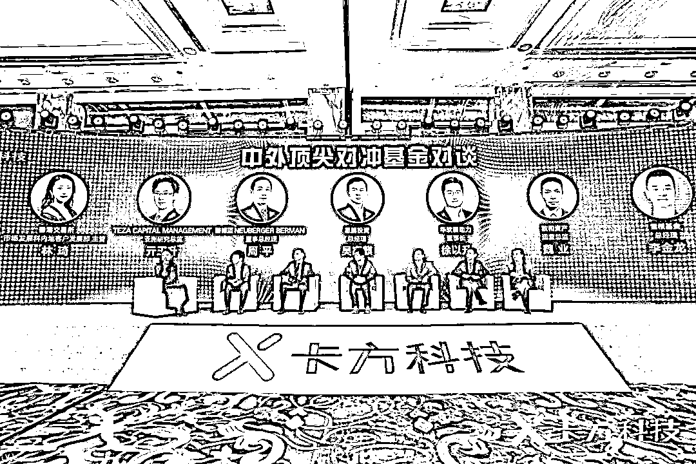

主持人

*   林琦 香港交易所 市场发展科内地客户发展部主管

圆桌嘉宾 

*   周平博士 路博迈 Neuberger Berman 董事总经理

*   亓玉升博士 TEAZ Capital Management 亚洲研究总监

*   吴家麒 思勰投资 总经理

*   徐以升 华软新动力 董事长

*   魏业 敦和资产 运营总监

*   李金龙 雷根基金 总经理

**主持人：**增长规模的速度，在明年能不能继续保持，量化交易的护城河体现在哪里？大家目前看到有什么比较行之有效的交易策略和交易方向或者表现较好的交易品种？

**亓：**看好中国期货市场。目前市场上已经有接近 70 个期货品种，整个期货市场资金总量接近 8000 亿元，和去年底相比增加了 40%多，后面这个盘子还会越来越大，交易活跃度也会越来越高，从资产配置的角度考虑，管理期货策略和各种股票策略一般来说相关性还是很低的，是非常好的配置资产的选择。具体到管理期货的策略上，在中国以商品期货为主的市场环境中，我们认为驱动资产公允价值变化最有影响力和最根本的，还是来自于商品产业链的基本面信息，这就是我们一直不断迭代升级我们的期货基本面量化策略的原因，也是我们认为的将来期货量化策略的一个趋势。

**周：**明年的市场是否保持，取决于市场基本面；投资策略的方面要保持谨慎。

**吴：**量化投资跑赢主观投资。绝对收入的产品，可能要有一个心理——绝对收入一定会有挑战，原因是市场上的企业太多了，从长期来看，只要任何一个策略给你带来一个不错的收入，大量的资金就会往策略上投入，优势逐渐向下，指数增强值得投资人关注。

**徐：**主观基金和量化多头选股资金，从大家的收益来源来看，都可以在当前 A 股市场跑赢指数。从量化跑赢指数的时间情况和跑赢指数的超额效应稳定程度来看，有非常大的发展能力；国内量化行业的竞争非常激烈，11 月行业回撤比较大，存在因子失效，回撤可能不是周期性的还而是结构性的，我相信有这一点量化处理的这种高性能的一个特点，给了我们甲方很大的一个力量。

**魏：**市场配置的能力，结合现在的技术，提高市场参与效率，投资配置的方向。

**李：**雷根基金 2021 年结合境内外的市场将布局三大类策略，按照风险等级：低风险：现金管理类的策略、固收+：量化对冲、科创、港股打新策略、高风险：全球宏观价值策略，无论哪种策略我们都将以人民币和美元基金的方式来进行投资，具体看好的市场：有 A 股、港股、中资美元债、新加坡的 reits。今年港股表现比较好的一些行业，首先第一个是生物医药。第二个行业是物业管理，物业管理公司也参差不齐，在 10 月份之前整体的业务管理表现还是比较乐观的。第三个是信息技术第四个行业类型为消费行业。雷根将在未来的几年市场不断的布局 A 股、港股市场、以及海外市场。

**主持人：**国内监管政策对创新的影响？

**周：**从外资的角度，从中国的经济占全世界经济的比重来看的话，中国的资本市场在海外投资者的比重过于低，完全与中国的经济重要性不同，中国的资产市场，还需要更多的一些配置。

**吴：**其实对于量化系统来说，我们本身最重要的事情其实还是在于自身策略的迭代，如果更深挖一些，可能就是在于这种执行力。因为刚刚主持人提到了中国市场上它的政策性特别强，它的变化是非常快，可能这两年一个非常有效的策略，就是它有效的一个机会，可能就在短短的一年里又消失了，但它又会创造出一些新的机会。所以我觉得这里面最重要的事情是你怎么能够快速跟上中国市场这样多元的变化，无论是同行的变化，外资的进入等等。我个人认为有一句话说的很对：“这个世界上唯一不变的就是时刻在不断的变化”，这对我们有十分重要的指导意义！

**主持人：**我相信今年港股市场表现也是大家非常关注的一个领域，特别是香港从 18 年推出上市制度改革以后，大家看到很多中国科技公司从美国回归，这让整个香港市场从一个原来比较偏金融和地产这样的一个市场转化成一个科技板块占比最高的市场。从全球配置的角度来看，未来会不会在香港市场加强布局？

**亓：**我们太则资本在海外市场目前覆盖了欧美主要的期货交易所和证券交易所，通过我们的自营业务和资管业务来交易各种期货和股票。除了发行私募基金产品，去年我们也上线了共同基金业务。最近我们结合在中国及海外期货投研上策略的积累，以及考虑到很多境内及境外投资者同时拥有境内及海外投资的需求，我们开发出一套中国在岸离岸的期货对冲套利策略。

**李：**今年行业表现比较好的一些行业，首先第一个是生物医药，不过近期有个别的医疗资源是有审计开发的情况的；第二个行业是物业管理。物业管理公司也参差不齐，在 10 月份之前整体的业务管理表现还是比较乐观的。第三个是信息技术，主要香港 IPO 上市。接下来明年的 A 股的市场会注册会放开，IPO 的数量越来越多。接下来其实是一个行业的发展，我们看不同的时间节点，不同的状态，它的行业环境也不同。

**圆桌论坛 2：金融科技在投资领域的应用与实践**

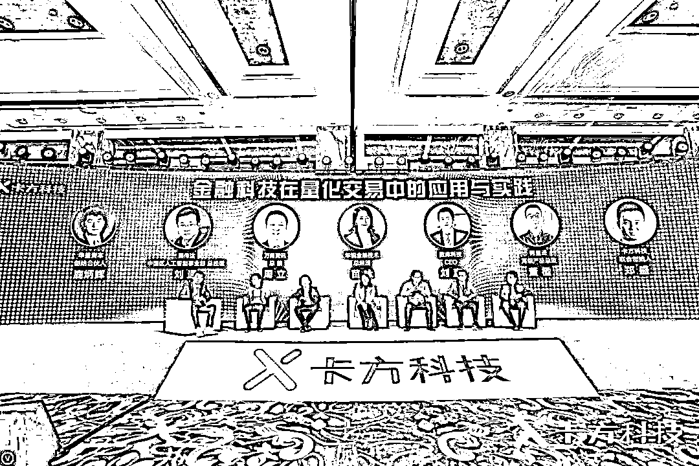

主持人

*   鹿炳辉 华盖资本 创始合伙人

圆桌嘉宾

*   刘通  英伟达（NVIDIA）公司中国产业 AI 总经理
*   周立 万得资讯 总裁
*   苗咏 华锐金融技术 总经理
*   刘彦 数库科技 CEO
*   董楹 阿里云 高级产品总监
*   郑盛 卡方科技 联合创始人

**主持人：**在强监管的情况下，对于我们数据厂商有什么思考？

**万得：**总的趋势可能是越来越严，在这个方面万得始终非常重视。

**数库：**很多公开信息里有很多价值都没有挖掘出来。所以说，只要你在技术上有持续的投入并且一直扎根在这个上面的话，你会发现其实很多黄金就在你身边，所以我觉得其实很多时候大家没有必要去走这种违法的捷径。

**主持人：**对于软硬件厂商，这两年监管到底是在我们的产品开发当中起到多大作用，或者说有多大的推动力？

**英伟达：**我们和监管的距离太远了，英伟达是底层技术工程方，是人工智能技术的引领者，我们会和在座的各位精诚合作，为量化提供最高算力。

**华锐：**我的感受是比较强烈的，关系很密切。本质上我们是一家科技公司，科技公司要恪守科技的本分，那么就不断的去提升我们的技术能力，不断以我们的技术能力赋能给我们的客户，帮助我们的客户通过获得技术提升的方式去获得他的竞争力的提升，这是我们的本源要做的事。

**卡方：**监管机构也在招最聪明的人在监管层面做金融，我们花了很大的力气在风控内控上，一个是制度性的问题，一个是 IT 管理。因为我们知道卡方是服务型企业，我们不是某对冲资金内部的一个团队，如果是内部的一个团队风控出了问题，扣点工资就结束。所以我们花了很大的功夫去做全量风控，把所有交易所的规定和限制全都写进去。

**阿里云：**对于阿里云来说，强监管状态下，数据安全是重中之重。我们在开发的过程中，会有特定的流程来保证数据安全，并且，很多客户对监管规则的理解是不同的，如何找到客户需求和监管的平衡点，在不违反规则的情况下，帮助客户实现目标，完成创新，是数据厂商和软硬件厂商是至关重要的。

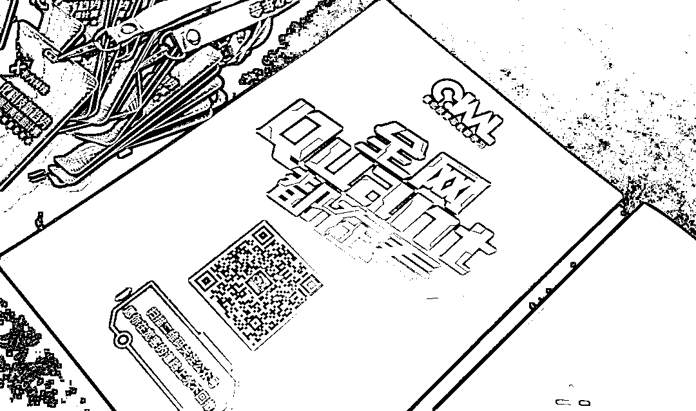

量化投资与机器学习微信公众号，是业内垂直于**量化投资、对冲基金、****Fintech、人工智能、大数据**等领域的**主流自媒体**。公众号拥有来自**公募、私募、券商、期货、银行、保险、高校**等行业**20W+**关注者，2019 年被腾讯云+社区评选为“年度最佳作者”。