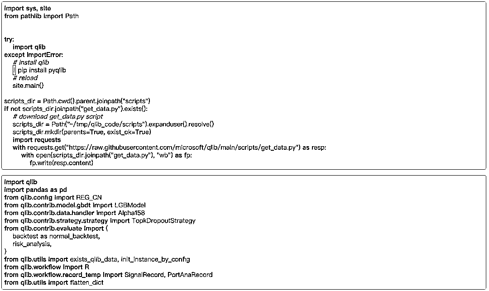
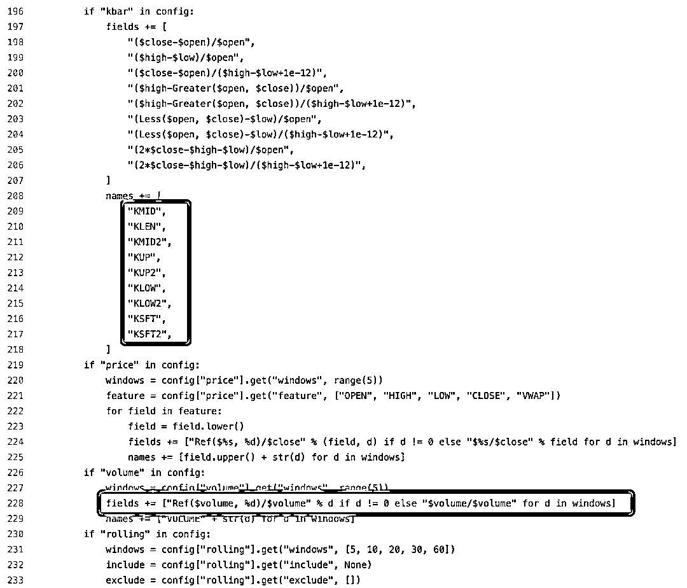

# 微软也搞 AI 量化平台？还是开源的！

> 原文：[`mp.weixin.qq.com/s?__biz=MzAxNTc0Mjg0Mg==&mid=2653308634&idx=1&sn=d4e7109363bf487b094f65516923d05a&chksm=802d84cfb75a0dd9de6471d61fc29b222d3e0ca71fe5e74bac2baca51ba779c4f2a4c8f3eef0&scene=27#wechat_redirect`](http://mp.weixin.qq.com/s?__biz=MzAxNTc0Mjg0Mg==&mid=2653308634&idx=1&sn=d4e7109363bf487b094f65516923d05a&chksm=802d84cfb75a0dd9de6471d61fc29b222d3e0ca71fe5e74bac2baca51ba779c4f2a4c8f3eef0&scene=27#wechat_redirect)


***全网 Quant 都在看！***

量化投资与机器学习公众号报道

近日，量化平台大家庭又增一位新成员，业内首个 AI 量化投资开源平台：**Qlib——微矿**


小编好奇，这是一只胖胖橘猫嘛？

来头也不小——**微****软亚洲研究院**。

微矿开源仅一个月多，目前已经在 Github 上获得了**800+**颗星。

地址：***https://github.com/microsoft/qlib***

Qlib 一些主要贡献者（前六）： 


**背景介绍**

根据微软亚洲研究院官方报道，微软亚洲研究院“创新汇”成立至今已有三年时间，创新汇的成员企业如今已扩展到了 27 家，包含了来自金融、物流、教育、医疗健康、制造、零售等多个行业的龙头企业和创新公司。

## 

创新汇成员华夏基金与微软亚洲研究院自 2017 年开始在量化投资——多因子选股领域合作，基于“AI+指数增强”的策略，双方挖掘出了与传统投资方法低相关性的投资组合，实现了华夏基金在金融市场中的差异化竞争。

事实上，在整个股票投资的过程中，选股只是一小步，如果要确保投资成功，还需了解建仓股票之间的关系，从而进行风险控制，以避免“鸡蛋放在一个篮子”的问题发生，如同类股票要谨慎购买，相关联企业要分散投资等等。同时，还需要将交易成本、换手率等约束条件纳入考虑之中；当形成最优投资组合之后，还要考虑订单的执行和交易因素等等。

基于这样的思路，微软亚洲研究院在此前的研究基础上，打造了一个 AI 量化投资平台：Qlib——微矿，希望实现量化投资流程的 AI 闭环。**作为一个开源工具包，该平台可供金融机构、从业个人使用，以提升投资者的技术储备和综合水****准，提高整个市场的效率，从而在投资领域形成更大规模的良性循环。**

从 Qlib 的官网介绍来看：

Qlib 包含了数据处理、模型训练、回测等完整的机器学习 pipeline，并涵盖了量化投资的整个链条：**Alpha 挖掘、风险建模、投资组合优化、定单执行**等等。

同时，Qlib 还专门为此写了一篇论文，里面有关于数据储存结构的设计等等细节问题，大家可以进行查阅：


https://arxiv.org/pdf/2009.11189.pdf

根据官方对 Qlib 的表述：

**Qlib 平台大大降低了使用 AI 算法的门槛，其内部集成了十几个 AI 算法在金融场景下的使用样例以供参考**，并且为整个金融行业提供了一个适应 AI 算法的高性能基础设施和数据、模型管理平台。而对于 AI 从业者来说，Qlib 则提供了一个完备的投资研究框架，以及基于领域知识设计的多个跨市场的数据集和业内领先的基准。

**Qlib 的框架**

Qlib 的功能就是由下述模块构成，每个模块都可以单独使用：


带有虚线边框的模块具有高度的用户自定义性和可扩展性

**Infrastructure 层**

该层为量化研究提供了基础支持。Data Server 模块为用户管理和检索原始数据提供了高性能的基础架构。Trainer 模块提供了灵活的接口来定义模型的训练过程，同时也为分布式训练提供了接口。Model Manager 模块可以让用户更好地管理繁多的 AI 模型，更快地迭代其 AI 算法。

**Workflow 层**

该层涵盖了量化投资的整个工作流。Information Extractor 模块为模型提取数据。Forecast Model 侧重于为其他模块产生各种预测信号（如 Alpha 信号、风险信号）,利用这些信号，Portfolio Generator 模块将生成目标投资组合，并由 Order Executor 模块执行交易。Meta Controller 模块就是在解决不同时期调整模型、策略、执行的问题，辅助用户进行操作。

**Interface 层**

交互层是为底层系统提供一个友好的界面。Analyser 模块为用户提供详细的预测信号、投资组合和执行结果的分析报告。

**Qlib 的语言**

Qlib 支持 Python3，可以在 Windows 和 Linux 下运行。Qlib 也需要 lightgbm 和 pytorch 包的支持。

```py
pip install pyqlib
```

```py
import qlib
from qlib.config import REG_CN
provider_uri = "~/.qlib/qlib_data/cn_data"
qlib.init(provider_uri=provider_uri, region=REG_CN)
```

**Qlib 的数据处理性能**

Qlib 将其与其他几个数据存储解决方案进行了比较，通过同任务来评估其性能。该比较方案从股票市场（2007 年至 2020 年每天月 800 支股票）的基本数据（开、高、低、收、成交量） 创建一个数据集（14 个特征/因子）。该方案涉及数据查询和数据处理。


+(-)E indicates with (out) ExpressionCache

+(-)D indicates with (out) DatasetCache

大多数通用数据库在加载数据上花费了太多时间。Qlib 发现在通用数据库解决方案中，数据要经过了太多的接口层和不必要的格式转换。这大大地减缓了数据加载过程。Qlib 的数据以一种紧凑的格式存储，对金融数据和运算进行了存储和计算优化，这种格式可以有效地组合成数组用于计算科学。**相比传统 IT 平台，Qlib 的计算性能要快数十倍！**

**自动量化研究 workflow**

Qlib 提供了一个名为**qrun**的工具来自动运行整个 workflow（包括构建数据集、训练模型、回测和评估)。具体文档看这里：


https://qlib.readthedocs.io/en/latest/component/workflow.html

图形报告分析——预测信号（模型预测）分析：


**自定义 workflow**

自动化的 workflow 不一定适合所有量化研究者的研究 workflow。为了支持灵活的量化研究 workflow，Qlib 还提供了一个模块化界面，允许研究人员通过代码构建自己的 workflow。下面是一个通过代码定制量化研究 workflow 的示例（部分代码展示）：




# **Qaunt 模型 Zoo**

Qlib 目前内置了许多常见的金融 AI 算法模型：

*   GBDT based on LightGBM

*   GBDT based on Catboost

*   GBDT based on XGBoost

*   MLP based on pytorch

*   GRU based on pytorch

*   LSTM based on pytorcn

*   ALSTM based on pytorcn

*   GATs based on pytorch

*   SFM based on pytorch

*   TFT based on tensorflow

*   ···

例如 GBDT based on XGBoost 的代码：


同时，大家可以看到相关模型的一些详细信息：


 除了 Qlib 提供的默认模型外，用户还可以将自己的定制模型集成到 Qlib 中。

最后，用户可以基于平台和自己的数据甚至是引用的最新的外部论文去创建全新的模型，挖掘差异化的投资因子，针对不同的数据和目标训练相应的预测模型并构建自己的投资组合。

**Quant 数据集 Zoo**

Qlib 也提供了包含美股和 A 股的两个数据集：


从代码来看：

**Alpha360 偏****量价****因子**


**Alpha158 偏****常用****因子（比如技术指标等）**



下面是 Alpha360 和 Alpha158 分别在 A 股和 CSI300 数据集上的测试结果：


**写在最后**

**Qlib 的优点在于将相关问题拆分，并在每一步和每个模块中提供了简单易学的 AI 技术、数据引入的方法，以及模型的训练方式，大大降低了 AI 使用的专业门槛。**

相信在后续的迭代更新中，Qlib 能有更出色的表现，给 Quant 们带来福音！

在文末，大家可以查询下方链接，查看**最新**文档说明：


*https://qlib.readthedocs.io/en/latest/index.html*

 

量化投资与机器学习微信公众号，是业内垂直于**量化投资、对冲基金、****Fintech、人工智能、大数据**等领域的**主流自媒体**。公众号先拥有来自**公募、私募、券商、期货、银行、保险、高校**等行业**20W+**关注者，2019 年被腾讯云+社区评选为“年度最佳作者”。