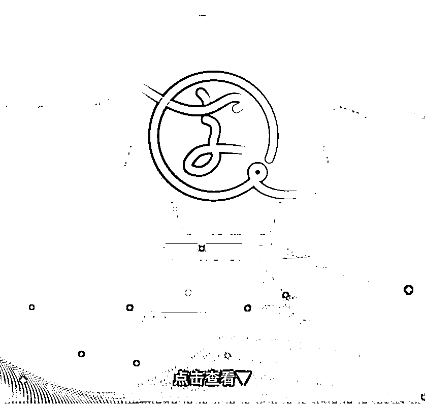
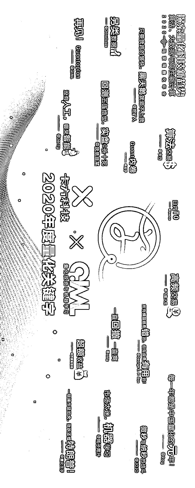
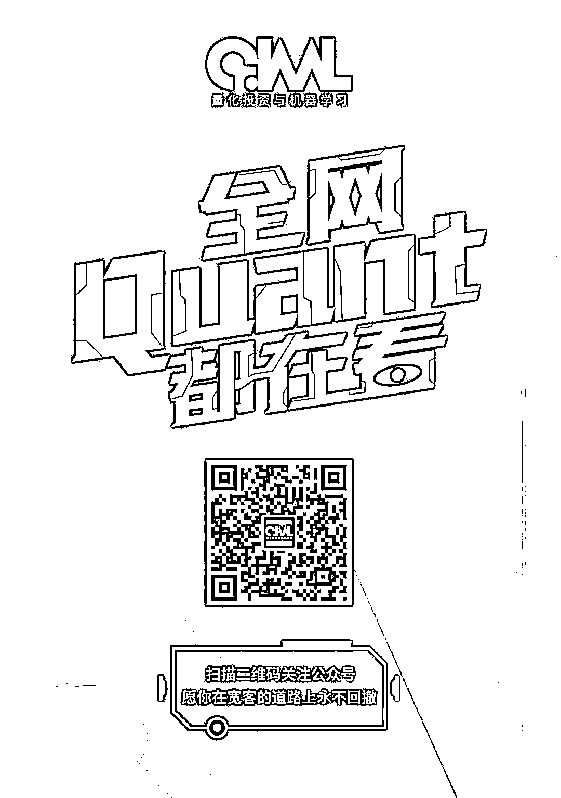

# 二千零二十、年度量化『关键字』重磅揭晓！

> 原文：[`mp.weixin.qq.com/s?__biz=MzAxNTc0Mjg0Mg==&mid=2653308494&idx=1&sn=b051a87395cd964e8c0622e9f246f15c&chksm=802d845bb75a0d4d97a831beaa478855694dd2260075b2a5afb65addea232886759c7345689d&scene=27#wechat_redirect`](http://mp.weixin.qq.com/s?__biz=MzAxNTc0Mjg0Mg==&mid=2653308494&idx=1&sn=b051a87395cd964e8c0622e9f246f15c&chksm=802d845bb75a0d4d97a831beaa478855694dd2260075b2a5afb65addea232886759c7345689d&scene=27#wechat_redirect)

经过全网公开征集，公众号最终筛选了如下量化投资领域 2020 年度『关键字』，快来看看吧！

获取高清原图，在后台回复： 

**量化 GJZ** 

量化投资与机器学习微信公众号，是业内垂直于**量化投资、对冲基金、****Fintech、人工智能、大数据**等领域的**主流自媒体**。公众号先拥有来自**公募、私募、券商、期货、银行、保险、高校**等行业**20W+**关注者，2019 年被腾讯云+社区评选为“年度最佳作者”。