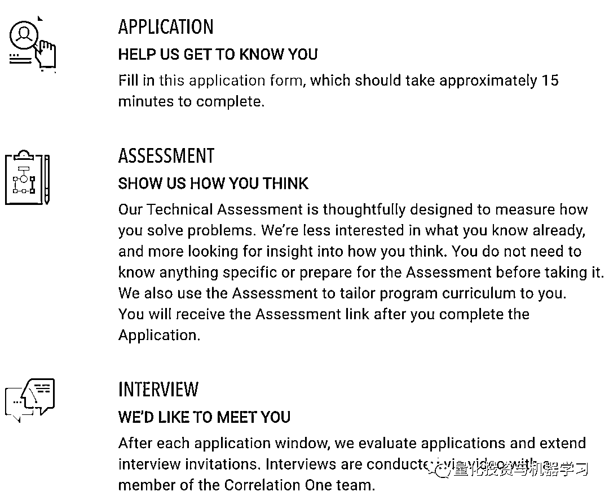

# 全球顶尖对冲基金：人才培养新计划！

> 原文：[`mp.weixin.qq.com/s?__biz=MzAxNTc0Mjg0Mg==&mid=2653308398&idx=1&sn=39e7503d8163db30dc682360194e9bae&chksm=802d87fbb75a0eedb2f860a796db490d0eb50850ed169b8daf84e82766f928fbcbb979b30524&scene=27#wechat_redirect`](http://mp.weixin.qq.com/s?__biz=MzAxNTc0Mjg0Mg==&mid=2653308398&idx=1&sn=39e7503d8163db30dc682360194e9bae&chksm=802d87fbb75a0eedb2f860a796db490d0eb50850ed169b8daf84e82766f928fbcbb979b30524&scene=27#wechat_redirect)

**项目介绍**

近期，全球头部对冲基金，如：Point72、Citadel、Citadel Securities、Marshall Wace、Two Sigma 正与 Correlation One 一起参与一项新的多元化计划：

参与机构名单

Correlation One 是全球提供数据和分析培训的市场领导者：

该项目提倡：***Data Science For All / Empowerment***。包括为期 13 周的免费培训，导师来自常青藤联盟（哈佛、哥伦比亚、麻省理工等学校）。该课程通过真实的业务案例教授数据技能，以便让大家知道如何将所学知识应用到现实世界中。

**课程大纲**

同时对于**学员**也有**要求**：

**项目申请**

目前申请已经开始了，你需要完成一个技术评估和面试才能进入这个项目：

**申请地址：**

https://correlation-one.typeform.com/to/ub4JEbgG?_gl=1*1f8chyh*_ga*MTgxNTk2MjY2NS4xNjA3NDA3NzA0*_ga_MR3R8BG9FG*MTYwNzQxODU4Ny4yLjEuMTYwNzQxODYwMy4w 

**申请时间**

去年，该项目有 8300 人申请，500 人被录取。

**各位加油！**

 

量化投资与机器学习微信公众号，是业内垂直于**量化投资、对冲基金、****Fintech、人工智能、大数据**等领域的**主流自媒体**。公众号先拥有来自**公募、私募、券商、期货、银行、保险、高校**等行业**20W+**关注者，2019 年被腾讯云+社区评选为“年度最佳作者”。