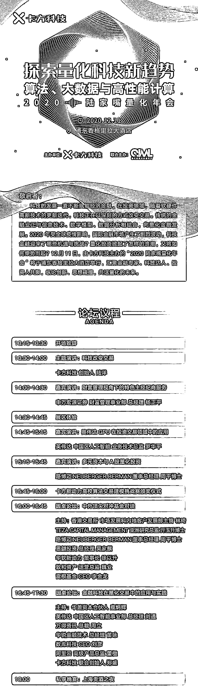
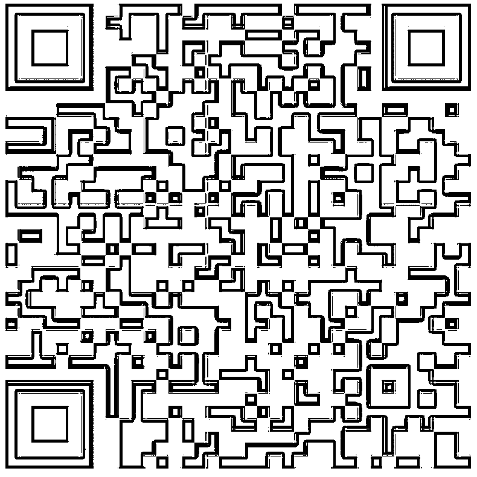

# 十二、月 11 日、魔都、不见不散！

> 原文：[`mp.weixin.qq.com/s?__biz=MzAxNTc0Mjg0Mg==&mid=2653308352&idx=1&sn=a01013c29fdae9cd714b2eb552592cd9&chksm=802d87d5b75a0ec3585c2965d09bb811b51606ec91c2e3db59339145b37508926f6288dc46d0&scene=27#wechat_redirect`](http://mp.weixin.qq.com/s?__biz=MzAxNTc0Mjg0Mg==&mid=2653308352&idx=1&sn=a01013c29fdae9cd714b2eb552592cd9&chksm=802d87d5b75a0ec3585c2965d09bb811b51606ec91c2e3db59339145b37508926f6288dc46d0&scene=27#wechat_redirect)

**12 月 11 日**

**上海**

**不见不散~**

**1 **天论坛

多位行业领袖、科技大咖精英

**4** 场主题演讲

科技改变交易

国内特色经纪商探索

GPU 在投资交易领域中的应用

多元资本与 A 股量化投资

**2** 场圆桌对谈

中外顶尖对冲基金对谈

金融科技在量化交易中的应用与实践

**量化投资与机器学习****公众号**（QIML）将联合国内金融科技领域领先的算法供应商**卡方科技**，共同在上海为全网 Quant 举办一场大型的量化科技峰会。

这是 QIML 成立 5 年来第一次联合举办如此盛大的线下活动，感谢 5 年来一直关注 QIML 的铁杆粉丝们！QIML 也希望为国内量化投资的发展贡献一份自己微薄的力量。

**活动介绍与议程**

**参会地点**

**如何报名？**

请各位 Quant 于 **12 月 11 日前**，**扫描文末二维码**或点击**阅读原文**进行报名。通过审核的用户可以收到成功短信（内附二维码），请大家在活动当天出示二维码进行参会签到！

由于疫情人员管控，公众号这边预留出 **50-100 个名额**给到大家，各位 Quant：

**早****扫早通过！****早****扫早参加！**

**拒绝****空降****！****拒绝****混场子****！**

QIML 希望给大家呈现最好的大会体验，届时会对参会人员进行严格审核。

在**邀请人**一栏填写：**QIML **将大大增加通过审核几率！

**扫码参会，永不回撤！**

量化投资与机器学习微信公众号，是业内垂直于**量化投资、对冲基金、****Fintech、人工智能、大数据**等领域的**主流自媒体**。公众号先拥有来自**公募、私募、券商、期货、银行、保险、高校**等行业**20W+**关注者，2019 年被腾讯云+社区评选为“年度最佳作者”。