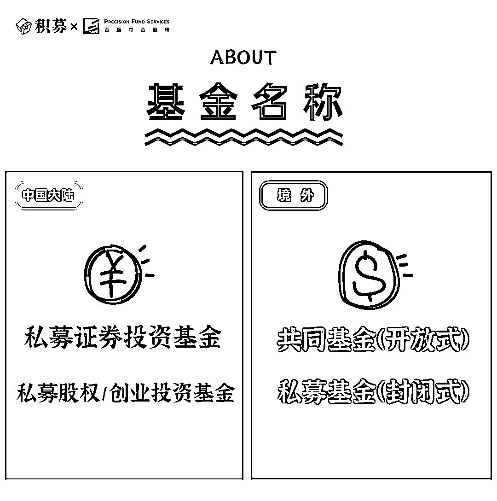

# 有点意思！一图看懂境内外私募基金

> 原文：[`mp.weixin.qq.com/s?__biz=MzAxNTc0Mjg0Mg==&mid=2653308274&idx=1&sn=c0971624097ec554e7f62cecc5ae7672&chksm=802d8767b75a0e713f0797f8303e74fd8536e839fbfff8fc60eeeba97a1eec9d8960c8b49d26&scene=27#wechat_redirect`](http://mp.weixin.qq.com/s?__biz=MzAxNTc0Mjg0Mg==&mid=2653308274&idx=1&sn=c0971624097ec554e7f62cecc5ae7672&chksm=802d8767b75a0e713f0797f8303e74fd8536e839fbfff8fc60eeeba97a1eec9d8960c8b49d26&scene=27#wechat_redirect)

小编在跟大家闲聊的时候发现，海内外对于私募的要求、定义、组织形式都存在一定差异，为了便于大家更好地理解，积募特别联合百顺基金服务截取私募基金在境内外不同地区的关键词做了一系列的对比，供大家参考。

作者  |  积募 x 百顺基金服务

**01**

**02**

**中国大陆**

**中国证监会：**进行行政监管

**中国基金业协会：**进行自律监管

**境外**

**开曼：**CIMA 金融管理局

**BVI：**FSC 金融管理局

**新加坡**：MAS 金融管理局

**香港：**香港证监会

**03**

**04**

**05**

**中国大陆**

需要在中国基金业协会登记备案

**境外**

**开曼、BVI：**可以申请持牌豁免（SIBL 登记）

**新加坡：**要求 MAS（如 RFMC 牌照）

**香港：**要求在香港证监会持牌（如 4、9 号牌照）

**06**

**中国大陆**

中国境内

**境外**

基本无地域限制（但开曼有限合伙基金 GP 需要为开曼机构或者自然人）

**07**

**08**

**09**

**中国大陆**

**私募证券投资基金（含 FOF）：**股票、债券、期货合约、期权合约、证券类基金份额以及中国证监会认可的其他资产。

**私募股权投资基金（含 FOF）：**未上市企业股权、上市公司非公开发行或交易的股票、可转债、市场化和法治化债转股、股权类基金份额，以及中国证监会认可的其他资产。

**创业投资基金**（含 FOF）**：**创业阶段的未上市成长性企业股权、创业类基金份额等。

**境外**

**共同基金（开放式）**

通常在基金招股书（以及/或）投资明细附录（Appendix/Supplement）自行约定。

**私募基金（封闭式）**

通常在“有限合伙协议”LPA 进行约定。

**10**

**11**

**12**

**13**

**14**

**中国大陆**

契约型基金不超过 200 人

合伙型基金不超过 50 人

**境外**

**开曼：**受监管基金没有限制

**新加坡：**RFMC 投资人不能超过 30 人（其他 LFMC 没有限制）

**15**

**中国大陆**

**合格投资者**

投资于单只私募基金的金额不低于 100 万元且符合下列相关标准的单位和个人：

（一）净资产不低于 1000 万元的单位；

（二）金融资产不低于 300 万元或者最近三年个人年均收入不低于 50 万元的个人。

前款所称金融资产包括银行存款、股票、债券、基金份额、资产管理计划、银行理财产品、信托计划、保险产品、期货权益等。

下列投资者视为合格投资者：

（一）社会保障基金、企业年金等养老基金，慈善基金等社会公益基金；

（二）依法设立并在基金业协会备案的投资计划；

（三）投资于所管理私募基金的私募基金管理人及其从业人员；

（四）中国证监会规定的其他投资者。

**合格投资者身份证明文件：**

https://www.2in20.com/document-details/63

**境外**

**合资格投资者（开曼）**

1、 高净值人士

净资产至少为（开曼币）80 万（约 96 万美元）或总资产不低于（开曼币）4，000，000 元（约 479 万美元）。

2、 专业投资人（"sophisticated person"）

1) 受开曼主管机构的监管；

2) 受其他认可的海外监管机构监管；

3) 上市公司；

4) 在财务以及商业事件有丰富经验，有能力判断交易机，并参与单笔金额不低于（开曼币）80 万元（约 96 万美元）的交易；

**香港（专业投资者 Professional Investor）：**

(a) 认可交易所、认可结算所、认可控制人或认可投资者赔偿公司，或根据《证券及期货条例》第 95(2) 条获认可提供自动化交易服务的人；

(b) 中介人，或经营提供投资服务的业务并受香港以外地方的法律规管的其他人；

(c) 认可财务机构，或并非认可财务机构但受香港以外地方的法律规管的银行；

(d ) 根据《保险公司条例》(第四十一章) 获授权的保险人，或经营保险业务并受香港以外地方的法律规管的其他人；

(e) 符合以下说明的计划——

(i) 根据《证券及期货条例》第 104 条获认可的集体投资计划；或(ii) 以相似的方式根据香港以外地方的法律成立，并 (如受该地方的法律规管) 根据该地方的法律获准许营办，或营办任何该等计划的人；

(f) 《强制性公积金计划条例》(第四百八十五章) 第 2(1) 条界定的注册计划，或《强制性公积金计划 (一般) 规例》(第四百八十五章，附属法例) 第 2 条界定的该等计划的成分基金，或就任何该等计划而言属该条例第 2(1) 条界定的核准受托人或服务提供商或属任何该等计划或基金的投资经理的人；

一般专业投资者的特征：

l 具有与相关产品和市场相关的产品类型的经验； 

l 过去一年内进行不少于四十次投资交易； 

l 在相关市场（或具有类似特征的市场）有至少两年的经验； 

l 具有相关产品和市场的知识与专业知识；及意识到相关产品与/或市场交易的风险。

**16**

**17**

**18**

**19**

**20**

**21**

2019 年 12 月 23 日发布的《私募投资基金备案须知》第二十五条【基金年度报告及审计要求】管理人应当在规定时间内向协会报送私募投资基金年度报告。

**私募股权投资基金、私募资产配置基金的年度报告的财务会计报告应当经过审计**。

**22**

**境外**

**共同基金：**硬性规定需要

**私募基金：**相关职能需要由内部团队执行，但此团队必须完全独立；否则必须聘用独立第三方（如：基金行政管理人）

**23**

**24**

**中国大陆**

**有限合伙：**无

**公司型：**需要

**境外**

**开曼、BVI：**无

**新加坡**：有，但可以豁免（满足特定条件）

**香港：**有，但存在优惠政策

**25**

量化投资与机器学习微信公众号，是业内垂直于**Quant****、Fintech、人工智能、大数据**等领域的**量化类主流自媒体。**公众号拥有来自**公募、私募、券商、期货、银行、保险、资管**等众多圈内**20W+**关注者。每日发布行业前沿研究成果和最新量化资讯。