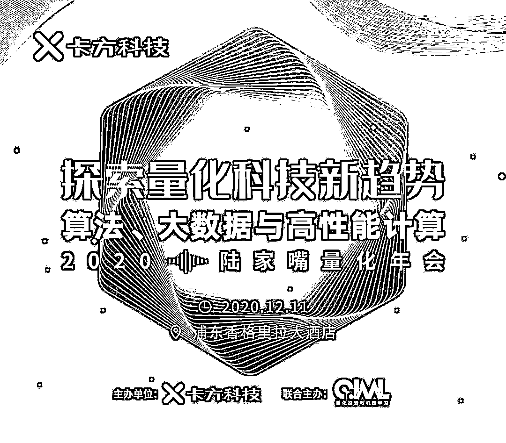
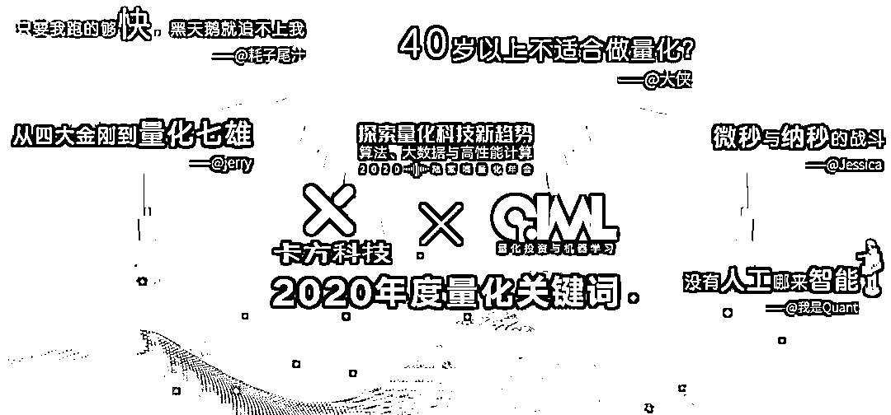
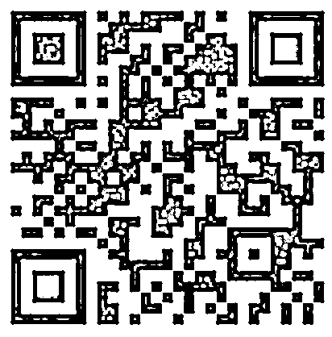

# 巨型展板！2020 年度量化关键词全网征集中···

> 原文：[`mp.weixin.qq.com/s?__biz=MzAxNTc0Mjg0Mg==&mid=2653308228&idx=1&sn=e45382ad7f19faf2e29aba00c70fb4f4&chksm=802d8751b75a0e475ab1e5ac34bd79395034c0db393efebf0e99553c6282ea07dd656f6fb3c9&scene=27#wechat_redirect`](http://mp.weixin.qq.com/s?__biz=MzAxNTc0Mjg0Mg==&mid=2653308228&idx=1&sn=e45382ad7f19faf2e29aba00c70fb4f4&chksm=802d8751b75a0e475ab1e5ac34bd79395034c0db393efebf0e99553c6282ea07dd656f6fb3c9&scene=27#wechat_redirect)

嗨，各位 Quant！

**量化投资与机器学习**公众号将联合国内金融科技领域领先的算法供应商**卡方科技**，共同在上海举办一场大型的量化嘉年华活动。

具体大会详情我们会在下周一之前公布，请大家随时关注公众号推文！

针对本次大会，我们将**特别设置一块巨型展板**（**长 7 米，宽 3 米**），用作大会签到与合影留念！

现在，公众号向**全网征集属于 Quant 的 slogan**。经过大会评委高票通过的 slogan，将会在这块展板上留下你的身影！

**活动征集时间**

**2020 年 12 月 2 日——2020 年 12 月 4 日（中午 12 点截止）**

注：字数请勿过长，否则将无法上墙~

**如何上墙？**

**扫描下方****二维码****或点击****阅读原文****进行填写**

期待各位 Quant 精彩的 slogan，让我们 12 月 11 日相约魔都，见证 2020 年度量化关键词吧！

量化投资与机器学习微信公众号，是业内垂直于**Quant****、Fintech、人工智能、大数据**等领域的**量化类主流自媒体。**公众号拥有来自**公募、私募、券商、期货、银行、保险、资管**等众多圈内**20W+**关注者。每日发布行业前沿研究成果和最新量化资讯。