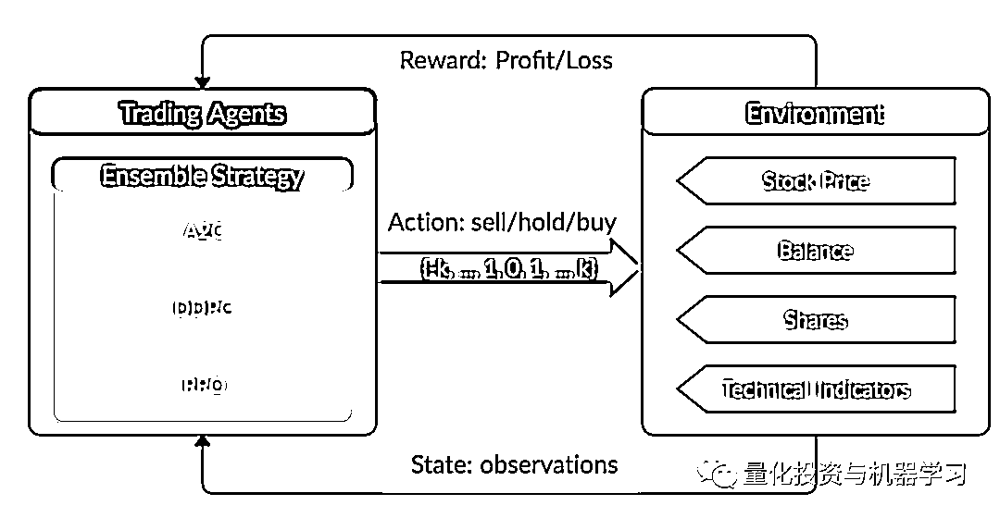

# 基于深度强化学习的股票交易策略框架（代码+文档）

> 原文：[`mp.weixin.qq.com/s?__biz=MzAxNTc0Mjg0Mg==&mid=2653308195&idx=1&sn=1d355162ccb4a2779061c70f80b90901&chksm=802d8736b75a0e2042b3212db027e552d332f1ba920cfcf6265ab0833f9a4a95cc71c564e04f&scene=27#wechat_redirect`](http://mp.weixin.qq.com/s?__biz=MzAxNTc0Mjg0Mg==&mid=2653308195&idx=1&sn=1d355162ccb4a2779061c70f80b90901&chksm=802d8736b75a0e2042b3212db027e552d332f1ba920cfcf6265ab0833f9a4a95cc71c564e04f&scene=27#wechat_redirect)


作者：Bruce Yang      编译：QIML 编辑部

**前言**

深度强化学习（DRL）已被公认为量化投资中的一种有效方法，因此获得实际操作经验对初学者很有吸引力。然而，为了培养一个实用的 DRL 交易 agent，决定在哪里交易，以什么价格交易，以及交易的数量，会涉及非常多的内容和前期具有挑战性的开发和测试。


公众号为大家介绍了一个名为 FinRL 的 DRL 库，可以帮助初学者基于 DRL 自己开发股票交易策略。

我们先以单只股票为例。

**获取完整代码，见文末**

**问题定义**

这个问题是为单只股票交易而设计的一个自动化交易解决方案。我们将股票交易过程建模为马可夫决策过程交易过程（MDP）。然后我们将交易目标表述为一个最大化问题。

强化学习环境的组成部分：

**Action**

操作空间允许 agent 与环境交互的操作。一般情况下，a∈a 包含三个动作：a∈{−1,0,1}，其中−1,0,1 表示卖出、持有和买入。同时，一个 Action 可以对多份股票进行。我们使用一个动作空间{−k,…,−1,0,1,…,k}，其中 k 表示股份的数量。例如，“买 10 股 Apple”或“卖 10 股 Apple”分别是+10 或-10。

**Reward function**

 r (s，a，s ′)是 agent 学习更好的激励机制。当 a 在状态 s 时，达到新的状态 s '时，投资组合值的变化，即 r(s, a, s ') = v '−v，其中 v '和 v 分别表示状态 s '和 s 时的投资组合值。

**State**

状态空间描述 agent 从环境中接收的观察值。正如交易者在执行交易之前需要分析各种信息一样，我们的交易 agent 也观察了许多不同的特征，以便在交互环境中更好地学习。

本案例只研究单只股票，数据来自雅虎财经 API。数据包含开高低收和成交量。

**加载相关库**

```py
# Install the unstable development version in Jupyter notebook:
!pip install git+https://github.com/AI4Finance-LLC/FinRL-Library.git
```

```py
import pkg_resources
import pip
installedPackages = {pkg.key for pkg in pkg_resources.working_set}
required = {'yfinance', 'pandas', 'matplotlib', 'stockstats','stable-baselines','gym','tensorflow'}
missing = required - installedPackages
if missing:
    !pip install yfinance
    !pip install pandas
    !pip install matplotlib
    !pip install stockstats
    !pip install gym
    !pip install stable-baselines[mpi]
    !pip install tensorflow==1.15.4
```

```py
# import packages
import pandas as pd
import numpy as np
import matplotlib
import matplotlib.pyplot as plt
matplotlib.use('Agg')
import datetime
from finrl.config import config
from finrl.marketdata.yahoodownloader import YahooDownloader
from finrl.preprocessing.preprocessors import FeatureEngineer
from finrl.preprocessing.data import data_split
from finrl.env.environment import EnvSetup
from finrl.env.EnvMultipleStock_train import StockEnvTrain
from finrl.env.EnvMultipleStock_trade import StockEnvTrade
from finrl.model.models import DRLAgent
from finrl.trade.backtest import BackTestStats, BaselineStats, BackTestPlot
```

**数据下载**

FinRL 使用 YahooDownloader 类提取数据。

**获取完整代码，见文末**

```py
class YahooDownloader:
    """Provides methods for retrieving daily stock data from
    Yahoo Finance API
Attributes
    ----------
        start_date : str
            start date of the data (modified from config.py)
        end_date : str
            end date of the data (modified from config.py)
        ticker_list : list
            a list of stock tickers (modified from config.py)
Methods
    -------
    fetch_data()
        Fetches data from yahoo API
"""
```

保存数据：

```py
data_df = YahooDownloader(start_date = '2009-01-01', 
                          end_date = '2020-09-30', 
                          ticker_list = ['AAPL']).fetch_data()
view raw
```

  

**数据预处理**

技术指标构建，inRL 使用一个 FeatureEngineer 类来预处理数据。

**获取完整代码，见文末**

```py
class FeatureEngineer:
    """Provides methods for preprocessing the stock price data
Attributes
    ----------
        df: DataFrame
            data downloaded from Yahoo API
        feature_number : int
            number of features we used
        use_technical_indicator : boolean
            we technical indicator or not
        use_turbulence : boolean
            use turbulence index or not
Methods
    -------
    preprocess_data()
        main method to do the feature engineering
"""
```

特征工程：

```py
data_df = FeatureEngineer(data_df.copy(),
                          use_technical_indicator=True,
                          tech_indicator_list = 
                          tech_indicator_list,use_turbulence=False,
                          user_defined_feature = True).preprocess_data()
```

  **环境搭建**

我们将金融建模定义为一个马尔可夫决策过程（MDP）问题。训练过程包括观测股价变化，采取动作和收益的计算，使 agent 调整其相应的策略。通过与环境的互动，交易 agent 将得到一个交易策略，随着时间的推移，最大化收益。

交易环境基于 OpenAI Gym 框架。

环境设计是 DRL 中最重要的部分之一，因为它会因应用程序和市场的不同而有所不同。我们不能用股票交易的环境来交易比特币，反之亦然。

操作空间描述允许 agent 与环境进行交互操作。通常，动作 a 包括三个动作：{- 1,0,1}，其中- 1,0,1 表示卖出、持有和买入。同时，一个动作可以对多个股份进行。我们使用一个动作空间{-k,…,- 1,0,1,…,k}，其中 k 表示需要买入的股份数量，-k 表示需要卖出的股份数量。连续动作空间需要归一化到[- 1,1]，因为策略是在高斯分布上定义的，需要归一化和对称。

在本文中，我们将 k=200 设置为 AAPL 的整个操作空间为：200*2+1=401。

FinRL 使用 EnvSetup 类来设置环境：

**获取完整代码，见文末**

```py
class EnvSetup:
    """Provides methods for retrieving daily stock data from
    Yahoo Finance API
Attributes
    ----------
    stock_dim: int
        number of unique stocks
    hmax : int
        maximum number of shares to trade
    initial_amount: int
        start money
    transaction_cost_pct : float
        transaction cost percentage per trade
    reward_scaling: float
        scaling factor for reward, good for training
    tech_indicator_list: list
        a list of technical indicator names (modified from config.py)
Methods
    -------
    fetch_data()
        Fetches data from yahoo API
"""
```

初始化一个环境类：

```py
env_setup = EnvSetup(stock_dim = stock_dimension,
                     state_space = state_space,
                     hmax = 200,
                     initial_amount = 100000,
                     transaction_cost_pct = 0.001,
                     tech_indicator_list = tech_indicator_list)
env_train = env_setup.create_env_training(data = train, 
                                         env_class = SingleStockEnv)
```

用户定义的环：模拟环境类。

FinRL 为单一股票交易环境提供一个类：

**获取完整代码，见文末**

```py
class SingleStockEnv(gym.Env):
    """A single stock trading environment for OpenAI gym
    Attributes
    ----------
        df: DataFrame
            input data
        stock_dim : int
            number of unique stocks
        hmax : int
            maximum number of shares to trade
        initial_amount : int
            start money
        transaction_cost_pct: float
            transaction cost percentage per trade
        reward_scaling: float
            scaling factor for reward, good for training
        state_space: int
            the dimension of input features
        action_space: int
            equals stock dimension
        tech_indicator_list: list
            a list of technical indicator names
        turbulence_threshold: int
            a threshold to control risk aversion
        day: int
            an increment number to control date
    Methods
    -------
    _sell_stock()
        perform sell action based on the sign of the action
    _buy_stock()
        perform buy action based on the sign of the action
    step()
        at each step the agent will return actions, then 
        we will calculate the reward, and return the next 
        observation.
    reset()
        reset the environment
    render()
        use render to return other functions
    save_asset_memory()
        return account value at each time step
    save_action_memory()
        return actions/positions at each time step
"""
```

**实现 DRL 算法**

 DRL 算法的实现基于 OpenAI Baselines 和 Stable Baselines。Stable Baselines 是 OpenAI Baselines 基线的一个分支，包括主要的结构重构和代码清理。


FinRL 库经过微调的标准 DRL 算法，如 DQN、DDPG、Multi-Agent DDPG、PPO、SAC、A2C 和 TD3。还允许用户通过调整这些 DRL 算法来设计他们自己的 DRL 算法：


FinRL 使用 DRLAgent 类来实现算法：

```py
class DRLAgent:
    """Provides implementations for DRL algorithms
Attributes
    ----------
    env: gym environment class
         user-defined class
Methods
    -------
    train_PPO()
        the implementation for PPO algorithm
    train_A2C()
        the implementation for A2C algorithm
    train_DDPG()
        the implementation for DDPG algorithm
    train_TD3()
        the implementation for TD3 algorithm 
    DRL_prediction() 
        make a prediction in a test dataset and get results
    """
```

**模型训练**

```py
print("==============Model Training===========")
now = datetime.datetime.now().strftime('%Y%m%d-%Hh%M')
td3_params_tuning = {'batch_size': 128,
                    'buffer_size':50000,
                    'learning_rate': 0.0001,
                    'verbose':0,
                    'timesteps':20000}

agent = DRLAgent(env = env_train)

model_td3 = agent.train_TD3(model_name = "TD3_{}".format(now), 
                            model_params = td3_params_tuning)
```

在本文中我们使用了 4 种 DRL 模型，即 PPO、A2C、DDPG 和 TD3。



TD3 是 DDPG 的一个改进。

**PPO：**


## **A2C：**

## 


**DDPG：**


https://spinningup.openai.com/en/latest/algorithms/td3.html#background

## **Tensorboard：reward 和损失函数绘图**

我们使用 tensorboard integration 进行超参数调整和模型选择，张力板生成漂亮的图表。


一旦调用了 lear 函数，你可以在训练期间或训练之后监视 RL agent，使用下面的 bash 命令：

```py
# cd to the tensorboard_log folder, run the following command 
tensorboard --logdir ./A2C_20201127-19h01/
# you can also add past logging folder
tensorboard --logdir ./a2c_tensorboard/;./ppo2_tensorboard/
```

每个算法的总 reward：


Total _ timesteps (int) : 要训练的样本总数。它是最重要的超参数之一，还有其他重要参数，如学习率、batch size、 buffer size 等。

为了比较这些算法，我设置 total_timesteps = 100k。如果我们将 total_timesteps 设置得太大，那么我们将面临过拟合的风险。

通过观察 episode_reward 图表，我们可以看到随着步骤的增长，这些算法最终会收敛到一个最优策略。TD3 的收敛速度非常快。

actor_loss for DDPG 和 policy_loss for TD3：


我们最终选择 TD3 模型，因为它收敛得非常快，而且它是 DDPG 上的最先进的模型。通过观察 episode_reward 图表，TD3 不需要达到 100k 的总时间/步数就会收敛。

**交易**

假设我们在 2019/01/01 有 10 万美元的初始资本，我们使用 TD3 模型来交易 AAPL。

```py
env_trade, obs_trade = env_setup.create_env_trading(data = trade,
                                       env_class = SingleStockEnv)
## make a prediction and get the account value change
df_account_value = DRLAgent.DRL_prediction(model=model_td3,
                                           test_data = trade,
                                           test_env = env_trade,
                                           test_obs = obs_trade)
```


**回测表现** 

使用 Quantopian pyfolio 来回测我们的交易策略。

FinRL 使用 set of functions 对 pyfolio 进行回测。

**获取完整代码，见文末**

```py
print("==============Get Backtest Results===========")
perf_stats_all = BackTestStats(account_value = df_account_value)
perf_stats_all = pd.DataFrame(perf_stats_all)
perf_stats_all.to_csv("./"+config.RESULTS_DIR+"/perf_stats_all_"+now+'.csv')

# BackTestPlot
# pass the account value memory into the backtest functions
# and select a baseline ticker
print("=====Compare to AAPL itself buy-and-hold=======")
%matplotlib inline
BackTestPlot(account_value = df_account_value, 
             baseline_ticker = 'AAPL')
```


多个股票测试在这里不在陈述，大家看代码即可：

**获取完整代码，见文末**


希望这篇文章对大家有帮助，学到了一些基于 DRL 的知识！

**代码获取**

后台回复：**FinR-DRL**（注意大小写哦！）

量化投资与机器学习微信公众号，是业内垂直于**Quant****、Fintech、人工智能、大数据**等领域的**量化类主流自媒体。**公众号拥有来自**公募、私募、券商、期货、银行、保险、资管**等众多圈内**20W+**关注者。每日发布行业前沿研究成果和最新量化资讯。