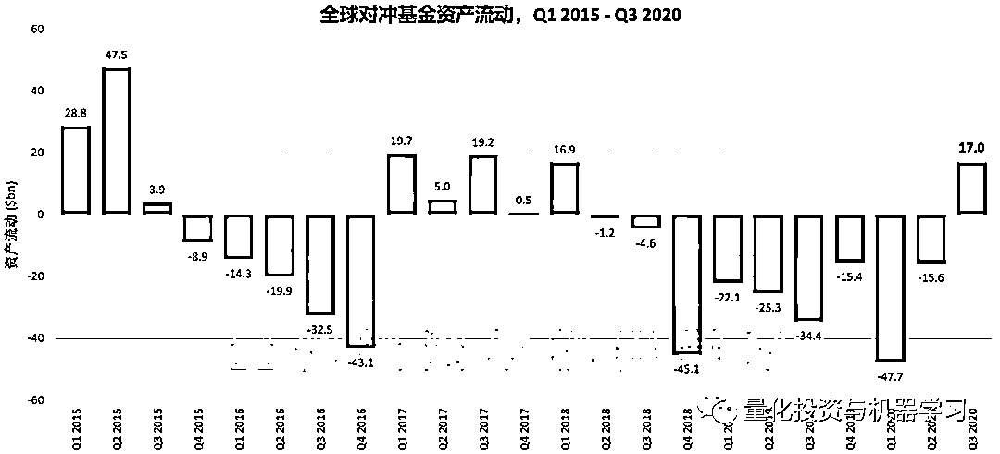
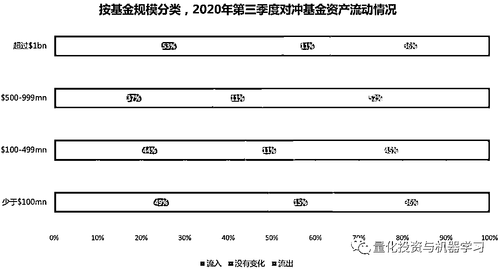
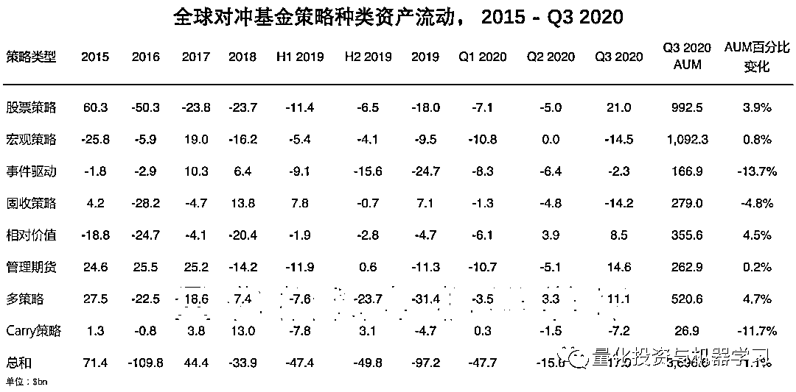
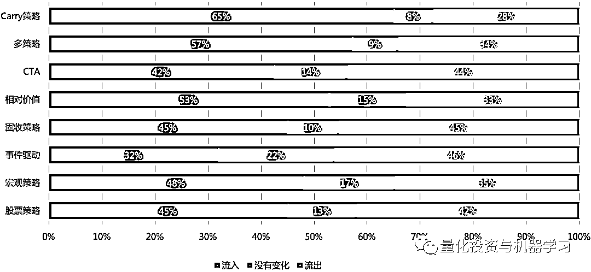
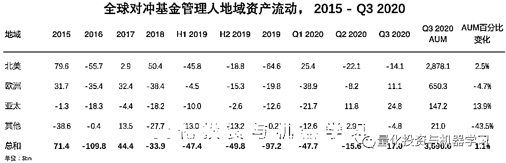
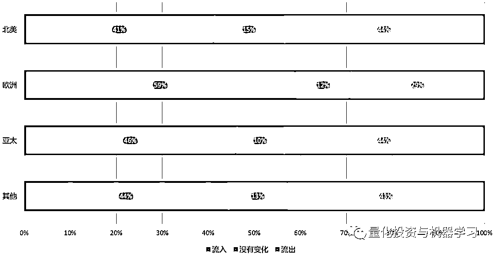
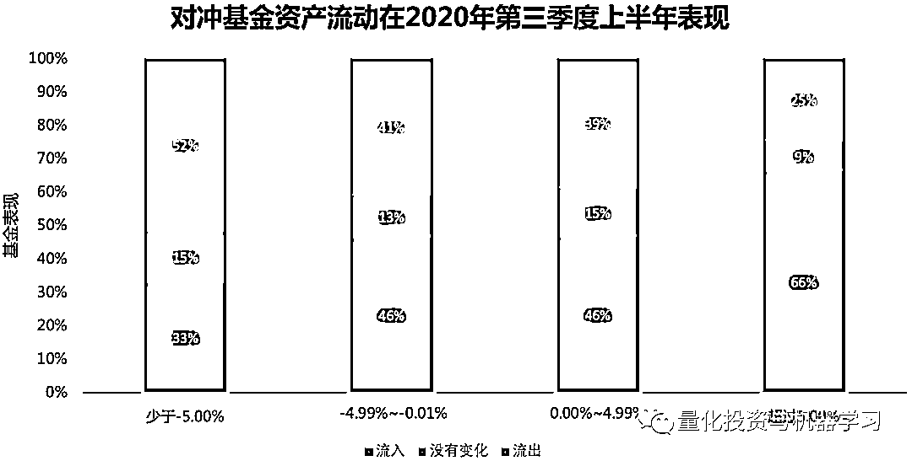

# 二千零二十、年 Q3：全球对冲基金表现

> 原文：[`mp.weixin.qq.com/s?__biz=MzAxNTc0Mjg0Mg==&mid=2653308159&idx=1&sn=aae61674ebe6dc633dd4798ef7a71a65&chksm=802d86eab75a0ffcc6c0b9e7f94d0e5d72458f0412547e1d420c05b76756441818210bcfdafc&scene=27#wechat_redirect`](http://mp.weixin.qq.com/s?__biz=MzAxNTc0Mjg0Mg==&mid=2653308159&idx=1&sn=aae61674ebe6dc633dd4798ef7a71a65&chksm=802d86eab75a0ffcc6c0b9e7f94d0e5d72458f0412547e1d420c05b76756441818210bcfdafc&scene=27#wechat_redirect)

全球对冲基金**AUM**2020 年第三季度超过了新冠肺炎爆发前的水平，达到了**36960 亿**美元的新高。这一创纪录的数字主要归于 9 月份大家业绩的改善，从年初至今的收益率为+5.01%。此外，对冲基金行业经历了自 2018 年第一季度以来的首次季度资金流入+170 亿美元，结束了连续 9 个季度投资者赎回的情况。

数据来自：Preqin

股票策略吸引了最多的资本投入（+210 亿美元），其次是 CTA（+146 亿美元），这表明投资者股票和大宗商品市场的信心增强。信贷和宏观策略则表现没有那么好，分别出现了 142 亿美元和 145 亿美元的资金流出。股票和信贷对冲基金的资金流动，与共同基金和 ETF 的资金流动形成了直接对比。共同基金和 ETF 的资金流动，表现出大量资金从全球股票转向全球债券。CTA 和大宗商品都经历了资金流入。第三季的轮调可能表明，那些愿意承担股市风险的投资者正选择对冲基金，而非共同基金和 ETF。与此同时，流入对冲基金和大宗商品的资金表明，投资者正优先考虑多元化和低相关性。

总部位于欧洲和亚太地区的基金经理分别有 111 亿美元和 248 亿美元的资金净流入：

过去的业绩不能保证未来的收益，但其仍是基金经理吸引投资者未来资金的关键驱动力。在 2020 年上半年实现+5.00%或以上收益的基金中，有 66%在第三季度实现了资金的流入，只有 25%的资金流出。与此形成对比的是，在同一时间段内，那些收益率为-5.00%或更低的基金，其中只有 33%的基金实现了净流入，而 52%的基金流出。

量化投资与机器学习微信公众号，是业内垂直于**Quant****、Fintech、人工智能、大数据**等领域的**量化类主流自媒体。**公众号拥有来自**公募、私募、券商、期货、银行、保险、资管**等众多圈内**20W+**关注者。每日发布行业前沿研究成果和最新量化资讯。