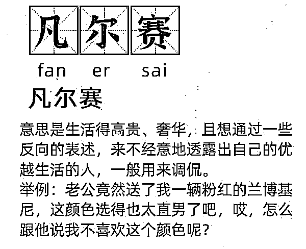

# 量化圈的凡尔赛文学

> 原文：[`mp.weixin.qq.com/s?__biz=MzAxNTc0Mjg0Mg==&mid=2653308132&idx=1&sn=a650da11d591bc8ed419022bf1521fe3&chksm=802d86f1b75a0fe71079ea9a575d1bdbb186f576bdc00b559bcba8c2aacc6462bf6037d68243&scene=27#wechat_redirect`](http://mp.weixin.qq.com/s?__biz=MzAxNTc0Mjg0Mg==&mid=2653308132&idx=1&sn=a650da11d591bc8ed419022bf1521fe3&chksm=802d86f1b75a0fe71079ea9a575d1bdbb186f576bdc00b559bcba8c2aacc6462bf6037d68243&scene=27#wechat_redirect)

量化投资与机器学习微信公众号，是业内垂直于**Quant****、Fintech、人工智能、大数据**等领域的**量化类主流自媒体。**公众号拥有来自**公募、私募、券商、期货、银行、保险、资管**等众多圈内**20W+**关注者。每日发布行业前沿研究成果和最新量化资讯。

什么是凡尔赛文学？

各位 Quant，是时候展现自己**“凡学”**水平的时候了！

  **如何不经意间透露自己是量化圈的银~**

欢迎大家踊跃留言，点赞第一名公众号将送上丰厚的礼品~