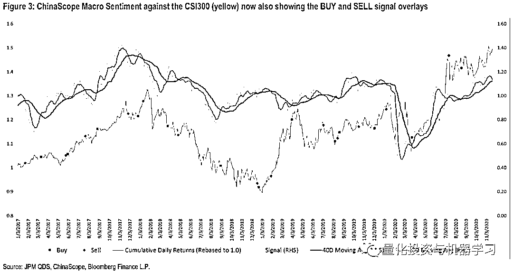

# JPMorgan 最新报告解读：A 股新闻情绪指数策略（附下载）

> 原文：[`mp.weixin.qq.com/s?__biz=MzAxNTc0Mjg0Mg==&mid=2653308124&idx=1&sn=9f990aab91d3840b6babda5d95879c50&chksm=802d86c9b75a0fdf5124c602ce916e532a71dd208be9819c4ac62c05a097ff7da682dcfed701&scene=27#wechat_redirect`](http://mp.weixin.qq.com/s?__biz=MzAxNTc0Mjg0Mg==&mid=2653308124&idx=1&sn=9f990aab91d3840b6babda5d95879c50&chksm=802d86c9b75a0fdf5124c602ce916e532a71dd208be9819c4ac62c05a097ff7da682dcfed701&scene=27#wechat_redirect)

量化投资与机器学习微信公众号，是业内垂直于**Quant****、Fintech、人工智能、大数据**等领域的**量化类主流自媒体。**公众号拥有来自**公募、私募、券商、期货、银行、保险、资管**等众多圈内**20W+**关注者。每日发布行业前沿研究成果和最新量化资讯。

QIML 编辑部出品

7 月下旬，J.P. Morgan（摩根大通）就基于关 A 股情绪写了一篇相关的研究报告（[这里下载报告](http://mp.weixin.qq.com/s?__biz=MzAxNTc0Mjg0Mg==&mid=2653303713&idx=1&sn=f6dfd1d473421430e54847644f51272c&chksm=802df1b4b75a78a2a01fd8ac58a608eb4d8ab44b723ecccc84a6b92de967adb9237280191961&scene=21#wechat_redirect)）。今天，公众号刚刚拿到了 JPMorgan 最新撰写的一篇基于 A 股情绪的量化报告。相对于上一篇来说，本篇报告**不仅基于新闻分析数据构建了市场维度的情绪指数，还基于该情绪指数发出****的交易信号进行****了一系列测试。**

**获取完整报告，见文末**

接下来公众号就为大家做一个全面的解读分享，**文末**是本篇报告**最重要的结论！**

**报告详细解读**

**从微观到宏观**

在[上一篇报告](http://mp.weixin.qq.com/s?__biz=MzAxNTc0Mjg0Mg==&mid=2653303713&idx=1&sn=f6dfd1d473421430e54847644f51272c&chksm=802df1b4b75a78a2a01fd8ac58a608eb4d8ab44b723ecccc84a6b92de967adb9237280191961&scene=21#wechat_redirect)中，JPMorgan 基于 ChinaScope 的新闻分析数据构建了情绪因子，在沪深 300 指数成分股中进行了测试，并结合了传统的基本因子提出了一些改善建议。由于 A 股市场是一个由个人投资者作为主要交易量贡献的市场，市场的宏观情绪在一定程度了能够预测市场的价格走势，在本篇报告中，JPMorgan 利用 ChinaScope 的新闻分析数据构建了市场维度的情绪指数，并基于该情绪指数发出的交易信号进行了一系列测试。**具体指数构建逻辑请参考报告原文。**

### **ChinaScope 新闻分析数据**

ChinaScope 对 4000+版面的新闻源进行监控及爬取，结合多年积累的丰富语料库及 NLP 算法对新闻进行元数据的提取及情绪的打分。利用情绪数据与元数据的结合，可以充分发挥非结构化数据在量化投资中的应用。

每一篇新闻文章都由机器学习分类器处理：

### **测试逻辑与测试结果**

策略逻辑

JPMorgan 基于 CSMS（ChinaScope Macro Sentiment）日度情绪指数，构建了短期情绪均线（10 日）和长期情绪均线（40 日），并根据两根均线的上穿（多头）下穿（空头）发出对应的交易信号。在报告中，JPMorgan 基于沪深 300 股指期货，分别测试了多头交易策略及多空交易策略。相关测试结果如下，具体测试逻辑请参考报告原文。

**▍Long-Short 测试**

****

**▍Long-Only 测试**

**参数敏感性分析**

报告的最后部分，对不同均线的参数组合进行了敏感性的分析，最终选择了 10 日与 40 日均线是因为这个参数组合在不同的年份都有比较稳定的表现。**报告还发现在市场波动比较大的时候，更短的长期均线能够带来更好的表现，而当市场波动比较小的时候更长的长期均线表现更优。       **

**报告中最重要的结论！**

1、本篇报告中我们站在宏观的视角下去利用 ChinaScope 的 A 股新闻分析数据构建 A 股的市场情绪指数，并基于这个情绪指数构建相关交易策略。

2、与上一篇报告主要关注个股的情绪相比，本篇报告主要**关注整个市场层面的情绪**。

3、由于整个市场 80%的换手是由个人投资者参与的，JPMorgan 相信新闻情绪对市场的价格走势有一定的预测作用。

4、ChinaScope 市场情绪指数（CSMS）基于每天来自 4000+新闻源的新闻数据。对于这些新闻数据，ChinaScope 进行了元数据的提取及情绪的打分。再经过一系列的数据聚合构建了一个稳健的市场情绪指数。

5、在这个市场情绪指数基础之上，JPMorgan 基于传统的技术分析，用长期短期均线的交叉作为交易信号，并在沪深 300 指数上进行敏感性测试，该测试包含了滑点交易成本及止损点的考虑。

6、**JPMorgan 基于信号多空的测试，显示该策略能够提供将近 1 的夏普比率（扣除成本之后），且 2020 年的夏普比率超****过了 2。多头策略的表现能够带来更优的风险回报比。**

7、该指数对于市场最新的信号是多头持仓，但信号本身开始回调。

**如何下载报告？**

因为一些要求，此报告只提供给机构投资者。大家 **点击阅读原文****，**即可申请下载，一般都会通过审核哦！同时，大家还可查看**中国 A 股市场情绪指数**的最新走势。**点击****阅读原文，查看完整报告与 A 股情绪指数！**