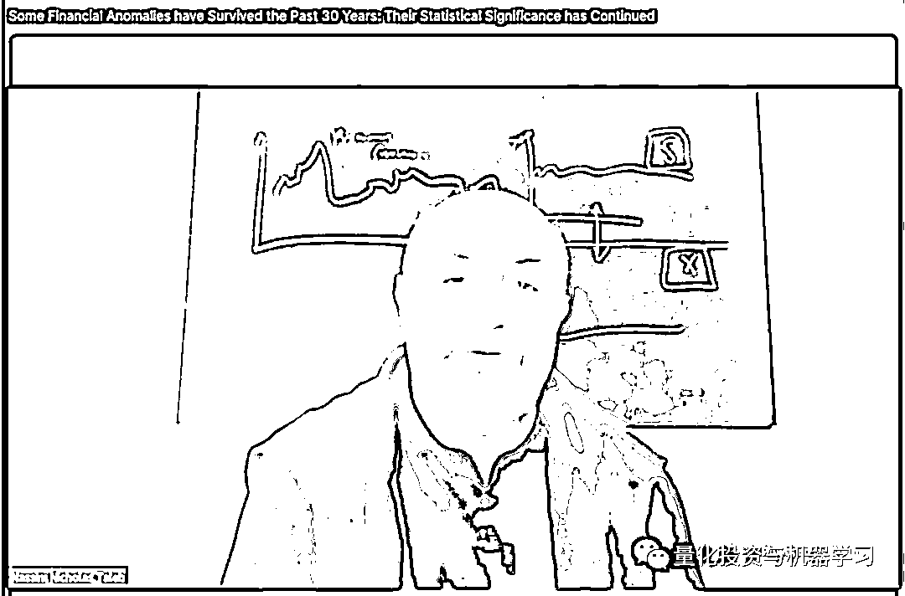
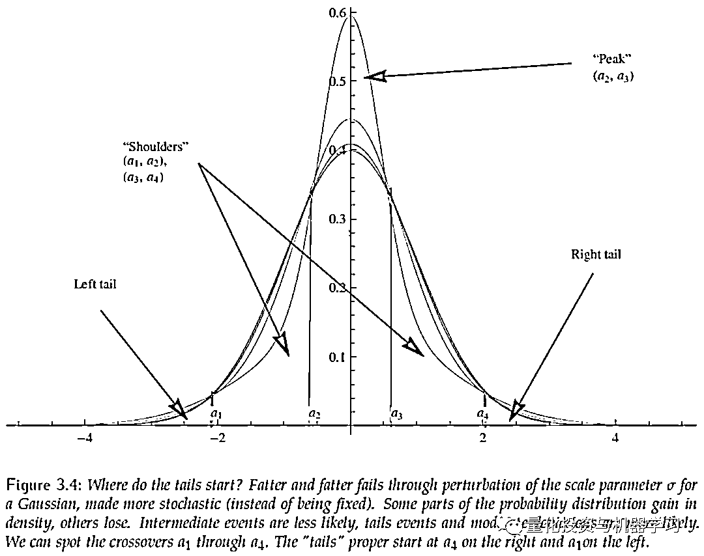
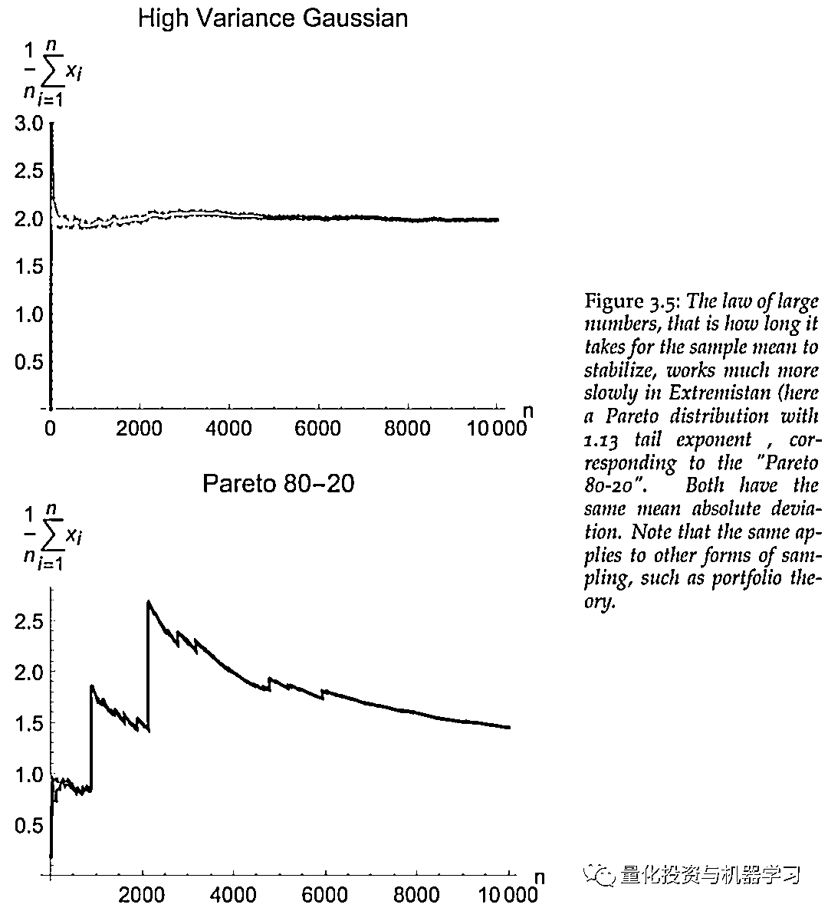
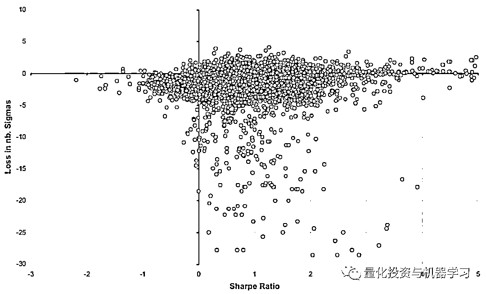
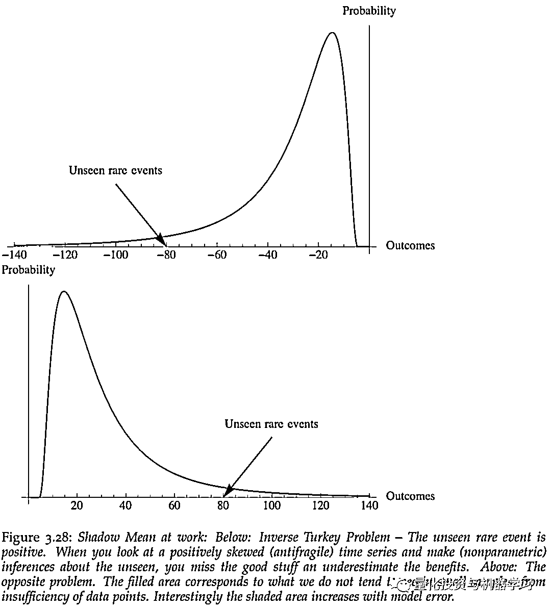

# 塔神：不可忽视的肥尾分布！

> 原文：[`mp.weixin.qq.com/s?__biz=MzAxNTc0Mjg0Mg==&mid=2653308023&idx=1&sn=fe33860848c31658eea0fa1ac06233ab&chksm=802d8662b75a0f74fb2384d3409e9e4fbde9ccc37ba2e9ff0d74febf780ae0eed50498278b57&scene=27#wechat_redirect`](http://mp.weixin.qq.com/s?__biz=MzAxNTc0Mjg0Mg==&mid=2653308023&idx=1&sn=fe33860848c31658eea0fa1ac06233ab&chksm=802d8662b75a0f74fb2384d3409e9e4fbde9ccc37ba2e9ff0d74febf780ae0eed50498278b57&scene=27#wechat_redirect)

QIML 公众号编辑部出品<mpsearch class="js_mpsearch appmsg_search_iframe js_uneditable custom_select_card" data-keywords="%5B%7B%22label%22%3A%22%E9%87%8F%E5%8C%96%E6%8A%95%E8%B5%84%22%7D%2C%7B%22label%22%3A%22%E6%9C%BA%E5%99%A8%E5%AD%A6%E4%B9%A0%22%7D%2C%7B%22label%22%3A%22%E5%AF%B9%E5%86%B2%E5%9F%BA%E9%87%91%22%7D%2C%7B%22label%22%3A%22%E6%8B%9B%E8%81%98%22%7D%5D" data-parentclass="appmsg_search_iframe_wrp" data-ratio="1.5664335664335665" data-w="286"></mpsearch>

塔勒布最早因为著作《黑天鹅》而被大家所熟知，他相信黑天鹅事件（往往伴随市场大跌，911，英国退欧都是比较典型的黑天鹅事件）的出现频率远远超出投资者的预期，由于无法预测什么时候会以何种形式出现，因此他一直提倡要持续不断地买入看跌期权才能真正实现对投资组合的对冲目的。

今年 5 月塔勒布还在 Twitter 上和 AQR 的 Cliff 相互 Diss，大概是：

AQR 发布了两篇有问题的报告，声称用期权来对冲尾部风险的做法很“贵”，不管用（理论上）然后他们却没有告诉大家：

**1、他们自己的风险溢价（基于因子投资的多空）策略赔了钱。**

**2、他们其他的那部分公开“垃圾”（共同基金产品）跑不赢大盘。**

是对客户以及真实世界的侮辱。

近日，塔勒布在上周举行的 Quant Insights Conference 中透露了他的新书 INCERTO 系列的第二部***《Convexity, Risk and Fragility》***的即将出版，早在之前的第一部*《Statistical Consequence of Fat Tails》*及《黑天鹅》中，塔神就不遗余力的强调**肥尾分布给传统统计理论带来的冲击及其在投资中的重要性**。

大胡子爷爷塔勒布

公众号将塔勒布在此次峰会演讲的精华部分进行总结，同时结合公众号自身研究，对相关问题进行拓展与剖析！赶快阅读吧~

### 

**什么是肥尾？**

当我们改变正态分布（或高斯分布）的形态，使它看上去越来越肥的时候，那么一个标准差之外的数据将越来越少（越来越多的数据将分布在一个标准差之内）。对于正态分布，随机变量处于离均值一个标准差之内的概率是 68%。当分布的尾部越来越肥的时候，随机变量处于离均值一个标准差之内的概率将上升到 75%-95%。所以，当一个分布的尾部变得更肥时，该分布的头部变得更高，肩部变得更瘦，这时对于离均值越远的事件也有更高的发生概率。这就是肥尾分布，具体如下图：

对于非肥尾的分布，两个 3 倍标准差事件发生的概率要显著的大于一个 6 倍标准差事件发生的概率。换句话说，对于正态分布，连续发生不太可能发生的事件比发生一件极端不可能事件的概率来的大。相反，对于肥尾分布，远离分布中心的极端事件扮演着非常重要的角色，破产更可能来自一个单一的极端事件，而不是一系列的坏事件。**黑天鹅并不是更为常见，但它们产生的结果更为严重。**

**肥尾带来的后果是什么？**

在一个正态分布的世界里，任何观测值都不能真正改变统计特性。在肥尾分布的世界中，尾部（稀有事件）在决定这些统计特性方面起着不成比例（与其发生概率相比）的重要作用。肥尾分布带来的后果主要有：

**1、大数定律在现实世界中起效得太慢**

大数定律告诉我们，当我们加上观察值时，平均值变得更稳定，速率是观察值的平方。下面的图表显示，要使平均值稳定，需要在一个肥尾分布下(下图)进行更多的观测。尽管需要在高斯模型下进行 30 次观测才能使平均值稳定在给定的水平上，但在帕累托模型下进行 1011 次观测才能使样本误差降低同样的水平。

**2、分布的平均值将不符合样本的平均值，特别当分布是有偏度的（或单尾的）。事实上，在肥尾分布中，样本平均值并并不是总体均值的恰当的估计，除非我们有比我们实际数量级更多的数据。同样，用样本得到标准差或方差是不可靠也不准确的。**

**3、Beta、Sharpe Ratio 等其他普通常用等金融指标将不能提供足够的信息。**

因为肥尾的存在，采用标准差估计的风险就不准确，那么 Sharpe Ratio、Beta 等依赖方差的收益风险衡量指标就不再具有参考意义。从下图可知，历史波动对未来损失并没有预测性，很多基金的损失超过了 10 个标准差。       

**4、稳健（Robust）的统计指标将不在稳健，经验分布也不能完全反应足够了经验信息。**

如果一个统计指标并不能随着分布的变化而改变的化，就不能称之为稳健指标。比如，在处理肥尾分布时，通常的做法是采用 Winsorization 的方法，去除极端值。确实，这种方法能够有效的发现异常值，但是异常并不代表虚假。但这种做法，估计出来的均值等指标就不能完全反应原数据集的信息，就不能称之为稳健。同样，如果采用历史数据作为经验分布，也存在问题。如果把所有可能都限定在历史数据集，那将来发生的事件超过历史最大值的概率就为 0。但仔细想一下，历史上最大值的产生，不也是超过了之前的最大值吗。所以，经验分布遇到肥尾就不再有效。

5、线性最小二乘法回归也不起作用，因为 Gauss-Markov 定理的失败（根据该定理，普通最小二乘法估计量在一定条件下是最佳的线性无偏估计）。

6、极大似然法可以很好地估计分布中的某些参数。

**7、主成分分析(PCA)和因子分析很可能产生虚假的因子和负荷。**

8、矩量法（method of moments）将不再有效。因为肥尾的存在，每次抽样的矩估计都不准确，所以高矩量将不再有参考意义或者压根就不存在。

9、并不存在一个所谓的大的方差，因为肥尾的存在，方差的大小很难定义，特别当肥尾分布很严重时，很难说存在一个确定的范围。

10、动态对冲将不能对冲掉期权的风险。

**如何处理肥尾？**

传统的统计学家在处理肥尾分布的时候，通常是假设一个不同的分布，但是具体的操作还是和平常一样，还是同样的度量指标，测试方法和统计显著性的说明。**他们陷入了一个逻辑性的矛盾，当我们遇到分布离开了传统统计可处理的区域，那么所有的方法理论就不是先前规划的那样了。**

统计估计基于两个基本因素: 中心极限定理和大数定律。但是，当分布是肥尾时，样本均值收敛的速度就变得非常慢，在这种状态下，观测到的样本数据并不能准确的估计总体的均值及方差。

对于肥尾分布来说，由于尾部事件发生的概率很小，而且分布也不一定对称，简单的求样本均值和方差的方法不一定有效。**一个比较好的方法就是先推测分布，在从分布利用极大似然估计（而不是样本均值）反推均值**。比如对于 Pareto 分布，98%的样本会小于均值，如下图所示，尾部值在样本中出现的可能性非常小（除非有超出多个数量级的样本数据），这样就会极大影响整体的均值。

未完待续···

近期，公众号会针对塔神的新书做更多的解读。**我们不翻译书籍，而是把最精华的部分深入浅出的解读给公众号读者，同时加上对相关知识的扩展**。尽情期待！

量化投资与机器学习微信公众号，是业内垂直于**Quant****、Fintech、人工智能、大数据**等领域的**量化类主流自媒体。**公众号拥有来自**公募、私募、券商、期货、银行、保险、资管**等众多圈内**20W+**关注者。每日发布行业前沿研究成果和最新量化资讯。