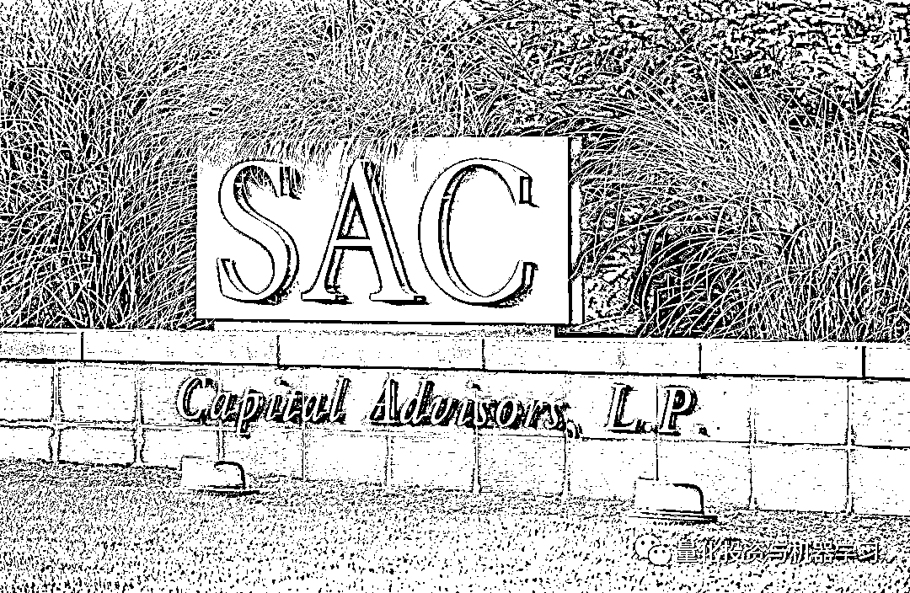

# Point72 科恩：从对冲基金大佬到 Twitter 上的明星

> 原文：[`mp.weixin.qq.com/s?__biz=MzAxNTc0Mjg0Mg==&mid=2653307995&idx=1&sn=7a9565c83115c49d905c3e32eca0e7a7&chksm=802d864eb75a0f58086982508508afed6895f329ac49ca7a0bcbc126d8c9f0ebadcc1a9b820a&scene=27#wechat_redirect`](http://mp.weixin.qq.com/s?__biz=MzAxNTc0Mjg0Mg==&mid=2653307995&idx=1&sn=7a9565c83115c49d905c3e32eca0e7a7&chksm=802d864eb75a0f58086982508508afed6895f329ac49ca7a0bcbc126d8c9f0ebadcc1a9b820a&scene=27#wechat_redirect)

QIML 公众号编辑部出品<mpsearch class="js_mpsearch appmsg_search_iframe js_uneditable custom_select_card" data-keywords="%5B%7B%22label%22%3A%22%E9%87%8F%E5%8C%96%E6%8A%95%E8%B5%84%22%7D%2C%7B%22label%22%3A%22%E5%AF%B9%E5%86%B2%E5%9F%BA%E9%87%91%22%7D%2C%7B%22label%22%3A%22%E6%9C%BA%E5%99%A8%E5%AD%A6%E4%B9%A0%22%7D%2C%7B%22label%22%3A%22%E6%8B%9B%E8%81%98%22%7D%5D" data-parentclass="appmsg_search_iframe_wrp" data-ratio="1.5664335664335665" data-w="286"></mpsearch>

**史蒂夫 • 科恩**，如果不熟悉他的朋友一定知道《Billions》这部剧： 

**尔虞我诈、环环相扣、高潮迭起**

*图片来自：网络

**相关阅读：**

[扒一扒 Billions 第四季：你必须知道的投资秘密（上）](http://mp.weixin.qq.com/s?__biz=MzAxNTc0Mjg0Mg==&mid=2653293801&idx=1&sn=00e71e5179b99ac8cf60ecebf996d37c&chksm=802dcefcb75a47ea118e5c20195a85ceabd4785eacc67a31c380450a856219ffd9b50466429e&scene=21#wechat_redirect)

[扒一扒 Billions 第四季：你必须知道的投资秘密（中）](http://mp.weixin.qq.com/s?__biz=MzAxNTc0Mjg0Mg==&mid=2653293936&idx=1&sn=59f47b30f8b0a9468328ed8515d76f78&chksm=802dcf65b75a4673a642430965d9bafc853b26be01804153be196ab0a8afef9272cf3e6f4805&scene=21#wechat_redirect)

[扒一扒 Billions 第四季：你必须知道的投资秘密（下）](http://mp.weixin.qq.com/s?__biz=MzAxNTc0Mjg0Mg==&mid=2653294079&idx=1&sn=001acaeef585dc688ebf83171c058116&chksm=802dcfeab75a46fc69e14d2a2cd0e56553b7f89d54217b896d7b58e53cce34bd2c7b51386120&scene=21#wechat_redirect)

[扒一扒 Billions 第五季：你必须知道的投资秘密（1-5 集）](http://mp.weixin.qq.com/s?__biz=MzAxNTc0Mjg0Mg==&mid=2653300830&idx=1&sn=343000c474bb31111c7dcfbef06ac941&chksm=802dea4bb75a635d29444cff91f50f56635188e828e6466a6eb706288e6b0cb781f7ffeeb834&scene=21#wechat_redirect)

**传奇科恩**

SAC 的创始人 Steve Cohen（史蒂夫 • 科恩，现为 Point72 首席执行官）。其旗下基金被称为美国最赚钱的基金之一，其近 20 年内高达 30%的年均收益率一度被认为投资传奇。而在被控内幕交易后，该基金被迫对外部投资者关闭，并缴纳 18 亿美元天价罚款及和解金。**Billions 中的****主角鲍比·阿克塞尔罗德的原型正是科恩。**

剧中鲍比的原型：科恩

科恩来自中产家庭，上中学时非常喜欢玩扑克牌，大多数时候，他都能赢 500-1000 美元。这对于一个中学生来说，可是不小的数目。

科恩说：**我对赚钱本身不感兴趣，我就喜欢赌赢后带来的刺激和成就感。**

1978 年科恩从宾大沃顿商学院毕业。之后进入华尔街 Gruntal 公司成为一名初级交易员，凭借着独特的天赋，工作第一天他就获得了 8000 美元的收益。由于表现出色，很快科恩就开始独立领导自己的团队，手下有 6 名交易员，负责管理 7500 万美元的资金。1987 年 10 月 19 日美国股市单日暴跌 22.6%，创下华尔街史上最大百分比跌幅。科恩认为，纽交所的经纪人们把股市价格看得太低了，之后他把公司的 5000 万美元资金押注股市。暴跌后第二日股市出现反弹，科恩的大胆押注帮助公司弥补了损失。Gruntal 公司允许交易员从收益中提取 60%，科恩在第一年赚了 10 万美元，第二年赚了 100 万美元。在他 25 岁左右的时候，在市场平淡的年份里，他也可以赚得 500 万美元；行情好的话那就是 1000 万美元。1992 年，在华尔街积累了丰富经验和雄厚财富的科恩成立了自己的基金：**塞克资本（SAC Capital）**，公司的名字源于他自己名字的三个首字母缩写。 

在之后的 18 年里，以平均收益率超 30%傲视群雄，2000 年的收益率甚至高达 70.34%。

Billions 中，Axe Capital 手下的基金经理一年收入都是百万美元起步。超级跑车，豪宅，以及巨大的压力是 Axe Capital 的基金经理典型写照。这也是 SAC 旗下基金经理的写照。许多人了解 SAC 是因为，曾经有一个中国明星交易员江平，在 2009 年拿到了令人咋舌的 1 亿美元奖金！这个数字已经超过了许多对冲基金的创始人。这就是 SAC 基金经理的收入水平。

**在 SAC 工作的人大概是世界上最辛苦的 200 名员工，“没业绩，毋宁死”，他们年薪通常 200 万美元以上，但关键要看各人表现，而不是 SAC 整体赢利情况**。在 SAC 有着丰盛的假日派对，三名公司内部的按摩师，以及公司旁边的雪茄吧。在公司的停车场更是豪车云集，从法拉利，马萨拉蒂到宾利一应俱全。

 **“如果说索罗斯是老虎，他就是对冲基金行业的大白鲨”** 科恩的一位资深客户对媒体如此表示。

也正是因为超高的回报，科恩管理的基金也屡遭质疑，甚至是调查。

*图片来自：网络

查克的原型叫 Bharara，是一名印度裔的美国联邦检察官。他起诉过花旗银行和美国银行，有过成功定罪连胜 85 起的记录。Bharara 指控科恩及他的公司涉嫌内幕交易。从此契而不舍地追踪科恩和他公司的交易行为。

时代杂志称之为：**干死华尔街的人**

检察官原型普利特·巴拉拉登上时代周刊

2013 年，终于有一项指控得到落实，SAC 承认涉及内幕交易，当局开出了 18 亿美元的罚单，创下美国有史以来最高的内幕交易罚金纪录。8 名直接参与内幕交易的员工先后入狱。曾经辉煌一时的 SAC 退出了历史舞台。

*图片来自：网络

经历了多重内幕交易丑闻之后，SAC 进行转型。将公司更名为**Point72 资产管理公司**，作为认罪协议的一部分，科恩同意他的公司将不再为外部投资者管理资金。Point72 正式成为一家家族理财室，其资本绝大部分是科恩本人的，还有少量来自员工。

新公司的名字可能源自 SAC 的地址 72 Cummings PointRoad。公司在网站宣布，Point72.com 所代表的是道德、卓越、机遇、创新和领导力。公司使命是通过提供卓越的风险收益回报力争成为资产管理界的翘楚；同时坚持最高的道德标准，并向业内的优秀人士提供机遇。

*图片来自：网络

在 Piont72 成立的当年，公司便获得了不菲收益，远超其他对冲基金表现。据纽约时报报道，2014 年 4 月以 100 亿美元启航的 Point72 总收益达到 25-30 亿美元。虽然这部分收益未剔除运营成本，但短短 8 个月内就有如此强劲表现还是证明科恩宝刀未老。

让我们回过头看看 2019 年全球对冲基金收益排名前 20 的基金经理榜单，科恩的收益也是在这中间位置：

*图片来自：QIML 公众号自制

同时，我们看看 2019 年全球 15 位对冲基金收入：

*图片来自：QIML 公众号自制

我们看到一个有趣的发现。科恩在**基金收益**这块占到了他**总收入**的**89%**，力压文艺复兴的西蒙斯、Citadel 的格里芬，**真的是凭本事赚钱啊！****！****！**

*图片来自：QIML 自制

同时最新的彭博亿万富翁排名，科恩总排名：**194/500**，在金融类总排名：**13/40**。个人资产到**101 亿美元！**

*图片来自：最新科恩个人净资产情况

2020 年 7 月，Point72 管理的资产约为 170 亿美元，其中约 70 亿美元属于科恩。

科恩还从 20 世纪 90 年代开始购买艺术品，现在拥有世界上最有价值的收藏品之一。他拥有梵高和莫奈的印象派画作，以及杰夫·昆斯和格哈德·里希特的当代作品。

科恩宣布，从美国职棒大联盟（MLB）球队纽约大都会队的所有者 Sterling Partners 的手中收购这支球队，对该球队的估值约为 24.75 亿美元，创北美运动队收购纪录。

科恩表示：“我很高兴与威尔庞和卡茨家族达成协议，收购纽约大都会队。”

*图片来自：网络

据报道，科恩将拥有该球队的 95%股份。科恩的注资将帮助该球队成为美国职棒大联盟最高级赛事世界大赛（World Series）的竞争者。该球队成立于 1962 年，曾两次获得冠军，最后一次是在 1986 年。

接下来我们就要说说科恩在棒球队的以及他在 Twitter 的故事。

**Twitter 流量主**

现在拥有纽约大都会队的科恩，在 Twitter 上变成了一个诙谐、问我什么都可以的形象。他在 Twitter 上很快就有了超过**9.5 万名粉丝**，疯狂的大都会球迷亲切地称他为：**Uncle Steve！**

你要知道，科恩从来没有对媒体说过话，没有发表过公开声明！

之前在 SAC 一位内部人士称：他非常不愿在镜头前露面。而且他要求员工签署严格的保密协议！

科恩如此的合群可能是因为在 7 月在主场对阵 Yankees 失利后，大都会球迷有一些沮丧，这可能是他鼓舞球迷和树立自身形象的缘由吧。

现在科恩正在和纽约大都会队的粉丝们打成一片，他们对科恩的 Twitter 一直看不够，他的推特经常会进入**dad joke**的范畴。有个粉丝问科恩，Citi Field 的 fair poles 餐厅是否应该撤下 Chick-Fil-A 广告，科恩回答说：

来自粉丝的留言，哈哈，高手在民间：

科恩最初在 2017 年 1 月加入 Twitter，在成为大都会队老板之前只发了 2 次推特：

科恩也利用 Twitter 进行一些网络上的辟谣：

从守口如瓶的对冲基金经理大佬迅速转变为人人都喜欢的球队老板，这种转变让我们觉得很惊讶！这可能也是竞技体育的魅力所在吧~

量化投资与机器学习微信公众号，是业内垂直于**Quant****、Fintech、人工智能、大数据**等领域的**量化类主流自媒体。**公众号拥有来自**公募、私募、券商、期货、银行、保险、资管**等众多圈内**20W+**关注者。每日发布行业前沿研究成果和最新量化资讯。