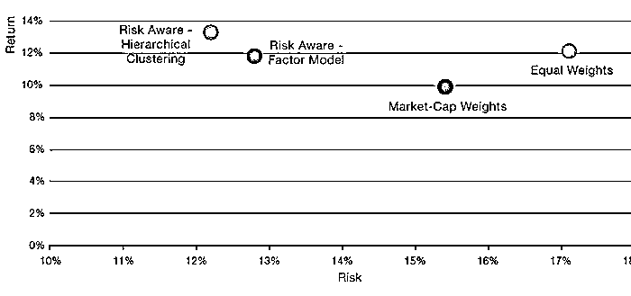
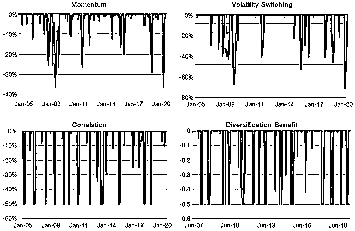

# Man Group 最新：动态风险管理在股票投资组合中的应用

> 原文：[`mp.weixin.qq.com/s?__biz=MzAxNTc0Mjg0Mg==&mid=2653307932&idx=1&sn=00ba991e26c490fbf11b5a667119ebe2&chksm=802d8609b75a0f1f7da99ad8cbf077f92401bcb5c3c0cb26cde0ad700769311ae3093dd25849&scene=27#wechat_redirect`](http://mp.weixin.qq.com/s?__biz=MzAxNTc0Mjg0Mg==&mid=2653307932&idx=1&sn=00ba991e26c490fbf11b5a667119ebe2&chksm=802d8609b75a0f1f7da99ad8cbf077f92401bcb5c3c0cb26cde0ad700769311ae3093dd25849&scene=27#wechat_redirect)

编译：QIML 公众号编辑部

今天公众号为大家分享一篇 Man Group 最新的研究文章，干货满满！重点在第四节~

**1、引言**

我们坚信，风险管理可以成功地指导投资决策。主要是：

1、分散化投资在投资组合的构建中发挥着核心作用；

2、系统的风险管理能够改善投资组合的风险调整收益和尾部分布特征。

更重要的是，我们相信，对风险的预测可能比对收益的预测准确得多。分散化投资可以通过平衡投资组合内的风险来实现，系统地减少投资组合整体的风险还有额外的好处。本文中，我们将这一思想应用在一个新的投资问题上：管理全球股票的投资组合。**我们将探索以风险为核心的方法，从下往上建立股票投资组合，然后系统地从上往下管理整个投资组合风险**。我们的目标是，相对于传统的市值加权指数，能够得到更高预期回报率和更低的下行风险。

我们的方法按照风险和收益来概括，可以分为四个步骤，如图 1 所示：

**1、选取对应的市场：**通常是一个常见的市值加权指数，如 MSCI World Index；

**2、构建 Risk-Aware 投资组合：**使用投资组合优化技术来改善投资组合的分散性和风险特性。由此产生的投资组合旨在提供与 MSCI World Index 相当的收益，同时有更低的波动性；

**3、构建 Risk-Aware-Levered 投资组合：**利用杠杆增加 Risk-Aware 投资组合的预期收益，使其 Beta 接近 MSCI World Index。由此产生的投资组合具有与 MSCI World Index 相似的风险特征，但预期收益较高；

**4、对风险进行动态管理（Risk-Managed）：**使用 risk overlays 系统地管理整个投资组合风险。每个 risk overlay 解决了投资组合所面临的特定风险，改善了尾部特征。

图 1：将风险管理理论应用于股票

**2、不基于收益预测的最优投资组合**

市值加权指数在构建时，往往集中在规模最大的股票上（图 2）。重要的是，确定每只股票的权重时，并不考虑其风险或其可能带来的分散化。每个股票的风险和分散化对整个投资组合的风险都起着重要作用。我们相信，投资者可以可靠地将这些信息纳入投资组合构建中，以提高风险调整后的收益率。

图 2：指数中股票的集中度

在传统的金融理论中，承担更高（不可分散）风险的投资者应该得到更高的预期收益。这一观点在多资产投资中得到了实证的支持。比如在美国，股票的收益比债券的收益更高，波动性也更大，而债券的收益比现金的收益更高，波动性也更大。基于风险平价的投资方式有很多种，但这些方法基本都基于这样一个假设：各类资产类别的夏普比率比较接近。或者，换句话说，一种资产类别的预期超额收益与其波动性成正比。 

在单一股票投资中，这种风险与收益相称的假设很难证明是合理的。从历史上看，高风险股票的平均表现仅略好于低波动性股票。无论是用波动率还是市场贝塔系数来表示风险，这都是事实。传统的 CAPM 模型在真实的投资中已经失效，如图 3 所示，这一观察结果有时被描述为“证券市场线” ，它比 CAPM 更加平缓。对这一现象的学术解释包括杠杆限制的存在以及机构投资者普遍基于市场基准构建投资组合。

图 3：股票风险与收益的关系

考虑到股票风险与收益关系的不确定性，构建风险投资组合时，我们将研究的方法建立在具有更易处理性的相关性和波动率上，而不去考虑未来收益率的预测。我们相信，在不依靠对单只股票的收益预测的情况下，用这种方法构建的投资组合能够在承受更低的风险时获得相同的收益（即更高的夏普比率）。

**2.1 风险评估**

虽然我们不需要估计风险投资组合的预期收益，但是我们需要估计股票收益的协方差。投资组合优化过程中的协方差矩阵的估计有很多众所周知的困难。首先，组合优化的解对协方差的细小的变动特别敏感。其次就是维度灾难。对于 n 个股票，一个协方差矩阵就需要 n(n+1)/2 个参数。大量的参数就需要大量的数据来进行可靠的估计，在这种情况下，参数数量的增长速度快于资产数量。这对于构建一个有上千个股票的投资组合确实是一个很大的问题。

我们采用两种方法减少协方差矩阵的维度并提高估计的稳健性。**第一个方法是采用因子模型**。我们用主成分分析的方法去识别驱动股票收益最重要的统计因子。然后，用股票的波动率和因子暴露构建协方差。第二种方法，**我们用层次化聚类的方法来规则化一个传统的协方差矩阵**。该聚类基于股票的联动性来找到的聚合的股票组。我们用平均法平滑各组之间的相关性。该方法有效地减少了模型参数的个数，提高了鲁棒性。图 4 提供了一个通过层次化聚类实现的协方差矩阵平滑的例子。

图 4：层次聚类

**公众号说明**

关于层次聚类在资产配置中的应用可以参考 Raffinot 于 2017 年发表的论文***《Hierarchical clustering-based asset allocation》***

**2.2 Risk-Aware 投资组合的长期表现**

作为此方法有效性的验证，我们展示了该 Risk-Aware 投资组合的长期表现优于市值加权指数的相关回测数据。我们使用 1968 年至 2014 年的美股数据，该数据来自美国证券价格研究中心(CRSP)，来创建假设的风险投资组合。然后我们分别测试基于因子和层次聚类的方法，最大权重约束为 100 个基点。

表 1 显示，在两种方法下，相对于市值加权组合和等权组合，Risk-Aware 投资组合都有更小的最大回撤和更高的风险调整收益（信息比率）。图 5 和图 6 也说明了这一点。

表 1：长期回测-因子模型和分层聚类

图 5：长期回测-因子模型和分层聚类

**2.3 在投资组合中增加 ESG**

我们构建 Risk-Aware 投资组合时，增加了 ESG 的限制：

*   **最低 ESG 分数:** 我们使用 Man Numeric 的方法计算每个公司的 ESG 得分。该方法产生的分数是对于股票的国家，板块及行业是中性的。然后对于投资组合有一个最低 ESG 得分的限制。

*   **低碳成分:** 我们使用 TruCost 的数据来计算每个公司的碳强度。这是衡量公司活动的所产生的二氧化碳排放量的指标。我们设定了一个最大的排放水平，公司不得超过这个水平才能被考虑列入投资组合。这一限制可能对某些板块或行业的暴露产生重大影响(例如，公用事业公司往往权重不足)。然而，在 Risk-Aware 投资组合里，这个影响是很微小的。

**2.4 模拟结果**

图 1 中我们提到，Risk-Aware 投资组合相对市场组合，有更高的收益及更低的风险。表 2 展示了基于全球股票，从 2005 年 1 月到 2020 年 6 月构建的 Risk-Aware 投资组合的回测结果。

表 2：回测结果

图 6：累计收益（对数化）

**3、杠杆：收益、成本和风险**

Risk-Aware 投资组合的目标是，相对于市值权重的组合，在不降低预期收益的情况下降低组合的风险。它比 MSCI World Index 有着更低的波动率，但我们可以使用杠杆调节组合的波动率。在接下来的例子中，我们以投资组合的 Barra Global Beta 作为风险，如图 7 所示。我们还显示了，1.5 倍杠杆下 Risk-Aware-Levered 投资组合的 Barra Global Beta，此时该组合的风险和 MSCI World Index 的风险比较接近。正如图一所示，杠杆的使用使得投资组合朝着该图的右上角移动，预期收益随着组合风险的上升而增加。

图 7：Barra Global beta

表 3：回测结果

表 3 比较了 Risk-Aware-Levered 投资组合与 MSCI World Index 的一些收益及风险统计指标，图 8 显示了收益。

图 8：累计收益（对数化）

杠杆的好处是能够放大了投资组合的收益率。然而，它也有一些成本。首先，存在一个融资成本，通常大于现金回报率。其次，存在一个增加尾部损失的成本：图 9 显示，在 MSCI World Index 的最糟糕的 1 天期间，Risk-Aware-Levered 投资组合的收益率更糟糕。正如表 3 所示，这是因为 Risk-Aware 投资组合的收益率比 MSCI World 的收益率更负偏。不过，好消息是，尾部损失，就像任何其他类型的风险一样，可以用正确的方法来管理。这是下一节的主题。

图 9：MSCI World Index 的最糟糕的 1 天的收益率

**4、动态风险控制: Risk Overlays**

**Risk overlays 的目标是在市场压力加剧时期降低投资组合风险，从而提高风险调整收益和尾部性质。**有效降低风险意味着减少风险敞口，从而降低获得股票风险溢价的潜力。为了使 risk overlays 有效，它们降低投资组合风险的幅度必须大于降低投资组合回报的幅度。参照图 1，我们希望在投资组合风险收益特征向西南方向移动，但是比简单地降低杠杆率的梯度要小。也就是说，我们希望向左移动得更远（风险更低），而不是向下移动（回报率更低）。我们考虑的四个 risk overlays 是：

**1、Volatility-switching overlay：**我们估计 Risk-Aware-Levered 投资组合的两个波动——快的和慢的。快速指标明显高于慢速指标，表明波动性大幅上升，股票抛售风险增加。Volatility-switching overlay 降低了这些情景下的投资组合的风险: 波动幅度上升越大，风险降低幅度越大;

**2、Momentum overlay：**监测每个股指期货的趋势信号。中度至强度的下跌趋势与对应持仓的下行风险有关。在这些情况下，通过做空相关期货合约，可以降低相应持仓股票的风险;

**3、Correlation overlay：**债券与股票之间的相关性不断增加，收益率不断上升，这两者结合在一起意味着债券与股票联合抛售的风险增加(例如，一段跨资产去杠杆化时期)。对于及时性，使用高频数据计算债券股票相关性;

**4、Diversification-benefit overlay：**利用高频股票数据，我们通过股票相关性来衡量市场的广度。股票相关性的增加意味着市场广度的减少，或者等价地说，意味着分散化潜力的降低。在这些情况下，股票抛售的风险增加，Diversification-benefit overlay 降低了投资组合风险。

图 10 显示了以上四种 Risk Overlay 对 Risk-Aware-Levered 投资组合风险的控制效果。图 11 显示了使用 Risk Overlay 之后的 Risk-Aware-Levered 投资组合的净风险暴露。关于如何叠加 Risk Overlay，下一小节有详细的解释。

图 10：不同 Risk Overlay 带来的风险降低的百分比（以杠杆 Risk-Aware 投资组合的总风险的百分比度量）

图 11：叠加 Risk Overlay 之后的 Risk-Aware-Levered 投资组合的净风险暴露

表 5 给出了 Risk-Aware-Levered 投资组合本身的一些收益和风险统计数据，也包括叠加每个 Risk Overlay 之后的统计数据作为对比：

**1、应用 Risk Overlay 有助于降低投资组合的波动性，因为 Risk Overlay 的应用降低了组合的平均风险暴露；**

**2、不应期望 Risk Overlay 会增加收益率。**尽管我们的模拟显示收益率有所提高，但这种情况在未来不一定会继续下去。这是可以接受的，因为我们愿意放弃收益，只要我们能够改善经风险调整后的收益(例如夏普比率的改善，或以偏态、预期亏损或最大亏损来衡量的更好的尾部特性)。额外的回报来自对杠杆的使用。

表 5：回测结果

**4.2 风险暴露的约束**

在 risk overlays 之后，加入了两个额外的风险暴露约束，以确保投资组合的贝塔风险和名义风险保持在合理的范围内。与 risk overlays 一样，我们同样也会利用股指期货来确保满足约束条件。风险约束是投资组合系统化风险管理的一部分。风险约束与 risk overlays 的主要区别在于：

1、它们的影响取决于 risk overlays 的方法；

2、它们可以增加或减少投资组合的总体风险。

**第一个限制将整个投资组合（加上 risk overlay 之后的股票头寸）的贝塔值限制为 MSCI World Index。投资组合中的风险敞口经过调整，使贝塔系数介于 0 和 1 之间。**

**第二个约束限制了整个投资组合的名义净风险敞口。**这里的限制是动态的，根据市场条件而变化。高频数据被用来确定广泛的股票市场的压力。在典型的市场条件下，净敞口限制在 50% 至 150% 之间。由于市场压力或波动是从高频数据推断出来的，因此净敞口的上限可以从 150% （在市场处于正常时期且没有叠加 risk overlay 时）降至 100% 。同样，在压力或波动性异常低的时期，净敞口的下限从 50% （通常只有在使用多个 risk overlay 时才有可能）上升到 100% 。在实践中，如果已实现的波动率过低，则需要停止使用一些 risk overlay。

**5、风险管理的投资组合：综合所有的改进方法**

将 risk overlay 和风险暴露的约束应用到 Risk Aware Levered 投资组合中，可以使我们得到一个优化的风险管理策略。以下是我们遵循的步骤：

1、我们从 MSCI World Index 开始，这是一个发达市场股票的市值加权指数，广泛代表了全球股票市场；

2、将风险和分散化作为股票选择过程的核心，我们构建了 Risk-Aware 投资组合。与市值加权一样，这避免了对股票进行收益预测。然而，基于风险的方法提供了比 MSCI World Index 更高的收益率和更低的波动性；

3、我们对 Risk Aware 投资组合进行了杠杆操作，使其市场贝塔值接近 MSCI World Index。Risk Aware Levered 显示出与 MSCI World Index 相似的风险特征，但是收益显著提高；

4、最后，我们应用基于期货的 risk overlays 和风险暴露约束来动态管理投资组合的风险，从而得到最优的风险管理策略。risk overlays 监测了各种指标，这些指标可靠地显示出股票抛售风险加大。这些指标包括：

*   波动性峰值（波动转换叠加）

*   持久性负趋势（动量叠加)）

*   股票和债券联合抛售（相关叠加）

*   股票市场宽度（分散化叠加）

表 6 量化了每个投资组合构建步骤的带来增量收益。收益曲线如图 12 所示。

表 6：回测结果

图 12：累计收益（对数表，左）&相对 MSCI World Index 的超额收益（右） 

在图 13 中，我们显示了 MSCI World Index、Risk-Aware-Levered 投资组合和优化后的风险管理策略（optimized Risk-managed strategy）的最差 1 日和 20 日回报率。当 MSCI World Index 经历了最糟糕的收益时，Risk-Aware-Levered 也会经历类似的负收益，这与贝塔系数接近 1 是一致的。然而，这些时间也与 risk overlays 的强劲表现相关，因此优化的风险管理策略表现优于基准和 Risk-Aware 资组合。优化后的风险管理策略的最差收益期，通常也是 risk overlys 没有发挥作用的时期。Risk overlays 并非万能药。经过优化的风险管理策略仍可能遭遇尾部事件，但这些事件通常不像没有系统风险管理的股票投资组合那么频繁，也不那么严重。

价格大幅回调（或缺口风险）仍是尾部风险的来源。由于 risk overlays 通常会对股市状况的变化作出反应，因此在市场回调时，risk overlay 的相关指标可能还没反应过来。（这里的例外是相关性覆盖，它使用债券收益率和交叉资产相关性预测股票抛售）。尽管如此，令人鼓舞的是，尽管使用了杠杆，但这种经过优化的风险管理策略的最差 1 日回报率相对于 MSCI World Index 并不算高。

图 13：MSCI World Index 和管理风险后组合收益的最差收益率对比

**6、总结 **

结合基于风险的投资组合优化和动态风险管理，可以构建一种股票策略，该策略显示出比 MSCI World Index 更好的经风险调整的收益和尾部特征，每个投资组合构建步骤提供渐进改进。我们相信，这种策略可以成为传统全球股票投资组合的一个更好的选择。**关注核心股票持有的分散化为在市场平静期间杠杆化投资组合提供了空间，获得了比市值加权法更多的股票风险溢价，但风险可比。在股市承压期间，risk overlay 降低了市场风险敞口，低于市值加权策略：****在风暴过去之前收起风帆！**

量化投资与机器学习微信公众号，是业内垂直于**Quant****、Fintech、人工智能、大数据**等领域的**量化类主流自媒体。**公众号拥有来自**公募、私募、券商、期货、银行、保险、资管**等众多圈内**20W+**关注者。每日发布行业前沿研究成果和最新量化资讯。