# Man Group：一个高性能、低延迟的交易、执行系统如何建立？

> 原文：[`mp.weixin.qq.com/s?__biz=MzAxNTc0Mjg0Mg==&mid=2653307828&idx=1&sn=84197c80678bd1fc76835d2b2ae8ba7e&chksm=802d81a1b75a08b738db4699c37a40e689833ea5dfdf7901085190e2d93e5682f441c6d500e8&scene=27#wechat_redirect`](http://mp.weixin.qq.com/s?__biz=MzAxNTc0Mjg0Mg==&mid=2653307828&idx=1&sn=84197c80678bd1fc76835d2b2ae8ba7e&chksm=802d81a1b75a08b738db4699c37a40e689833ea5dfdf7901085190e2d93e5682f441c6d500e8&scene=27#wechat_redirect)

来自：Man Group     作者：Zhu Tan

编译：QIML 编辑部

**介绍**

由于外汇交易的特点，其对于我们交易系统的低延迟运行至关重要。银行源源不断地向我们提供报价，然后我们对报价进行比较，以选择最优的价格进行交易。因此，实时接收报价是很重要的。此外，有利的报价会很快消失，所以我们需要在这块提升系统的迅速。

执行/交易系统通常由多个服务组成，每个服务处理一个不同的进程，并通过 IPC（Inter-Process Communication，进程间通信）相互通信，以完成整个交易流程。随着复杂性的增加，使用更小的组件来隔离 concerns/failures 通常更可行。事实上，对于微服务体系结构，在交易系统中运行数百个服务并不罕见。因此 IPC 对整个系统延迟有很大的影响。

我们采用 Aeron 消息传递（ Messaging）来改善延迟的过程，从而加强低延迟性。

**何为 Aeron？**

**Aeron 是一个开源的、低延迟的消息传递系统。**最初是为美国的一个大型交换机开发的。特别适合于具有高吞吐量/需要最短响应时间的企业实时系统。

Github 的该项目的 README 把它描述为：“高效可靠的 UDP（Internet 协议集支持一个无连接的传输协议，该协议称为用户数据报协议：UDP，User Datagram Protoco）单播、 UDP 多播和 IPC 消息传输”。更具体地说，它是一个消息传递解决方案，特别强调三件事情：

*   高带宽低延迟

*   可靠性

*   易于监控

Aeron 两位创始人的介绍：

**Todd Montgomery**：一名网络老手，他研究、设计和构建了许多协议、面向消息的中间件系统和实时数据系统。他为 NASA 做了很多研究，也为 IETF 和 IEEE 做出了贡献。

**Martin Thompson**：Java 的领军人物，拥有 20 多年构建复杂、高性能计算系统的经验。他也是 20 世纪 90 年代汽车和金融领域中一些最重要的 C++和 Java 系统的领导者。

2013 年，他们开始合作开发简单二进制编码（SBE）：

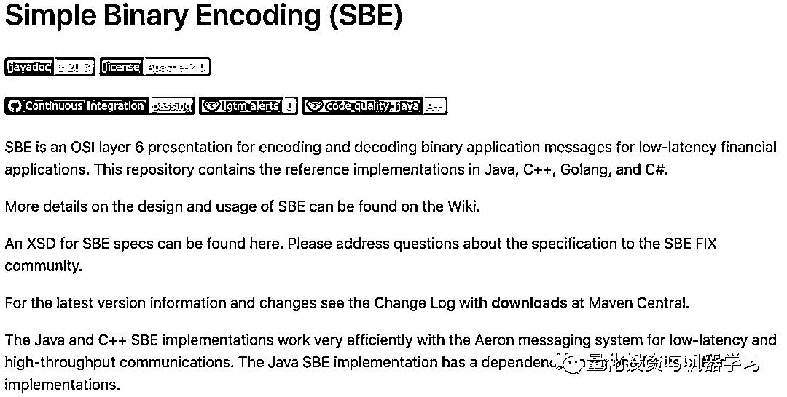

这是 FIX 委员会指定的高性能编码机制。在这个项目成功之后，他们的赞助商当时聘请他们开发一个新的消息传递系统。

Aeron 的设计始于 2014 年初，基于其设计原则：

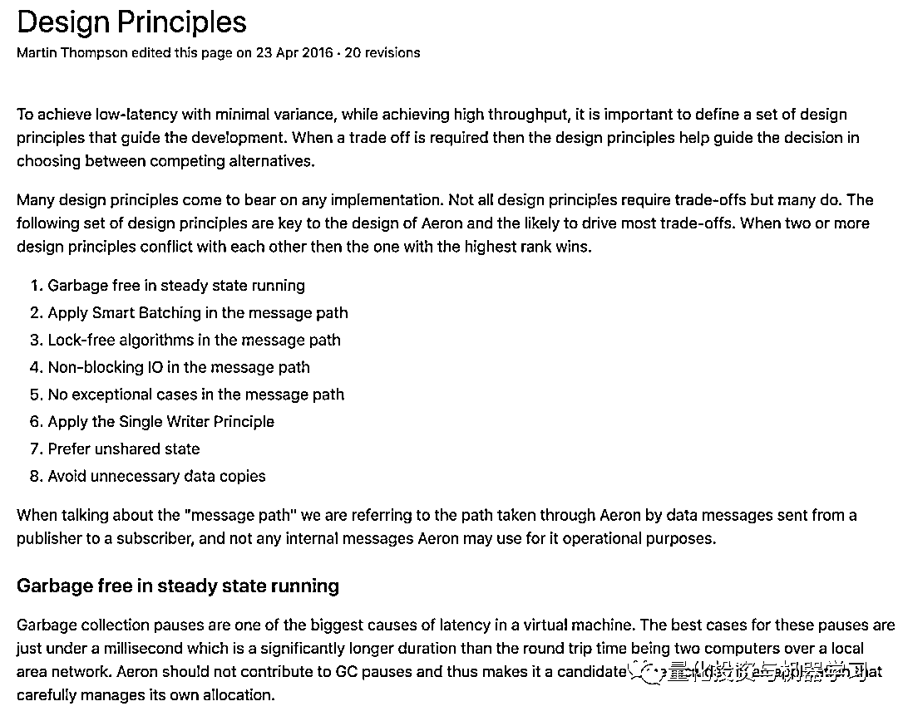

关于 Aeron 的进一步介绍，**公众号将在明天的推文中详细分析。**

**微基准测试（Microbenchmark）**

**科普**

基准测试（Benchmark）用来测量机器的硬件最高实际运行性能，以及软件优化的性能提升效果，可分为微基准测试（Microbenchmark）和宏基准测试（Macrobenchmark）。微基准测试用来测量一个计算机系统的某一特定方面，如 CPU 定点/浮点性能、存储器速度、I/O 速度、网络速度或系统软件性能（如同步性能）；宏基准测试用来测量一个计算机系统的总体性能或优化方法的通用性，可选取不同应用，如 Web 服务程序、数据处理程序以及科学与工程计算程序。

通过微基准测试来了解 IPC 延迟的等级或程度。正确地利用微基准测试并不容易，因为在进行测试时，每纳秒都很重要！启动 Java 虚拟机、进行热点（HotSpot）编译和多线程都可能给测量增加额外的延迟，从而大大降低测量的准确性。幸运的是，有一个非常好用的 Java 库 JMH。下面的内容主要是 JMH 基准测试的结果。

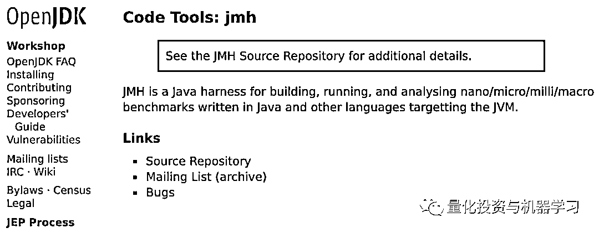

https://openjdk.java.net/projects/code-tools/jmh/

首先，让我们看看使用主流的 ping pong 基准测试在两个线程之间传递数据的成本。如下面的代码所示：

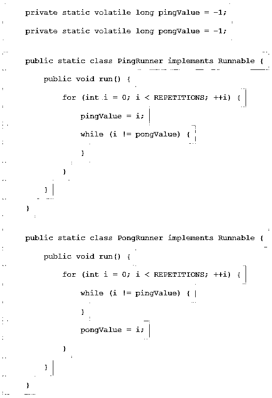

两个 Java 线程通过一对带有 volatile longs 进行通信。

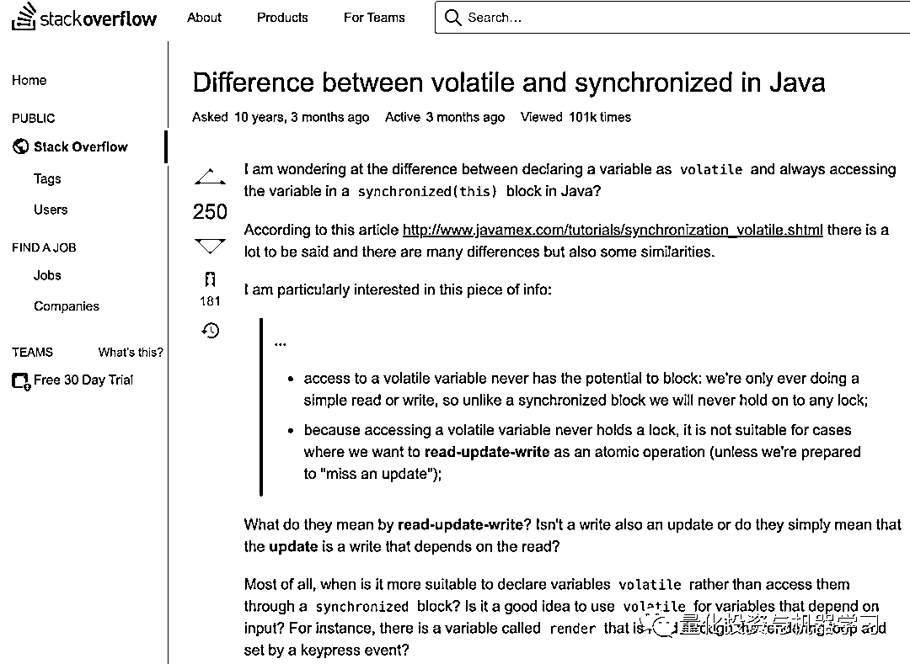

https://stackoverflow.com/questions/3519664/difference-between-volatile-and-synchronized-in-java

参见 PingPongVolatile.java 获取完整代码：

*http://ahlgit.maninvestments.com/projects/OTHER/repos/tech-articles/browse/assets/axeOnAeron/PingPongVolatile.java*

往返延迟约为 0.1μs（微秒）。有趣的是，光在同一时间内传播了大约 100 英尺。但是，如果我们使一个用 BlockingCollection，SynchronousQueue（同步队列），而不是 volatile long，延迟会到 100+μs，比原来慢 1000 多倍！这说明了跨线程同步导致的上下文切换代价有多高。

在现实世界中，我们想要发送的不止单个 long。如果我们使用**ConcurrentLinkedQueue**并发送 100 字节的消息，往返大约需要 0.3μs。

**科普**

ConcurrentLinkedQueue 是一个基于链接节点的无界线程安全队列，它采用先进先出的规则对节点进行排序，当我们添加一个元素的时候，它会添加到队列的尾部，当我们获取一个元素时，它会返回队列头部的元素。

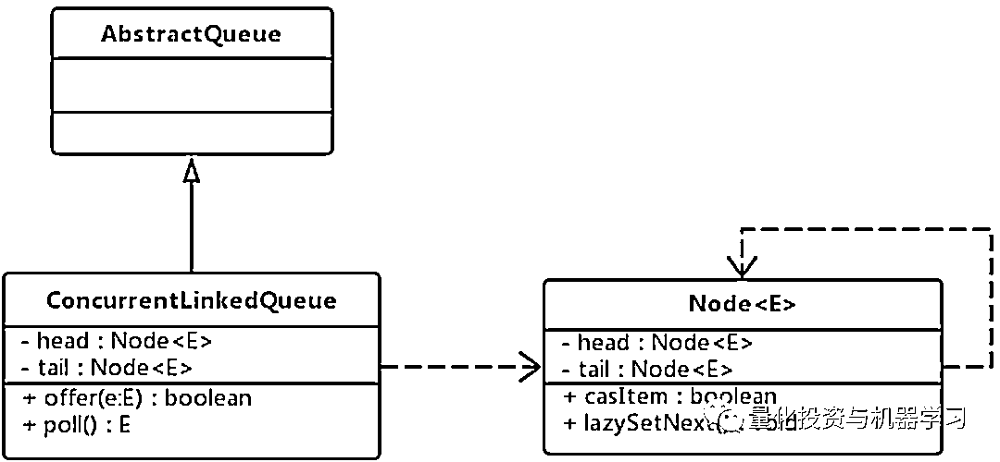

ConcurrentLinkedQueue 结构图

ConcurrentLinkedQueue 相关网站学习：

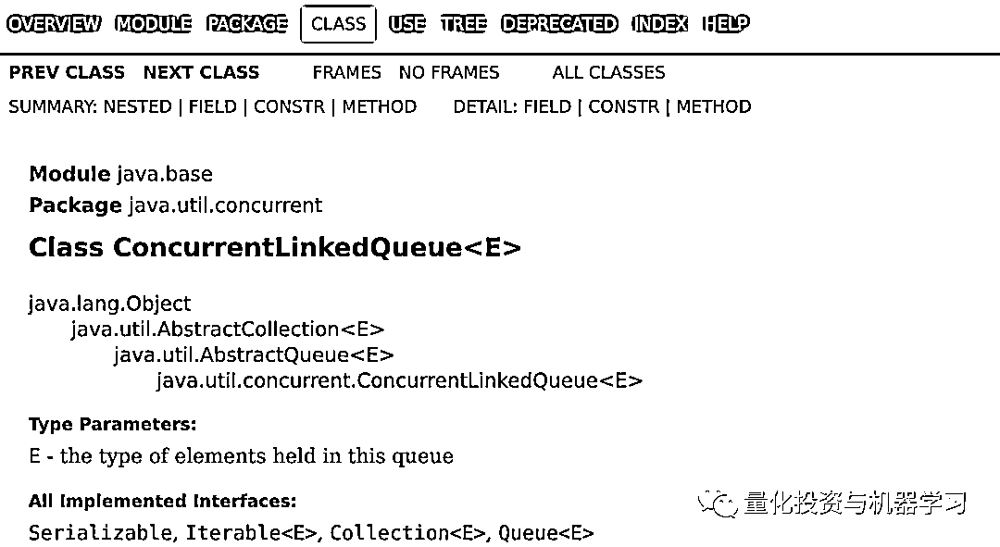

https://docs.oracle.com/javase/9/docs/api/java/util/concurrent/ConcurrentLinkedQueue.html

扩展到 IPC 时，Aeron 和 Chronicle Queue IPC 的两种众所周知的超低延迟解决方案。

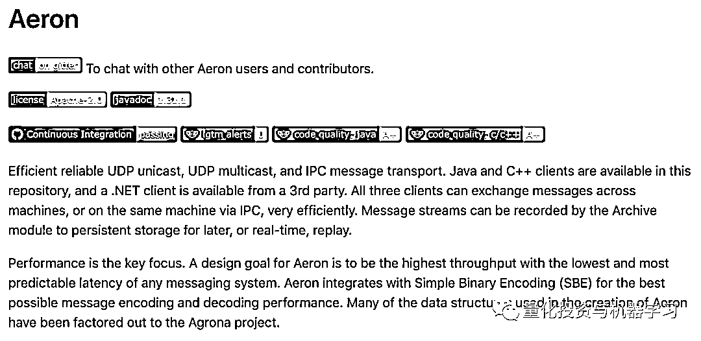

https://github.com/real-logic/aeron

Github：https://github.com/OpenHFT/Chronicle-Queue

这两种方法都利用了共享内存并实现了 100 字节消息的 0.25μs 的往返延迟，这令人印象深刻，因为它比在同一进程中两个线程之间使用 ConcurrentLinkedQueue 更快！

对于网络上的通信，我们需要使用一个可靠的协议，即 TCP 被认为是可靠的，而原始 UDP 则不是。有许多消息传递系统运行在 TCP 之上。根据 TCP 协议的绑定，它们的往返延迟至少在几十毫秒的范围内。Aeron 和 Tibco 在 UDP 之上提供了一个可靠的协议来提高性能。Aeron 的往返延迟大约是 10μs，Tibco 的往返延迟约为 200μs。

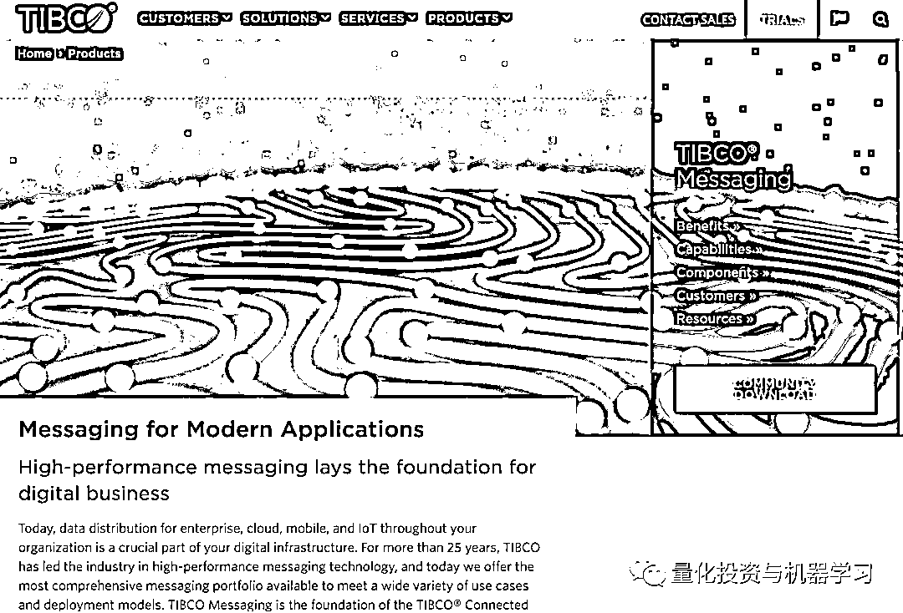

https://www.tibco.com/products/tibco-messaging

如上所述，Aeron 在低延迟基准测试中演示了在同一台机器上进行通信和在网络上进行通信的优越性能。此外，我们发现它的延迟在增加的负载下不会恶化。它可以使几乎所有的传输都饱和。rpc-bench（*https://github.com/benalexau/rpc-bench/*）的结果可以说明这一点：

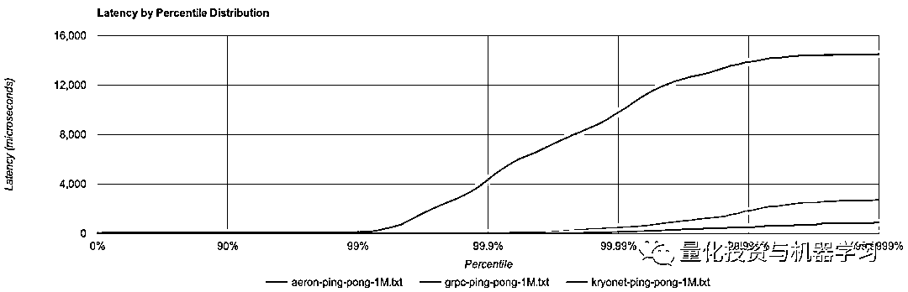

##### Ping-pong 基准测试

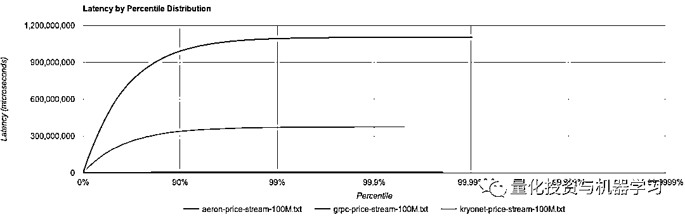

##### Heavy load 基准测试

在图 1 程度 ping pong 基准测试中，Aeron 的延迟一直很低（99.999%），并且在重批量负载下没有明显的延迟增加。相比之下，在这两种情况下，grpc/http2 和 kryonet 的延迟显著劣势。这意味着 Aeron 在处理大量信息时具有更强的弹性，大量信息需要一次性处理并迎头赶上时能够迅速恢复。 

**Aeron 的进一步考虑**

在 Aeron 超低且可预测的延迟的鼓舞下，我们构建了一个 IPC 模拟环境，模拟我们的执行系统，在几周的时间里测试 Aeron 在各种负载下的性能。与以前的实现相比，每个百分位数都记录了更好的延迟统计数量级，至少提高了一个百分点。随着 Message rates 的增加，这种改进变得更加明显——在非常沉重的负载下，Message rates 可以达到 2 个数量级。

低延迟并不是采用 Aeron 的唯一原因：

1、Aeron 是一款开源产品，有许多经过验证的用途，比如 akka remote：

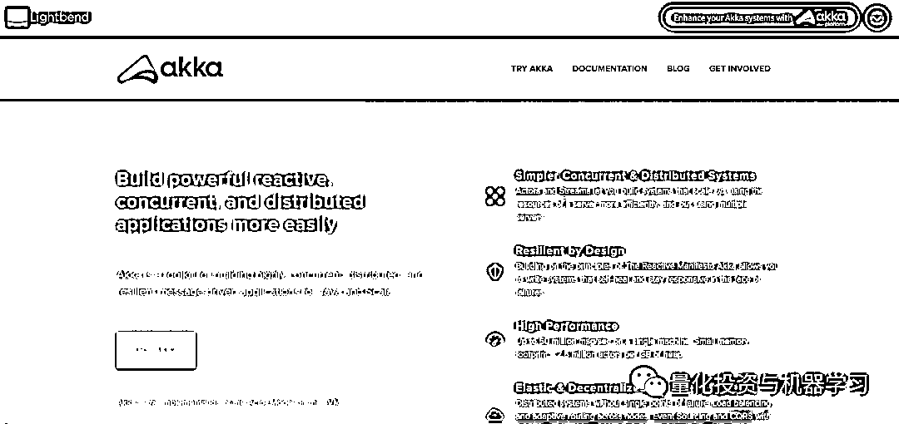

https://akka.io/

2、Aeron 的设计原则是合理的。它是 GC-free 的（堆外内存：off-heap memory），无锁（lock-Less）并利用非阻塞 IO，消息路径上没有异常，并且尽可能使用单个写入器。我们受到这些原则的启发，并将它们应用于构建我们自己的执行系统。

3、Aeron 的归档和集群提供了构建完全容错消息层所需的主要功能。Aeron 消息传递层允许我们将系统拆分为关键交易和报告流程，而不用担心在过程中增加延迟。虽然交易过程力求快速和稳定，但报告流程没有那么快的限制，因此存在不同的工程挑战。通过这种架构，我们还为系统构建了弹性，这样报表流程就不会干扰我们的交易活动。

**结果**

Man 在 2019 年初将 IPC 换成了 Aeron。从那以后，它一直运行得很顺利，没有任何问题。随着系统更新和其他性能调优，IPC 延迟每百分位至少降低了一个数量级。下图比较了切换前后 99%和 99.99%的延迟，显示了 99.99%延迟减少了 50 倍。注意，在之后的延迟要稳定得多，因此也更容易预测。

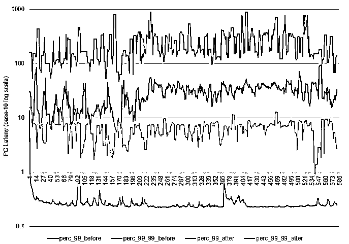

关于 Aeron 的进一步介绍，**公众号将在明天的推文中详细分析。**

量化投资与机器学习微信公众号，是业内垂直于**Quant****、Fintech、人工智能、大数据**等领域的**量化类主流自媒体。**公众号拥有来自**公募、私募、券商、期货、银行、保险、资管**等众多圈内**20W+**关注者。每日发布行业前沿研究成果和最新量化资讯。