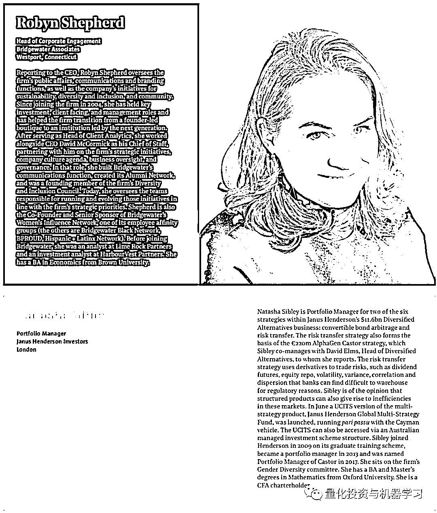
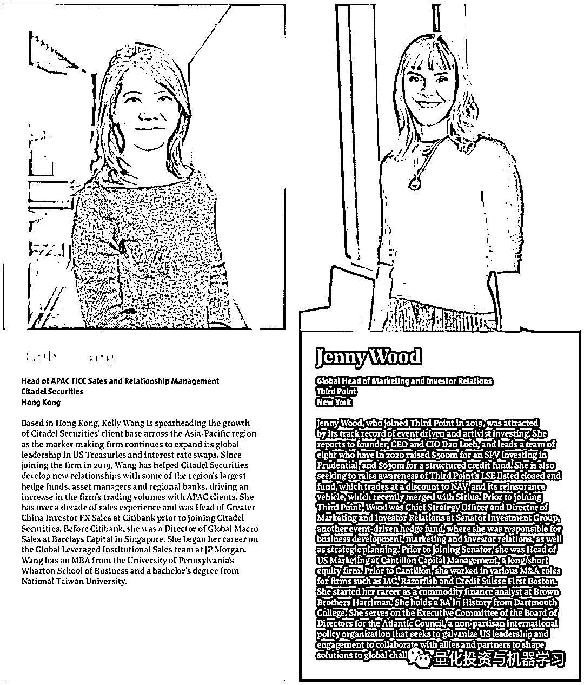

# 女『矿』大佬！2020 年 50 位对冲基金小姐姐齐亮相

> 原文：[`mp.weixin.qq.com/s?__biz=MzAxNTc0Mjg0Mg==&mid=2653307706&idx=1&sn=eb03f1db6f87fdf3108d27cc37ec9d30&chksm=802d812fb75a0839014cbf4946de0d051dbf3275c6330ab60a52c549b16840157d0b9d4f4a30&scene=27#wechat_redirect`](http://mp.weixin.qq.com/s?__biz=MzAxNTc0Mjg0Mg==&mid=2653307706&idx=1&sn=eb03f1db6f87fdf3108d27cc37ec9d30&chksm=802d812fb75a0839014cbf4946de0d051dbf3275c6330ab60a52c549b16840157d0b9d4f4a30&scene=27#wechat_redirect)

**全网 TOP 量化自媒体**

**背景概述**

对冲基金杂志每年会与安永合作，推出年度对冲基金 50 位女性领军人物，今年的报告也出来啦！

在今年的报告中，约有 23 人是投资专业人士，27 人担任非投资职位，包括合规、法律、审计、业务、财务、行政、市场营销和投资者关系等。

根据 LCF Edmond de Rothschild 的分析，在今年的报告中，有 8 位女性供职于史上最赚钱的 5 家对冲基金中的 4 家，这 4 家公司是：**桥水、Citadel、Lone Pine、DE Shaw**。

#### 同时根据安永的研究：一项对标准普尔综合指数 1500 的分析发现，**拥有女性高管的公司平均比那些没有女性高管的公司的资产多 4000 万美元！**与此同时，Peterson Institute for International Economics 发现，女性人数在 30%及以上的董事会的净利润率会增加 6%。

#### 让更多女性担任高级职位有助于企业的创新和提高业绩！

**女性在职场越来越强大！**

**报告详情**

本报告并非排名

量化投资与机器学习微信公众号，是业内垂直于**Quant****、Fintech、AI、ML**等领域的**量化类主流自媒体。**公众号拥有来自**公募、私募、券商、期货、银行、保险、资管**等众多圈内**18W+**关注者。每日发布行业前沿研究成果和最新量化资讯。