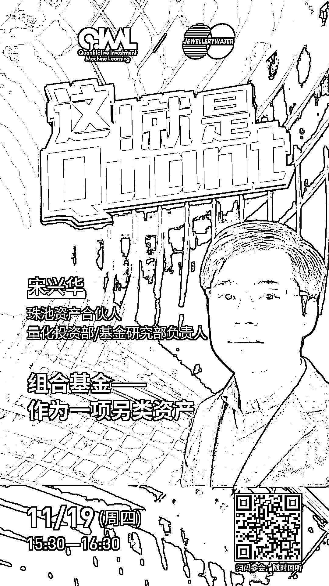

# 珠池资产 | 组合基金，作为一项另类资产

> 原文：[`mp.weixin.qq.com/s?__biz=MzAxNTc0Mjg0Mg==&mid=2653307644&idx=1&sn=d7ddf03587e9801db2d03a5d3e20ce2a&chksm=802d80e9b75a09ff1428a006111875a554da5edc1014dafcb308e363f8b2c4a7fe79e2dc4edd&scene=27#wechat_redirect`](http://mp.weixin.qq.com/s?__biz=MzAxNTc0Mjg0Mg==&mid=2653307644&idx=1&sn=d7ddf03587e9801db2d03a5d3e20ce2a&chksm=802d80e9b75a09ff1428a006111875a554da5edc1014dafcb308e363f8b2c4a7fe79e2dc4edd&scene=27#wechat_redirect)

点击上方图片，查看历史精彩会议

***1***

**关于珠池资产**

珠池资产成立于 2014 年 9 月，以管理组合基金，提供投资顾问服务为主要业务，2018 年和 2019 年连续获得金牛奖最佳组合基金奖, 投资范围包括权益、可转债、商品及衍生品等资产。珠池资产通过构建多元化组合，力求为投资人提供与权益市场相关性较低的，风险调整后可观的收益。

***2***

**主讲嘉宾介绍**

**宋兴华** | 珠池资产合伙人，量化投资部/基金研究部负责人，清华大学-香港中文大学金融工商管理硕士学位。历任尚心投资副总裁，尚心投资为单一家族投资办公室，投资范围涵盖海外大中华主题投资，管理规模为 5 亿美金；历任泰康资产和万家基金研究员。

***3***

**主持嘉宾介绍**

**肖承志** | 东北证券研究所金融工程组组长，同济大学应用数学本科、硕士。2016 年以来具有 5 年证券研究从业经历。致力于市场择时、资产配置、量化与基本面选股。擅长各类择时与机器学习模型，对隐马尔可夫模型有深入研究；在因子选股领域撰写多篇因子改进报告，市场独家见解。

***4***

**嘉宾互动环节**

本次网络直播会议将设置：**读者问答环节**。大家如有问题向嘉宾提问，请**扫码下方二维码**填写问卷。我们将根据问题质量，选择性在直播中进行回答。欢迎大家踊跃提问哦！

***5***

**如何参会？**

**扫码下方海报二维码**

或**点击阅读原文**

即可收听！

量化投资与机器学习微信公众号，是业内垂直于**Quant****、Fintech、AI、ML**等领域的**量化类主流自媒体。**公众号拥有来自**公募、私募、券商、期货、银行、保险、资管**等众多圈内**18W+**关注者。每日发布行业前沿研究成果和最新量化资讯。