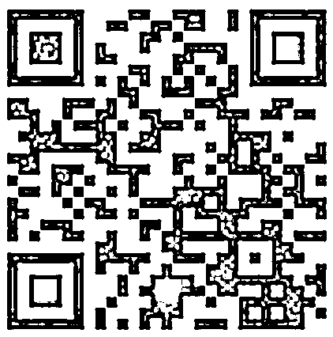
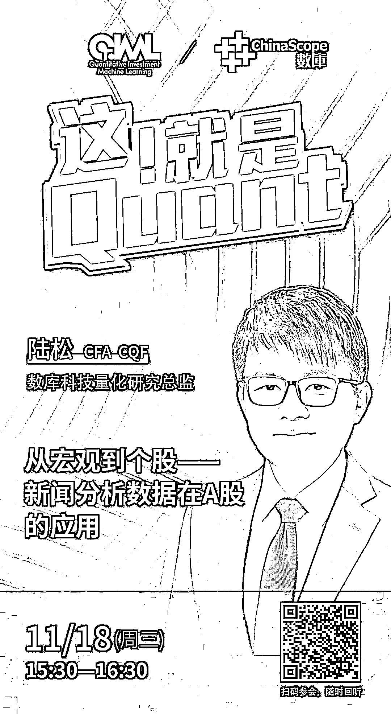

# ChinaScope | 从宏观到个股：新闻分析数据在 A 股的应用

> 原文：[`mp.weixin.qq.com/s?__biz=MzAxNTc0Mjg0Mg==&mid=2653307631&idx=1&sn=83baa5ec3c65b69df7f691cf7f0224d5&chksm=802d80fab75a09ec1acb60b2fac7373508042169a48a48ab3e9cfac67e9ea02f72175dc9b171&scene=27#wechat_redirect`](http://mp.weixin.qq.com/s?__biz=MzAxNTc0Mjg0Mg==&mid=2653307631&idx=1&sn=83baa5ec3c65b69df7f691cf7f0224d5&chksm=802d80fab75a09ec1acb60b2fac7373508042169a48a48ab3e9cfac67e9ea02f72175dc9b171&scene=27#wechat_redirect)

***1***

**关于数库科技**

数库科技（ChinaScope）成立于 2009 年，连续 3 年被 KPMG 评选为中国 Fintech 50 强企业，是一家以人工智能驱动的数据科技 SaaS 公司。专注于在金融及产业领域提供基于产业逻辑的智能数据产品与系统服务，以成熟的数据方案助力金融机构数字化转型及科技升级。

**Smart Data, Smart Way**

数库科技已成功打造独特的 SAM 产业链体系、供应链、企业图谱、新闻舆情、智能公告研报流等全方位金融数据流服务，覆盖 A 股、科创板、新三板、港股，美股及 4000W+非上市企业。同时满足智能获客、智能投研、资产管理、风险管理、产业监控、智能资讯、量化投资等多维度的业务场景，全面赋能金融机构、企业及政府部门的数字化转型。

***2***

**主讲嘉宾介绍**

**陆松** **CFA CQF** | 数库科技量化研究总监

主要负责与主导另类数据在量化投资领域的应用。具有多年量化研究与投资经验，曾任某私募量化投研总监，某大型金融数据服务商旗下量化平台负责人。

***3***

**嘉宾互动环节**

本次网络直播会议将设置：**读者问答环节**。大家如有问题向嘉宾提问，请**扫码下方二维码**填写问卷。我们将根据问题质量，选择性在直播中进行回答。欢迎大家踊跃提问哦！

***4***

**如何参会？**

**扫码下方海报二维码**

或**点击阅读原文**

即可收听！

量化投资与机器学习微信公众号，是业内垂直于**Quant****、Fintech、AI、ML**等领域的**量化类主流自媒体。**公众号拥有来自**公募、私募、券商、期货、银行、保险、资管**等众多圈内**18W+**关注者。每日发布行业前沿研究成果和最新量化资讯。