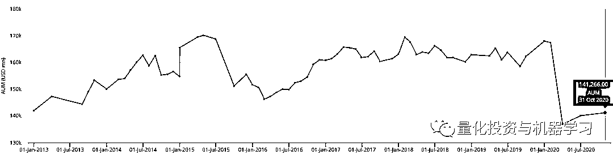

# 桥水、中国、全天候！

> 原文：[`mp.weixin.qq.com/s?__biz=MzAxNTc0Mjg0Mg==&mid=2653307595&idx=1&sn=ff0899e631faab0a2dbbc7f7b33a8d21&chksm=802d80deb75a09c83bb093d1d8ac095f0795662b6c1c07b154340ea7fb8867c7868dfc055a3b&scene=27#wechat_redirect`](http://mp.weixin.qq.com/s?__biz=MzAxNTc0Mjg0Mg==&mid=2653307595&idx=1&sn=ff0899e631faab0a2dbbc7f7b33a8d21&chksm=802d80deb75a09c83bb093d1d8ac095f0795662b6c1c07b154340ea7fb8867c7868dfc055a3b&scene=27#wechat_redirect)

**全网 TOP 量化自媒体**

桥水基金（Bridgewater Associates）在中国的业绩远好于世界其他地区。

桥水目前管理的基金列表

根据彭博报道，目前以**AUM 1400+亿美元**排名全球对冲基金第一桥水基金管理公司今年 9 月为其第二只中国基金——“桥水全天候增强型中国私募证券投资基金二号”，托管在<ai type="6" parm="{&quot;otherinfo&quot;:&quot;A&quot;}" style="color: rgb(0, 0, 0);font-size: 14px;white-space: normal;">招商证券。其</ai>筹集了约人民币**9 亿元**，资产规模翻了一番。

桥水历史 AUM，截止 2020 年 10 月 31 日，来自 preqian

附：

尽管境内业务的规模较小，但**最新一轮融资使其管理资产增至人民币 17 亿元左右**，这使桥水成为在华最大的外资对冲基金公司之一。

全天候策略 12%月度收益率，截止 10 月 31 日，来自 preqian

今年是艰难的一年。由于疫情的爆发，桥水的旗舰基金 Pure Alpha II 下跌了 13.6%，但其全天候基金同期上涨 2.6%多 。桥水的 AUM 也从年初的 1600+亿美元下降至 1400+亿美元左右。

根据相关数据显示，桥水仅次于 Winton 和 UBS ，主要是这两家基金在中国的运营时间较长。其中，根据 Z-Ben 的数据，UBS 有望今年成为大中华地区最大的全球基金管理公司，其市场份额从 2018 年的 5.1% 上升至 9.1% 。同时，UBS 资产管理部门计划在未来几年实现中国员工数量两位数的增长。自 2017 年以来，该部门的员工数量增加了一倍，达到 40 多人。

在中国扩大开放其规模达 100 万亿元人民币的投资市场后：

http://www.ssf.gov.cn/yjypz/201807/P020180731597692681634.pdf

中国对全球基金经理的重要性越来越大。达里奥也长期以来一直对中国持乐观态度，**认为****桥水基金有必要在其投资组合中持有很大一部分中国资产，以实现长期多元化和短期交易**。

根据 Wind 数据显示，截至 11 月 16 日，已有包括瑞银资产、富敦投资、惠理投资在内的 32 家外资私募进军中国市场，除罗素投资、弘收投资、威廉欧奈尔投资等 7 家暂未备案产品外，**其余 25 家私募已累计发行 92 只私募基金**。

其中 10 月份新增 3 只产品。其中 31 家外资私募，注册在上海的最多，有 28 家，其余三家则分别在深圳、珠海和天津。而在产品数量方面，外资私募总备案基金有 94 只，数量最多的是瑞银资管，共计备案 16 只，其次是惠理投资备案了 12 只，元胜投资备案了 9 只，<ai type="2" parm="{&quot;companycode&quot;:&quot;1172031225&quot;}">路博迈投资</ai>备案了 8 只；毕盛投资、<ai type="2" parm="{&quot;companycode&quot;:&quot;1004113835&quot;}">施罗德投资</ai>、安中投资分别备案了 7 只、6 只、5 只。

其中发行产品数量最多的外资私募是瑞银资产和惠理投资，两家私募自成立以来已经备案**16 只**和**11 只**产品。根据据 Broadridge 2020 年 10 月调研报告显示 1，瑞银资产管理凭借其中国市场管理的资产规模（AUM）强劲的增长，再次成功蝉联总排名榜首。

来自中国基金报

根据泽奔咨询发布了第五份外资资管《2020 China Rankings》报告显示，瑞银（UBS）和景顺（Invesco）在均下滑一位，分别位列第二和第三，而施罗德（Schroders）、贝莱德（BlackRock）和富达（Fidelity）则保住了 2018 年的排名，分别位列第四、第五和第六。

<ai type="2" parm="{&quot;companycode&quot;:&quot;1045995775&quot;}">前海开源基金</ai>首席经济学家<ai type="14" parm="{}">杨德龙</ai>此前表示，外资基金的进入，加大了国内资管行业的竞争力度，有可能会导致国内的基金竞争更加激烈。但是外资基金本身具有比较好的投资能力和投资经验，进入中国市场也会带来鲶鱼效应，让国内的基金更加注重投资业绩，从而获得更好的发展。

国信证券研报认为，当前海内外疫情复苏节奏存在错配，国外疫情仍在爆发，经济复苏依然存压，而相比之下，国内疫情基本得到有效控制，随着经济复苏的不断推进，上市公司盈利同样有望持续改善，A 股市场仍具备较高的投资性价比，因此我们认为外资整体净流入的趋势仍未改变。

综合彭博、万得报道

量化投资与机器学习微信公众号，是业内垂直于**Quant****、Fintech、AI、ML**等领域的**量化类主流自媒体。**公众号拥有来自**公募、私募、券商、期货、银行、保险、资管**等众多圈内**18W+**关注者。每日发布行业前沿研究成果和最新量化资讯。