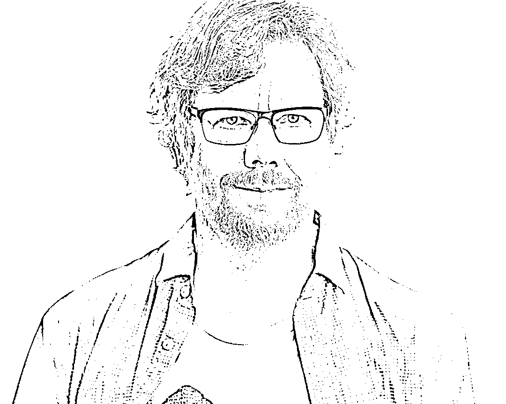

# 退休太无聊！Python 之父加盟微软

> 原文：[`mp.weixin.qq.com/s?__biz=MzAxNTc0Mjg0Mg==&mid=2653307523&idx=1&sn=82b578c001a970106f01c596779b5f99&chksm=802d8096b75a0980f48db991f5e357656b0794040a29774fab957929c169f6b894a9b8b7cbe6&scene=27#wechat_redirect`](http://mp.weixin.qq.com/s?__biz=MzAxNTc0Mjg0Mg==&mid=2653307523&idx=1&sn=82b578c001a970106f01c596779b5f99&chksm=802d8096b75a0980f48db991f5e357656b0794040a29774fab957929c169f6b894a9b8b7cbe6&scene=27#wechat_redirect)

**全网 TOP 量化自媒体**

Guido van Rossum

**刚刚！**几个小时前，Python 之父 Guido van Rossum 宣布了他已经加入微软的消息：

我觉得退休生活很无聊，于是加入了微软的开发部门。去做什么呢？选择太多了！不过肯定会更好地使用 Python（不仅仅是在 Windows 上）。这里有很多开源软件。请关注这个领域。

去年 10 月，Van Rossum 在 Dropbox 公司工作了六年半后决定退休。

一位微软发言人告诉我们，该公司也没有其他细节可分享，但证实了 van Rossum 确实已经加入了微软：“我们很高兴他加入到微软的开发部门。微软致力于为 Python 社区的成长作贡献，而 Guido 的入职就是这一承诺的体现。”

去年 10 月 30 日，Python 之父 Guido 宣布退休，离开 Dropbox。

当时他发推文说：“这件事感觉既苦涩又甜蜜：苦涩的是，我马上要离开 Dropbox，现在已经退休；甜蜜的是，在 Dropbox 做工程师期间，我学到很多，比如类型标注就来自这段经历。我会非常怀念在这里工作的日子。”

如同大多数的编程语言之父一般，Guido van Rossum 也有着辉煌的履历：

*   1982 年，Guido van Rossum 获得阿姆斯特丹大学的数学和计算机科学硕士学位，同年加入了 CWI。

*   1989 年，他创立了 Python 语言，并于 1991 年初推出了 Python 的第一个公开发行版。

*   2005 年 12 月，吉多·范罗苏姆加入 Google。他用 Python 语言为 Google 写了面向网页的代码浏览工具。

*   2006 年，他被美国计算机协会（ACM）认定为著名工程师。

在他的职业生涯中，成就最高的就是创造了 Python。而且关于 Guido，一直有一个比较有趣的段子：据说 Guido 当年去 Google 面试的时候，简历上只写了一句话：***I wrote Python***。HR 没能理解，直到面试到第 10 轮才反应过来这个人是 python 的作者，而不是只是“写过”Python 程序。 

这当然是个段子了，2005 年 Guido 加入谷歌时，已经是无「」人不知的大佬了，自己投简历这件事不太可能，而且谷歌的人更不可能不认识 Guido。

Guido 宝刀未老，微软拥抱开发者社区，双赢的好事情，支持支持！

*文章来自网络公开媒体，综合整理发布**相关文章：** 

量化投资与机器学习微信公众号，是业内垂直于**Quant****、Fintech、AI、ML**等领域的**量化类主流自媒体。**公众号拥有来自**公募、私募、券商、期货、银行、保险、资管**等众多圈内**18W+**关注者。每日发布行业前沿研究成果和最新量化资讯。